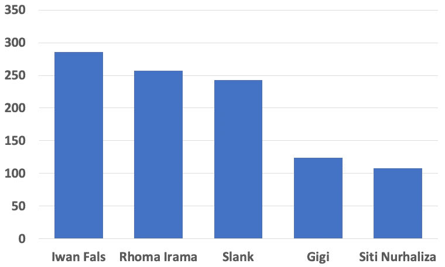
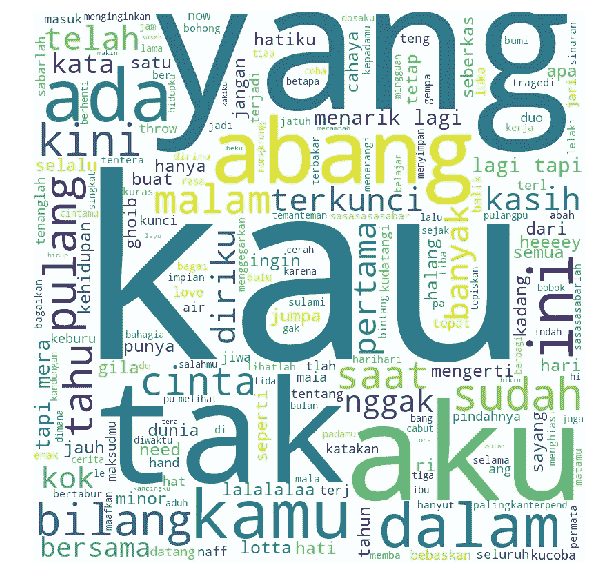
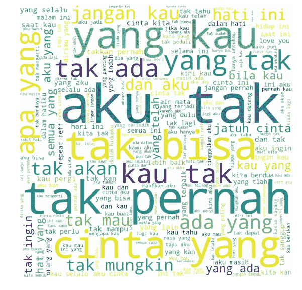
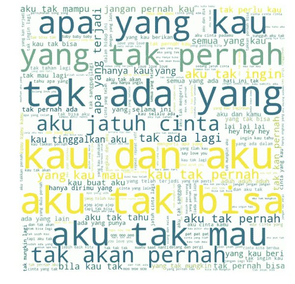

# 使用自然语言处理的音乐歌词分析

> 原文：<https://medium.com/analytics-vidhya/music-lyrics-analysis-using-natural-language-processing-7647922241c0?source=collection_archive---------8----------------------->

## 我用 NLP 和 Python 对印尼歌词做了一点“研究”。除了一些描述性的分析，我还将向你展示我是如何基于印度尼西亚歌词数据库建立语言模型的。


由[马尔特·温根](https://unsplash.com/@maltewingen?utm_source=medium&utm_medium=referral)在 [Unsplash](https://unsplash.com?utm_source=medium&utm_medium=referral) 上拍摄的照片

我来自印度尼西亚，在我的国家，每年都有很多歌曲发行。我不知道目前为止在印尼发行的歌曲的确切数量。

我的好奇心把我带到了印尼最大的歌词提供商网站，http://lirik.kapanlagi.com。

通过查看网站，我唯一想到的是如何获取数据。

有没有我可以下载的 API 或者源码？

答案是否定的，所以我做了一些搜集工作来获取数据。

我用 Python、Selenium 和 BeautifulSoup 制作了刮刀。这三个组合在做一些刮痧任务的时候总是在帮我。如果你愿意，可以看看我的 scraper 代码。

[ScrapeLaguIndo.py](https://github.com/DeaVenditama/lagu_indonesia/blob/master/ScrapeLaguIndo.py)

刮削工作完成后，我对数据做了一些描述性分析，下面是结果。

1.  歌曲总数: **18.733** (并非所有歌曲都使用印尼语言，但所有歌手都来自印尼)
2.  歌手总数: **4005** 歌手(包括乐队、二重唱或独唱)。
3.  **Iwan Fals** 是在 286 首歌曲的数据集中拥有**最多歌曲**的歌手。

以下是歌曲最多的歌手的图表。



如果你是印尼人，你会发现茜蒂·诺哈丽莎不是印尼歌手。Siti 是马来西亚歌手，在印尼很受欢迎；也许这就是她被输入 lirik.kapanlagi.com 数据库的原因。

伊万·法斯是一名歌手，2002 年被《时代》杂志评为伟大的亚洲英雄。Rhoma Irama 是一名 Dangdut 歌手，印度尼西亚民间音乐。Slank 和 Gigi 是印度尼西亚的顶级乐队，已经在印度尼西亚“摇滚”了超过 25 年。

当我根据语言对歌曲进行分类时，大约有 74%的歌曲使用印度尼西亚语，大约有 5%的歌曲使用英语，其余的使用当地语言，比如爪哇语和巽他语。

我继续我的“研究”,只使用印尼语歌词数据集。

我正在使用名为 Sastrawi 的 Python 库，它为我提供了清理数据集的能力。

[](https://github.com/sastrawi/sastrawi) [## 萨斯特拉维/萨斯特拉维

### Sastrawi 是一个简单的 PHP 库，它允许你减少印度尼西亚语(印度尼西亚语)中的屈折词…

github.com](https://github.com/sastrawi/sastrawi) 

清洗完歌词，想看看印尼歌曲中常见的词或短语。我根据单词的单个 n-gram、bigram 和 trigram 来分离歌词。之后我做了一个词云，看最常见的词或者短语；这是结果。



单个 n 元、二元和三元词云

通过看到单词 cloud，我可以看到否定是印度尼西亚歌曲中常见的单词和短语。

在一首**单曲 n-gram** 中，“Kau”这个词(在英语中是你的意思)是印尼歌曲中出现最多的词。“Tak”的意思是不，“Yang”是停用词，“Aku”的意思是“I”。

我通过看到这首单曲 n-gram 得出的初步结论是讨论关系的印尼歌曲《你和我》。

在 **bigram** 单词云中，我可以看到出现了如此多的否定短语。唯一不同的是“Cinta yang”短语，这似乎不是一个完整的印度尼西亚短语，但我敢肯定，根据这个短语，印度尼西亚歌曲真的很喜欢“爱情”主题。

从**三元组**词云可以明显看出，印尼歌曲是关于否定、爱和你我之间的关系。

> 我从三字云得到的非科学结论是，很多印尼歌曲是关于“爱的背叛”的。


照片由[马太·亨利](https://unsplash.com/@matthewhenry?utm_source=medium&utm_medium=referral)在 [Unsplash](https://unsplash.com?utm_source=medium&utm_medium=referral) 上拍摄

# 使用 LSTM (n-gram)的歌词生成

基于我得到的数据，我想根据它生成一个句子；我想通过使用所有印度尼西亚歌词训练模型成为一名诗人。

要根据训练数据生成一个句子，我必须有一个好的语言模型。为了开发一个好的语言模型，我必须了解深度学习。

我在这两个教程里读到了深度学习和 LSTM。

[](https://machinelearningmastery.com/how-to-develop-a-word-level-neural-language-model-in-keras/) [## 如何开发一个单词级的神经语言模型，并用它来生成文本——机器学习…

### 一个语言模型可以预测序列中下一个单词的概率，基于已经在…

machinelearningmastery.com](https://machinelearningmastery.com/how-to-develop-a-word-level-neural-language-model-in-keras/) [](https://github.com/Sangarshanan/song-lyrics-generation-and-analysis) [## sangarshanan/歌词生成和分析

### 数据:https://www.kaggle.com/mousehead/songlyrics 神经网络(带反馈的神经网络)在自然语言处理和人工智能中非常有用

github.com](https://github.com/Sangarshanan/song-lyrics-generation-and-analysis) 

看完那些教程，我在低配机上安装了 TensorFlow 和 Keras，可惜那些深度学习的东西需要一个 GPU 卡来完成一些深度学习的任务。

如果我用自己的笔记本电脑训练模型，将需要很长时间。当我几乎无望实现我的想法时，我的朋友告诉我，我可以使用 Google Collab 来训练模型。

Google Collab 是一款谷歌产品，它允许我们在其中运行机器学习或数据科学任务。基本上，它是一个运行在谷歌机器上的笔记本，所以我不需要担心硬件规格。

然后我做了一个基于所有印度尼西亚歌词的序列。当涉及到将标签转换成分类数据以便机器更熟悉时，我的 Google Collab 笔记本崩溃了，它需要更多的 RAM 来处理所有的歌曲。

因为我不想成为 Google Collab 的付费会员，所以我试图通过将数据集拆分成更小的数量来解决这个问题。

我只从 13000 首歌里拿了 1500 首来训练。它的工作，我的笔记本电脑几乎崩溃，但它是好的，直到最后。

我唯一的问题是模型训练花了很长时间来训练数据。用 100 个历元训练数据花了差不多 6 个小时。这是我从那两个教程中得到的模型设计。

```
**def** create_model(max_sequence_len, total_words):
    input_len = max_sequence_len - 1
    model = Sequential()

    *# Add Input Embedding Layer*
    model.add(Embedding(total_words, 10, input_length=input_len))

    *# Add Hidden Layer 1 - LSTM Layer*
    model.add(LSTM(100))

    *# Add Output Layer*
    model.add(Dense(total_words, activation='softmax'))model.compile(loss='categorical_crossentropy', optimizer='adam')

    **return** model
```

和模型摘要

```
Model: "sequential_3" _________________________________________________________________ Layer (type)                 Output Shape              Param #    ================================================================= embedding_3 (Embedding)      (None, 251, 10)           20930      _________________________________________________________________ lstm_3 (LSTM)                (None, 100)               44400      _________________________________________________________________ dense_3 (Dense)              (None, 100)               10100      _________________________________________________________________ dense_4 (Dense)              (None, 2093)              211393     ================================================================= Total params: 286,823 Trainable params: 286,823 Non-trainable params: 0 _________________________________________________________________ None
```

我对模型设计不是很了解；我还在学习，所以我不想谈论太多。

> 经过 6 个小时的数据训练，我得到了希望能让我成为诗人的最终模型。

现在，我可以根据提供给模型的种子文本生成一个句子，我可以提供一个或多个单词作为种子文本来创建一个句子。

这些是我给我的文本生成器的单词。我给生成器这些单词，然后生成 15 个单词。

1.  **辛塔** ( *爱*)
2.  **Aku Ingin** ( *我要*)
3.  阿库林杜 ( *我想念*)
4.  佩吉拉·卡穆 ( *走开*)
5.  阿库丹卡穆(我和你)
6.  **Aku Sangat Bahagia** ( *我很开心*

结果是，

```
1\. **cinta** yang tak pernah pernah ada di dalam hatiku kau tak bisa menepis dirimu yang tak
===========
2\. **aku ingin** ada di hatiku tak pernah bisa mencintaimu darimu tak bisa ku tak bisa menahan mencobacoba
===========
3\. **aku rindu** padamu tak pernah ada rasa yang tak pernah pernah ada di dalam hatiku kau tak
===========
4\. **pergilah kamu** tak pernah ada rasa yang tak pernah ku keluhkan padamu yang lain tak mungkin kau
===========
5\. **aku dan kamu** tak bisa ku tak bisa bisa kepayang kepayang kepayang aku tak bisa kepayang kepayang kepayang
===========
6\. **aku sangat bahagia** aku tak bisa ku tak bisa bisa kepayang kepayang kepayang aku tak bisa kepayang kepayang
```

我对结果感到惊讶；它生成一个语法几乎正确的印度尼西亚句子。有一个语法错误，但是我知道这个句子的意思。

从这些结果句子中，

> 我仍然确信印尼歌曲的氛围是关于爱情的背叛。

因为结果句中有太多悲伤的情绪，悲伤通常是因为背叛而发生的。


照片由[马太·亨利](https://unsplash.com/@matthewhenry?utm_source=medium&utm_medium=referral)在 [Unsplash](https://unsplash.com?utm_source=medium&utm_medium=referral) 上拍摄

接下来我想做的是用一个字符级的 n-gram 来训练模型。我使用了一个单词级的 n-gram，结果对我来说不是很满意，我还不能成为诗人。

# 结论

自然语言处理可以帮助我们更深入地了解数据。通过使用简单的自然语言处理任务处理文本数据，我们可以获得更多的信息。

为了将来的改进，也许我会通过从歌词数据中寻找来做一些情感分析和流派分类。

深度学习可以帮助我们做一个基于数据的语言模型。我们可以使用之前训练的模型基于 see 文本生成一些文本。

也许我会添加更多的数据或调整参数，以获得更好的结果。

我还在研究一个字符级语言模型，看看这个模型的结果是否不同。

我共享笔记本、数据、模型、分词器等。在 GitHub 上。

[](https://github.com/DeaVenditama/lagu_indonesia) [## 印度尼西亚迪万迪塔马/拉古

### 在 GitHub 上创建帐户，为 DeaVenditama/lagu_indonesia 的发展做出贡献。

github.com](https://github.com/DeaVenditama/lagu_indonesia) 

谢谢你