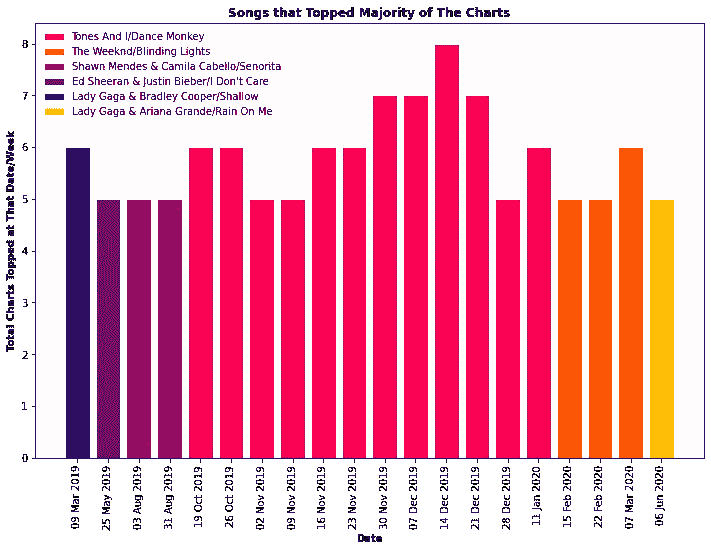
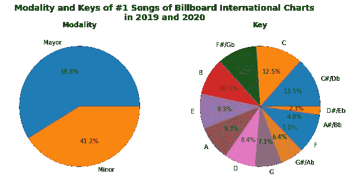
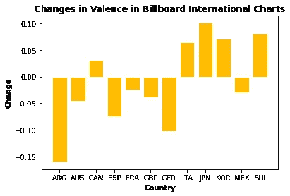
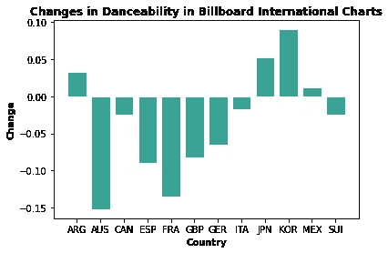
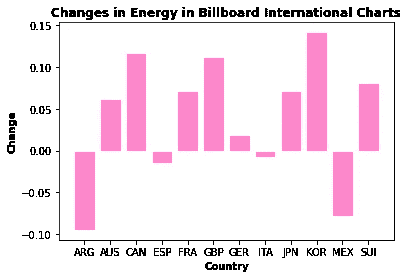
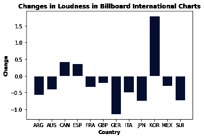
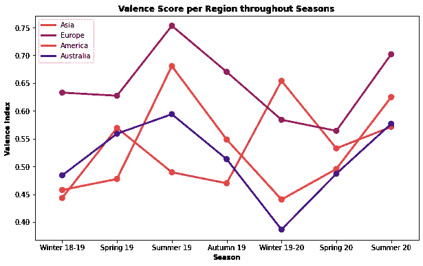
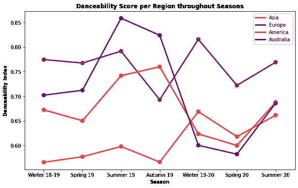
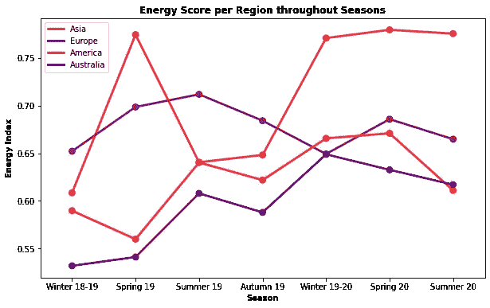
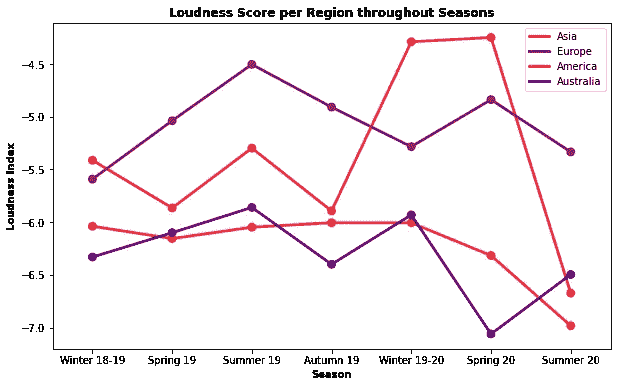

# 使用 Spotify API 进行音乐偏好分析

> 原文：<https://medium.com/analytics-vidhya/music-preference-analysis-with-spotify-api-915acb81884c?source=collection_archive---------7----------------------->

## 从 2019 年到 2020 年，世界对音乐的品味会发生怎样的变化

照片由 Mohammed Metri (Unsplash)拍摄

# 关于分析

这项分析旨在探索 2019 年至 2020 年 8 月世界各地人们所听歌曲的变化和趋势。

数据收集自国际[公告牌排行榜](https://www.billboard.com/charts)。如果你点击页面底部的“国际”标签，你会看到一个国际图表列表。我只拿了单曲榜，因为分析的是歌曲。

数据中收集了 12 个国家，分别是阿根廷(ARG)、澳大利亚(AUS)、加拿大(CAN)、西班牙(ESP)、法国(FRA)、德国(GER)、意大利(ITA)、日本(JPN)、韩国(KOR)、墨西哥(MEX)、瑞士(SUI)和英国(GBP)。

从这些图表的每一张中，数据中存在的每一周都选择了排名第一的歌曲。然后，从 [Spotify API](https://developer.spotify.com/documentation/web-api/reference/tracks/get-audio-features/) 获取这些歌曲的特征。然后，该特征将用于描述从 2019 年到 2020 年 8 月听音乐时偏好的变化。

# 谁每周经常出现在大多数音乐排行榜的第一名？

从 2019 年到 2020 年 8 月在 12 个 Billboard International 排行榜中登顶≥ 5 个排行榜的歌曲

对于数据中存在的每个星期，我们可以得到哪些歌曲在这些国家占主导地位。以下是在同一周内同时主修超过 5 个排行榜的歌曲。

自 2019 年 10 月至 2020 年 1 月，我和 Tones 的 Dance Monkey 已荣登多个排行榜榜首。2019 年 12 月 14 日已登顶 8 张，3 次/周 7 张。这首歌也在 2019 年的 12 周内荣登多张排行榜榜首。

Lady Gaga 和布莱德利·库珀的《Shallow》在 2019 年 3 月 9 日也登上了 6 张排行榜的榜首。

与此同时，在 2020 年，威肯的《致盲之光》在 3 月 7 日占据了 6 个排行榜，在 2 月 15 日和 22 日占据了 5 个排行榜。

# 2019 年和 2020 年排名第一的歌曲中的模态和调

#1 歌曲的模态和键

2019 年和 2020 年，大多数歌曲有 58.8%的主要情态。与此同时，歌曲的基调也相当多样化。其中基于 C#/Db 的占 13.5%，其次是 C (12.5%)

# 2019-2020 年#1 歌曲音频特征变化

## 配价和可舞性

2019-2020 年排名第一歌曲的配价和可跳性特征变化

大部分音乐排行榜显示 2020 年排名第一歌曲的化合价得分呈下降趋势。2020 年，来自这些国家的人比 2019 年更多地听不太快乐的歌曲。

阿根廷人比其他国家的人更喜欢听悲伤的歌曲。同时，加拿大、意大利、日本、韩国、瑞士是在 2020 年听更多快乐歌曲的国家。

在 2020 年，可跳舞性特征在大多数图表中也显示出下降趋势。澳大利亚图表在可跳舞性方面的下降幅度最大。2020 年，阿根廷、日本、韩国和墨西哥的观众会比 2019 年听到更多适合跳舞的歌曲。

根据 Spotify API 中的描述，Valence 代表音乐的积极性，值越高意味着歌曲越积极(欢快、快乐、欣快)。可舞性表示一首歌有多容易跳，0 表示最不适合跳舞，1 表示最适合跳舞。

## 能量和响度

2019 年至 2020 年#1 歌曲的能量和响度特征的变化

虽然在 2020 年可跳舞性和效价大多下降，但 12 个图表中的 8 个显示了#1 歌曲在能量特征上的倾斜得分。

2020 年，阿根廷、西班牙、意大利和墨西哥的观众会更多地听一些不太有活力的歌曲。阿根廷的图表下降幅度最大，而韩国的图表在能源方面的倾斜幅度最大。

能量衡量歌曲的强度和活跃程度，因此有能量的曲目听起来会很快、很响、很吵。

大多数排行榜的歌曲音量在 2020 年有所降低，而加拿大、西班牙和韩国排行榜的#1 歌曲音量更大。与 2019 年相比，2020 年韩国观众会听到更多更响亮的歌曲。

# 2019 年和 2020 年基于季节和地区的音频特征趋势

## 配价和可舞性

基于季节和地区的效价和可跳性趋势

除了亚洲，2019 年夏天观众听快乐歌最多。对于亚洲来说，他们在 2019 年冬天听的快乐歌曲最多，同年春天次之。

从两个季节的倾斜度来看，亚洲和欧洲都更喜欢 2019 年夏季和冬季的可跳舞歌曲。尽管如此，在整个 2019 年和 2020 年，欧洲观众比其他地区更喜欢化合价更高的歌曲。

对于澳大利亚和美国，观众在 2019 年夏秋季节听了更多适合跳舞的歌曲，然后在 2019/2020 年冬季失去了对这种歌曲的兴趣。

与其他地区的排行榜相比，亚洲排行榜第一名的歌曲的可舞性得分相对较低。

## 能量和响度

基于季节和地区的能量和响度趋势

2019 年夏秋两季，亚洲观众对活力较低歌曲的偏好有所改变。他们也是比其他地区更喜欢听更有活力的歌曲的听众。

随着时间的推移，美国和澳大利亚的观众对充满活力的歌曲表现出越来越大的兴趣，但在 2020 年夏天，他们的兴趣开始下降。

在 2019 年冬季和 2020 年春季，亚洲观众更喜欢更响亮的歌曲。与其他地区相比，澳大利亚的听众通常更喜欢听不太有活力的歌曲。

可以在这里检查代码[。](https://github.com/intandeay/Music-Analysis)

## 参考资料:

 [## 寻找下一个广告牌# 1——Spotify API 探索性分析

### 第一部分——音乐包裹的十年

medium.com](/analytics-vidhya/finding-the-next-billboard-1-spotify-api-exploratory-analysis-4fb2ba80c9fc)  [## 图表

### 公告牌排行榜

www.billboard.com](https://www.billboard.com/charts)  [## 获取音轨的音频功能|面向开发者的 Spotify

### 需要路径参数授权。来自 Spotify 帐户服务的有效访问令牌:参见 Web API…

developer.spotify.com](https://developer.spotify.com/documentation/web-api/reference/tracks/get-audio-features/)