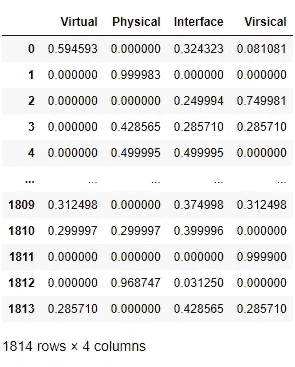

# 音乐家/乐器分析— Touchpoint 2025，音乐流中的人工智能音乐制作:第 2 部分

> 原文：<https://medium.com/analytics-vidhya/musician-instrument-analysis-touchpoint-2025-ai-powered-music-production-in-music-streaming-aec6324e1951?source=collection_archive---------24----------------------->

# "创造一种智能，可以从你所拥有的工具中谈论你."

# 主文章

[https://medium . com/@ akashsonthalia/touch point-2025-ai-powered-music-production-in-music-streaming-part-1-771936924 a47](/@akashsonthalia/touchpoint-2025-ai-powered-music-production-in-music-streaming-part-1-771936924a47)

# 目标

为前一篇文章创建物理到虚拟的 KPI，并基于艺术家的工具做出自动化的分析决策。

为了理解艺术家与他们的歌曲的互动，我们需要理解他们的乐器。为了理解他们的乐器，我们需要一种方法来获取他们的乐器并创建一个数据集。

# 网络抓取数据

Equipboard 是一个网站，作为艺术家使用的工具的数据库。整个数据库是众包的。来源各不相同，从 YouTube 视频到新闻文章再到采访。它涵盖了大范围的视觉。

以下工具用于收集在设备板上有图像的艺术家的数据(一般假设是，如果艺术家很有名气并且足够大，他们就会有图像，因此数据质量更好)

*   Python 被用作协调刮擦的命令。
*   Chrome 用于查看设备板网页。
*   Selenium 使 chrome 浏览器自动浏览所有艺术家。
*   Beautiful Soup 帮助从 HTML 页面源中提取数据。

1834 位艺术家的所有类别都被捕获。该样本表示世界上的艺术家群体。

# 清理和分析数据

相关性分析——在这里，我试图了解某些种类的仪器之间是否存在相关性，因为有大量的列，将图编程为交互式是有意义的。

将相关图分成 0.1 的增量有助于推断结果，

*   没有观察到负相关。(乐手对所有乐器都是真心的！)
*   大提琴/立式贝司和鼓/鼓棒/鼓硬件有很强的(> 0.80)正相关。
*   录音室设备/键盘和合成器&录音室监听系统/耳机有中度(> 0.60)正相关。
*   DAWs 与软件工具、插件和工作室监视器呈正相关(> 0.50)
*   我不考虑低于 0.50 的相关性，因为从音乐制作人和艺术家的角度看数据，似乎没有太多的因果行为。

这是仪器桶分布的样子，

*   *虚拟*——纯粹的虚拟仪器。
*   *【虚拟乐器】* —物理和虚拟乐器的混合。(这将创建我们的抽象上下文！)
*   *物理* —纯物理仪器。
*   *杂项* —艺术家的额外音乐/非音乐装备。
*   *接口* —平行于虚拟仪器，但更多地用作物理连接器。

我们来看一下*压缩关联*。

主要观察结果，

*   *物理和虚拟仪器没有关联！*事实上，这些可以是我们矩阵中单独的列。
*   虚拟和接口桶似乎与软件乐器有轻微的相关性，但与物理桶的相关性很小(这是意料之中的，MIDI 设备需要软件，然而，吉他手并不总是需要软件，他可以用一个放大器，因此有轻微的相关性)。记住这一点，我们将不得不*标准化我们的界面变量*的权重。
*   我将*而不是*作为*来考虑我们分析的杂项桶*，因为它包括*非音乐装备，如帽子和婴儿木棒*等。

# 数据聚类

艺术家数据现已标准化，并尝试对该数据进行聚类，以更好地了解艺术家的类型。*K 均值*聚类应用于数据，使用*肘形法*确定最佳 K 值。

虽然找不到明显的弯头，但聚类迭代表明在 5 个聚类处有一个转弯。

*考虑 5 个聚类来分布艺术家。预计群集不会是完美的。*

一个平行的技术被用来推导艺术家的*倾斜*用于物理-虚拟尺度以相互验证。

对倾斜度的计算进行了多次反复试验。

群集图揭示了以倾斜度量形成的群集(x 轴),很容易区分物理群集与虚拟群集,但是，我们可能需要进一步探索，以分析+倾斜部分(虚拟/虚拟)的差异。

*   *物理活套’*—*第一组*与物理仪器有亲缘关系，下面用红色标出。
*   *【虚拟囤积者】*—*第四集群*对虚拟仪器有很强的亲和力，也如蜂群图所示(最高)。
*   *【MIDI Looper】*—*第 0 个和第 2 个*群集可以被认为是一个群集，因为它们在性质上极其相似，群集间差异很小。这可以很方便地成为我们的桥接集群。

# 从他们的乐器分类和新艺术家聚类预测

用 *KNN 分类器*训练算法，我可以在 542 位艺术家的*测试分割上达到 92.66%* 的*准确率。虽然该模型确实在虚拟/物理和桥接之间受到了一些影响。92.66%的测试准确率对于 web 抓取的数据来说是一个相当不错的分数。*

# 在我自己的音乐和风格上验证模型

我对自己进行了验证，以找出我在乐器列表中属于哪一类，

*   *物理*—1/归一化为 0.08 — Stratocaster 吉他
*   *vir sical*—6/标准化为 0.42 — M40x 耳机、Arturia MinilabMKII、Launchpad Mini、放大器、智能手机控制、拼接
*   *虚拟*—7/归一化为 0.5 — Ableton Live，Analog Lab，LABS，UVI 工作站，Output Arcade，Splice，Serum。

*   O/P — 2 — *《迷笛 Looper》*我就是。:)

我真的倾向于循环很多 MIDI。

希望你喜欢这本书。我将继续致力于接触点的想法。如有任何疑问或问题，请随时联系我或发表评论！

# 第一部分:

[https://medium . com/@ akashsonthalia/touch point-2025-ai-powered-music-production-in-music-streaming-part-1-771936924 a47](/@akashsonthalia/touchpoint-2025-ai-powered-music-production-in-music-streaming-part-1-771936924a47)

下次见！