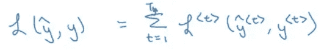
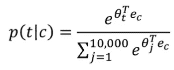

# 学习序列建模的必读教程(deeplearning.ai 课程#5)

> 原文：<https://medium.com/analytics-vidhya/must-read-tutorial-to-learn-sequence-modeling-deeplearning-ai-course-5-55bbc0d8827?source=collection_archive---------0----------------------->

预测序列中接下来会发生什么的能力令人着迷。这也是我对数据科学感兴趣的原因之一！有趣的是，人类的大脑确实很擅长这个，但机器却不是这样。给定一本书中的神秘情节，人脑将开始创造结果。但是，如何教会机器做类似的事情呢？

多亏了深度学习——我们今天能做的比几年前多得多。处理序列数据的能力，如音乐歌词、句子翻译、理解评论或构建聊天机器人——所有这一切现在都有可能归功于**序列建模**。

这就是我们将在本文中学到的东西。由于这是我们 deeplearning.ai 专业化系列的一部分，我希望读者能够意识到某些概念。如果您还没有浏览之前的文章，或者只是需要快速复习一下，这里有一些链接:

*   [*《深度学习和神经网络入门指南》(deeplearning.ai 课程#1 笔记)*](https://www.analyticsvidhya.com/blog/2018/10/introduction-neural-networks-deep-learning/)
*   [*改进神经网络——超参数调整、正则化等(deeplearning.ai 课程#2)*](https://www.analyticsvidhya.com/blog/2018/11/neural-networks-hyperparameter-tuning-regularization-deeplearning/)
*   [*从头开始学习卷积神经网络的综合教程(deeplearning.ai 课程#4)*](https://www.analyticsvidhya.com/blog/2018/12/guide-convolutional-neural-network-cnn/)

在这最后一部分，我们将看到序列模型如何应用于不同的现实应用，如情感分类、图像字幕和许多其他场景。

# 目录

1.  课程结构
2.  课程 5:序列模型
    1。模块 1:递归神经网络。模块 2:自然语言处理(NLP)和单词嵌入
    2.1 单词嵌入介绍
    2.2 学习单词嵌入:Word2vec & GloVe
    2.3 使用单词嵌入的应用
    3 .模块 3:序列模型&注意机制

# 课程结构

到目前为止，我们已经在这个系列中介绍了很多内容。下面是我们所学概念的快速回顾:

*   深度学习和神经网络的基础
*   浅层和深层神经网络如何工作
*   如何通过超参数调整、正则化和优化来提高深度神经网络的性能
*   卷积神经网络的工作和实现

是时候把重点转向序列建模了。本课程(官方标签为吴恩达教授的深度学习专业化课程#5)分为三个模块:

1.  在模块 1 中，我们将学习递归神经网络及其工作原理。我们还将在本模块中讲述 gru 和 LSTMs
2.  在模块 2 中，我们的重点是自然语言处理和单词嵌入。我们将看到 Word2Vec 和 GloVe 框架如何用于学习单词嵌入
3.  最后，模块 3 将介绍注意力模型的概念。我们将会看到如何将大而复杂的句子从一种语言翻译成另一种语言

准备好了吗？让我们进入模块 1！

# 课程 5:序列模型

# 模块 1:递归神经网络

课程 5 第一单元的目标是:

*   了解什么是递归神经网络
*   学习几种变体，包括 LSTMs、GRUs 和双向 RNNs

如果这些缩写听起来令人生畏，请不要担心，我们会很快澄清它们。

# 但是首先，为什么是序列模型？

为了回答这个问题，我将向您展示几个在真实场景中使用序列模型的例子。

***语音识别:***

如今这是一个很常见的应用程序(每个有智能手机的人都会知道这一点)。这里，输入是一个音频剪辑，模型必须生成文本副本。随着时间的推移，音频被视为一个序列。此外，抄本是一个单词序列。

***情感分类:***

序列模型的另一个流行应用。我们传递一个文本句子作为输入，该模型必须预测句子的情绪(积极，消极，愤怒，兴高采烈等)。).输出也可以是评级或星级的形式。

***DNA 序列分析:***

给定一个 DNA 序列作为输入，我们希望我们的模型预测 DNA 的哪个部分属于哪个蛋白质。

**机器翻译:**

我们用一种语言输入一个句子，比如说法语，我们希望我们的模型把它转换成另一种语言，比如说英语。这里，输入和输出都是序列:

***视频活动识别:***

这实际上是序列模型的一个即将到来的(和当前的趋势)应用。该模型预测给定视频中正在进行的活动。这里，输入是一系列帧。

***名称实体识别:***

绝对是我最喜欢的序列模型用例。如下所示，我们传递一个句子作为输入，并希望我们的模型识别该句子中的人:

现在，在我们进一步讨论之前，我们需要讨论一些你将在整篇文章中看到的重要符号。

# 我们将在本文中使用的符号

我们用 X 代表一个句子。为了理解进一步的通知，我们来看一个例句:

> 哈利和赫敏发明了一个新的咒语。

现在，为了表示句子中的每个单词，我们使用 x <t>:</t>

*   x <1> =哈利
*   x <2> = Hermoine，以此类推

对于上面的句子，输出将是:

y = 1 0 1 0 0 0 0

在这里，1 表示这个词代表一个人的名字(0 表示它绝不是)。下面是我们通常使用的一些常用符号:

*   Tx =输入句子的长度
*   Ty =输出句子的长度
*   x(i)=第 I 个训练示例
*   x(i) <t>=第 I 个训练示例的第 t 个训练</t>
*   Tx(i)=第 I 个输入句子的长度

在这一点上，有理由怀疑——我们如何在一个序列中表示 n 个单词？嗯，这就是我们学习词汇或字典的地方。这是我们在陈述中使用的单词列表。词汇表可能是这样的:

词汇表的大小可能因应用程序而异。建立词汇表的一个潜在方法是从训练集中挑选最频繁出现的单词。

现在，假设我们想要表示单词“harry ”,它在我们的词汇表中位于第 4075 位。我们一次性编码这个词汇来表示“哈利”:

概括地说，x <t>是一个独热编码向量。我们将在第 4075 个位置放置 1，所有剩余的字将表示为 0。</t>

如果这个单词不在我们的词汇表中，我们创建一个未知的<unk>标签，并将其添加到词汇表中。就这么简单！</unk>

# 递归神经网络(RNN)模型

当 X 或 Y，或者 X 和 Y 都是一些序列时，我们使用递归神经网络来学习从 X 到 Y 的映射。但是为什么我们不能用一个标准的神经网络来解决这些序列问题呢？

很高兴你问了！让我用一个例子来解释。假设我们建立下面的神经网络:

这主要有两个问题:

1.  输入和输出没有固定的长度，即一些输入句子可以是 10 个单词，而其他句子可以是<> 10 个单词。最终输出也是如此
2.  如果我们使用一个标准的神经网络，我们将不能共享在文本的不同位置学习到的特征

我们需要一种表示，它将帮助我们解析不同的句子长度，并减少模型中的参数数量。这就是我们使用递归神经网络的地方。这是典型的 RNN 的样子:

RNN 提取第一个字(x <1>)并将其输入神经网络层，该神经网络层预测输出(y’<1>)。重复该过程，直到产生最后输出 y’<ty>的最后时间步骤 x <tx>。这是一个输入和输出的字数相同的网络。</tx></ty>

RNN 按从左到右的顺序扫描数据。请注意，RNN 用于每个时间步长的参数是共享的。我们将在每个输入和隐藏层(Wax)，每个时间步(魏如萱)和隐藏层和输出(Wya)之间共享参数。

因此，如果我们对 x <3>进行预测，我们也将获得关于 x <1>和 x <2>的信息。RNN 的一个潜在弱点是，它只从前面的时间点获取信息，而不从后面的时间点获取信息。这个问题可以用双向 RNNs 来解决，我们将在后面讨论。现在，让我们看看 RNN 模型中的正向传播步骤:

<0>是全零向量，我们计算类似于标准神经网络的进一步激活:

*   一个<0> = 0
*   a <1> = g(魏如萱* a <0> +蜡* x <1> + ba)
*   y <1> = g'(Wya * a <1> + by)

同样，我们可以计算每个时间步的输出。这些公式的一般形式可以写成:

我们可以用更简单的方式写出这些方程:

我们水平堆叠魏如萱和 Wya 得到 Wa。a <t-1>和 x <t>垂直堆叠。我们现在只有 1 个矩阵，而不是 2 个参数矩阵。简而言之，这就是前向传播对于递归神经网络的工作方式。</t></t-1>

# 穿越时间的反向传播

您可能会看到这种情况—反向传播步骤的工作方向与正向传播相反。我们有一个损失函数，我们需要尽量减少，以产生准确的预测。损失函数由下式给出:

我们计算每个时间步的损失，最后对所有这些损失求和，以计算序列的最终损失:

在前向传播中，我们从左向右移动，即增加时间 t 的索引。在反向传播中，我们从右向左移动，即在时间上向后移动(因此称为时间反向传播)。

到目前为止，我们已经看到了输入和输出序列长度相等的场景。但是如果长度不同呢？让我们在下一节看看这些不同的场景。

# 不同类型的 rnn

我们可以有不同类型的 rnn 来处理序列长度不同的用例。这些问题可以分为以下几类:

***多对多***

我们前面看到的名称实体识别例子就属于这一类。我们有一个单词序列，对于每个单词，我们必须预测它是否是一个名字。对于这样一个问题，RNN 的架构看起来是这样的:

对于每个输入单词，我们预测相应的输出单词。

***多对一***

考虑情感分类问题。我们将一个句子传递给模型，它会返回与该句子相对应的情感或评级。这是一个多对一的问题，输入序列可以有不同的长度，而只有一个输出。针对此类问题的 RNN 体系结构如下所示:

这里，我们在句子的末尾得到一个输出。

***一对多***

考虑音乐生成的例子，我们希望使用音乐作为输入来预测歌词。在这种情况下，输入只是一个单词(或一个整数)，输出可以是不同的长度。此类问题的 RNN 架构如下所示:

还有一种工业上普遍使用的 RNN。考虑机器翻译应用程序，我们将一种语言的输入句子翻译成另一种语言。这是一个多对多的问题，但是输入序列的长度可能等于也可能不等于输出序列的长度。

在这种情况下，我们有编码器部分和解码器部分。编码器部分读取输入句子，解码器将其翻译成输出句子:

# 语言模型和序列生成

假设我们正在构建一个语音识别系统，我们听到一句话“苹果和梨沙拉很好吃”。该模型将预测什么——“苹果和沙拉很好吃”或“苹果和梨沙拉很好吃”？

我希望第二句话！语音识别系统通过使用预测每个句子的概率的语言模型来挑选这个句子。

但是我们如何建立一个语言模型呢？

假设我们有一个输入句子:

> 猫平均每天睡 15 个小时。

构建语言模型的步骤如下:

*   步骤 1 —对输入进行标记，即创建一个字典
*   步骤 2 —将这些单词映射到一个独热编码向量。我们可以添加代表句子结束的标签
*   步骤 3——建立一个 RNN 模型

我们取第一个输入单词并对其进行预测。这里的输出告诉我们字典中任何单词的概率是多少。给定第一个输入单词，第二个输出告诉我们预测单词的概率:

我们的 RNN 模型中的每一步都着眼于一些前面的单词来预测下一个单词。训练 RNN 模型会面临各种挑战，我们将在下一节讨论这些挑战。

# 使用 RNNs 的消失渐变

递归神经网络的最大问题之一是它会遇到消失梯度。怎么会？考虑这两句话:

*已经吃了一堆食物的猫吃饱了。*

已经吃了一堆食物的猫已经饱了。

上面两句话哪个语法正确？是第一个(再看一遍以防错过！).

**基本 rnn 不擅长捕捉长期依赖关系。**这是因为在反向传播期间，来自输出 y 的梯度将很难反向传播以影响早期层的权重。因此，在基本的 RNNs 中，输出受更接近该单词的输入的影响很大。

如果梯度爆炸，我们可以通过设置预定义的阈值来修剪它们。

# 门控循环单元

gru 是 RNNs 的一种修改形式。它们在捕捉更长的距离依赖性方面非常有效，也有助于解决消失梯度问题。计算时间步长 t 激活的公式为:

RNN 的一个隐藏单元如下图所示:

一个单元的输入是来自前一个单元的激活和那个时间步长的输入字。我们在这一步计算激活和输出。我们给这个 RNN 增加一个存储单元，以便记住远离当前单词的单词。让我们看看 GRU 的方程式:

c <t>= a</t>

其中 c 是存储单元。

在每个时间步长，我们将 c <t>值改写为:</t>

这作为更新 c <t>值的候选。我们还定义了一个更新门，它决定是否更新存储单元。更新门的公式为:</t>

请注意，我们使用 sigmoid 来计算更新值。因此，更新门的输出将总是在 0 和 1 之间。我们使用先前的存储单元值和更新门输出来更新存储单元。c <t>的更新公式如下:</t>

当门值为 0 时，c <t>= c <t-1>，即我们不更新 c <t>。当门值为 1 时，c <t>= c <t>并且该值被更新。让我们用一个例子来理解这个令人费解的概念:</t></t></t></t-1></t>

当我们看到单词 cat 时，门值为 1。对于序列中的所有其他字，门值是 0，因此猫的信息将一直携带到字“was”为止。我们期望模型预测*是*而不是*是*。

这就是 GRUs 帮助记忆长期依赖的方式。以下是帮助您理解 GRU 工作原理的可视化效果:

对于每个单元，我们有三个输入:a <t-1>，c <t-1>和 x <t>和三个输出:a <t>，c <t>和 y(hat) <t>。</t></t></t></t></t-1></t-1>

# 长短期记忆(LSTM)

LSTMs 如今在深度学习领域风靡一时。由于其复杂性，他们现在可能没有很多行业应用程序，但相信我，很快就会有了。花时间学习这个概念是值得的——它将来会派上用场。

现在为了理解 LSTMs，让我们回忆一下我们看到的所有 GRU 方程:

我们刚刚在计算 c <t>的相关性时增加了一个门，这个门告诉我们 c <t-1>与更新 c <t>的相关性如何。对于 GRUs 来说，a <t>= c <t>。</t></t></t></t-1></t>

**LSTM 是 GRU 的一个更一般化、更强大的版本。**LSTM 的方程式是:

这和 GRU 的情况相似，对吗？我们只是用了一个<t-1>而不是 c <t-1>。我们还有一个更新门:</t-1></t-1>

我们在 LSTM 也有一个遗忘门和一个输出门。这些门的公式类似于更新门的公式:

最后，我们将 c <t>值更新为:</t>

下一层的激活将是:

那么，你应该使用哪种算法——GRU 还是 LSTM？

每种算法都有其优点。你会发现它们的准确性会根据你要解决的问题的类型而有所不同。GRU 的优势在于它的架构更简单，因此我们可以建造更大的模型，但 LSTM 更强大、更有效，因为它有 3 个门，而不是 2 个。

# 双向 RNN

到目前为止，我们看到的 RNN 架构只关注序列中的前一个信息。如果我们的模型能够在特定的时间步长进行预测时，同时考虑序列的先前和后来的信息，那该有多棒？

是的，有可能！欢迎来到双向 RNNs 的世界。但是在我向您介绍什么是双向 rnn 以及它们是如何工作的之前，让我们先来看看为什么我们需要它们。

考虑命名实体识别问题，我们想知道序列中的一个单词是否代表一个人。我们有以下例子:

> 他说:“泰迪熊打折了！”

如果我们把这个句子输入一个简单的 RNN，这个模型会预测“泰迪”是一个人的名字。它只是没有考虑到这个词后面的内容。我们可以在双向 rnn 的帮助下解决这个问题。

现在假设我们有一个 4 个单词的输入序列。双向 RNN 看起来像这样:

为了计算 RNN 单位的输出，我们使用以下公式:

类似地，我们可以有双向 gru 和双向 LSTMs。使用双向 RNNs 的一个缺点是，我们必须在做出任何预测之前查看整个数据序列。但是标准的 B-RNN 算法实际上对于构建和设计大多数 NLP 应用程序是非常有效的。

# 深层 RNNs

还记得深度神经网络长什么样吗？

我们有一个输入层，一些隐藏层，最后是一个输出层。深邃的 RNN 也是这个样子。我们取一个类似的网络，并及时展开:

这里，激活的通用符号如下所示:

a[l] <t>=稍后在时间 t 激活 l</t>

假设我们要计算一个[2] <3>:

深度 RNNs 到此为止。深吸一口气，这是相当多的一口气消化。现在，是时候进入模块 2 了！

# 模块 2:自然语言处理和单词嵌入

学习第二单元的目标是:

*   使用深度学习技术学习自然语言处理
*   了解如何使用单词矢量表示和嵌入层
*   让我们看看自然语言处理的各种应用，比如情感分析、命名实体识别和机器翻译，来丰富我们的学习

# 第 1 部分—单词嵌入简介

# 单词表示法

至此，我们已经用一个词汇来表示单词:

为了表示一个单词，我们创建了一个 hot vector:

现在，假设我们希望我们的模型在不同的单词之间进行归纳。我们根据下面的句子训练模型:

> *我想要一杯苹果汁。*

我们给了“我想要一杯苹果”作为训练序列，给了“果汁”作为目标。我们希望我们的模型能够概括出，比如说:

> 我想要一杯橘子汁。

为什么我们以前的词汇方法行不通？因为它缺乏概括的灵活性。我们将尝试计算代表单词 Apple 和 Orange 的向量之间的相似度。我们将不可避免地得到零作为输出，因为任何两个一热向量的乘积总是零。

如果我们用一组特征来表示每个单词，而不是用一个热点向量来表示，会怎么样呢？看看这张表:

我们可以用这种方法找到相似的单词。挺有用的吧？

比方说，每个单词有 300 个特征。例如，单词“Man”将由一个名为 e5391 的 300 维向量来表示。

我们还可以将这些表示用于可视化目的。将 300 维向量转换为二维向量，然后绘制它。有相当多的算法可以做到这一点，但我最喜欢的是简单的 [t-SNE](https://www.analyticsvidhya.com/blog/2017/01/t-sne-implementation-r-python/) 。

# 使用单词嵌入

当使用单词表示时，单词嵌入确实有助于我们更好地进行概括。

假设您正在执行命名实体识别任务，并且在训练集中只有少量记录。在这种情况下，您可以在线获取预训练的单词嵌入，也可以创建自己的嵌入。这些嵌入将具有该词汇表中所有单词的特征。

下面是用单词嵌入替换独热编码表示的两个主要步骤:

1.  从大型文本语料库中学习单词嵌入(或下载预训练的单词嵌入)
2.  将这些嵌入转移到具有较小训练集的新任务中

接下来，我们将看看单词嵌入的属性。

# 单词嵌入的性质

假设你得到一个问题——“如果男人是女人，那么国王是？”。大多数敏锐的解谜者以前都见过这类问题！

这个问题的答案可能是女王。但是模型将如何决定呢？这实际上是理解单词嵌入最广泛使用的例子之一。我们嵌入了男人、女人、国王和王后。男人的嵌入向量将类似于女人，国王的嵌入向量将类似于王后。

我们可以使用下面的等式:

eman — ewoman = eking —？

解决这个问题给了我们一个 300 维的向量，其值等于 queen 的嵌入。我们也可以使用相似性函数来确定两个单词嵌入之间的相似性。相似性函数由下式给出:

这是余弦相似性。我们也可以使用欧几里德距离公式:

在核心推荐系统中，还有一些其他不同类型的相似性度量。

# 嵌入矩阵

当我们实现一个单词嵌入算法时，我们实际上最终学习了一个嵌入矩阵。如果我们有一个 10，000 个单词的词汇表，每个单词有 300 个特征，嵌入矩阵表示为 E，如下所示:

为了找到单词“orange”在第 6257 个位置的嵌入，我们将上面的嵌入矩阵乘以 orange 的独热向量:

e。O6257 = e6257

E 的形状是(300，10k)，O 的形状是(10k，1)。因此，嵌入向量 e 将具有(300，1)的形状。

# 第 2 部分—学习单词嵌入:Word2Vec & GloVe

# 学习单词嵌入

假设我们正在使用神经网络构建一个语言模型。模型的输入是“我想要一杯橘子汁”，我们希望模型预测下一个单词。

我们将首先使用预训练的单词嵌入矩阵来学习序列中每个单词的嵌入，然后将这些嵌入传递给神经网络，该神经网络将在末端具有 softmax 分类器来预测下一个单词。

这就是建筑的样子。在这个例子中，我们有 6 个输入单词，每个单词由 300 维向量表示，因此序列的输入将是 6*300 = 1800 维。该模型的参数是:

*   嵌入矩阵(E)
*   W[1]，b[1]
*   W[2]，b[2]

我们可以减少输入单词的数量，降低输入维数。我们可以说，我们希望我们的模型仅使用前面的 4 个单词来进行预测。在这种情况下，输入将是 1200 维的。输入也可以被称为上下文，并且可以有各种方式来选择上下文。几种可能的方法是:

*   取最后 4 个单词
*   从左边取 4 个单词，从右边取 4 个单词
*   最后一个词
*   我们也可以用一个邻近的词

这就是我们如何解决语言建模问题，我们输入上下文并预测一些目标词。在下一节中，我们将看看 Word2Vec 如何应用于学习单词嵌入。

# Word2Vec

这是一种简单且更有效的学习单词嵌入的方法。假设我们的训练集中有一个句子:

> 我要一杯橙汁配麦片。

我们使用 skip gram 模型来挑选一些上下文和目标单词。这样，我们创建了一个监督学习问题，其中我们有一个输入和相应的输出。对于上下文，我们不是只有最后 4 个单词或最后 1 个单词，而是随机选取一个单词作为上下文单词，然后在某个窗口内随机选取另一个单词(比如左右各 5 个)并将其设置为目标单词。一些可能的上下文-目标对可以是:

这只是几双，我们还可以有更多双。以下是该模型的详细信息:

Vocab 大小= 10，000k

现在，我们想学习从某个上下文到某个目标(t)的映射。我们是这样做映射的:

Oc -> E -> ec -> softmax -> y(hat)

这里，ec = E.Oc

在这里，softmax 计算在给定上下文单词(c)的情况下获得目标单词(t)作为输出的概率。

最后，我们将损失计算为:

使用 softmax 函数给算法带来了几个问题，其中之一是计算成本。每次我们计算概率时:

我们必须对词汇表中的所有 10，000 个单词进行求和。如果我们使用更大的词汇量，比如 100，000 个单词或者更多，计算会变得非常慢。这个问题的几种解决方案是:

使用分层的 softmax 分类器。因此，我们不是一次把一个词分成 10，000 个类别，而是先把它分成 5000 个类别，或者 5000 个类别，以此类推。这样，我们不必每次都计算所有 10，000 个单词的总和。分层 softmax 分类器的流程如下所示:

你脑海中可能出现的一个问题是如何选择上下文 c？一种方法是随机抽取上下文单词。随机抽样的问题是，像 is，The 这样的常见词会出现得更频繁，而像 orange，apple 这样的独特词可能一次也不会出现。因此，我们尝试选择一种方法，对不常用的词给予较大的权重，对较常用的词给予较小的权重。

在下一节中，我们将看到一种帮助我们减少计算成本和学习更好的单词嵌入的技术。

# 负采样

在 skip gram 模型中，正如我们前面看到的，我们将上下文单词映射到目标单词，这允许我们学习单词嵌入。该模型的一个缺点是 softmax 带来的高计算成本。考虑我们之前举的同一个例子:

我想要一杯橙汁配我的麦片。

负采样会做的是，它创建了一个新的监督学习问题，其中给定一对单词“orange”和“juice ”,我们将预测它是否是上下文-目标对？对于上面的例子，新的监督学习问题将看起来像:

由于 orange-juice 是一个上下文-目标对，我们将目标值设置为 1，而 orange-king 不是上例中的一对，因此目标值为 0。这些 0 值表示它是负样本。我们现在应用逻辑回归来计算该对是否是上下文-目标对的概率。概率由下式给出:

我们可以有 k 对单词来训练模型。对于较小的数据集，k 可以在 5-20 之间，而对于较大的数据集，我们选择较小的 k(2-5)。因此，如果我们建立一个神经网络，输入是橙色(橙色的一个热点向量):

我们将有 10，000 个可能的分类问题，每个问题对应于词汇表中的不同单词。所以，这个网络会告诉所有与上下文单词 orange 对应的可能的目标单词。这里，不是有一个巨大的 10，000 路 softmax，这在计算上非常慢，而是有 10，000 个二进制分类问题，这与 softmax 相比相对非常慢。

从序列中选择上下文单词，一旦它被选择，我们从序列中随机选取另一个单词作为正样本，然后从词汇表中随机选取几个其他单词作为负样本。这样，我们可以使用简单的二进制分类问题来学习单词嵌入。接下来我们将看到学习单词嵌入的更简单的算法。

# 手套词向量

我们将研究同一个例子:

我想要一杯橙汁配我的麦片。

之前，我们通过从文本语料库中挑选两个彼此非常接近的单词来对单词对(上下文和目标)进行采样。用于单词表示的手套或全局向量使其更加明确。假设:

Xij =在 j 的上下文中出现的次数

这里，I 类似于目标(t)，j 类似于上下文。手套最大限度地减少了以下情况:

这里，f(Xij)是加权项。它对更频繁出现的单词(例如像这样的停用词，is，of，a，..)和较不常用的单词的较大权重。同样，当(Xij) = 0 时，f(Xij) = 0。已经发现，最小化上述等式最终导致良好的单词嵌入。现在，我们已经看到了许多学习单词嵌入的算法。接下来，我们将看到使用单词嵌入的应用程序。

# 第 3 部分—使用单词嵌入的应用程序

# 情感分类

你一定很清楚什么是情感分类，所以我长话短说。查看下表，其中包含一些文本及其相应的情绪:

X (text) y(感悟)甜品棒极了。****服务很慢。**适合速食，但没什么特别的。***完全缺乏好品味*

情感分类的应用多种多样，种类繁多，规模巨大。但是在大多数情况下，你会遇到，这种训练并没有贴上标签。这就是单词嵌入派上用场的地方。让我们看看如何使用单词嵌入来建立情感分类模型。

我们得到的反馈是:“甜点太棒了”。

这里，E 是预训练的嵌入矩阵，比如说，1000 亿个单词。我们将每个单词的独热编码向量与嵌入矩阵相乘，以获得单词表示。接下来，我们总结所有这些嵌入，并应用 softmax 分类器来决定该评论的评级。

它只取所有单词的平均值，所以如果评论是负面的，但有更多正面的单词，那么模型可能会给它更高的评级。不是个好主意。因此，我们可以使用 RNN 来进行情感分类，而不是仅仅对嵌入求和来获得输出。

这是一个多对一的问题，我们有一个输入序列和一个输出。你现在完全有能力解决这个问题。🙂

# 模块 3:序列模型和注意机制

欢迎来到本系列的最后一个模块！下面是我们将在本模块中主要实现的两个目标:

*   理解注意力机制
*   为了理解在给定输入序列的情况下模型应该将注意力集中在哪里

# 基本型号

我将保持这一部分与行业相关，因此我们将涵盖对机器翻译、语音识别等应用有用的模型。考虑这个例子——我们的任务是构建一个序列到序列模型，我们想输入一个法语句子并将其翻译成英语。问题将会是这样的:

这里 x <1>，x <2>是输入，y <1>，Y <2>是输出。为了建立一个模型，我们有一个编码器部分，它接受一个输入序列。编码器被构建为 RNN，或 LSTM，或 GRU。在编码器部分之后，我们构建解码器网络，该网络将编码输出作为输入，并被训练以生成句子的翻译。

这个网络也普遍用于图像字幕。作为输入，我们有图像的特征(使用卷积神经网络生成)。

# 挑选最可能的句子

机器翻译系统的解码器模型与语言模型非常相似。但是两者之间有一个关键的区别。在语言模型中，我们从全零向量开始，而在机器翻译中，我们有一个编码器网络:

机器翻译模型的编码器部分是一个条件语言模型，其中我们计算给定输入的输出概率:

现在，对于输入句子:

我们可以有多种翻译，例如:

我们想要以上所有句子的最佳翻译。

好消息是什么？有一种算法可以帮助我们选择最可能的翻译。

# 波束搜索

这是生成最可能翻译的最常用算法之一。使用以下 3 个步骤可以理解该算法:

**第一步:**选择第一个翻译的单词并计算其概率:

我们可以设置一个豆宽(B)来表示 B=3，而不是只选择一个单词。它将挑选可能是第一个翻译单词的前 3 个单词。这三个词然后被存储在计算机的内存中。

**步骤 2:** 现在，对于步骤 1 中选择的每个单词，该算法计算第二个单词可能是什么的概率:

如果波束宽度为 3，词汇表中有 10，000 个单词，则可能的组合总数将是 3 * 10，000 = 30，000。我们评估所有这 30，000 个组合，并挑选出前 3 个组合。

第三步:我们重复这个过程，直到句子结束。

通过一次添加一个单词，beam search 为任何给定的句子决定最可能的翻译。让我们来看看我们可以对波束搜索做的一些改进，以使它更有效。

# 光束搜索的改进

波束搜索使这种可能性最大化:

这个概率是通过将不同单词的概率相乘来计算的。由于特定的概率是非常小的数字(在 0 和 1 之间)，如果我们将这样小的数字乘以多次，最终的输出是非常小的，这在计算中产生了问题。因此，我们可以使用下面的公式来计算概率:

因此，我们不是最大化产品，而是最大化产品的日志。即使使用这个目标函数，如果翻译的句子有更多的单词，它们的乘积将下降到更多的负值，因此我们可以将函数归一化为:

因此，对于使用波束搜索选择的所有句子，我们计算这个归一化的对数似然，然后选择给出最高值的句子。还有一个细节我想分享，那就是如何决定波束宽度 B？

如果波束宽度更大，我们会有更好的结果，但算法会变得很慢。另一方面，选择较小的 B 会使算法运行更快但结果不会准确。选择波束宽度没有硬性规定，可以根据应用而变化。我们可以尝试不同的值，然后选择产生最佳结果的值。

# 波束搜索中的误差分析

波束搜索是一种近似算法，根据波束宽度输出最可能的平移。但是并不总是需要每次都能产生正确的翻译。如果我们没有得到正确的翻译，我们必须分析是由于光束搜索还是我们的 RNN 模型导致了问题。如果我们发现波束搜索导致问题，我们可以增加波束宽度，希望我们会得到更好的结果。如何决定是重点改进波束搜索还是模型？

假设实际的翻译是:

*简九月访问非洲(y*)*

我们从算法中得到的翻译是:

*简去年九月访问了非洲*

RNN 将计算 P(y* | x)和 P(y(hat) | x)

**案例一:** P(y* | x) > P(y(hat) | x)

这意味着波束搜索选择了 y(hat ),但是 y*获得了更高的概率。因此，波束搜索是错误的，我们可以考虑增加波束宽度。

**情况二:** P(y* | x) < = P(y(hat) | x)

这意味着 y*是比 y(hat)更好的翻译，但 RNN 预测相反。在这里，RNN 是错误的，我们必须改进模型。

所以，对于每一个翻译，我们决定是 RNN 错了还是光束搜索错了。最后，我们计算出波束搜索与 RNN 模型相比所导致的误差比例，并基于哪一个错误更大来更新波束搜索或 RNN 模型。这样我们可以改进翻译。

# 注意力模型

到目前为止，我们已经看到了机器翻译的编码器-解码器架构，其中一个 RNN 读取输入，另一个输出句子。但是当我们得到很长的句子作为输入时，模型很难记住整个句子。

注意力模型所做的是从长句中提取小样本并翻译它们，然后再提取另一个样本并翻译它们，等等。

我们使用一个 alpha 参数来决定在生成输出时应该对特定的输入单词给予多大的关注。

⍺ <1,2> =为了生成第一个单词，应该对第二个输入单词给予多少关注

让我们用一个例子来理解这一点:

因此，为了生成第一个输出 y <1>，我们为每个单词取注意力权重。我们是这样计算注意力的:

如果我们有 Tx 个输入单词和 Ty 个输出单词，那么总的注意参数将是 Tx * Ty。

**你可能已经知道了——注意力模型是深度学习中最强大的想法之一。**

# 结束注释

序列模型很牛逼吧？它们有大量的实际应用——我们只需要知道在特定情况下使用的正确技术。我希望你能在本指南中学到这些技巧。

单词嵌入是表示单词的一种很好的方式，我们已经看到了如何构建和使用这些单词嵌入。我们已经讨论了单词嵌入的不同应用，最后我们还讨论了注意力模型，这是构建序列模型的最强大的思想之一。

如果你对这篇文章有任何疑问或反馈，欢迎在下面的评论区分享。期待您的回复！

*原载于 2019 年 1 月 21 日*[*www.analyticsvidhya.com*](https://www.analyticsvidhya.com/blog/2019/01/sequence-models-deeplearning/)*。*