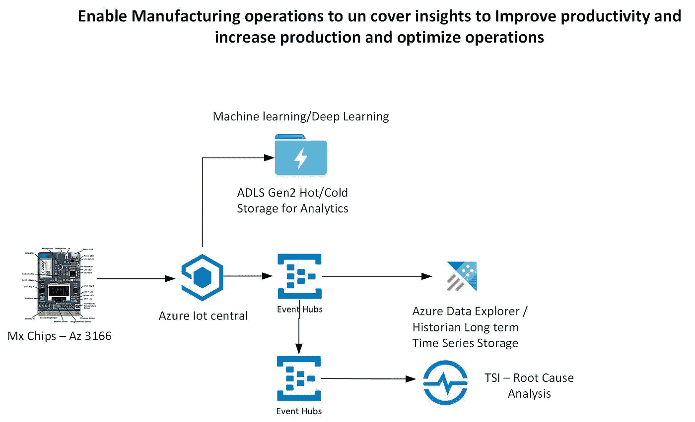
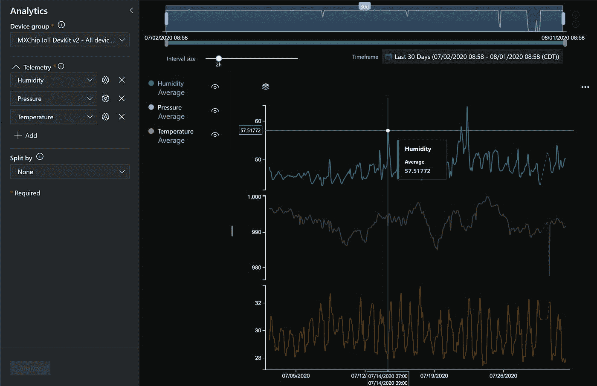

# MXchips-Az3166-IIoT 使用 Azure Data Explorer 和 IoT Central 进行时间序列分析

> 原文：<https://medium.com/analytics-vidhya/mxchips-az3166-iiot-time-series-analysis-using-azure-data-explorer-and-iot-central-2abd32d4d427?source=collection_archive---------14----------------------->

能够将时间序列历史数据存储到 Azure Data Explorer 中进行时间序列处理。还能够存储 ADLS 第二代，用于长期存储以及机器学习或深度学习分析。

Azure iot central 只存储了 30 天的数据，而要对大量传感器进行时间序列分析，我们需要 30 天以上的时间，而 Azure data explorer 就像云历史学家一样做这件事。还能够根据需要进行扩展，性能惊人。非常适合工业用例，有趣的是聚合可以在读取时完成，而不是设计 ETL 来聚合。节省大量时间，更快获得见解。还具有对时间序列数据等的机器学习能力。

我一直在运行这个:

03/18/2020 到 07/31/2020，并为下面的教程收集数据点。



首先配置 mxchips 并使用此链接连接到 Azure Iot Central:[https://docs . Microsoft . com/en-us/samples/Azure-samples/MX chip-Iot-dev kit-PNP/sample/](https://docs.microsoft.com/en-us/samples/azure-samples/mxchip-iot-devkit-pnp/sample/)

Github 回购:【https://github.com/Azure-Samples/mxchip-iot-devkit-pnp 

一旦数据流入 Azure IoT Central 并通过仪表板验证。

现在是设置的时候了

*   Azure 存储帐户
*   Azure 活动中心
*   Azure 数据浏览器

创建一个 blob 存储帐户，并创建一个名为 iotcentralTelemetry 的容器。从 Azure IoT Central 选项到导出遥测，设备和设备模板在编写此 blob 时可用。

导出时应该有 3 个文件夹

iotcentrallemetry \ GUID \ telemetry iotcentrallemetry \ GUID \ devices iotcentrallemetry \ GUID \ device templates

创建事件中心名称空间。

现在创建 3 个事件中心，一个用于遥测，一个用于设备，一个用于设备遥测。

我把它命名为

*   生物中心测量法
*   生物中心设备
*   iotcentraldevicetemplates

保留默认值 2，选择所有默认值进行测试。

如果需要，现在创建一个新的数据库或使用现有的数据库。我们的目标是只将遥测技术推向 ADX。

现在是创建表、表映射的时候了

```
// Create table command //////////////////////////////////////////////////////////// .create table ['iotcentraltelemetry'] (['humidity']:real, ['temperature']:real, ['pressure']:real, ['magnetometer_x']:int, ['magnetometer_y']:int, ['magnetometer_z']:int, ['gyroscope_x']:int, ['gyroscope_y']:int, ['gyroscope_z']:int, ['accelerometer_x']:int, ['accelerometer_y']:int, ['accelerometer_z']:int, ['EventProcessedUtcTime']:datetime, ['PartitionId']:int, ['EventEnqueuedUtcTime']:datetime) 
// Create mapping command //////////////////////////////////////////////////////////// .create table ['iotcentraltelemetry'] ingestion json mapping 'iotcentraltelemetry_mapping' '[{"column":"humidity","path":"$.humidity","datatype":"real"},{"column":"temperature","path":"$.temperature","datatype":"real"},{"column":"pressure","path":"$.pressure","datatype":"real"},{"column":"magnetometer_x","path":"$.magnetometer.x","datatype":"int"},{"column":"magnetometer_y","path":"$.magnetometer.y","datatype":"int"},{"column":"magnetometer_z","path":"$.magnetometer.z","datatype":"int"},{"column":"gyroscope_x","path":"$.gyroscope.x","datatype":"int"},{"column":"gyroscope_y","path":"$.gyroscope.y","datatype":"int"},{"column":"gyroscope_z","path":"$.gyroscope.z","datatype":"int"},{"column":"accelerometer_x","path":"$.accelerometer.x","datatype":"int"},{"column":"accelerometer_y","path":"$.accelerometer.y","datatype":"int"},{"column":"accelerometer_z","path":"$.accelerometer.z","datatype":"int"},{"column":"EventProcessedUtcTime","path":"$.EventProcessedUtcTime","datatype":"datetime"},{"column":"PartitionId","path":"$.PartitionId","datatype":"int"},{"column":"EventEnqueuedUtcTime","path":"$.EventEnqueuedUtcTime","datatype":"datetime"}]'
```

表名:iotcentraltelemetry

表映射名称:iotcentraltelemetry_mapping

映射类型 JSON

登录物联网中央仪表盘

转到导出，然后配置 2 个选项。

*   导出到 Blob 存储
*   导出到事件中心

对于 Blob 存储，选择上面的 iotcentraltelemetry 容器作为输出。您可以选择所有 3 个遥测、设备和设备模板进行输出，也可以自行选择。

数据分分钟存储，存储为 JSON 格式文件。

对于事件中心，仅选择遥测，并选择 iotcentraltelemetry 作为事件中心名称。事件中心名称空间显示在下拉框中。

单击创建，等待它运行。

现在进入 Azure 数据浏览器。

选择我们将要使用的数据库。在左侧菜单中，我们有数据摄取选项。

选择数据摄取并创建新的摄取连接，然后选择事件中心作为 iotcentraltelemetry。

对于 ADX 表名，请使用:iotcentraltelemetry

对于映射名称:iotcentraltelemetry_mapping

对于数据类型使用:JSON

验证并创建连接，然后等待数据加载

现在，您可以运行 query 来验证并查看数据是否已加载

```
iotcentraltelemetry | limit 200
```

让我们做一些图表

```
iotcentraltelemetry 
| extend ingesttime = ingestion_time() 
| project ingesttime,humidity,temperature,pressure, accelerometer_x,accelerometer_y,accelerometer_z 
| summarize avgHumidity=avg(humidity) ,avgPressure=avg(pressure), avgTemperature=avg(temperature) by bin(ingesttime, 1m) 
| render timechart
```

现在让我们只绘制 2 个传感器点的图表

```
iotcentraltelemetry 
| extend ingesttime = ingestion_time() 
| project ingesttime,humidity,temperature,pressure, accelerometer_x,accelerometer_y,accelerometer_z 
| summarize avgHumidity=avg(humidity) ,avgTemperature=avg(temperature) by bin(ingesttime, 1m) 
| render timechart
```

上述查询每 1 分钟聚合一次

现在让我们每 15 分钟汇总一次数据

```
iotcentraltelemetry 
| extend ingesttime = ingestion_time() 
| project ingesttime,humidity,temperature,pressure, accelerometer_x,accelerometer_y,accelerometer_z 
| summarize avgHumidity=avg(humidity) ,avgTemperature=avg(temperature) by bin(ingesttime, 15m) 
| render timechart
```

这些查询是在读取时进行 ETL 的示例，而不是聚集和存储它

每小时总量

```
iotcentraltelemetry 
| extend ingesttime = ingestion_time() 
| project ingesttime,humidity,temperature,pressure, accelerometer_x,accelerometer_y,accelerometer_z 
| summarize avgHumidity=avg(humidity) ,avgTemperature=avg(temperature) by bin(ingesttime, 1h) 
| render timechart
```

每日平均值

```
iotcentraltelemetry 
| extend ingesttime = ingestion_time() 
| project ingesttime,humidity,temperature,pressure, accelerometer_x,accelerometer_y,accelerometer_z 
| summarize avgHumidity=avg(humidity) ,avgTemperature=avg(temperature) by bin(ingesttime, 1d) 
| render timechart
```

异常检测

```
let min_t = datetime(2020-03-18); 
let max_t = datetime(2020-03-19 22:00); 
let dt = 1h; 
iotcentraltelemetry 
| extend ingesttime = ingestion_time() 
| make-series temperature=avg(temperature) on ingesttime from min_t to max_t step dt 
| extend (anomalies, score, baseline) = series_decompose_anomalies(temperature, 1.5, -1, 'linefit') 
| render anomalychart with(anomalycolumns=anomalies, title='Temp, anomalies')
```

时间数列预测法

```
let min_t = datetime(2020-03-18); 
let max_t = datetime(2020-03-19 22:00); 
let dt = 1h; 
let horizon=7d; 
iotcentraltelemetry 
| extend ingesttime = ingestion_time() 
| make-series temperature=avg(temperature) on ingesttime from min_t to max_t step dt 
| extend forecast = series_decompose_forecast(temperature, toint(horizon/dt)) 
| render timechart with(title='Temp, forecasting the next week by Time Series Decomposition')
```

机器学习

聚类样本

```
let min_t = toscalar(iotcentraltelemetry | extend ingesttime = ingestion_time()  | summarize min(ingesttime));  
let max_t = toscalar(iotcentraltelemetry  | extend ingesttime = ingestion_time() | summarize max(ingesttime));  
iotcentraltelemetry
| extend ingesttime = ingestion_time() 
| make-series num=count() on ingesttime from min_t to max_t step 10m
| render timechart with(title="Temperature over a week, 10 minutes resolution")let min_t=datetime(2020-03-18);
iotcentraltelemetry
| extend ingesttime = ingestion_time() 
| make-series num=count() on ingesttime from min_t to min_t+24h step 1m
| render timechart with(title="Zoom on the 2nd spike, 1 minute resolution")
```

自动集群

```
let min_peak_t=datetime(2020-03-18);
let max_peak_t=datetime(2020-03-19 22:00);
iotcentraltelemetry
| extend ingesttime = ingestion_time() 
| where ingesttime between(min_peak_t..max_peak_t)
| evaluate autocluster()let min_peak_t=datetime(2020-03-18);
let max_peak_t=datetime(2020-03-19 22:00);
iotcentraltelemetry
| extend ingesttime = ingestion_time() 
| where ingesttime between(min_peak_t..max_peak_t)
| evaluate basket()
```

机器学习查询结束

对温度、湿度和压力等各种传感器进行预测

```
iotcentraltelemetry
| extend ingestionTime = ingestion_time()
| where ingestionTime > ago(5h)
| make-series AvgTempWithDefault=avg(temperature) default=real(null) on ingestionTime from ago(5h) to now() step 1m
| extend NoGapsTemp=series_fill_linear(AvgTempWithDefault)
| project ingestionTime, NoGapsTemp
| render timechart// What will be the temperature for next 15 minutes?
iotcentraltelemetry
| extend ingestionTime = ingestion_time()
| where ingestionTime > ago(5h)
| make-series AvgTemp=avg(temperature) default=real(null) on ingestionTime from ago(5h) to now()+120m step 1m
| extend NoGapsTemp=series_fill_linear(AvgTemp)
| project ingestionTime, NoGapsTemp
| extend forecast = series_decompose_forecast(NoGapsTemp, 15)
| render timechart with(title='Forecasting for next 15 min by Time Series Decomposition')// What will be the temperature for next 15 minutes?
iotcentraltelemetry
| extend ingestionTime = ingestion_time()
| where ingestionTime > ago(5h)
| make-series AvgTemp=avg(humidity) default=real(null) on ingestionTime from ago(5h) to now()+15m step 1m
| extend NoGapsTemp=series_fill_linear(AvgTemp)
| project ingestionTime, NoGapsTemp
| extend forecast = series_decompose_forecast(NoGapsTemp, 15)
| render timechart with(title='Forecasting for next 15 min by Time Series Decomposition')// What will be the temperature for next 15 minutes?
iotcentraltelemetry
| extend ingestionTime = ingestion_time()
| where ingestionTime > ago(5h)
| make-series AvgTemp=avg(pressure) default=real(null) on ingestionTime from ago(5h) to now()+120m step 1m
| extend NoGapsTemp=series_fill_linear(AvgTemp)
| project ingestionTime, NoGapsTemp
| extend forecast = series_decompose_forecast(NoGapsTemp, 15)
| render timechart with(title='Forecasting for next 15 min by Time Series Decomposition')
```

以下是收集的所有数据的输出



祝你好运，体验 mxchips 和其他物联网设备的乐趣

*最初发表于*[*【https://github.com】*](https://github.com/balakreshnan/IIoT-AI/blob/master/IIoT/mxchipstoadx.md)*。*