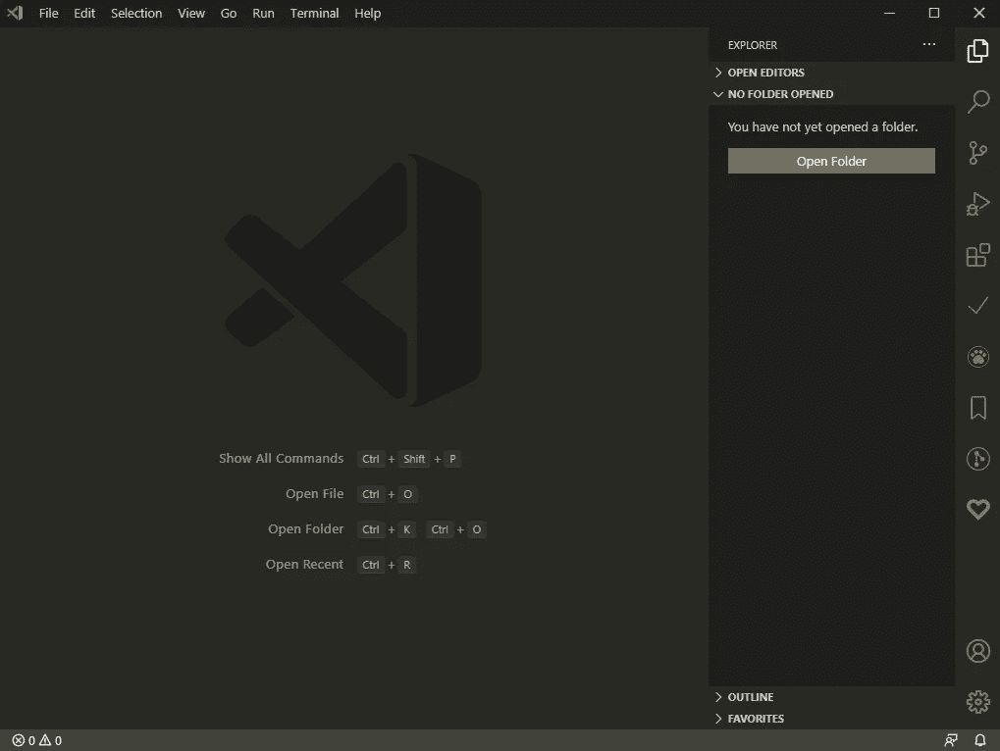

# 我最好的 VS 代码扩展

> 原文：<https://medium.com/analytics-vidhya/my-best-vs-code-extensions-42d444159ba6?source=collection_archive---------1----------------------->

## 帮助我更快使用 Vs 代码的扩展

Vs 代码截图

Vs Code 是我日常编码活动中使用最多的 IDE。尽管我的机器上安装了其他 IDE，但大多数时候我还是使用 Vs 代码，因为它非常“可扩展和可定制”。它支持数百种编程语言，这使它成为许多编程语言的单一 IDE。另一个主要原因是…