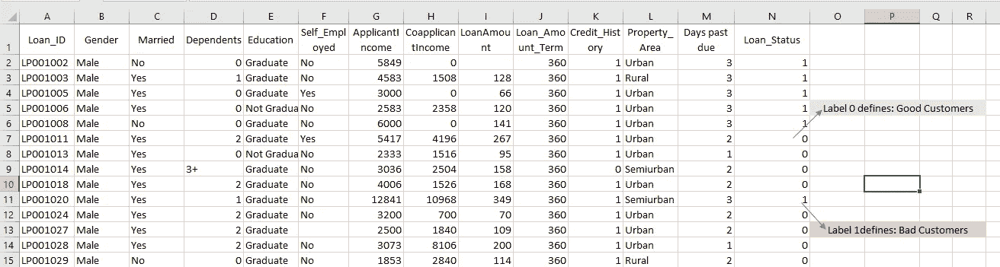
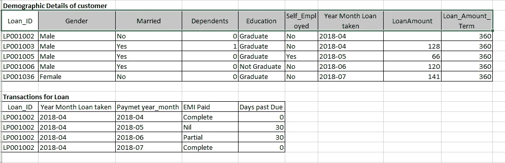
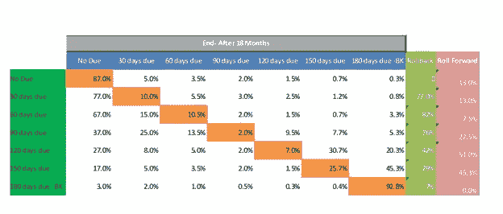
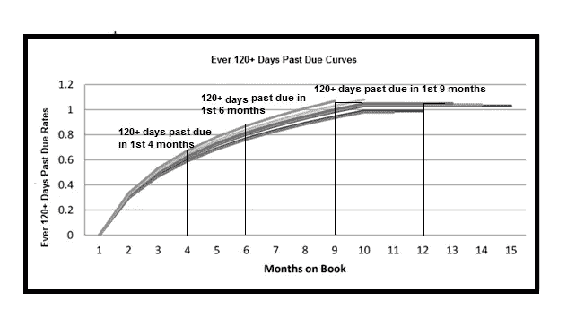

# 我在解决机器学习中的分类问题时最大的收获

> 原文：<https://medium.com/analytics-vidhya/my-biggest-learning-while-solving-classification-problems-in-machine-learning-7172bff9fad8?source=collection_archive---------1----------------------->

几个月前，我开始了我的数据科学之旅。在那之前，我一直在努力学习。我以为我已经准备好了，因为我以前参加过黑客马拉松和竞赛。但我必须承认，解决现实生活中的数据科学问题完全是另一回事。

那么，我在新的数据科学岗位上最大的收获是什么？

那就是“为分类问题定义问题陈述”可能非常具有挑战性。我知道——这对你来说可能听起来很简单。当我第一次开始的时候确实如此，直到我意识到这有多难。

让我更详细地解释一下

我得到了一个探索印度金融科技和保险业的机会。很好地评估风险是非常重要的。或者换句话说——“如何定义好与坏？”

当我们参加*数据*黑客马拉松时，这从来都不是问题，在那里你可以让*准备好使用数据。*因为你得到了一个有标签的数据集，很容易区分好坏。

例如:在下图(图 1.1)中，很容易看出 loan_status 0 指的是好客户，而 loan_status 1 指的是坏客户。

图 1.1-贷款预测黑客的数据

然而，在现实生活中，设计一个将数据有效地分类为多个或二进制类的定义可能会成为一个真正的挑战。

不正确的选择会让你的进一步分析和模型陷入困境。这意味着设计定义 1 和 0 的标准是任何给定数据问题的关键任务之一。

# 示例—信用风险建模

**让我们从理解开始，什么是信用风险？**

信用风险是指由于借款人未能支付任何类型的债务而造成损失的可能性。

与此同时，信用风险管理是通过了解银行在任何给定时间的资本和贷款损失准备金的充足性来减轻因信用违约而导致的损失的做法。

**为什么信用风险对金融机构很重要？**

毫无疑问，信用风险管理是一个对金融机构来说具有挑战性的过程，然而一个更好的开发过程能够使金融机构吸收信用风险的更高资本成本。更好的信贷风险管理也提供了一个机会，可以大大提高整体业绩，确保竞争优势。

**金融机构提供的数据**

通常，给定信用风险模型的可用数据包括金融机构过去向客户提供的贷款数据。这将包括:

*   人口统计数据
*   收入明细
*   局详情
*   客户还款交易。

我们的想法是利用这些数据来了解哪些客户拖欠付款、部分或完全拖欠(没有按时支付到期款项)、他们的损失记录、债务收入比等等。

图 1.2:真实生活数据的一瞥

所以现在，为了更好地评估风险，我们需要定义谁是好客户，谁是坏客户，这是我们挑战的开始。

**天真的方法**

一个简单的方法可能是把好客户说成是从未拖欠过任何款项的客户，而把坏客户说成是至少拖欠过一次。*(此处默认指 EMI/保费支付日期的过期天数)。*

听起来不错——这是挫折时刻。

不是每次像这样简单的定义都能奏效。人们将不得不与企业一起经历多次迭代来破解这个定义。

在这种情况下可以选择一组不好的定义，可能是:

1.  顾客违约也导致了预订的损失
2.  客户曾经违约，债务收入比很高
3.  客户在其任期的前 3 个月至少违约两次。
4.  客户在任期的前 6 个月至少违约三次
5.  客户在其任期的前 12 个月内连续三次违约。
6.  客户在其任期的前 18 个月内连续三次违约。

这不是一个详尽的列表。把所有选项都放进去可能会很费力。

因此，为了最终确定“好的和坏的定义”，通常很少有规定的定义经过数据样本的检验。 ***通常，真正的挑战是在最短的时间内定义出“最差”的客户*、**，这正是滚动率分析的用处所在。

> 什么是滚动率分析？
> 
> 在本练习中，我们选择一个时间段(月/年)进行分析，并选择一个静态的客户池进行分析。(大约同时贷款的客户指静态池。例:2018 年 3 月贷款的所有客户被定义为 3 月的静态池)

必须非常有策略地选择滚动率分析的周期，并且必须注意没有像非货币化这样的严重外部因素影响或影响结果。一旦确定了这一期限，我们将创建一个矩阵来分析不同违约率的静态客户群。

图 1.3:突出显示过去 18 个月窗口中违约百分比的矩阵

上图(图 1.3)告诉我们，在 18 个月的业绩结束时，不同默认类别的客户百分比。

矩阵中的第一行向我们解释了 87%的客户没有到期，其中 5%的客户在 30 天内到期，以此类推..

同样，矩阵中的第二行表示，在分析开始时，有 10%的客户在 30 天内到期，在 18 个月内，其中 77%的客户在 30 天内到期，而 13%的客户提前 30 天到期，依此类推…

建立这样的矩阵，可以确定回滚和前滚之间的最佳平衡，并将基准作为好与坏的分割点。因此，使用过期 120 天的上述矩阵状态是最佳数字。

然而，复杂性并没有到此为止。一旦我们决定了*适当的过期天数*数，我们必须检查最佳时间，我们必须检查过期 120 天。即第一个 *4 个月*逾期 120 天，第一个 *6 个月*逾期 120 天，前 9 个月逾期 120 天，前 12 个月逾期 120 天等等。下面的曲线可以解决这个问题(图 1.2)。

图 1.3:不同静态池的过期天数的客户计数。

在这里，我们看到，对于不同年份的客户，在 9 个月的贷款期限后观察到了一种持平现象。**因此，这将进一步加强我们的定义，使其更加准确，因为前 9 个月的到期日为 120 天**。

因此，总而言之，我想强调选择正确的坏定义确实是一项关键的任务，并且肯定需要一些迭代来集中精力。本文中讨论的信用风险问题也适用于以交易为中心的场景，以便更深入地了解客户的行为。这种深入的方法将有助于我们在最短的时间内确定“最差”客户“分类问题的最佳标准”。

你有没有遇到过这样的情况，你陷入了以正确的方式定义问题的困境？如果有，请告诉我，你的经历是什么。我很想听听你的经历并从中学习。