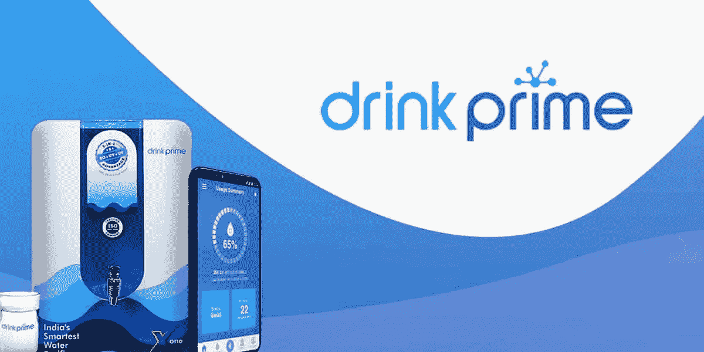

# 我的商业分析师实习故事——班加罗尔金融时报饮料总理实验室

> 原文：<https://medium.com/analytics-vidhya/my-business-analyst-internship-story-ft-drinkprime-labs-banglore-51335b719d1d?source=collection_archive---------16----------------------->

> 领导力和学习是彼此不可或缺的

首先，我已经完成了五大湖管理学院的 PGP 数据科学课程&当我找到 Drinkprime 的数据分析师实习机会时，我正在找工作。我马上申请了&经过多轮面试后被选中，然后我的班加罗尔之旅开始了。

Drink Prime 标志

第一天太棒了，我不知道班加罗尔的路线，不知何故第一天到办公室就迟到了。我遇到了我的学长 BA，并立即开始了解这家公司。Drinkprime 是一家净水公司，为班加罗尔和海德拉巴的人们提供解决方案。我被介绍给了 Drinkprime 的多个团队，并立即开始了我的工作。

因为这是一家初创公司——有许多团队有巨大的业务需求，涉及大量的数据。我在多个团队中工作，了解了创业公司的运作方式。感谢我的导师 Pranith G，他确保了我的任何疑问都能得到解决。我开始使用各种可视化工具发送报告、提取数据和构建仪表板，在 Drinkprime 中，我了解了数据可视化的价值和重要性。

> 可视化的目的是洞察力，而不是图片。本·施奈德曼

我对工作有了更多的了解，也知道了如何应对压力。与在跨国公司工作相比，在初创公司工作最重要的一点是，在跨国公司，工作是相应地分工的，在初创公司，你不知道需要什么&随波逐流，在需要的时候调节流程。也就是说，必须妥善处理压力情况。然后是我在大湖的期末考试，我不得不平行参加，并在考完试后工作。这是一个艰难的压力环境，它完美地训练了我处理大量事情的能力。

老实说，我一开始很挣扎，因为我刚开始在一家初创公司工作&在一个压力越来越大、期限越来越紧的地方也是如此。我在许多地方都感到震惊。我的导师给了我一个漂亮的建议——“我们需要结果——而不是你怎么做或者怎么做”。这是我收到的最好的礼物。这确保了我可以使用任何我能使用的技术来完成工作。我有时用 pandas 清理数据，用 SQL 从数据库中提取数据，用 PowerBi & Google Data Studio 进行数据可视化。

> 数字有一个重要的故事要讲。他们依靠你给他们一个清晰而有说服力的声音。
> ——斯蒂芬·诺什

我在这里学到的最重要的东西是数据的价值以及数字的重要性。数据总是与数字有关&这个地方 100%地证明了这一点，因为 Drink Prime 始终相信客户满意度——这是大多数产品公司关注的焦点。一个简单而有价值的产品卖给了客户&我喜欢他们让我区分任务优先级的方式。

这是一次收获颇丰的旅程，让我认识到了很多东西。所有的荣誉都归于 Pranith，我的导师和我在 Drink Prime 遇到的其他朋友。班加罗尔是一个美丽的城市，有很多机会。我从未在任何问题上挣扎过&人们都很可爱。

谢谢大家！