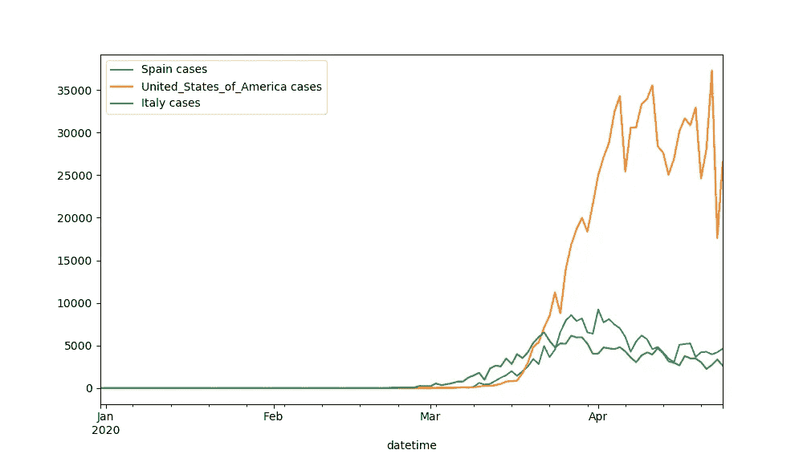
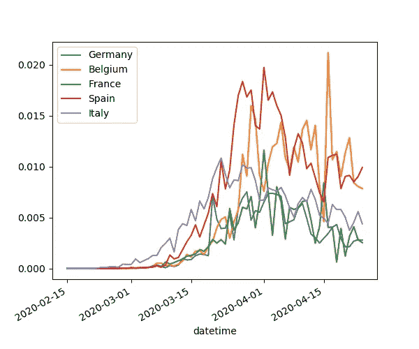
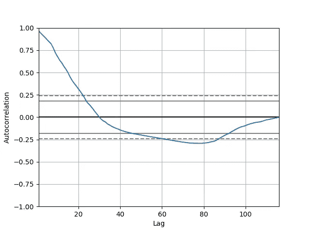
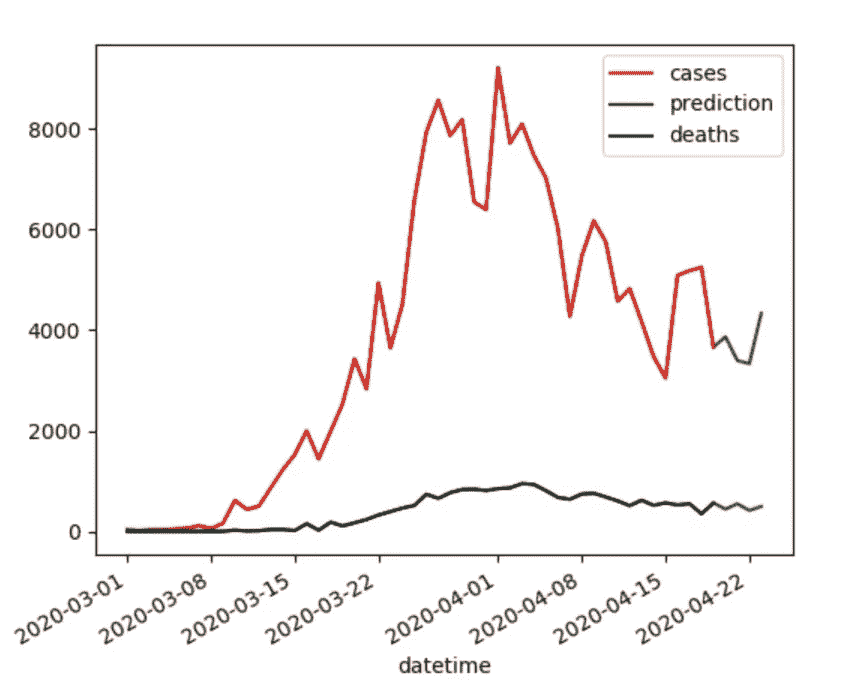
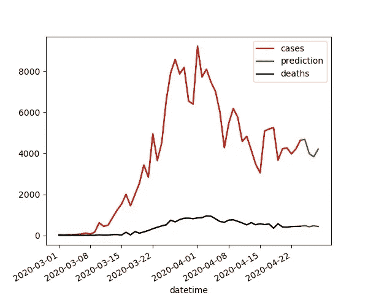

# 我的新冠肺炎分析和预测

> 原文：<https://medium.com/analytics-vidhya/my-covid-19-analysis-and-forecasting-ce7a7eaabd1d?source=collection_archive---------29----------------------->

在过去的几个月里，世界被卷入了一场由源于中国的病毒引起的全球性疫情。正因为如此，世界上大多数地方的人都必须呆在家里，直到感染人数减少。可能我们大多数人都在系统地观看新闻，以便了解情况的进展。这篇短文的目的是显示已确认的感染病例和死亡的统计数据，并显示如何对未来几天进行预测。

# 在国家间的比较中考虑人口规模

我听说 EEUU 是世界上受影响最严重的国家之一，我们看到的图表类型是(图 1):



图一。2020 年 4 月 24 日美利坚合众国病例数与西班牙或意大利病例数的对比

图 1 显示了三个国家(美国、西班牙、意大利)的新冠肺炎阳性病例的演变。仅考虑每个国家的阳性病例数，美国将是受影响最大的国家。但是，在绘制该图时没有考虑统计数据。在这种情况下，据说对于不同数量的群体(在三个不同的群体中)，病例以相同的方式计数。假设两个种群分别有 10 和 100 个个体。如果这两个国家分别有 5 个和 10 个国家受到影响，受影响最大的将是第二个国家，尽管事实上第一个国家有 50%的人口受到影响，而第二个国家“只有”10%的人口受到影响。这与图 1 所示的情况相同。我想说的是必须考虑人口总数。如果考虑到这一点，美国也不会是前五名受影响最严重的国家。图 2 显示了一个例子。



图二。截至 2020 年 4 月 24 日受影响最大的前 5 个国家/地区的病例演变

在前面的图(图 2)中，考虑了人口(以百分比表示)。病例总数除以人口数。可以看出，美国不在排名前列的国家。西班牙或比利时可能会受到最大的影响，尽管事实上必须考虑更多的参数，例如每天进行的测试数量。这种分析也适用于死亡人数。

每天更新的进化可以参考以下项目:[https://vicenteperezsoloviev.github.io/covid/](https://vicenteperezsoloviev.github.io/covid/)

# 用 AR 持久模型对新冠肺炎数据进行预测

请注意，在网站中，对西班牙的情况进行了简短的分析和预测。

执行时间序列预测的目的是根据过去的一些值来预测未来几天的值。数据科学家面临的主要问题是可用数据量少。因此，例如，不能应用神经网络，而必须应用其他模型，例如基于 ARIMA 的模型。

在我的项目中，持续自回归(AR)模型应用于数据，直到预测西班牙接下来 4 天的死亡和病例。代码如下:

```
**def** prediction_AutoRegressive2(pathdestino, num_predicciones):
    dt = pd.read_csv(pathdestino)

    dt[**'datetime'**] = pd.to_datetime(dt[**'dateRep'**], format=**'%d/%m/%Y'**)
    dt = dt.set_index(**'datetime'**)

    dt = dt.iloc[::-1]

    start_date = **'03/2020'** dt = dt[start_date:]
    dt = dt[dt[**'countriesAndTerritories'**] == **'Spain'**]

    casos = list(dt[**'cases'**].values)
    muertes = list(dt[**'deaths'**].values)

    *#cases prediction* model = AR(casos)
    model_fit = model.fit()
    window = model_fit.k_ar
    coef = model_fit.params

    print(**'cases prediction: window size (%d)'** % window)

    history = casos[len(casos) - window:]
    history = [history[i] **for** i **in** range(len(history))]

    predictions = []
    **for** t **in** range(num_predicciones):
        length = len(history)
        lag = [history[i] **for** i **in** range(length - window, length)]
        yhat = coef[0]
        **for** d **in** range(window):
            yhat += coef[d + 1] * lag[window - d - 1]
        predictions.append(yhat)
        history.append(yhat)

    casosPred = history[-num_predicciones:]

    *# deaths prediction* model = AR(muertes)
    model_fit = model.fit()
    window = model_fit.k_ar
    coef = model_fit.params

    print(**'deaths prediction: window size (%d)'** %window)

    history = muertes[len(muertes) - window:]
    history = [history[i] **for** i **in** range(len(history))]

    predictions = []
    **for** t **in** range(num_predicciones):
        length = len(history)
        lag = [history[i] **for** i **in** range(length - window, length)]
        yhat = coef[0]
        **for** d **in** range(window):
            yhat += coef[d + 1] * lag[window - d - 1]
        predictions.append(yhat)
        history.append(yhat)

    muertesPred = history[-num_predicciones:]

    **return** casosPred, muertesPred
```

完整的项目和代码可以在我的 GitHub 中找到:[https://github.com/VicentePerezSoloviev/covid](https://github.com/VicentePerezSoloviev/covid)

因为它是持久的，所以数据用于预测 4 个时间-1 天的范围，而不是使用数据来预测 1 个时间-4 天的范围。这样，当天 t+1 的预测用于预测 t+2、t+3 和 t+4；t+2 的预测用于预测 t+3 和 t+4；t+3 也是如此。

要进行预测，必须考虑过去的一些天，而要知道必须考虑多少天是一个问题。为了解决这个问题，我们绘制了一个自相关图，以便根据预测知道确切的天数(图 3)。



图 3。西班牙新冠肺炎病例演变的自相关图

先前的自相关图有助于了解为了执行预测需要考虑多少过去的值。知道了日期，算法可以估计一个函数来进行预测。考虑太多的天数会使模型过度拟合，这会使模型过度偏向，而考虑太少的天数会使模型非常差。在前面的图中，请注意数据量非常小，很难用它们进行预测。应该用于模型的最小数据数量对应于 C(滞后)→0，在这种情况下，这意味着使用所有数据来估计函数(过拟合的完美定义)。其他作者在 C(滞后)第一次穿过零线时使用该值。尽管事实如此，我们还是要试一试！

库 [statsmodels](https://www.statsmodels.org/stable/index.html) 提供了想要的 AR 模型，它包含了要考虑的过去天数的估计(滞后数)。我预计是用前 10 天。我将展示一个 4 天前的预测。和实际情况，以便向您展示它是如何预测的。



图 4。5 天前的西班牙形势与预测。



图 5。今日西班牙形势与预测。

在图 4 和图 5 中，显示的是 5 天前的预测和实际情况。诚然，这不是完美的预测，但用这么少的数据也不是那么糟糕的预测。

# 结论

总而言之，只需注意目标是尝试用实际数据进行预测。结果表明，没有足够的数据，而且有更多的变量需要考虑。现在，对人群进行了更多的测试，所以很明显在未来几天会看到越来越多的病例，所以在我看来，只考虑这些变量是不一致的。

在这篇文章的开始，我想说的是，为了在同一个图中表示相同的数据(而不是把梨和苹果混在一起)，要在国家之间进行比较，必须对案例进行标准化。

数据集下载自:

*   [https://open data . ecdc . Europa . eu/covid 19/case distribution/CSV](https://opendata.ecdc.europa.eu/covid19/casedistribution/csv)
*   [https://raw . githubusercontent . com/data dista/datasets/master/COVID % 2019/ccaa _ COVID 19 _ fallecidos . CSV](https://raw.githubusercontent.com/datadista/datasets/master/COVID%2019/ccaa_covid19_fallecidos.csv)

而且每天更新的剧情可以在 https://vicenteperezsoloviev.github.io/covid/[咨询](https://vicenteperezsoloviev.github.io/covid/)

如果你读到最后，谢谢你！