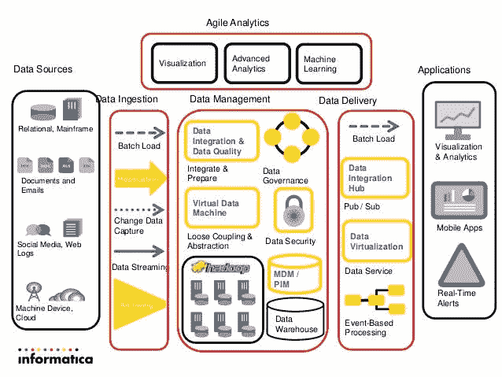
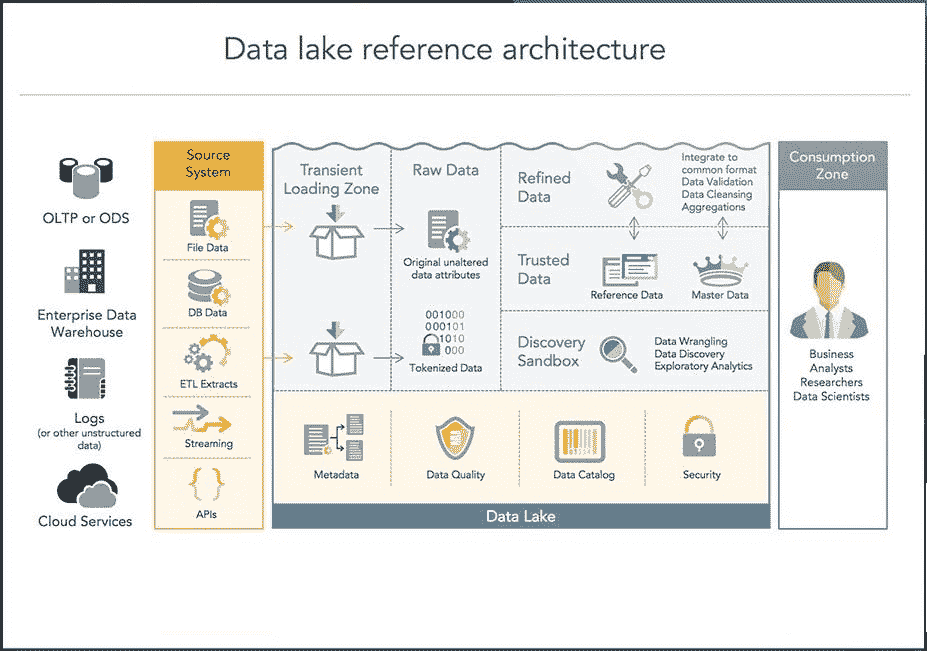
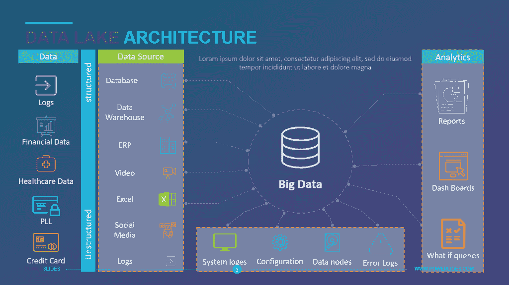
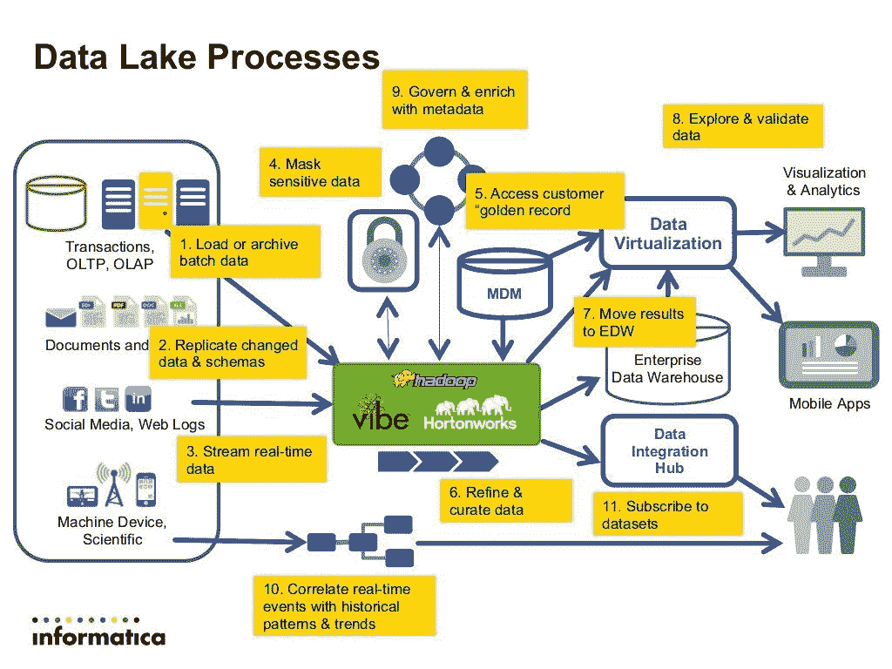

# 我对数据湖的定义

> 原文：<https://medium.com/analytics-vidhya/my-definition-of-data-lake-4620be139424?source=collection_archive---------14----------------------->

> 你用了一些特殊的技术也没关系。它是关于数据管理的概念和用于数据处理的架构。
> 
> *比如广为人知的 Hadoop。这是对数据湖最常见的误解。*

与大多数类似的文章不同，我将重点解释这个概念和我的主题:“我对数据湖的定义”。更不用说技术细节了。请理解。如前所述，这是数据管理流程和架构的概念，而不仅仅是您使用的技术。

你也可以查看另一篇文章，但观点相似:

 [## 数据湖？关于架构、战略和分析的大神话

### 什么是数据湖？帮助成为数据驱动型企业

blog.openbridge.com](https://blog.openbridge.com/8-myths-about-data-lakes-c0f1fc712406) 

数据湖是数据处理技术的结合。我在网上抓取了一些架构图，因为它准确地展示了我在经历中学到东西。

我最喜欢的一个来自 Infomatica 2013:

年轻人..他们在 2013 年就已经有了这个概念。所以我不会重复我所知道的和他们一样的事情。我指的是这显示了一个数据湖架构。我们从不同的应用程序、数据接收、数据管理、数据分析和应用程序中获得数据源。我们至少需要这些数据处理的组件来称之为数据湖。当然，如果你想增加更多的数据处理和应用，请便。

> *这是数据湖的精髓:灵活使用数据。*

我将展示更多的概念和解释数据湖的目的。

基本上，我们可以看到这些体系结构显示了数据湖的多样性。绝对不仅仅是“Hadoop”、“大数据仓库”，甚至不仅仅是“非结构化数据和结构化数据”的结合。无论您使用什么技术，数据湖更像是一个端到端的业务数据流程。

好的。在澄清定义之后，我将分享我构建数据湖的经验。

我们将按照下面的项目来介绍技术。最后说一个案例。

*   数据源
*   数据摄取
*   数据管理
*   数据传送
*   分析学
*   应用程序

我们得到了 RDB，Redis，Elasticsearch，HDFS，EXCEL 和图片作为我们的数据来源。许多人可能试图将原木迁移到 RDB 或将 RDB 迁移到 HDFS 等等。

首先，如果你想做数据湖，拥抱你的不同类型的来源。我们都知道，生活在一个简单的世界可能很简单，但要小心，简单不等于轻松或幸福。

> 让他们呆在原地。我们建造隧道来连接它们，而不是把它们放在一起。

2.数据摄取

我们通过批处理、流、CDC 和归档定义了我们可以看到的内容。这一步一定要定义清楚。以防万一我们会详细讨论这个问题。

3.数据管理

我们在这里定义了数据使用、用户权限、数据安全性、验证规则(数据质量)和数据类别。

4.数据传送

我们为外观设计了最终的压缩数据和存储。

5.分析学

我们根据我们的业务需求和目的来分析数据。从数据证据中生成业务指示和操作。

6.应用

我们使用来自其生命周期不同阶段的数据，并利用数据实现业务流程的自动化。

哇！听起来像是黑魔法。您可以通过数据湖完成您的业务流程！

但是背后有很多很多的辛苦和时间成本。让我们从我的经历说起。

> 在商业中，我们“简单地”只想【跟踪】和【监控】客户连接到我们网站的速度。我们需要对我们的业务规模进行预测，还需要硬件设备准备建议。很简单，对吧？
> 
> *我认为当你只关注业务而没有任何技术概念时，上面的话真的很常见。*

肯定的，一点都不容易。我们忽略了非常巨大的调查时间成本，并专注于我们用来解决的技术。

**来源**
RDB
我们用它来获取客户投入资金的交易数据和其他业务相关的参考信息。

Redis
我们用它来更快地缓存客户登录我们网站的密钥。

Elasticsearch
我们用它来获取应用服务器的日志信息。

HDFS
我们将它用于档案数据和数据探索沙盒。

EXCEL
我们用它来沟通和调整我们的数据逻辑和业务逻辑。

这是我们得到的数据来源。现在是时候将它们归类为不同的摄入方式了。

**摄取**
RDB、EXCEL 是同一个类别。我们在 RDB 相关函数中使用它们。

HDFS 是档案数据和流数据的不同用法。

Redis 是数据，我们不做任何事情，只是保持缓存系统正常工作。

Elasticsearch 得到了它的生态系统。我们将在管理我们的数据湖时讨论它。

**管理**
在我们的业务中，我们将监控、归档存储、报告和分析分离为数据流程的 4 个不同部分。因此，我们构建了 RDB 和 ELK 监视器来同时查看收入和服务器健康检查(实际上存在延迟)。HDFS 是大数据分析沙盒和流档案数据。报告和传统分析依赖于 RDB 和麋鹿。

**交付**
有些数据纯粹是原始的，比如在 HDFS 的流媒体。但是其余的大部分我们仍然从原始数据中进行一些提取和转换。我们定义来自 ELK 的数据是关于系统的，来自 RDB 的数据是关于收入的，所以交付目标保持不变。在 RDB，我们为报告和分析做预先计算结果。在 ELK 中，我们把它分成两部分使用。首先，我们在 Elasticsearch 中保留了它们的原始数据，当我们想通过 Kibana 查询时就进行查询。其他部分，我们从 Logstash 传输数据，并用我们定义的规则解析它们到 RDB。这为我们提供了一些 ELK 中没有直接提供的数据的分析和使用。

**分析** & **应用**
我不打算谈论我们“如何”进行分析的方式。有大量的文章和流通股。我要说的是分析结果的“用法”。我们确定了一些显示警报的标准，当我们认为服务达到我们设定的临界水平时， ***会自动*** 重启服务。当收入和未来客户预测达到我们设定的水平时，我们将自动预打开应用服务器*。那就是我们所说的“**分析**”和“**应用**”。*

*不仅仅是一份报告。报告帮助我们找到行动。做、**动作，自动做动作更好。***

**

*好的。以上所有的东西就是我们所说的业务实体中的数据湖。*

**原载于 2019 年 11 月 21 日*[*http://datamansamxiao.wordpress.com*](https://datamansamxiao.wordpress.com/2019/11/21/my-definition-of-data-lake/)*。**