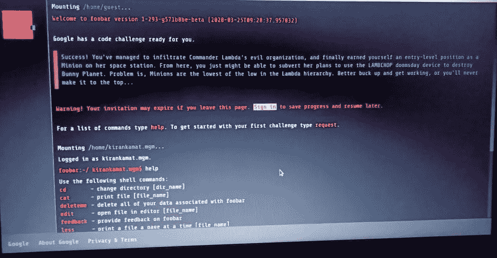
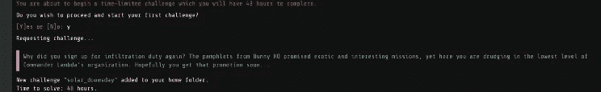
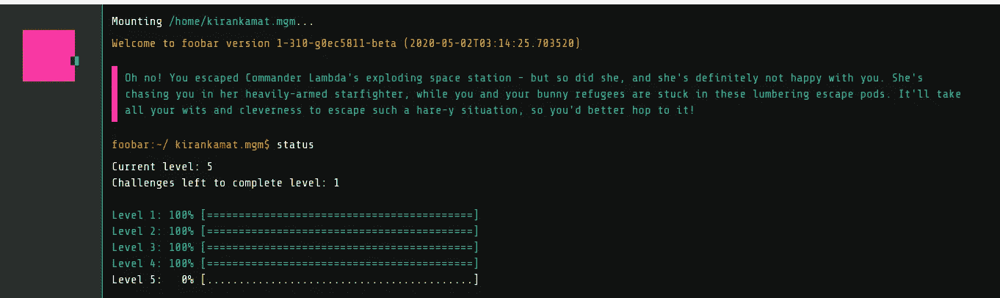

# 我参加 Google foobar 挑战的经历

> 原文：<https://medium.com/analytics-vidhya/my-experience-of-google-foobar-challenge-bc2f8a820d6d?source=collection_archive---------15----------------------->

2020 年 7 月 25 日

2020 年 3 月 25 日，我被邀请参加 Google foobar 挑战赛，并在 2020 年 5 月 2 日之前完成了第 4 级。几个月前我写了这篇博客(经历),但忙于其他工作，所以不能发表，所以今天发表。

**#博客 20**

照片由[克里斯蒂安·威迪格](https://unsplash.com/@christianw?utm_source=medium&utm_medium=referral)在 [Unsplash](https://unsplash.com?utm_source=medium&utm_medium=referral) 上拍摄

谷歌有一个秘密的招聘方式，是的，你没看错！！！

Google Foo bar challenge 是一个在全世界范围内雇佣开发者和程序员的秘密过程。谷歌利用这一点在全球范围内雇佣一些最好的开发人员，他们认为这些人可以很好地匹配他们的组织。这是一个秘密的过程，挑战包括编码挑战，难度随着你的进展而增加。Google foobar 页面不是每个人都可以访问的。谷歌发出邀请，只有那些程序员才有机会参加 foo bar 挑战赛。

Google Foobar 是一个基于邀请的招聘挑战。也就是说，你只有得到 Google 的 Foobar 邀请才能接受挑战。Foobar 挑战的独特之处在于**它**找到**你**，而不是通常的另一种方式。

所以，让我向你介绍一下我在 Google foobar 挑战赛中的经历。

我正在搜索 python assert，页面加载…

浏览器窗口突然打开，我看到了这个

“你在说我们的语言。准备好接受挑战了吗？”

有一个链接，我打开它，它把我重定向到一个新的页面‘foo . bar’

这有点像一个 Linux 控制台(UNIX 命令行界面),打开一个新的问题目录，你就可以一个接一个地解决问题。

(这张照片是我用手机拍的)

屏幕顶部有一些文本:

“谷歌为你准备了代码挑战”

就在下面，有一段蓝色的文字为一场科幻冒险做好了准备:

“成功了！你已经设法渗透到指挥官拉姆达的邪恶组织，并最终为自己赢得了一个入门级的职位，成为她的空间站上的一个奴才。从这里，你也许可以颠覆她用小羊排末日装置摧毁兔子星球的计划。问题是，奴才是 Lambda 等级中最底层的。最好振作起来，开始工作，否则你永远也不会成功……”

还有一个提示，如果你离开这个页面，它就会过期，所以我登录了。

有一个自述文件，所以打开自述文件，这就是如何开始挑战。

# 关于挑战

挑战包括 5 个层次的算法问题。我不会分享问题，也不会分享解决方案，因为这是不公平的。

但到目前为止，这真的是很棒的经历。

开始的几关相对容易，但是随着关卡越来越多，难度也越来越高。我已经完成了第 4 级，但我无法完成第 5 级。第四级相当激烈！每个问题给我几周时间。这些问题需要从数论到图表的多种概念。我设法完成了它。

完成第 3 级后，我必须在控制台中提交我的个人信息。

# 第 5 级

我花了大约一个半月的时间完成了第 4 级，但第 5 级的问题很难，我无法破解其中的逻辑。

在 foobar 挑战中，时间在第三级之前是不受限制的，但是如果你不是每天都在挑战中工作，那么在第三级之后时间就变得受限制了。同样的事情也发生在我身上。因为 1、2、3 级的挑战很容易，我在一天内就完成了，但我没有要求新的问题(进入下一级)，直到我有空，这意味着我没有认真对待它。但是四级很难，每个问题给我几周时间。我花了几周时间来完成这个问题。现在我感觉到了问题的难度，每天都需要花几个小时来解决这个问题。这些问题需要从数论到图表的多种概念。我设法完成了它。

第五级比第四级更难。这个问题给了我几个星期的时间，但我忘记了这个挑战，当我打开 foobar 时，我只有 2 天的时间来完成，只是在第 5 级输了。

# 我的建议

所以如果你有机会参加 Google foo bar 挑战赛，不要盯着给你的时间去解决问题，而是努力完成并提交。

如果提交的早，就好好享受剩下的时间学习，准备下一关。

关于反馈，你可以在 Kaggle [这里](https://www.kaggle.com/general/169271)或者在 [Reddit](https://www.reddit.com/r/programming/comments/hxft1o/my_experience_of_google_foobar_challenge/) 发推文或者发表评论。

*最初发布于*[*https://kirankamath . netlify . app*](https://kirankamath.netlify.app/blog/my-experience-of-google-foobar-challenge/)*。*