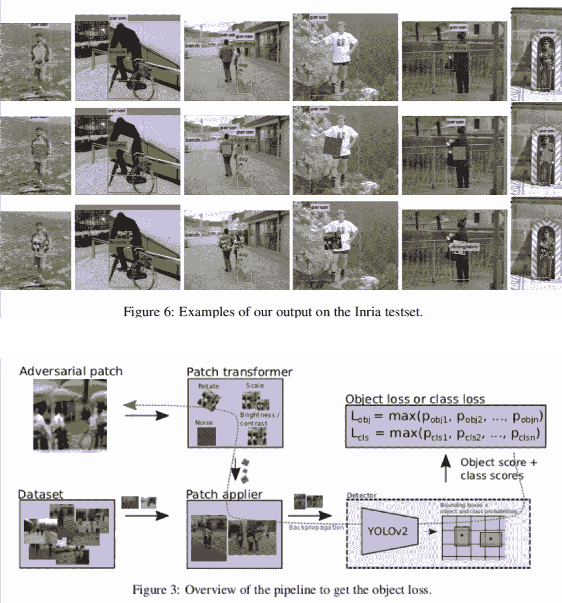
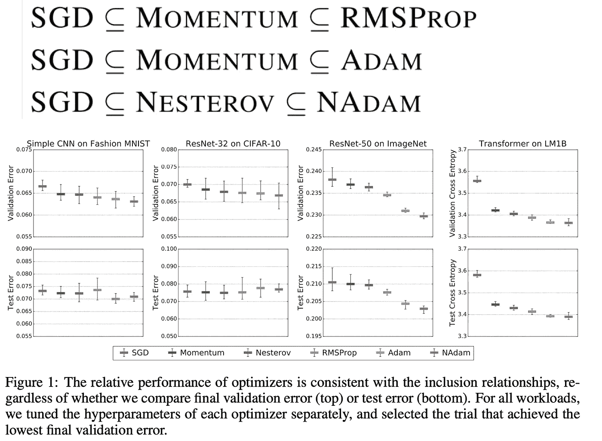
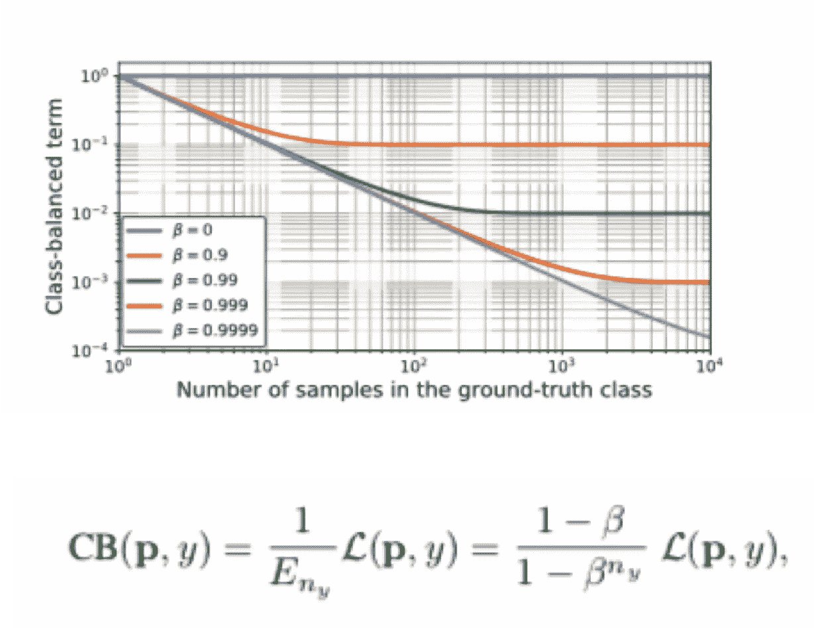

# 2019 年我最喜欢的机器学习论文

> 原文：<https://medium.com/analytics-vidhya/my-favorite-machine-learning-papers-in-2019-a9424c2f4f00?source=collection_archive---------20----------------------->

## 第 1 部分:图像任务、视频任务、学习技巧等等

威廉·艾文在 [Unsplash](https://unsplash.com?utm_source=medium&utm_medium=referral) 上的照片

# 关于这篇文章

在这篇文章中，我提供了 2019 年发表的机器学习论文中个人感兴趣的论文的概述。由于是大量的论文，把它放在一起，我把它分成三个职位。

*   第 1 部分:图像、视频和学习技巧(现在在这里)
*   第 2 部分:自然科学中的 NLP，ML，DL 分析(将于 1 月 18 日发布)

 [## 2019 年我最喜欢的机器学习论文第二部分— NLP，科学中的 ML，DL 的分析—

### 在这篇文章中，我简要地解释了自然语言处理，科学中的 ML，DL 的分析

medium.com](/@akichan_f/my-favorite-machine-learning-papers-in-2019-part-2-nlp-ml-in-science-analysis-of-dl-b914e150eaf9) 

*   第 3 部分:GAN、实际应用和其他领域(将于 1 月 25 日发布)

第一部分提供了以下五个领域共 27 篇论文的概述。请注意，字段中有一些重复项，因为它们只是为了方便而设置的。

1.  图像分类/目标检测 CNN 层的改进
2.  视频任务
3.  表征学习/提炼
4.  数据增强。
5.  学习技术/目标函数/半监督学习

# 1.图像分类/目标检测 CNN 层的改进

在这一节中，我介绍了关于单幅图像任务的论文，如图像分类和目标检测。我还介绍了提出一种新的 CNN 层结构的论文。图像分类是深度学习最基本的任务之一，这里开发的技术在其他领域应用和传播是很常见的。我认为今年最重要的论文之一是效率网。EfficientNet 也应用于对象检测，该思想也用于视频中的运动检测。已经宣布了许多新的 CNN 层，它们易于实现并且具有低计算成本。我很期待以后的事情。

## 1.EfficientNet:重新思考卷积神经网络的模型缩放

【https://arxiv.org/abs/1905.11946 

他们通过同时优化分辨率、深度和通道数量来构建高速、高精度的网络。通过在方程 3 中设置φ = 1，在 MnasNet (B0)的搜索空间中优化αβγ，然后改变φ，重复重新优化，构造 B1-> B7。

## 2.EfficientDet:可扩展且高效的对象检测

[https://arxiv.org/abs/1911.09070](https://arxiv.org/abs/1911.09070)

高速和高精度的对象检测网络 EfficientDet，具有 EfficientNet 和 BiFPN 等搜索空间，这是一种功能金字塔网络，可从高分辨率和低分辨率传输信息。它实现了 SOTA，但比 NAS 快 10 倍左右。

## 3.动态卷积:关注卷积核

[https://arxiv.org/abs/1912.03458](https://arxiv.org/abs/1912.03458)

他们没有直接增加 CNN 频道(核)的数量，而是提出了动态卷积，该动态卷积使用增加的核来执行卷积。它可以用普通的 CNN 来代替，并且在分类和目标检测中效果良好。我认为根据“彩票假设”得出好的初始值可能很容易，因为许多核可以以伪方式使用。

## 4.**降一个八度:用八度卷积减少卷积神经网络中的空间冗余**

【https://arxiv.org/abs/1904.05049 

他们提出了卷积神经层 Octave Conv，它分别处理图像中具有细节信息的密集部分和具有轮廓信息的稀疏部分。该过程是分别在低分辨率和高分辨率下进行卷积，并且整合高和低信息。可以直接用常规 CNN 代替，同样的参数数量会更快更准。

## 5.渠道平衡网络

[https://openreview.net/forum?id=BJlOcR4KwS](https://openreview.net/forum?id=BJlOcR4KwS)

研究通过调整通道之间的相关性来有效利用所有通道。在 Conv-BN-Relu 结构中，未使用通道的数量增加(稀疏化)，这对准确性有不利影响。通过引入使信道不相关的信道平衡(CE)块，防止了稀疏化并提高了精度。在几乎不增加计算量的情况下，它在图像分类/目标检测方面有很好的效果。

## 6.视觉模型中的独立自我注意

[https://arxiv.org/abs/1906.05909](https://arxiv.org/abs/1906.05909)

研究模型变得更好，以自我关注代替深藏在网络中的转换层。使用 Conv 作为第一层，并用自我注意力(Conv-stem +注意力)替换其余部分，产生了图像网和对象检测的结果。基本上，如果自我关注位于比 Conv 更深的地方，情况会变得更好。在这种情况下，建议使用更大的过滤器。

## 7.对立的例子提高了图像识别

[https://arxiv.org/abs/1911.09665](https://arxiv.org/abs/1911.09665)

显著提高了使用对立样本的 ImageNet 和带有噪声的 ImageNet 的准确性。通过将 BN 与敌对数据和正常数据分开，防止了由于数据混合而引起的分布变化。简单但相当强大。

在我的博客里讲解-> [***《对抗性例子提高形象识别》简介，ImageNet SOTA 方法运用对抗性训练***](/analytics-vidhya/introduction-of-adversarial-examples-improve-image-recognition-imagenet-sota-method-using-1fe981b303e)

**

## *8.FreeAnchor:学习匹配视觉对象检测的锚点*

*[https://arxiv.org/abs/1909.02466](https://arxiv.org/abs/1909.02466)*

*提出了一种通过使用多个候选者的最大似然估计而不是回归到单个锚的物体检测方法。建议最好采用最大似然估计，因为手工制作的锚往往不准确。关键点是引入一个可根据最优性评估损失的标准线性函数和一个根据学习进度增加最优值权重的均值-最大函数。*

**

## *9.Edge net——基于边缘的卷积神经网络对象检测器的平衡精度和性能*

*[https://arxiv.org/abs/1911.06091](https://arxiv.org/abs/1911.06091)*

*他们为处理高分辨率图像的边缘相机提出了一种高速节能的 EdgeNet。它分为候选位置计算单元、检测单元和光流跟踪单元。比 Tiny-YoloV3 更快更准。*

**

## *10.愚弄自动监控摄像机:攻击人员检测的对抗性补丁*

*[https://arxiv.org/abs/1904.08653](https://arxiv.org/abs/1904.08653)*

*研究创建一个在对象检测中不检测人的模式。如果你贴上这张印刷海报，你将不会被认出是人类。海报旨在增加被归类为人类的损失和被认为是物体的损失。*

*在随后的研究“隐身衣:对物体探测器的真实世界对抗性攻击([https://arxiv.org/abs/1910.14667](https://arxiv.org/abs/1910.14667))”中，作者验证了攻击补丁可以对另一个模型起作用。相对的阻碍可以转移到其他模特身上，印在衣服上是有效的，如图。*

**

# *2.视频任务*

*视频分析也是 DL 可以有效工作的领域之一。有一个印象是对高速处理有一些研究，比如不使用光流等附加数据，使用光网络等。，以便处理大量的连续图像数据。慢速-快速网络给人的印象是网络上已经执行了功能工程。微小视频网的搜索空间似乎受到了 EfficientNet 的影响，令人印象深刻的是视频分析网常用的 Conv3D 和非本地并没有出现。我还对“时间周期一致性学习”可以在没有老师的情况下做到这一点印象深刻。利用周期一致性学习似乎是思想的胜利。*

## *1.用于视频识别的慢速网络*

*[https://arxiv.org/abs/1812.03982](https://arxiv.org/abs/1812.03982)*

*在视频分析中，他们提出了一种 SlowFast 网络，通过将网络分为高 FPS 处理和低 FPS 处理来构建网络。前者在时序方向不使用池，后者主要使用 Conv2D。在时间序列方向上进行卷积时，似乎综合了高低帧信息的部分更好。*

*此外，为了匹配两个处理时间，根据帧的数量减少高 FPS 处理单元中的通道数量。*

**

## *2.微型视频网络*

*https://arxiv.org/abs/1910.06961*

*使用遗传算法发现的视频分析网络可以以百分之一的计算成本实现相同的性能。发现的网络不使用 Conv3D，这是一种非本地层，常用于视频分析。搜索空间看起来像 EfficientNet，因为我们在搜索深度/频道数量/分辨率。*

**

## *3.时间循环一致性学习*

*【https://arxiv.org/pdf/1904.07846.pdf *

*基于循环一致性和自监督学习的不同视频相同行为的无监督学习。执行学习，使得通过编码两个视频获得的特征在相应的时间点成为最近的邻居(周期一致性)。*

****

# *3.表征学习/提炼*

*表征学习是研究图像等高维数据如何嵌入低维空间而不丢失信息的一个研究领域。有一种印象是，关于使用度量学习而不是教师信号来创建良好的嵌入式表示的研究已经被发现。有很多方法可以使用互信息，但是一篇论文认为这不是一个好方法。蒸馏是研究如何将重量级的、高精度的网络转移到轻量级的网络。一些使用度量学习进行这种提炼的研究取得了良好的结果。*

## *1.无监督视觉表征学习的动量对比*

*[https://arxiv.org/abs/1911.05722](https://arxiv.org/abs/1911.05722)*

*无监督表示学习，MoCo，它的表现类似于使用字典的度量学习。关键网络逐渐更新以更接近查询网络。当用作预训练时，它可以提高目标检测的准确性。*

**

## *2.对比表征提取*

*【https://arxiv.org/abs/1910.10699 号*

*他们引入了提炼目标函数，如果相同的输入被输入到教师网络和学生网络，则值减小，否则值增加。它优于其他蒸馏方法。很好地捕捉了教师网络权重的分布。*

**

## *3.表征学习的互信息最大化研究*

*【https://arxiv.org/abs/1907.13625 *

*在最大化互信息的现有表示学习中，编码器和评估器之间存在归纳偏差，并且表示不能简单地通过纯粹最大化互信息来获得。有时，简单的评估器和更差的下限(MI 的理论值)比更好的下限模型产生更好的结果。作者表明，他们可以降低线性分类器的准确性，这些线性分类器根据通过敌意学习获得的表示进行分类，同时增加互信息。*

**

## *4.迭代变分推理的多目标表征学习*

*[https://arxiv.org/abs/1903.00450](https://arxiv.org/abs/1903.00450)*

*使用变分近似从包含多个对象的图像中分离每个对象的研究。为每个对象提供潜在变量，并且推断出分离对象的图像和用于分配给实际图像的掩模。*

**

# *4.数据扩充*

*数据扩充是获得好模型的必要手段。去年发表了几项自动增强的后续研究，自动探索良好的数据增强。一篇论文提出，增强的时机有好有坏，并建议在学习的最后阶段使用未增强的数据。使用 GAN 对数据增强进行了各种研究，但是“条件生成模型的分类准确度分数”声称是无效的。确实密度估计(生成)比分类难，所以我觉得有道理。*

## *1.更快的自动增强:使用反向传播的学习增强策略*

*[https://arxiv.org/abs/1911.06987](https://arxiv.org/abs/1911.06987)*

*在搜索最佳数据扩充方法的自动扩充中，获取每个转换操作的预期值可以通过转换操作策略的反向传播实现优化，并加快其速度。此外，基于数据扩充是现有数据的补充的思想，利用两个指标来执行优化，这两个指标指示扩充的数据是否接近现有数据或者是否能够被很好地分类。*

**

## *2.RandAugment:具有缩小搜索空间的实用自动数据扩充*

*https://arxiv.org/abs/1909.13719[.](https://arxiv.org/abs/1909.13719)*

*在寻找最佳数据扩充的自动扩充中，他们提出了同时也学习的 RandAugment。搜索空间被压缩到(N，M)，以强度 M 进行随机 N 次扩充。尽管简单，但结果等于或优于以前的结果。*

*他们说，像相关工作一样将最佳数据扩充方法搜索和学习分开是不好的，因为在最佳数据扩充方法和数据或模型的数量之间存在相关性。*

**

## *3.**重新审视数据增强:重新思考干净数据和增强数据之间的分布差距***

*[https://arxiv.org/abs/1909.09148](https://arxiv.org/abs/1909.09148)*

*在用扩充数据学习后，增加一个用非扩充数据调整的步骤的研究。建议是数据增广好，但最后微调最好用干净的，因为可能会出来不合适的数据。*

**

## *4.条件生成模型的分类准确度分数*

*[https://arxiv.org/abs/1905.10887](https://arxiv.org/abs/1905.10887)*

*这项研究表明，GAN 现在能够创建真实图像，但仅使用生成的图像创建分类器不起作用。使用由 GAN 生成的数据的分类器的准确性和在 GAN 评估中经常使用的 FID 分数之间没有相关性。使用 FID 分数比 Big-GANs 更差的自回归或 VQ-VAE 生成的数据，可以创建具有更高精度的分类器。*

*看每一类的分类精度，仅使用生成图像的分类精度不如使用真实数据的分类精度，进行得不顺利且似乎引起模式崩溃的类的 GAN 生成图像，而 VQVAE 则没有引起。*

**

# *5.学习技术/目标函数/半监督学习*

*在这里，我介绍论文，似乎很有趣，关于优化器和目标函数。修正的 Adam，结合了预热的效果，可能会在需要预热的变形金刚模型中流行。根据关于优化器比较的论文，Adam 在适当调优时很强大，但是我想知道调优成本取决于任务。针对不平衡数据提出了各种方法。但我认为实践中的有效性并没有得到保证，因为有一个故事说过采样在 DL([https://arxiv.org/abs/1710.05381](https://arxiv.org/abs/1710.05381))中并不坏。*

## *1.自信学习:估计数据集标签的不确定性*

*https://arxiv.org/abs/1911.00068*

*基于标准化混淆矩阵，通过移除“噪音”标签(低置信度的误预测数据)来改进数据的方法提案。可视化显示 ImageNet 有噪声。但是，去除后的精度提升并不是相对较大。*

**

## *2.深度学习优化器的实证比较*

*【https://arxiv.org/abs/1910.05446 *

*比较优化者的研究。优化器有一个包含关系，最一般的比如 Adam 比较好。它说了三件事。第一:Adam 等自适应系统在调优时优于 SGD momentum，第二:调度等学习速率的调整容易被强调，但 beta 和 epsilon 优化的改善幅度也很大，第三:自适应优化器中的最优 epsilon 取决于任务。*

*实际上，在使用自适应优化器时，最好调整所有元参数。*

**

## *3.适应性学习率的方差及其超越*

*[https://arxiv.org/abs/1908.03265](https://arxiv.org/abs/1908.03265)*

*研究表明，预热是一种在前几步使用小学习率的方法，它可以避免局部最小值，因为它可以避免仅基于前几个小样本的方差的大更新。*

*作者还提出了 Adam 的改进版本，修正 Adam，它应用了基于方差的学习率。*

**

## *4.MixMatch:半监督学习的整体方法*

*[https://arxiv.org/abs/1905.02249](https://arxiv.org/abs/1905.02249)*

*提高了识别准确率，实现了 sota。通过使用半监督学习中使用的三种策略。1st:一致性正则化，在本文中，他们使用增广数据预测值的平均值。第二:通用正则化，在本文中，他们使用混合。第三:熵最小化，在本文中，他们通过使用温度项来增加到决策边界的距离。*

**

## *5.基于有效样本数的类别平衡损失*

*https://arxiv.org/abs/1901.05555*

*作者提出了类别平衡损失的数据集有很大不同的数据数量的每一个类别。根据数据数量应用斜率。与经常使用的乘以数据数量的倒数的方法不同，具有特定数据数量或更多数据数量的类别具有应用相同系数的规范。很容易实现。*

**

## *6.用软最近邻损失分析和改进表示*

*【https://arxiv.org/abs/1902.01889 *

*作者通过增加温度项扩展了软最近邻损失。在隐藏层中最大化它改进了生成模型，并创建了对异常值更具抵抗力的分类器。当使用这个来分析 ResNet 时，有趣的是看到除了最后一层之外，它们似乎正在学习类共有的特征，而不是类分类所需的特征。*

*使用这个结果，你可以在最终层得到更好的混合效果。看博客。 [***“最终图层混合效果更好”***](/analytics-vidhya/better-result-with-mixup-at-final-layer-e9ba3a4a0c41)*

**

## *7.高斯相似度下的最大间隔类不平衡学习*

*[https://arxiv.org/abs/1901.07711](https://arxiv.org/abs/1901.07711)*

*作者提出了一种损失函数，称为亲和损失，它对不平衡数据同时执行分类和聚类。像 SVM 一样，它可以在每个类的中间绘制一个决策边界来分类，并为每个类匹配分布的大小。*

**

# *结论*

*在这篇博客中，我主要介绍了图像/视频任务以及与学习相关的想法。下周和下周，我会在以下主题上发布 2019 年有趣的论文列表，如果你喜欢，请回来查看。*

*第 2 部分:自然科学中的 NLP，ML，DL 分析(将于 1 月 18 日发布)*

*第 3 部分:GAN、实际应用和其他领域(将于 1 月 25 日发布)*

## *推特，一句话的论文解释。*

* [## 阿基拉

### akira 的最新推文(@AkiraTOSEI)。机器学习工程师/数据科学家/物理学硕士/…

twitter.com](https://twitter.com/AkiraTOSEI)*