# 2019 年我最喜欢的机器学习论文第二部分— NLP，科学中的 ML，DL 的分析

> 原文：<https://medium.com/analytics-vidhya/my-favorite-machine-learning-papers-in-2019-part-2-nlp-ml-in-science-analysis-of-dl-b914e150eaf9?source=collection_archive---------20----------------------->

# 关于这篇文章

在这篇文章中，我提供了 2019 年发表的机器学习论文中个人感兴趣的论文的概述。由于是大量的论文，把它放在一起，我把它分成三个职位。这篇文章是第二部分。

*   ↓ [第一部分:图像视频与学习技巧](/analytics-vidhya/my-favorite-machine-learning-papers-in-2019-a9424c2f4f00)(1 月 10 日贴)

 [## 2019 年我最喜欢的机器学习论文

### 关于这篇文章

medium.com](/analytics-vidhya/my-favorite-machine-learning-papers-in-2019-a9424c2f4f00) 

*   第 2 部分:自然科学的 NLP，ML，DL 的分析(现在在这里)
*   第 3 部分:GAN、实际应用和其他领域(将于 1 月 25 日发布)

第 2 部分提供了以下 4 个领域共 24 篇论文的概述。请注意，字段中有一些重复项，因为它们只是为了方便而设置的。

## 1.神经语言过程

1.  *使用单语对齐更新预训练的单词向量和文本分类器*
2.  *MIXOUT:有效的正则化来微调大规模预训练语言模型*
3.  *智能:通过有原则的正则化优化，对预先训练的自然语言模型进行稳健高效的微调*
4.  *ERNIE:带有信息实体的增强语言表示*
5.  *XLNet:用于语言理解的广义自回归预训练*
6.  *RoBERTa:一种稳健优化的 BERT 预训练方法*
7.  *ALBERT:一个用于语言表达自我监督学习的 LITE BERT*
8.  *好消息，各位！新闻图像的上下文驱动实体感知字幕*
9.  *PaperRobot:科学思想的增量式草稿生成*
10.  *抵御神经假新闻*

## 2.变压器的改进

1.  *TRANSFORMER-XL:固定长度上下文之外的注意力语言模型*
2.  *关于变压器架构中的层规范化*
3.  *用于长程序列建模的压缩变压器*
4.  单头注意力 RNN:停止用你的头脑思考

## 3.与物理和数学相关的 ML

1.  *深度神经网络的多电子薛定谔方程从头算解*
2.  *牛顿 vs 机器:利用深度神经网络解决混沌三体*
3.  *符号数学的深度学习*
4.  *带 ODE 积分器的哈密顿图网络*
5.  AI Feynman:一种受物理学启发的符号回归方法

## 4.数字图书馆分析

1.  *一票赢天下:跨数据集和优化器推广彩票初始化*
2.  *操纵彩票:让所有彩票中奖*
3.  *标签平滑什么时候有帮助？*
4.  *熵罚:走向超越 IID 假设的一般化*
5.  *基准测试神经网络对常见讹误和干扰的鲁棒性*

# 1.神经语言过程

在自然语言处理方面，2018 年底发表的关于改进的 BERTs 的论文还是很多的。有许多改进的 BERT 系统，但 ALBERT 和 XLNet 似乎是其中重要的。BERT 可以作为各种任务的微调模型，对微调的研究也很突出。OpenAI 不愿意公布 GPT-2 的完整模型，因为担心它在假新闻中被滥用，但也有关于假新闻措施的研究。

## 1–1.使用单语对齐更新预训练的词向量和文本分类器

【https://arxiv.org/abs/1910.06241 号

提出了一种进一步细化通过 NLP 微调获得的词向量的方法。使用在大规模语料库中获得的向量 X 和基于任务数据微调的向量 Y，通过线性回归使用矩阵 Q 重新排列 X，从而获得新的表达向量 Z。

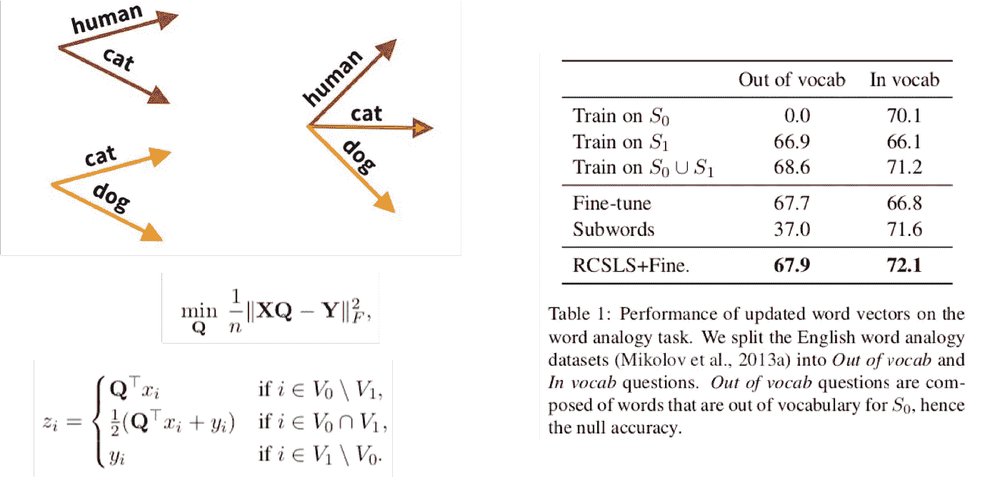

## 1–2.混合:大规模预训练语言模型微调的有效正则化

【https://arxiv.org/abs/1909.11299 

他们提出了一种叫做 MIXOUT 的迁移学习方法，像 Dropout 一样随机丢弃神经元，而是给出迁移源网络的权重。防止破坏性遗忘，并允许 Finetune 在接近传输源重量的情况下使用。NLP 成绩不错。

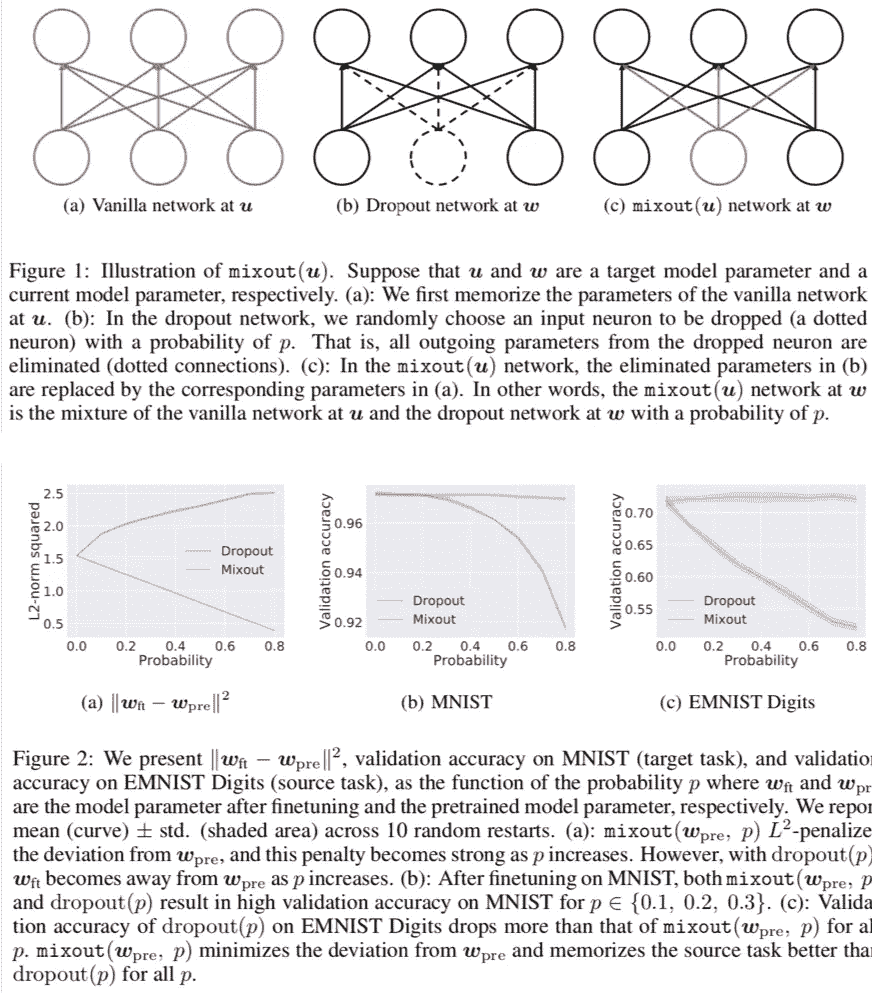

## 1–3.SMART:通过有原则的正则化优化，对预训练的自然语言模型进行稳健而高效的微调

[https://arxiv.org/abs/1911.03437](https://arxiv.org/abs/1911.03437)

提出 NLP 迁移学习方法 SMART 防止破坏性遗忘，无需启发式学习速率调整。第一种正则化是相对于原始正则化具有小的参数变化，第二种是相对于输入扰动的鲁棒性

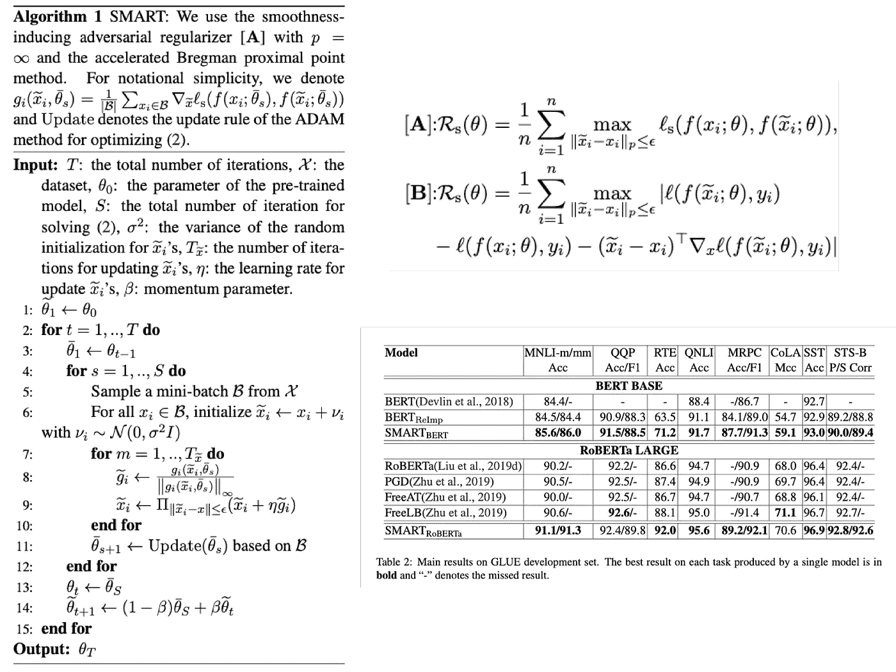

## 1–4.ERNIE:用信息实体增强语言表示

[https://arxiv.org/abs/1905.07129](https://arxiv.org/abs/1905.07129)

结合知识图改进语言模型的研究。句子中实体对应的部分是从 KG 取的。此外，通过随机屏蔽实体并学习从 KG 中获取合适的实体，促进了文档和 KG 的融合。

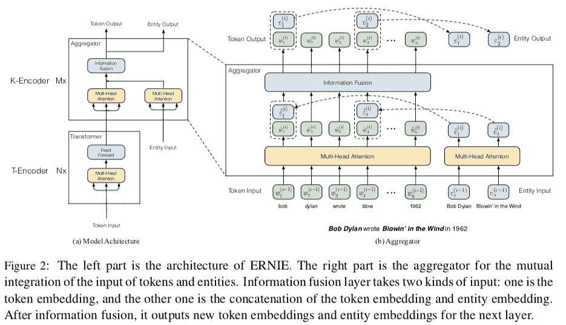

## 1–5.XLNet:用于语言理解的广义自回归预训练

[https://arxiv.org/abs/1906.08237](https://arxiv.org/abs/1906.08237)

BERT 通过预测屏蔽词来执行预训练，但这并不合适，因为在应用任务时缺少这样的机制(微调)。通过改变单词的预测顺序(保留原始顺序信息)，可以使用自回归模型获得双向语义依赖。由于顺序发生了变化，作者增加了查询流注意，用于获取顺序信息，此外还有正常的自我注意。伯特超过了 20 多项任务。

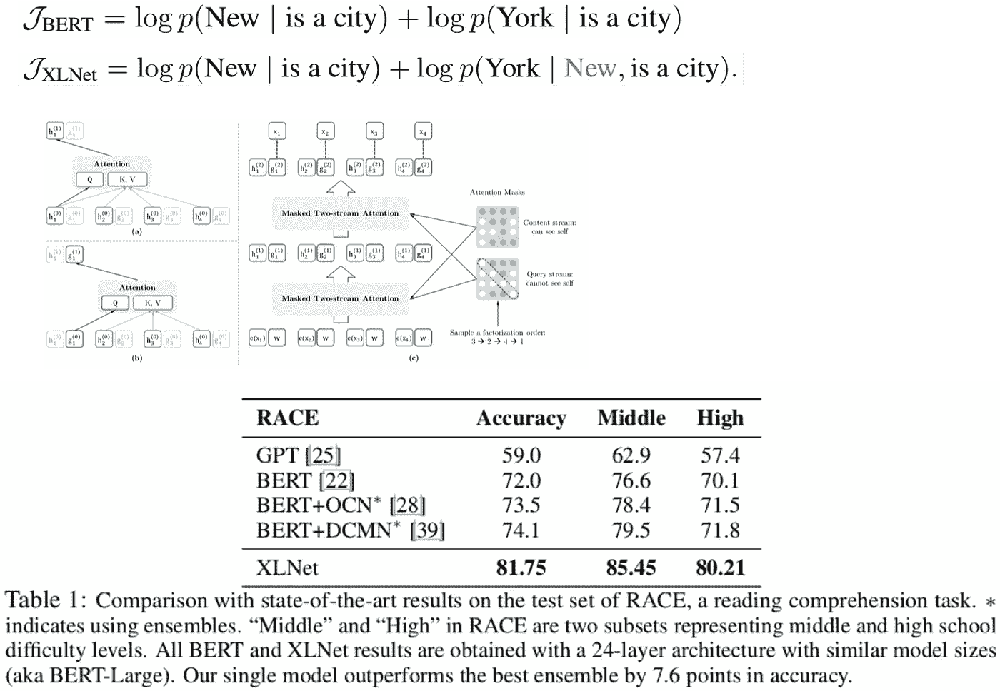

## 1–6 岁。RoBERTa:一种稳健优化的 BERT 预训练方法

https://arxiv.org/abs/1907.11692

BIn BERT，语言模型是通过解决填空题和句子对问题而创建的。但是前者一旦创建，就在学习过程中被重用。后者在其他研究中也没有取得多少成果。所以在学习前者的同时动态改变了面具的位置，后者被废除。添加更多数据可以提高性能。

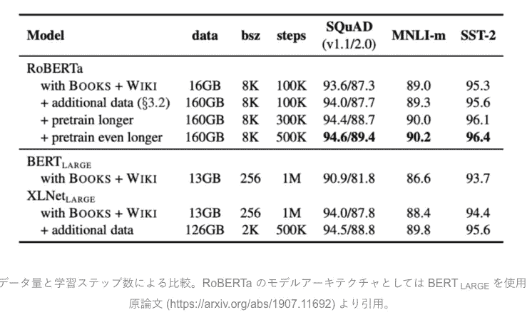

## 1–7.ALBERT:一个用于语言表达自我监督学习的 LITE BERT

【https://arxiv.org/abs/1909.11942 

作者使用三种策略:1、分解一个矩阵，在保持高表达性的同时提高参数的效率。第二，通过共享参数来提高效率。介绍一个文件订购任务。比 BERT 大型模型具有更少参数和更高速度的高性能。

最后一种策略将最初在 BERT 中引入的 NSP 任务(文档主题预测和文档一致性预测)改为 SOP(句序预测)。他们认为话题预测太简单了，没有效果，所以我们只关注连贯预测。

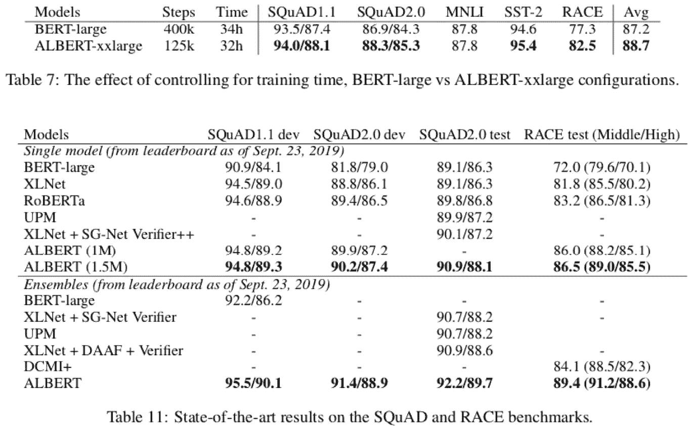

## 1–8.好消息，各位！用于新闻图像的上下文驱动的实体感知字幕

[https://arxiv.org/abs/1904.01475](https://arxiv.org/abs/1904.01475)

传统的图像字幕只能用一般的词来描述，但是结合新闻文章，图像可以被更详细地描述。通过用特殊字符替换专有名词，可以处理不在数据中的单词。此外，还提供了数据集 GoodNews。

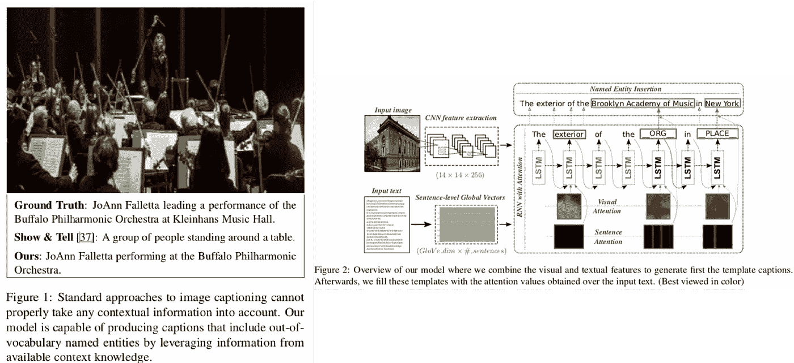

## 1–9.PaperRobot:科学思想的增量式草稿生成

[https://arxiv.org/abs/1905.07870](https://arxiv.org/abs/1905.07870)

使用从过去的论文制作的知识图(KG ),从标题自动生成“摘要、结论和下一篇工作，科学论文的下一个标题”的研究。通过链接预测来增加 KG 中元素之间的链接，以增强 KG。从标题和 KG 中获得的重要元素是使用记忆和注意力生成的。

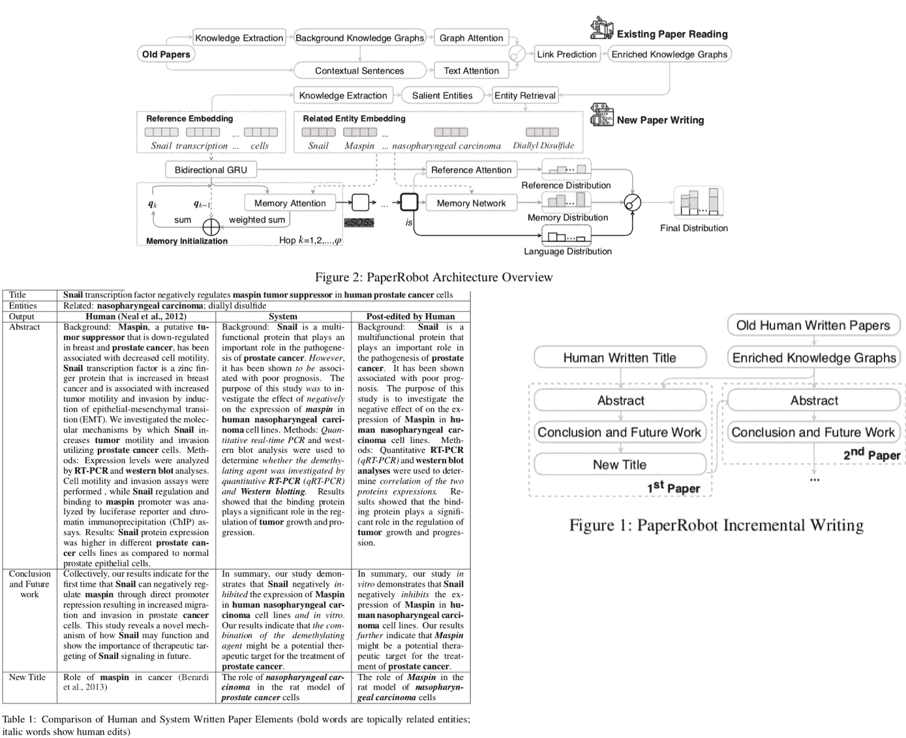

## 1–10.防御神经假新闻

[https://arxiv.org/abs/1905.12616](https://arxiv.org/abs/1905.12616)

MLで生成されたFake Newsに対応するために、GPT-2と似た機構で脅威モデルGROVERを作ったという研究。Fake Newsの内容だけでなく、著者・日付・タイトルも順次生成していくようなモデルになっている。言語モデルの潜在変数に分類器をつけてFake/Real 判定をさせたところ、BERTやGPT2よりGROVER 自身を使う方が判定精度はよかった（そりゃ当然という気がせんでもない）

创建假新闻生成威胁模型 GROVER 的研究，该模型具有类似于 GPT-2 的机制，以解决 ML 生成假新闻的问题。这是一个模型，不仅生成假新闻的内容，而且还依次生成作者、日期和标题。

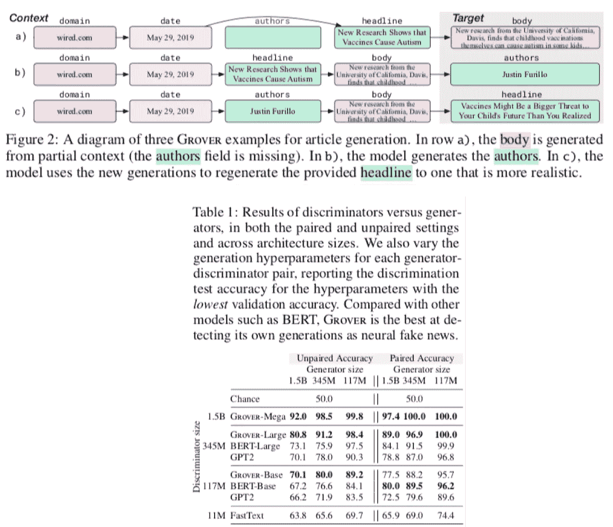

# 2.变压器的改进

Transformer 模型已经成为自然语言处理中压倒性的存在，但是存在一些问题，例如沉重、棘手的学习以及只能处理短的固定长度。有很多研究可以缓解。此外，BERTs 和其他模型需要的计算资源甚至连公司都无法准备，所以我个人喜欢处理它的研究，如单头注意力 RNN。

## 2–1.TRANSFORMER-XL:超越固定长度上下文的注意力语言模型

【https://arxiv.org/abs/1901.02860 号

使用通常只能处理较短固定长度的转换器编码器来引用整个文档的研究。Transformer-XL 可以通过仅参考旧句子参数的参数而不进行梯度计算，用整句(长于固定长度)计算预测值。他们可以学习比原始变压器长 450%的长期依赖性和比 RNN 长 80%的长期依赖性。

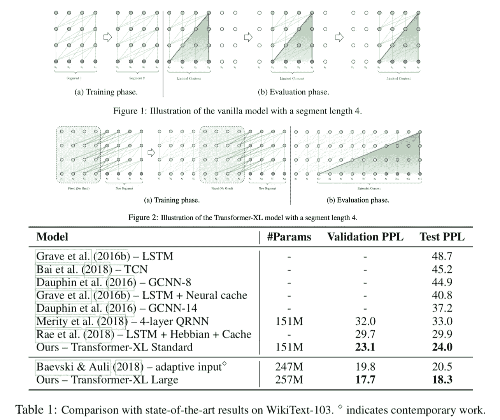

## 2–2.变压器体系结构中的层规范化

【https://openreview.net/forum?id=B1x8anVFPr 

通过将变压器编码器的层归一化位置从多头注意(或前馈网络)的前面改为跳过连接的后面，学习开始时的梯度不会爆炸，预热变得不必要。

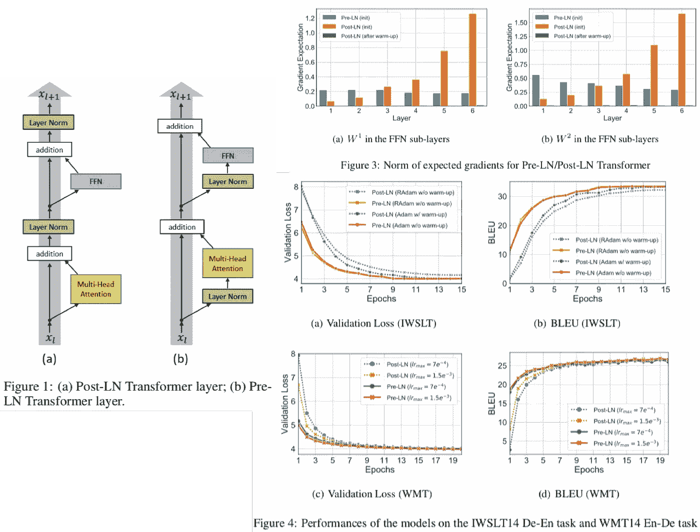

## 2–3.用于长程序列建模的压缩变换器

[https://openreview.net/forum?id=SylKikSYDH](https://openreview.net/forum?id=SylKikSYDH)

压缩转换器，通过压缩过去的序列，使注意力得以再现，超过记忆容量的时间序列长度可以被学习。基本型号是 Transformer-XL。压缩方法有很多种，但最好的方法是用 Conv1D 来重现注意力。事实上，过去压缩的信息的关注权重较大，可以看出信息正在被有效利用。

此外，据说降低学习速率的方法不太好，而降低优化频率(增加批量大小)的方法对 Compressive Transformer 和 Transformer-XL 都有效。

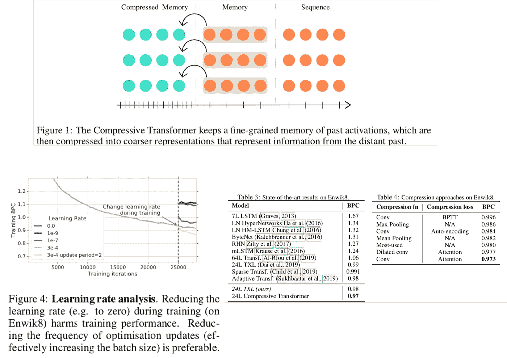

## 2–4.单头注意力 RNN:停止用你的头脑思考

[https://arxiv.org/abs/1911.11423](https://arxiv.org/abs/1911.11423)

一项将单头注意力与 LSTM 相结合的研究，以 1 GPU /天产生与 Transformer-XL 相当的分数。有很多段子，它更接近于一篇博文，而不是一篇学术论文，但我个人很喜欢作者试图以 1 GPU /天击败 BERT 这样的大型模型的意图。

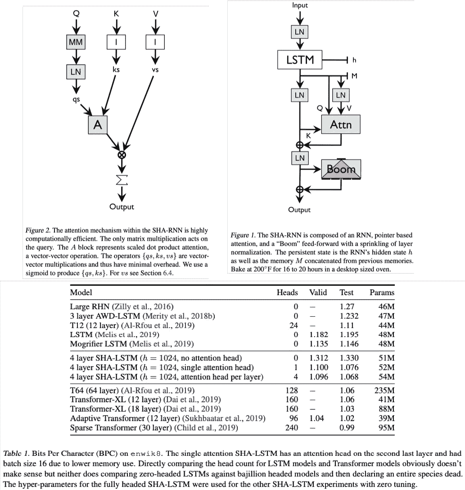

# 3.与物理和数学相关的 ML

似乎物理、数学等自然科学与机器学习的融合有所推进。我认为，有许多研究侧重于将物理约束放在模型或数据上，而不是以直接的方式将数据放入模型。针对符号数学的深度学习，可以解数学公式，可以发现物理规律的 AI Feynman，个人觉得相当震撼。

## 3–1.用深度神经网络从头算求解多电子薛定谔方程

【https://arxiv.org/abs/1909.02487 号

用神经网络进行量子化学计算的费米网建议。在通常的量子化学计算中，波函数通过能量最小化来优化。在费米子中，波函数用 NN 来近似。它结合了相当多的物理约束，如 HF 近似、Slater 行列式和反对称，能量计算也是通过物理计算来计算的。费米网在任何系统下都能产生好的结果。

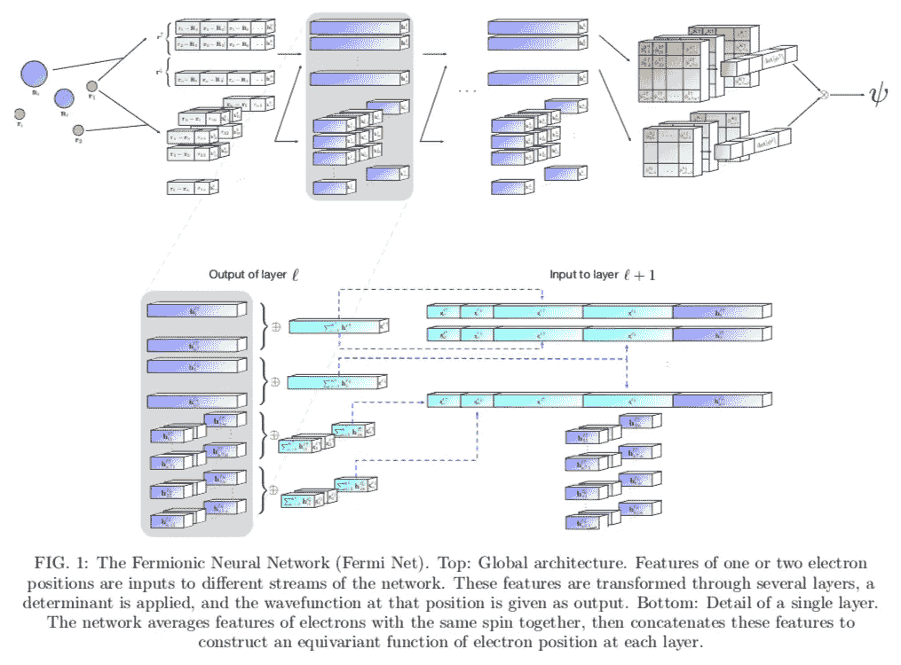

## 3–2.牛顿 vs 机器:使用深度神经网络解决混沌三体

【https://arxiv.org/abs/1910.07291 

研究用神经网络来近似无法解析解决的三体的物理模拟效果很好。虽然仿真环境有限(在平面环境下，三个初始位置中只有一个位置发生实质性任意变化)，但我感受到了神经网络对物理仿真的适用性。

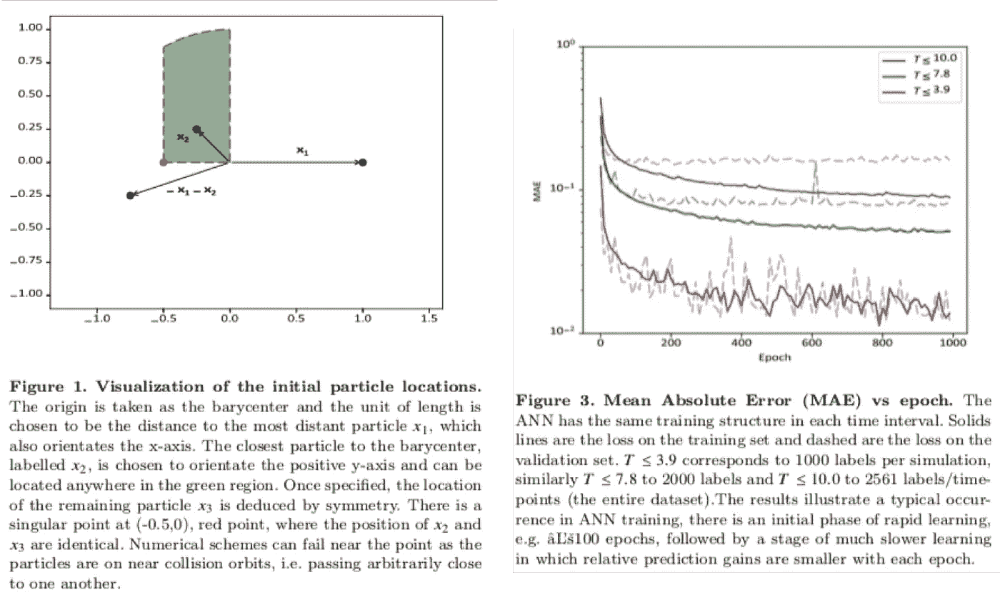

[在我的博客里解释](/analytics-vidhya/the-fusion-of-physics-simulation-and-machine-learning-a5f8a382c436) g↓

 [## 物理仿真与机器学习的融合

### 关于这篇文章

medium.com](/analytics-vidhya/the-fusion-of-physics-simulation-and-machine-learning-a5f8a382c436) 

## 3–3.符号数学的深度学习

https://arxiv.org/abs/1912.01412

用符号形式计算积分的研究。将公式分解成树形结构，用 seq2seq 作为计算每个符号出现概率的语言模型求解。它解决了相当复杂的积分问题，比 Mathmatica 或 Matlab 更精确。由于数据集必须自己准备，随机创建一个依赖于常数 c1 和 c2 的 x 的函数 f，输出二阶导数 f”和 f(或 x)的公式，如图。

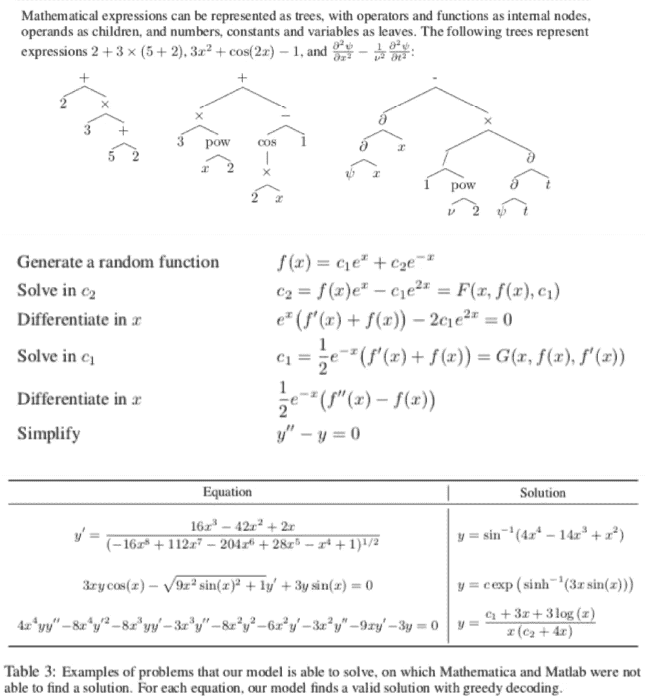

## 3–4.具有 ODE 积分器的哈密顿图网络

【https://arxiv.org/abs/1909.12790 

他们建议 HOGN 通过哈密顿计算来计算物体的动量和运动，而不是直接用 NN 来预测这些。HOGN 可以解释为通过哈密顿量的约束来学习物理系统，提高了轨道预测的精度。

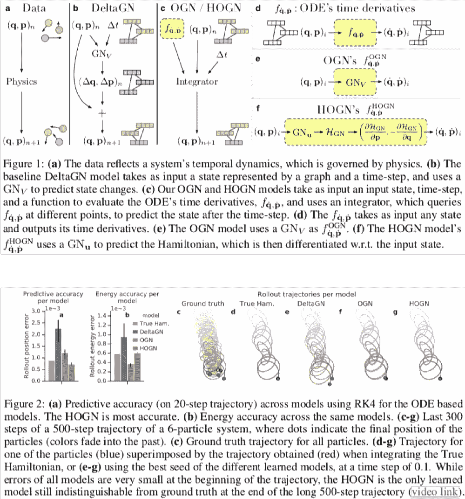

[在我的博客里解释](/analytics-vidhya/the-fusion-of-physics-simulation-and-machine-learning-a5f8a382c436) g↓

 [## 物理仿真与机器学习的融合

### 关于这篇文章

medium.com](/analytics-vidhya/the-fusion-of-physics-simulation-and-machine-learning-a5f8a382c436) 

## **3–5。AI Feynman:一种受物理学启发的符号回归方法**

[https://arxiv.org/abs/1905.11481](https://arxiv.org/abs/1905.11481)

**能从数据中发现物理规律的研究。重点是通过把问题分解成无量纲的量来简化问题。首先，在执行量纲分析或具有无量纲量的多项式拟合之后，使用 DL 确认是否存在平移对称性等。**

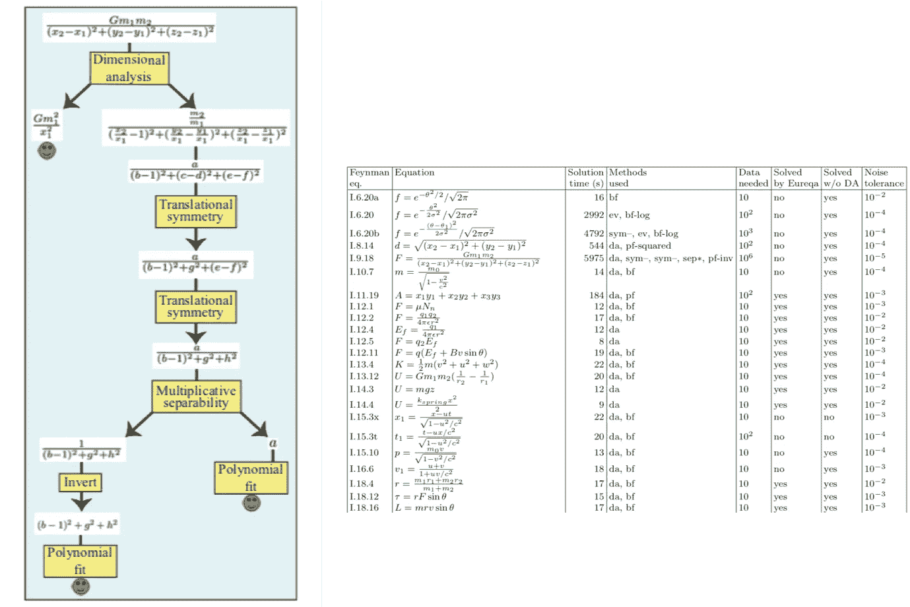

我博客里的解释↓

 [## 能“发现”物理规律的机器学习模型 AI Feynman

### 关于这篇文章

medium.com](/analytics-vidhya/ai-feynman-a-machine-learning-model-that-can-discover-physical-laws-222239d2c4ea) 

# 4.数字图书馆分析

我觉得对彩票假说的后续研究是相当有趣的研究。有一些关于未知数据中性能下降的研究。泛化的问题在现实世界的使用中很重要。

## 4–1.一张票赢所有人:跨数据集和优化器推广彩票初始化

[https://arxiv.org/abs/1906.02773](https://arxiv.org/abs/1906.02773)

在“彩票假说”中，只有好的初始值影响模型性能，好的初始值可以从一个数据集转移到另一个数据集。他们试验了不同的模型、数据集和优化器，但它是可以转移的。

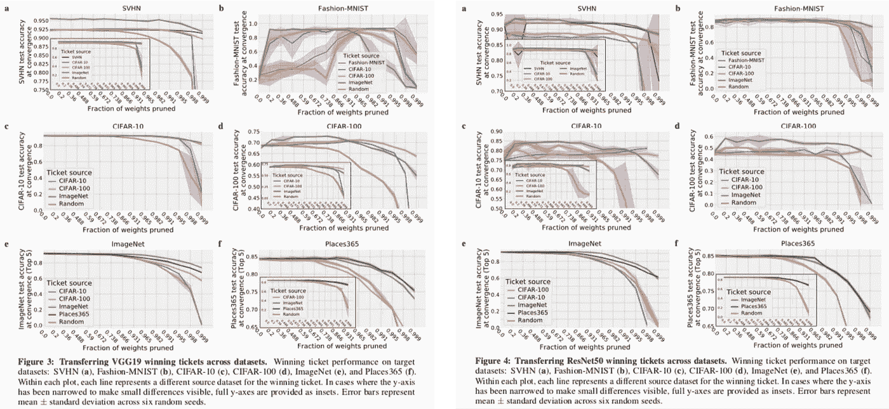

## 4–2.操纵彩票:让所有彩票中奖

[https://arxiv.org/abs/1911.11134](https://arxiv.org/abs/1911.11134)

在彩票假设中，只有一部分初始值有助于准确性，并且仅使用那些初始值的学习给出了稀疏网络，其最初可以达到与密集网络相同的准确性水平。在彩票假设中，只有一部分初始值有助于准确性，并且仅使用那些初始值的学习给出了稀疏网络，其最初可以达到与密集网络相同的准确性水平。他们提出了被称为作弊彩票(RigL)的训练方法，这种方法可以用任意初始值创建稀疏且高度精确的网络。通过重复“用稀疏 NN 学习→删除具有小参数的节点→连接具有大梯度的节点”的操作来执行学习。尽管学习时间不是很长(大约 1.2 到 2 倍)，但由于稀疏性，推理速度大大提高，精度增加而不是降低。

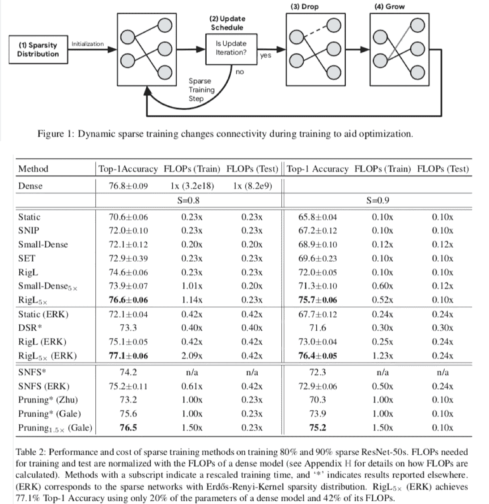

## 4–3.标注平滑何时有帮助？

【https://arxiv.org/abs/1906.02629 号

使用软标签(如[0.9，0.1])而不是硬目标(如[0，1])进行标签平滑的效果研究。对于语言模型/分类问题是有效的，因为它具有减少具有相同标签的数据的分布范围的效果。然而，相似类的相似性信息因此消失，在提取时精度降低。

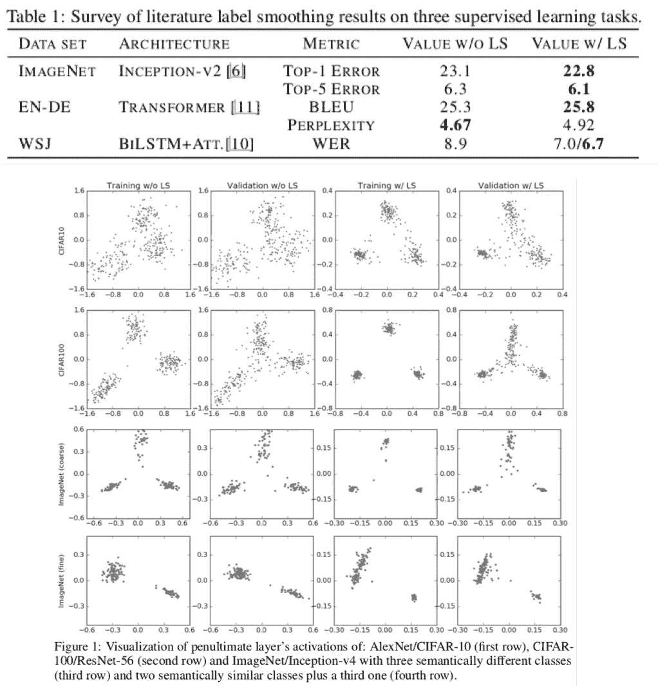

## 4–4.熵罚:走向超越 IID 假设的一般化

【https://arxiv.org/abs/1910.00164 

一项研究表明，由于模型在训练和测试之间学习到不寻常的共同特征，SOTA 方法在真实数据集中被降级。使用信息瓶颈框架，他们提出了一个熵惩罚，该熵惩罚添加了一个正则化项，该正则化项惩罚第一层中每个通道和每个标签的平均值的偏差。在 C-MNIST 上有显著的改进，在训练和测试中颜色是不同的。

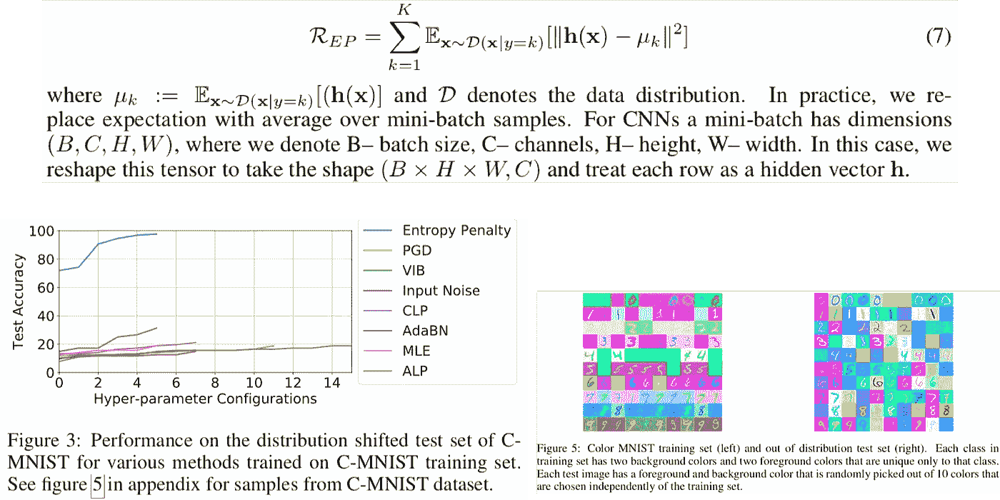

## 4–5.基准神经网络对常见讹误和干扰的鲁棒性

[https://arxiv.org/abs/1903.12261](https://arxiv.org/abs/1903.12261)

ICLR 2019 最佳论文之一。提出了基于 AlexNet 的图像污染和扰动评价指标和数据集。分数是基于与 Alex Net 的干净数据相比时的准确度下降来计算的。作者说直方图平坦化，多尺度图像方法如 MSDNetsw，多特征捕获方法如 DenseNet，ResNet 等。)更健壮。

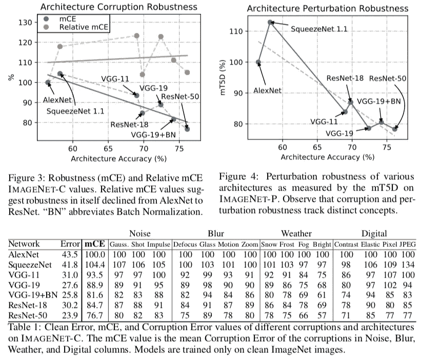

# 结论

在这篇博客中，我主要介绍了 NLP，自然科学，以及与 DL 相关的分析。下周，我将发布 2019 年关于以下主题的有趣论文列表，如果你喜欢，请回来查看。

*   [第一部分:图像和视频以及学习技巧](/analytics-vidhya/my-favorite-machine-learning-papers-in-2019-a9424c2f4f00) ↓

 [## 2019 年我最喜欢的机器学习论文

### 关于这篇文章

medium.com](/analytics-vidhya/my-favorite-machine-learning-papers-in-2019-a9424c2f4f00) 

*   第 3 部分:GAN、实际应用和其他领域(将于 1 月 25 日发布)

## 推特，一句话的论文解释。

 [## 阿基拉

### akira 的最新推文(@AkiraTOSEI)。机器学习工程师/数据科学家/物理学硕士/…

twitter.com](https://twitter.com/AkiraTOSEI)