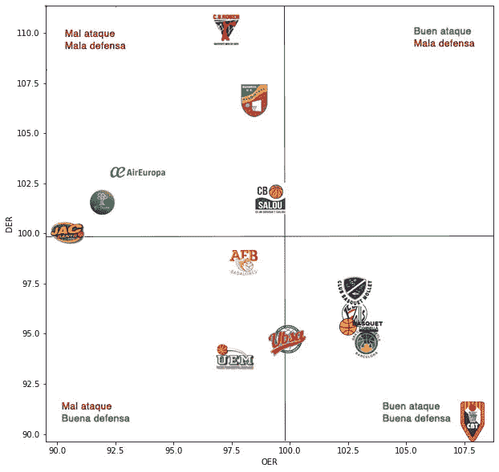
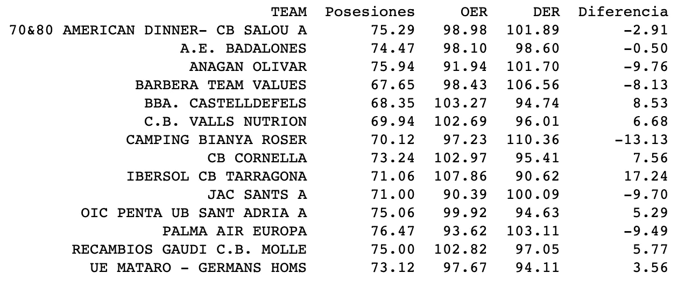
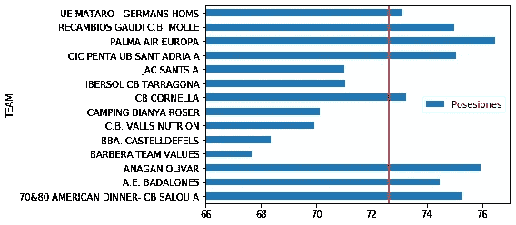
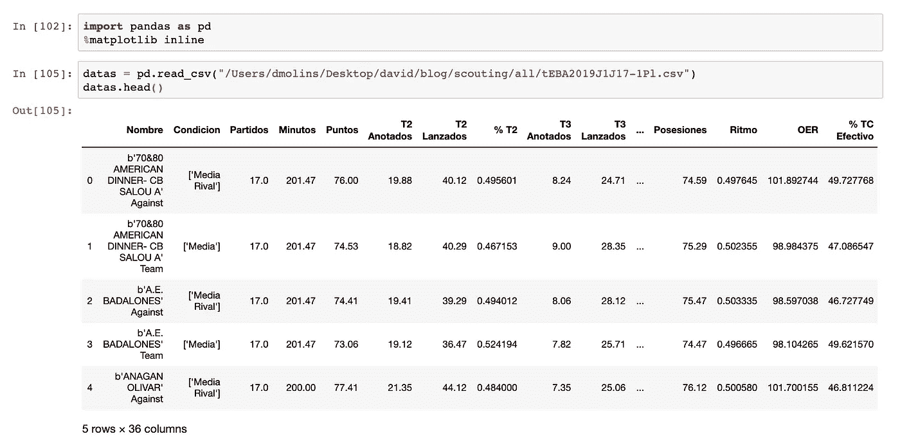
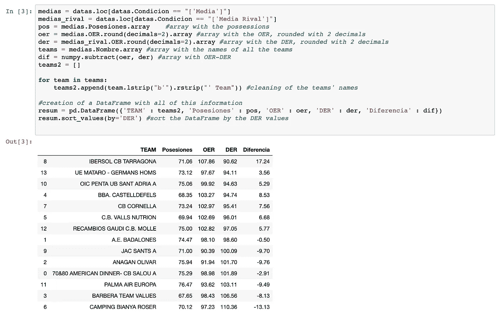
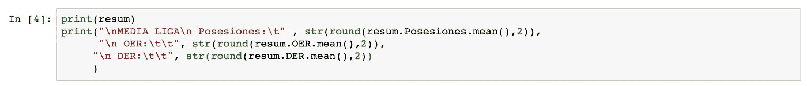
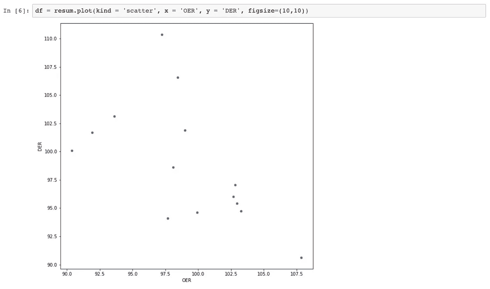
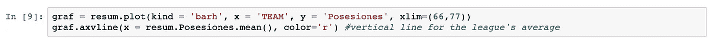

# 我的第一个篮球分析项目(第一部分)

> 原文：<https://medium.com/analytics-vidhya/my-first-basketball-analytics-project-part-1-6b8aa0f59b5f?source=collection_archive---------16----------------------->

这篇文章将与其他文章不同。到目前为止，我张贴了更多我从书籍或互联网上学习的理论。但是在这篇文章中，我将向你解释我的第一个篮球分析项目！:)

我是 JAC 圣巴塞罗纳的篮球教练，他们的成年队在 EBA 联赛踢球。最近，该领域的专家 adriàARBés 创建了一个名为 [BueStats](https://bit.ly/31ERWdB) 的开源工具，通过网络抓取从西班牙联邦网站获取 boxscores 上发布的统计数据。由于这一点，你可以访问球员和球队级别的高级统计报告。所以我想尝试 BueStats 来帮助我的高级团队成员提高他们的表现。

首先，我将展示结果，并解释从中可以得出的结论。然后，我会向你展示我是如何得到结果的，技术部分。

在开始写任何代码之前，我问自己哪种信息会对教练组有用。我考虑了效率和每场比赛的控球时间。但是在得到它们之后，我不知道它们是好是坏，所以我得到了联盟中所有球队的这些信息，以便在它们之间进行比较:

图 1

这张图同时显示了 OER 和 DER。正如我在以前的帖子中解释的那样，OER(进攻效率等级)是一支球队每百次进攻的得分，DER(防守效率等级)是一支球队每百次进攻的得分(f *或更多关于 OER 和 DER 的信息请点击此* [*链接*](/@davmol98/score-sheet-cska-moscow-vs-anadolu-efes-764febe18b04) *)。*所以越在右下角越好，反之亦然。我们可以看到，JAC 桑特是最差的进攻，但由于它的平均防守(就在这条线上)，它并不是最差的球队。

图 2

在这里，我们可以看到每支球队的确切值:财产，OER，DER 和 OER 和 DER 之间的差异。当然，最好的球队是分差最高的那支，在这个联赛里，塔拉戈纳。

控球权对于观察一支球队的比赛节奏很有用，如果一支球队有很多控球权，这意味着它的比赛节奏很快。为了了解一支球队的表现，可以和联盟的平均水平进行比较。

图 3

观察确切的数值(图 2)并与联盟的平均值(图 3)进行比较是没问题的，但我想做一个图表，以更直观(更酷)的方式对此进行总结:

我们可以看到，帕尔马西班牙欧洲航空公司是一支拥有更多控球权的球队。这是有道理的，由于它年轻的花名册。

## 技术部分

首先，我根据这个教程[生成了整个 EBA 丙级联赛的报告。使用 Jupyter 笔记本，首先要做的是导入(pandas 和 numpy 库)并读取文件。我使用函数 head()来查看表“datas”是怎样的。](https://bit.ly/2SfzCog)

但是表(data frame)“datas”包含大量信息，所以我执行以下操作来创建另一个名为“resum”的数据帧，其中包含我将要使用的信息。

使用函数 sort_values()，数据帧可以按照您选择的列进行排序。现在，我们已经将信息存储在数据帧中，我创建了如前所示的图表:

*图 2 和图 3:*

*图一:*

对于这个图表，首先我创建了一个散点图，其中每个点是一个团队，但团队在这里无法区分。根据图 2 中的信息，并使用 photoshop，我将每个徽标团队粘贴到其对应的点上。

结果很好，但我不认为这是最有效的方法，所以我在 Twitter 上问了做这种图形的人，一个人回答我说他使用一种叫做 *Tableau* 的工具，所以我打算在不久的将来尝试使用这种工具。

*图 4*

这个图是一个水平条形图。我用参数 xlim 缩短了水平范围，以便让它更清晰。我还添加了一条垂直红线，代表联盟的平均拥有量。

这是它，项目的第二部分将是关于球探，我想找到其他球队的优势和劣势。

请让我知道你是否有任何建议:改进我已经做的事情的方法，可以为第一部分和第二部分做的事情，等等。正如我在以前的帖子中提到的，这个博客的目的是让我尽可能多地了解这个领域。

你可以通过电子邮件联系我:davmol98@gmail.com