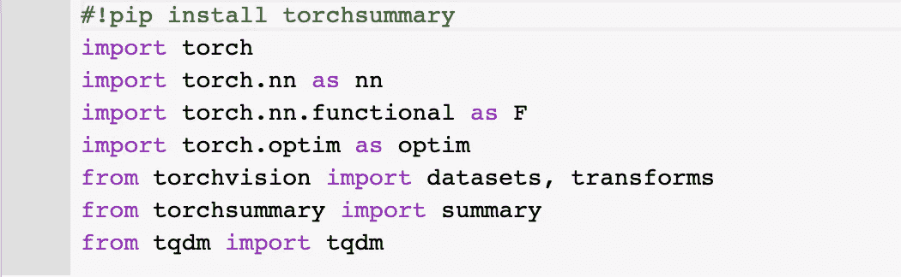
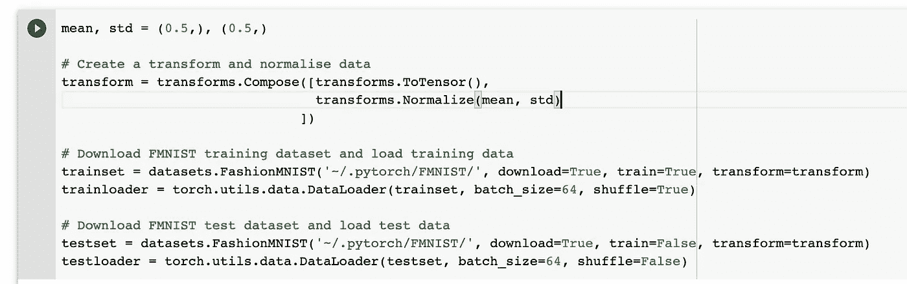
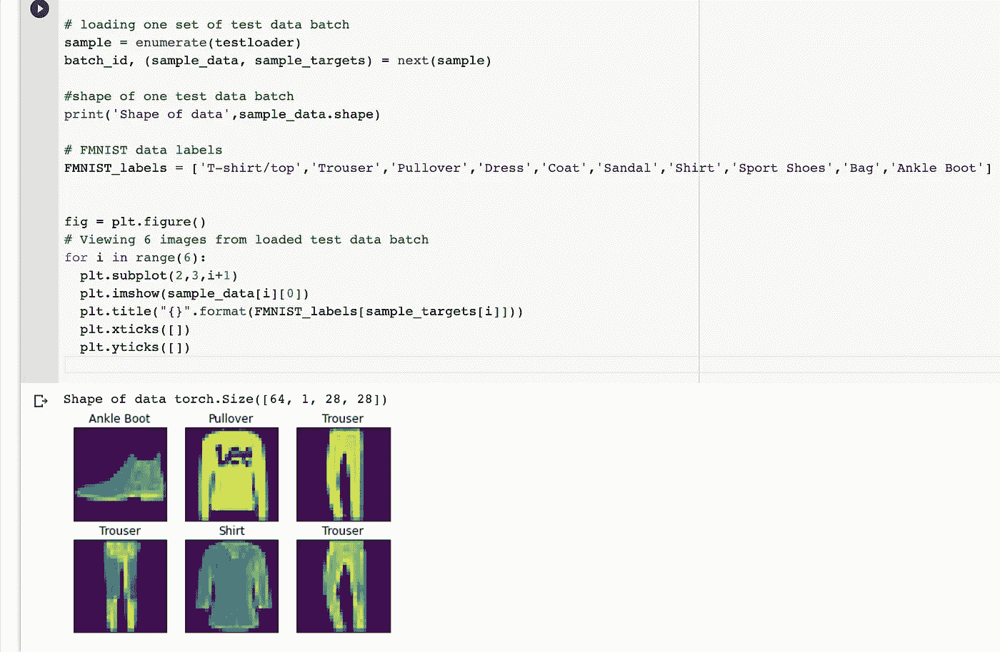
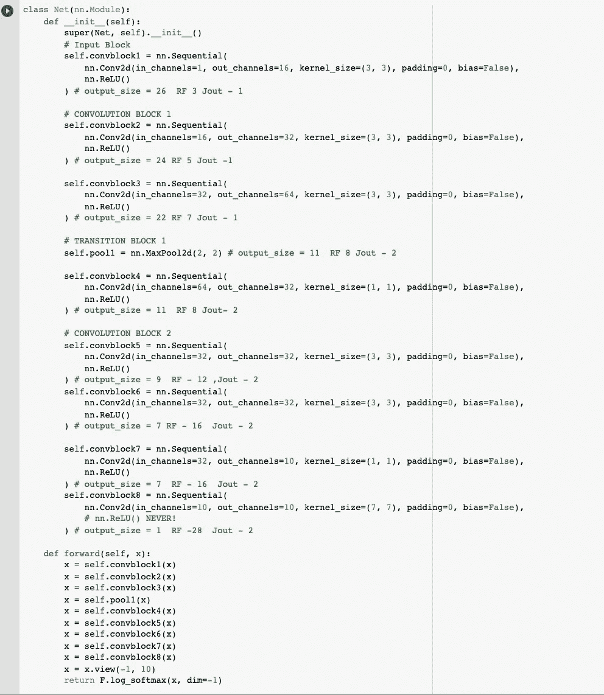
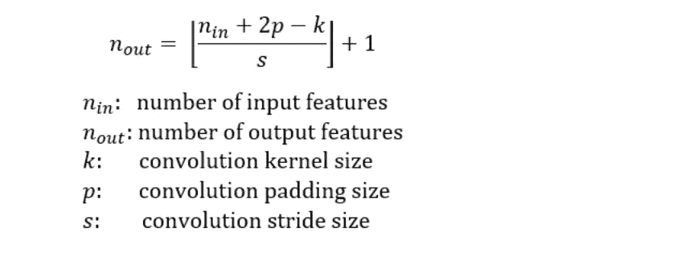
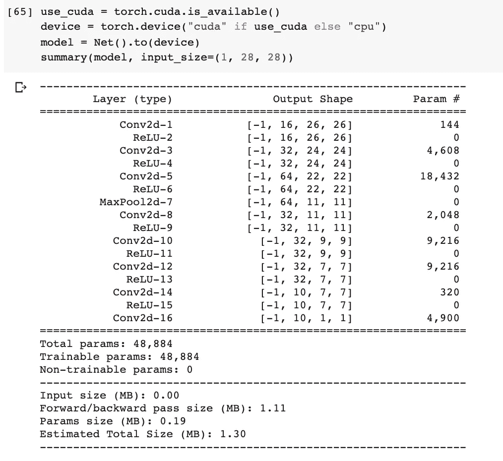
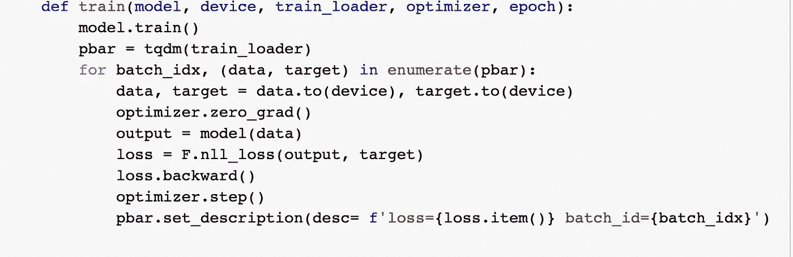
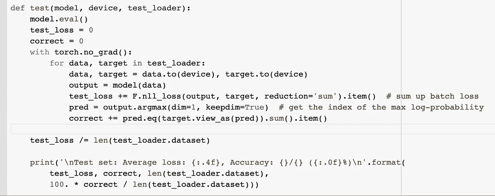
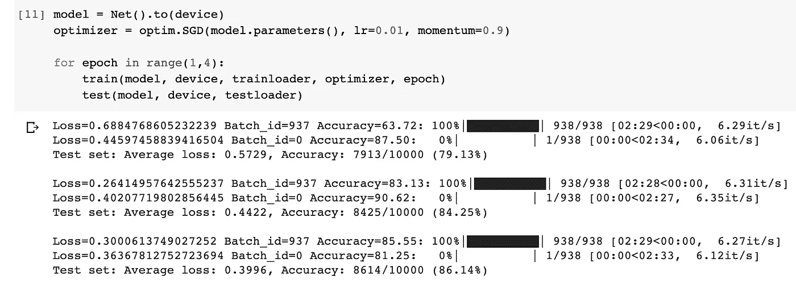

# 我第一个使用 PyTorch 的深度学习模型

> 原文：<https://medium.com/analytics-vidhya/my-first-deep-learning-model-using-pytorch-406caa278df6?source=collection_archive---------16----------------------->

继我之前的帖子 [**深度学习入门**](/@poojamahajan5131/getting-started-with-deep-learning-359fa9801b86) 和 [**Max Pooling**](/@poojamahajan5131/max-pooling-210fc94c4f11) 之后，在这篇帖子中，我将在 Pytorch 中构建一个简单的卷积神经网络。

我将使用 **FMNIST 数据集**。时尚 MNIST 数据集由时尚连锁店 Zalando 的图片组成。它包含 60，000 幅图像的训练集和 10，000 幅图像的测试集。每个图像的大小为 28 x 28 像素，并与来自 10 个类别的标签相关联。它类似于通常被称为图像识别的“Hello World”的 MNIST 数据集。

:D

# **1。导入所需的库**

*   **火炬** —进口 pytorch
*   **torch.nn**—py torch 提供的 torch . nn 模块，用于创建和训练神经网络
*   **torch.nn.functional** -这特别提供了直接使用的便捷功能，例如——Relu 或我们神经元的“校正线性”激活功能。
*   **torch.optim** -实现各种优化算法的包。
*   这个软件包由流行的数据集、模型架构和计算机视觉的通用图像转换组成
*   **torchsummary** —用于获取 pytorch 中的模型摘要
*   **tqdm**—用于显示迭代进度栏的包

# 2.正在加载数据集

pytorch 中的数据加载器有助于简化数据加载。它在给定的数据集上提供了一个 iterable。在本练习中，我们将对训练和测试数据集采用 64 的批量大小。

Torchvision 的 **transforms** 函数用于访问各种图像变换——在这种情况下，转换为张量，然后使用均值和标准差进行归一化(在这种情况下，两者都是 0.5)。

让我们看看它看起来怎么样！！

我们正在尝试加载一批测试数据集。从一批的形状来看，我们得到了[64，1，28，28]。这意味着我们有 64 个 28×28 像素的灰度示例(即没有 RGB 通道)。我们可以使用 matplotlib 绘制其中一些。

# 3.构建网络

现在让我们继续建立我们的网络。我使用二维卷积层的块和这些块之间的 Maxpool2d 层来构建我的网络。作为激活函数，我选择了[整流线性单元](https://en.wikipedia.org/wiki/Rectifier_(neural_networks))。使用这些数量的卷积层背后的想法是达到**-至少** **相当于图像大小**(在这种情况下为 28)的感受域。

**forward() pass** 定义了我们使用给定的层和函数序列计算输出的方式。

您可以使用以下公式计算每层后的输出大小:-

**车型总结**

模型摘要用于了解有多少参数与每一层相关联，以及每一层之后我们的输出形状看起来如何。需要注意的一点是，我们可以将 **torch.nn** 层视为包含可训练参数，而 **torch.nn.functional** 层则是纯功能性的，没有单独涉及的参数。

现在在 GPU 上训练 Pytorch 神经网络很容易。幸运的是，Google Colab 让我们可以免费使用 GPU。CUDA 是 NVIDIA 开发的并行计算平台和编程模型，用于自带 GPU 的通用计算。当使用 GPU 时，我们指定 CUDA 设备，并将所有输入和目标发送到 GPU。

# **4。训练模型**

我们首先需要使用 model.train() 设置**训练模式。在每个时期对所有训练数据进行迭代。Dataloader 处理单个批次的加载。**

在 Pytorch 中，我们需要将梯度设置为零，因为 pytorch 会在后续的反向传递中累积梯度。因此，当您开始训练循环时，理想情况下，您应该将梯度归零，以便正确更新参数。

然后，我们产生网络的输出(正向传递)。计算输出和地面真实标签之间的负对数似然损失。 **backward()用于收集一组新的梯度，使用 optimizer.step()** 将其传播回每个网络参数。优化器的工作是基于损失函数确定网络将如何更新。优化器使用损失值来更新网络的权重。

model.eval()或 model.train(mode=False)用于告知您正在测试。在我们的测试循环中，我们跟踪正确的预测。使用 torch.no_grad，即上下文管理器禁用梯度计算。

现在，让我们来训练这个模型，看看它是如何工作的。在这里，我用 0.01 的学习率和 0.9 的动量对这个模型进行了 3 个时期的训练。

就是这样，我们最终成功地在 pytorch 中实现了我们的第一个神经网络，使用卷积和最大池的简单概念作为我们网络的构建模块。

这篇文章旨在让你了解如何使用 PyTorch 的功能编写一个神经网络。我在这个练习中使用了 Google Colab。您可以在这个资源库中找到相关的代码:-

 [## poojamahajan0712/medium_blog

### permalink dissolve GitHub 是超过 5000 万开发人员的家园，他们一起工作来托管和审查代码，管理…

github.com](https://github.com/poojamahajan0712/medium_blog/blob/master/FMNIST_Pytorch/Pytorch_FMNIST_basic.ipynb) 

我们将在以后的文章中深入挖掘这些问题的本质细节。在那之前保持安全！！