# 我的第一个图像分类模型:时尚 _MNIST

> 原文：<https://medium.com/analytics-vidhya/my-first-image-classifying-model-fashion-mnist-89c85f4aa4e1?source=collection_archive---------4----------------------->

# 介绍

想象一下:你忙完一天的工作回到家。你的家人很高兴看到你回家。但是你放松的计划似乎变成了一场真正的灾难。你正在做晚饭，突然，你的孩子向你走来，说他们需要明天拍照时穿的衬衫。你开始恐慌，因为你的妻子/丈夫感觉不舒服，你不能同时做两件事。在那一刻，你希望你能有一个设备，可以为你做到这一点；一个既能帮你洗衣服，又能叠衣服的设备！

你猜怎么着我同意川普的观点…仅此一次。无论如何，让我给你看一些我正在研究的很酷的东西:一个可以对不同类型的衣服进行分类的神经网络！

# 编码:背景知识

所以，你可能会说，“好吧，这听起来很酷。但是它是如何工作的呢？”这就是我在这篇文章中的目的；快速浏览一下我做了什么。

我用来导入服装图片的库被称为时尚 MNIST 数据集。这个数据集包含 28 * 28px 的服装灰度图像。该库包含 10 种类型的服装:

*   t 恤/上衣
*   裤子
*   套衫
*   连衣裙
*   外套
*   凉鞋
*   衬衫
*   运动鞋
*   包
*   踝靴

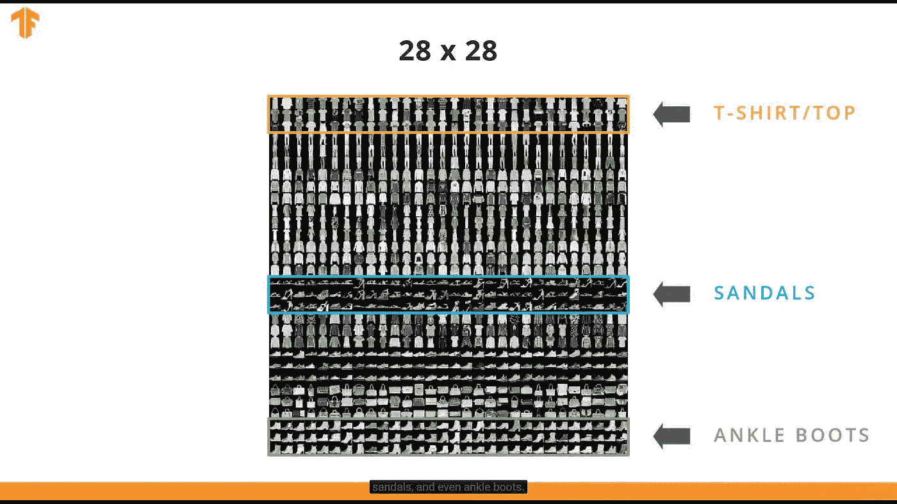

因此，给定一个输入图像，这些将是我们可能的输出。总的来说，时尚 MNIST 数据集包含 70，000 张图像，这对我们来说无疑是足够的。在 70，000 幅图像中，我们将使用其中的 60，000 幅来训练神经网络，另外 10，000 幅用于测试神经网络。另外，请记住，每个图像都是 28px x 28px 的图像，这意味着有 784 个像素。因此，这项工作只是将 784 个像素作为输入，然后输出图像代表的 10 种不同服装中的一种。

让我们快速看一下我们的神经网络是什么样子的:

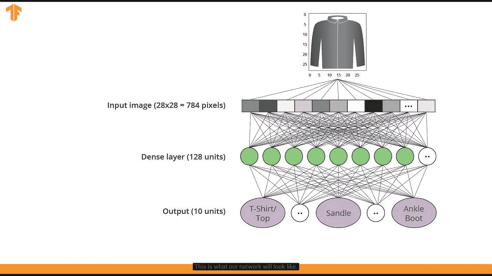

这里发生的情况是，神经网络不能处理二维图像(28 x 28 图像)，只能处理一维图像(数组)。所以，我们在这里要做的是把图像压缩成一个一维数组，用长度乘以高度。这就是 784 的由来(28 x 28)。这就是所谓的扁平化方法。因此，在这种情况下，我们的输入层是 784 个神经元。我们的隐藏层，在这种情况下，将是 128 个神经元，然后从那里，显示 10 个输出，这是可能的服装类型，如上所示。

为此，我们必须使用一个称为 ReLU(校正线性单位)的函数:

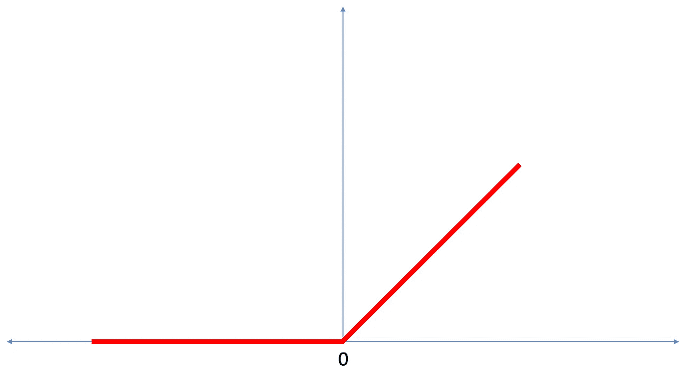

ReLU(也称为校正线性单位)是一个数学函数，我们可以用它来显示我们的概率值。我的意思是我们得到 10 个输出值，而不是 1 个。所以，这样想:当我们得到最后 10 个输出时，我们得到的是概率而不是陈述。总和将是 1，显示每个类别的概率值。雷鲁就是这么做的。

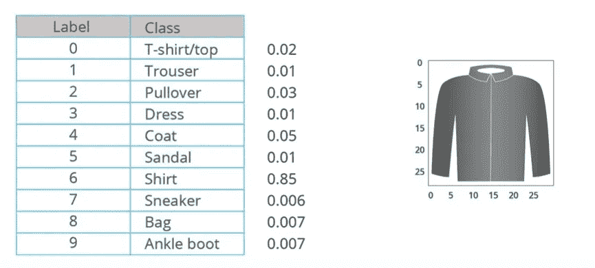

我们还将在最后使用 softmax 函数来帮助显示概率。

# 让我们开始编码吧！

我会在文章的最后放一个链接，这样你就可以看到所有的代码和所有的导入以及所有的这些和那些。所以，我要跳过所有的预处理，把重点放在神经网络上。

```
mnist_model = tf.keras.Sequential([tf.keras.layers.Flatten(input_shape=(28, 28, 1)),tf.keras.layers.Dense(128, activation=tf.nn.relu),tf.keras.layers.Dense(10, activation=tf.nn.softmax)])
```

如你所见，我们正在使用 TensorFlow 库来构建我们的神经网络。让我们更深入地了解一下我们正在做的事情:

*   **input** `tf.keras.layers.Flatten` -该层将一个二维数组(矩阵)转换成一个 784 (28 x 28)的一维数组。把这一层想象成把图像从一个正方形排成一条长线。这一层什么都不学；它只是重塑了数据。
*   **【隐藏】**`tf.keras.layers.Dense`——126 个神经元的密集连接层。每个神经元(也称为节点)接收来自前一层所有 784 个节点的输入，根据将在训练期间学习的隐藏参数对该输入进行加权，并向下一层输出单个值。
*   **输出** `tf.keras.layers.Dense`这是一个 10 节点的 softmax 层，每个节点代表一类服装。与前一层一样，每个节点从它之前的层中的 128 个节点获取输入，根据学习到的参数对该输入进行加权，然后以[0，1]的形式输出一个值，该值当然表示图像属于该类的概率。所有 10 个节点的和是 1。

在我们完成模型之前，我们需要编译它:

```
mnist_model.compile(optimizer=’adam’,loss=’sparse_categorical_crossentropy’,metrics=[‘accuracy’])
```

*   损失函数-一种算法，用于测量模型输出与期望输出的差距。训练的目标是这个措施的损失。
*   优化器-用于调整模型内部参数以最小化损失的算法。
*   指标——用于监控培训和测试步骤。以下示例使用准确度，即正确分类的图像比例:

**训练模型**

我们所做的是为训练数据集定义迭代行为:

*   通过指定`dataset.repeat()`永远重复(下面描述的`epochs`参数限制我们执行训练的时间)。
*   `dataset.shuffle(60000)`使顺序随机化，所以我们的模型不能从例子的顺序中学习任何东西。
*   并且`dataset.batch(32)`告诉`model.fit`在更新模型变量时使用 32 个图像和标签的批次。

通过调用`model.fit`方法进行训练:

*   使用`train_dataset`将训练数据输入模型
*   模型学习将图像和标签联系起来。
*   `epochs=5`参数将训练限制为训练数据集的 5 次完整迭代，因此总共 5 * 60000 = 300000 个示例。

```
BATCH_SIZE = 32train_dataset = train_dataset.repeat().shuffle(num_train_examples).batch(BATCH_SIZE)test_dataset = test_dataset.batch(BATCH_SIZE)mnist_model.fit(train_dataset, epochs=5, steps_per_epoch=math.ceil(num_train_examples/BATCH_SIZE)
```

现在，瞧！我们的模特正在接受训练！

```
Epoch 1/5
1875/1875 [==============================] - 36s 19ms/step - loss: 0.4963 - accuracy: 0.8266
Epoch 2/5
1875/1875 [==============================] - 33s 18ms/step - loss: 0.3761 - accuracy: 0.8655
Epoch 3/5
1875/1875 [==============================] - 34s 18ms/step - loss: 0.3340 - accuracy: 0.8784
Epoch 4/5
1875/1875 [==============================] - 33s 18ms/step - loss: 0.3083 - accuracy: 0.8865
Epoch 5/5
1875/1875 [==============================] - 29s 15ms/step - loss: 0.2935 - accuracy: 0.8919<tensorflow.python.keras.callbacks.History at 0x7fee73b267b8>
```

如您所见，损失和准确性指标显示得很清楚。在运行第 5 个时期后，我们可以看到，我们的模型准确率为 89%,而我们的损失约为 29%。

**评估我们的模型**

现在让我们比较模型在我们的测试数据集上的表现。我们可以使用测试数据集中的所有示例来评估模型的准确性。

```
test_loss, test_accuracy = mnist_model.evaluate(test_dataset, steps=math.ceil(num_test_examples/32))313/313 [==============================] - 3s 11ms/step - loss: 0.3563 - accuracy: 0.8754
```

查看我们的数据，测试数据集的准确性与训练数据集相似(87%和 89%)。这完全在意料之中，因为模型是在`train_dataset`上训练的。当模型看到它以前没有见过的图像时(在这种情况下，`test_dataset`)，我们可以预期精度会下降几个百分点。

为了结束这一切，让我们现在把一切都计划出来！

```
def plot_image(i, predictions_array, true_labels, images):predictions_array, true_labels, img = predictions_array[i], 
    true_labels[i], images[i]
    plt.grid(False)
    plt.xticks([])
    plt.yticks([])
    plt.imshow(img[...,0], cmap=plt.cm.binary) 
    predicted_label = np.argmax(predictions_array)    
    if predicted_label == true_labels:
        color = 'blue' 
    else:
        color = 'red'plt.xlabel("{} {:2.0f}{})".format(class_names[predicted_label],
    100*np.max(predictions_array), class_names[true_labels]),   
    color=color)def plotting_probabilities(i, predictions_array, true_labels):predictions_array, true_labels = predictions_array[i],     
    true_labels[i]
    plt.grid(False)
    plt.xticks([])
    plt.yticks([])
    thisplot = plt.bar(range(10), predictions_array,  
    color="#777777") 
    plt.ylim([0,1])
    predicted_label = np.argmax(predictions_array)
    thisplot[predicted_label].set_color('red')
    thisplot[true_labels].set_color('blue')#Plot the first 25images, their predicted label, and the true labelnum_rows = 5
num_cols = 3
num_images = num_rows*num_colsplt.figure(figsize=(2*2*num_cols, 2*num_rows))for i in range(num_images):
    plt.subplot(num_rows, 2*num_cols, 2*i+1)
    plot_image(i, predictions, test_labels, test_images) 
    plt.subplot(num_rows, 2*num_cols, 2*i+2)
    plotting_probabilities(i, predictions, test_labels)
```

这是我们的输出:

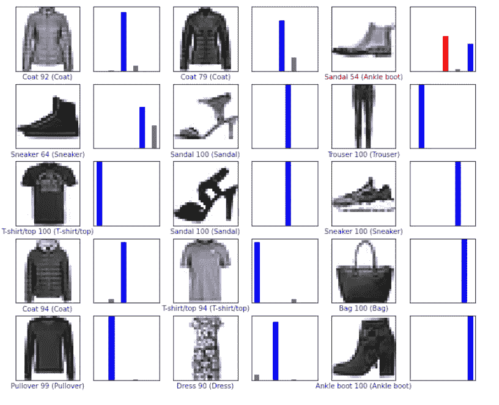

但是等等…这还没有结束。如果你梦想中的洗衣机出错了怎么办？如果你所有衣服中有 10%分类错误会怎样？如果我告诉你，你的机器有可能以 95%以上的准确率对你的衣服进行分类，你会怎么想？欢迎来到卷积和最大池的世界。

# 卷积神经网络——卷积

卷积神经网络本质上是一种比常规深度神经网络更精确的神经网络。该算法的两个主要概念是卷积和最大池。假设我们有这样一幅灰度图像:


为简单起见，我们假设图像高 6 像素，宽 6 像素。计算机会将图像解释为二维像素阵列。因为图像是灰度的，所以每个像素的值在 0 到 255 之间(0 代表黑色，255 代表白色)。假设这些是像素值:

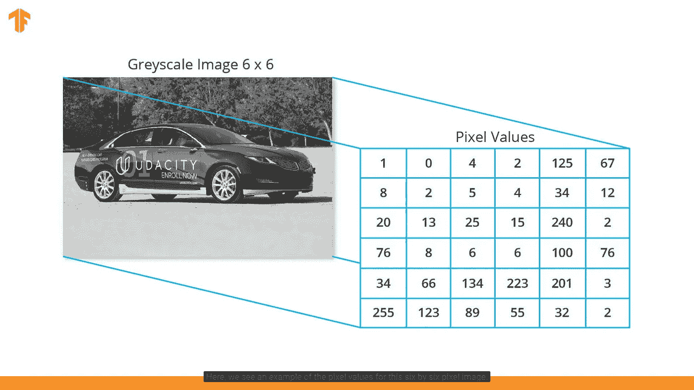

像素值将被归一化为 0 和 1 之间的值。卷积层的概念实质上是创建另一个层网格，称为内核或过滤器。

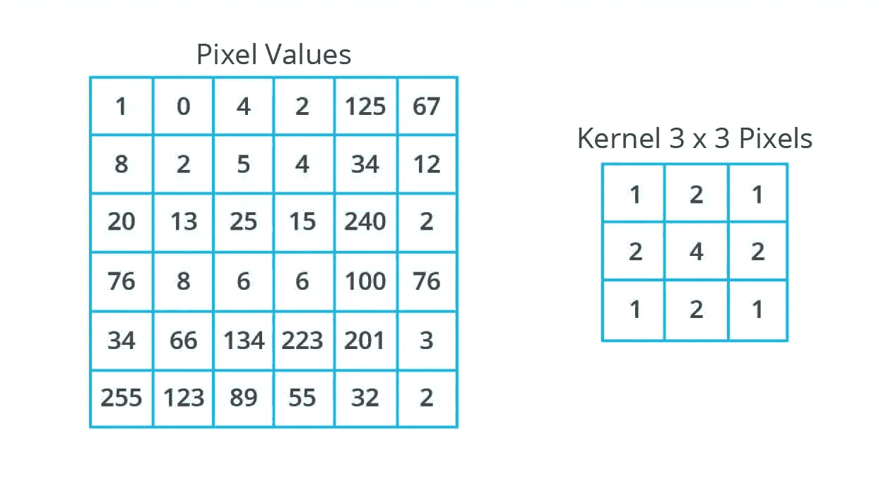

从那里，我们可以扫描整个图像的内核。图像大小为 6 x 6，内核大小为 3 x 3。卷积层将内核应用于输入图像的区域。假设我们要对像素值 25 执行内核卷积。

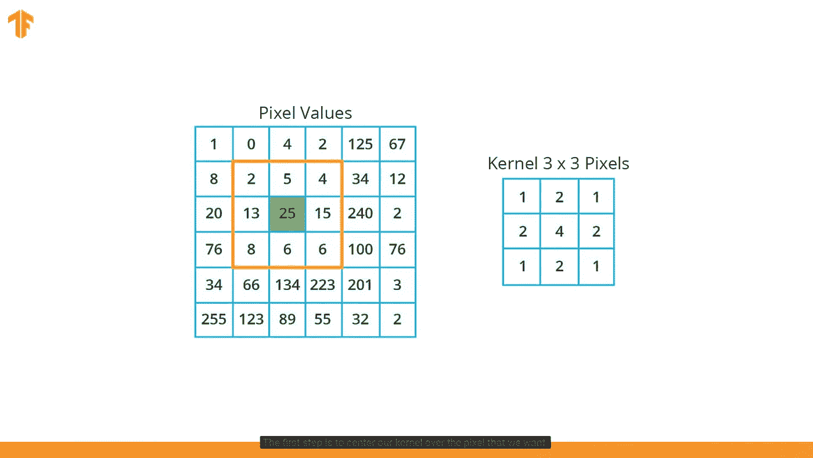

应用卷积的第一步应该是将内核集中在我们想要的像素上。在这种情况下，我们使用 25。我们现在要做的是查看以绿色像素为中心的 3x 3 网格中的像素值。所以，我们要做的是把每个对应的图像和内核值相乘，然后求和。

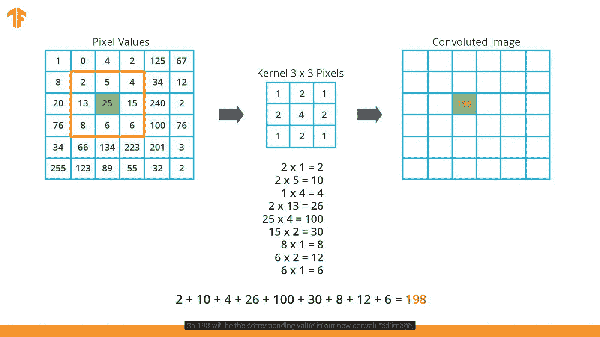

现在，我们将对图像的所有其他像素做同样的处理。但是边缘的像素呢？当你像这里看到的那样把内核放在那个像素的中心时，正方形的一些部分会脱离网格。我们该怎么办？

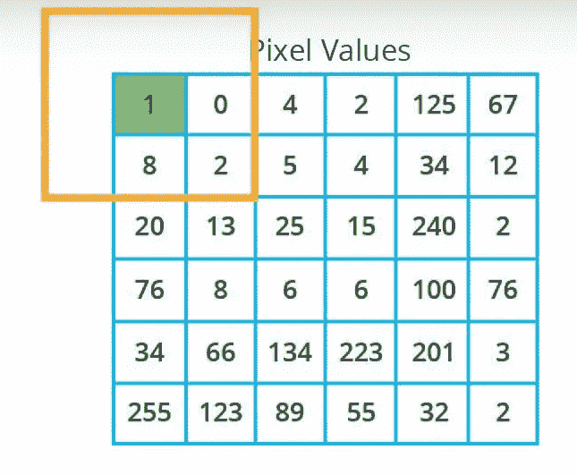

*   完全忽略该像素，就好像它根本不存在一样。这是通常的做法，但是缺点是你会丢失关于图像的信息，因为复杂的图像会比原始图像小得多。
*   一个更常见的选择是执行一种称为零填充的方法。我们要做的是在原始图像周围放置 0，然后求和。我们将在整个图像周围添加零填充。

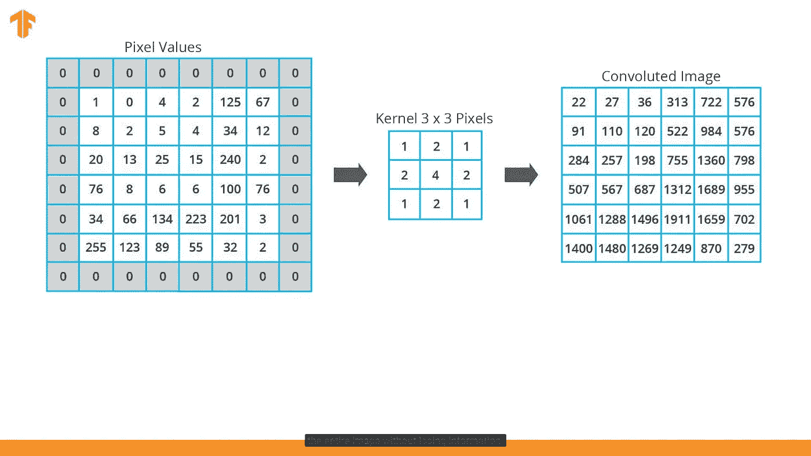

# 最大池化

Maxpooling 本质上是通过汇总区域来减小输入图像的大小。为了执行 maxpooling，我们需要选择两件事情:一个网格，这将是池的大小，和一个步幅。对于下面的例子，我们将使用如下所示的 2 x 2 px 网格:

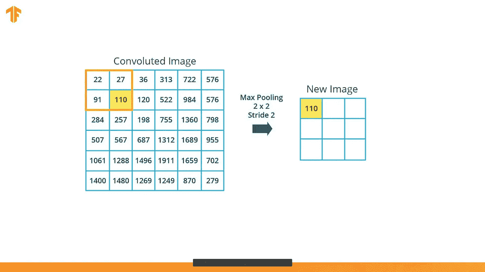

我们在这里做的是查看我们的 2 x 2 px 网格，选择最大值，然后将其放入我们的 3 x 3 网格。maxpooling 中使用的一个参数是步幅。这实质上决定了窗口在图像上滑动的像素数。在这个例子中，我们使用的步幅是 2。结果将是一个比原始图像小的新图像。

# 快速回顾

*   卷积是对图像应用滤镜(“内核”)的过程。
*   最大池是通过缩减像素采样减小图像大小的过程。
*   CNN 的:卷积神经网络。这是一个至少有一个卷积层的网络。典型的 CNN 还包括其他类型的层，例如池层和密集层。
*   内核/过滤器:比输入小的矩阵，用于将输入转换成块
*   填充:在输入图像周围添加一定值的像素，通常为 0
*   Stride:内核(滤镜)在图像上滑动的像素数。
*   缩减像素采样:缩小图像大小的行为

# 把这个编码出来！

因此，让我们也直接进入神经网络，因为这是与之前模型的唯一不同之处:

```
cnn_model = tf.keras.Sequential([tf.keras.layers.Conv2D(32, (3,3), padding='same',     
    activation=tf.nn.relu, input_shape=(28, 28, 1)),
    tf.keras.layers.MaxPooling2D((2, 2), strides=2),  

    tf.keras.layers.Conv2D(64, (3,3), padding='same', 
    activation=tf.nn.relu, input_shape=(28, 28, 1)),
    tf.keras.layers.MaxPooling2D((2, 2), strides=2),tf.keras.layers.Flatten(),
    tf.keras.layers.Dense(128, activation=tf.nn.relu),
    tf.keras.layers.Dense(10, activation=tf.nn.softmax)])
```

网络层包括:

*   卷积: *tf.keras.layers.Conv2D 和 max pool 2d*—网络从两对 Conv/MaxPool 开始。第一层是应用于输入图像的 Conv2D 滤镜(3，3)，通过使用填充保留原始图像大小，并创建 32 个输出(卷积)图像(因此该层创建 32 个与输入大小相同的卷积图像)。
*   maxpooling:*TF . keras . layers . maxpooling 2d—*之后，使用步长为 2 的 MaxPooling2D (2，2)减小 32 个卷积输出的大小。下一个 Conv2D 也有一个(3，3)内核，接受 32 个图像作为输入，并创建 64 个输出，这些输出的大小再次被 MaxPooling2D 层减小。
*   输出 *tf.keras.layers.Dense* —一个 128 个神经元，后面是一个 10 节点的 softmax 层。每个节点代表一类服装。与前一层一样，最后一层从它之前的层中的 128 个节点获取输入，并输出范围[0，1]中的值，表示图像属于该类的概率。所有 10 个节点值的总和为 1。

我们对模型的编译与上一个相同:

```
cnn_model.compile(optimizer='adam',
                  loss='sparse_categorical_crossentropy',
                  metrics=['accuracy'])
```

**训练模特**

训练模型也与之前的模型非常相似，但唯一的区别是我们有 10 个时期，而不是 5 个:

```
BATCH_SIZE = 32train_dataset = train_dataset.cache().repeat()
.shuffle(num_train_examples).batch(BATCH_SIZE)test_dataset = test_dataset.cache().batch(BATCH_SIZE)cnn_model.fit(train_dataset, epochs=10, steps_per_epoch=math.ceil(num_train_examples/BATCH_SIZE))Epoch 1/10
1875/1875 [==============================] - 10s 5ms/step - loss: 0.4011 - accuracy: 0.8546
Epoch 2/10
1875/1875 [==============================] - 10s 5ms/step - loss: 0.2646 - accuracy: 0.9039
Epoch 3/10
1875/1875 [==============================] - 11s 6ms/step - loss: 0.2198 - accuracy: 0.9196
Epoch 4/10
1875/1875 [==============================] - 10s 5ms/step - loss: 0.1890 - accuracy: 0.9298
Epoch 5/10
1875/1875 [==============================] - 10s 6ms/step - loss: 0.1576 - accuracy: 0.9413
Epoch 6/10
1875/1875 [==============================] - 11s 6ms/step - loss: 0.1367 - accuracy: 0.9481
Epoch 7/10
1875/1875 [==============================] - 10s 5ms/step - loss: 0.1156 - accuracy: 0.9572
Epoch 8/10
1875/1875 [==============================] - 10s 5ms/step - loss: 0.0991 - accuracy: 0.9630
Epoch 9/10
1875/1875 [==============================] - 10s 5ms/step - loss: 0.0835 - accuracy: 0.9688
Epoch 10/10
1875/1875 [==============================] - 10s 5ms/step - loss: 0.0696 - accuracy: 0.9745<tensorflow.python.keras.callbacks.History at 0x7fee6d4d3080>
```

你可以注意到我们最终的准确率是 97%！

现在，让我们计划一下:

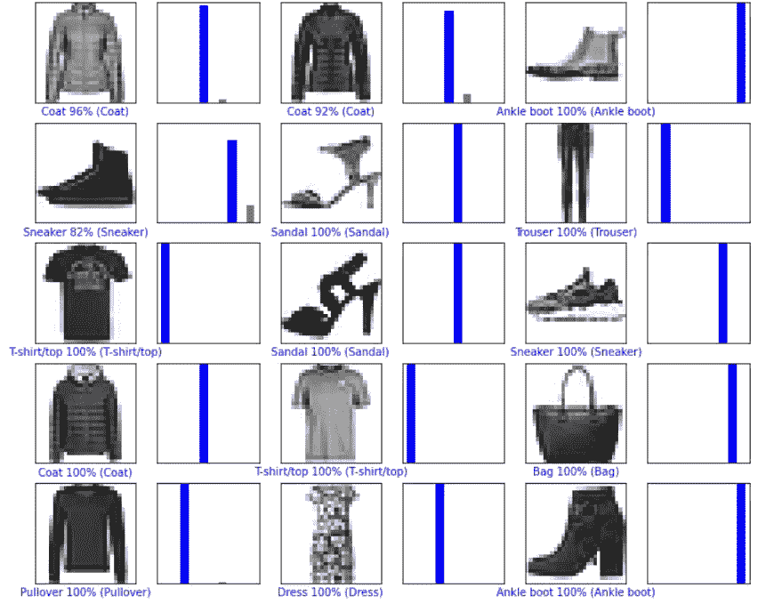

正如你所看到的，使用卷积和最大池的概念，你再也不会头疼了，因为下一次，你会有一个方便的漂亮洗衣机，它在 97%的时间里工作(我们不谈论那 3%…)。

好吧，我答应我会显示代码，所以在这里！这是一个谷歌协作实验室，所以你必须登录你的谷歌账户。[点击此文。](https://colab.research.google.com/drive/14jlNhRXlrBslqGVIWpnV08iA0DLxS8EI)

阅读本文的收获:

*   ReLU 和 Softmax 函数是帮助显示概率的两种不同类型的函数
*   CNN 的:卷积神经网络是至少有一个卷积层的网络。
*   卷积是对图像应用滤镜(“内核”)的过程。
*   最大池是通过缩减像素采样减小图像大小的过程。
*   内核/过滤器:比输入小的矩阵，用于将输入转换成块。用于盘旋。
*   零填充:在图像两端添加 0 个像素来帮助执行卷积

这是我的[时事通讯](https://subscribepage.com/srianumakonda)、 [Linkedin](https://www.linkedin.com/in/srianumakonda/) 和[电子邮件](mailto:sri.anumakonda06@gmail.com)如果你想联系我。

对我来说就是这样，享受你的一天！