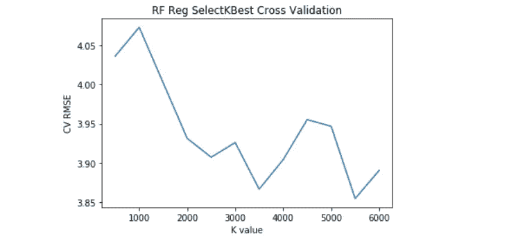

# 我的第一次机器学习黑客马拉松——试图进入前 17%

> 原文：<https://medium.com/analytics-vidhya/my-first-machine-learning-hackathon-attempts-for-finishing-in-top-17-1202fdafda06?source=collection_archive---------11----------------------->

这个博客包含了这个 ML 项目使用的详细方法，以及为尝试排名前 17%而进行的实验

# 目录

*(* ***注****——****这篇博文可能会有点长——因此我在下面附上了目录——如果你喜欢*** *)*

[**1。我的排行榜排名**](#e59a)

[②**。代码链接— (Github 简介)**](#a5a3)

[**3。最终决定解决一个黑客马拉松，尽管仍然对自己的技能充满信心**](#4184)

[**4。**项目目标](#a142)

[**5。测试数据评估度量= (1- RMSLE)**](#51d5)

[6**。**数据概述](#ad75)

[**7。**和](#6860)基本 EDA 功能概述

[8。用于本项目的机器学习工作流程](#2f67)

[9**。处理缺失值的重要性**](#2bd0)

[10**。文本特征提取**](#c860)

[11**。需要规范化的数字特征**](#4949)

[12**。编码分类特征**](#518f)

[**13。处理异常值**](#d4f4)

[14**。检查特征多重共线性**](#9470)

[15**。特征选择实验**](#e8ae)

[16**。**使用的回归模型](#0d81)

[17**。超参数调整和交叉验证**](#c804)

[**18。结束注释、学习和结论**](#06b1)

img ref—[https://sarahleibz.co.za/2018/01/22/run-to-win/](https://sarahleibz.co.za/2018/01/22/run-to-win/)

# 1.我的排行榜排名

目前排名第 72 位(在 418 个参与者提交的内容中)——[https://www . machine hack . com/course/predicting-the-costs-of-used-cars-hackathon-by-imarticus/leader board](https://www.machinehack.com/course/predicting-the-costs-of-used-cars-hackathon-by-imarticus/leaderboard)

排行榜排名(2011 年 11 月 30 日)

# 2.代码链接— (Github 配置文件)

我已经用 **Python** 解决了这个项目( **jupyter 笔记本**)。

[**https://github . com/debayamitra 1993-data/Predict-Prices-of-二手车**](https://github.com/debayanmitra1993-data/Predict-Prices-of-Used-Cars)

目前，我已经将代码库设为私有(因为这是 hackathon :P 的一部分)。它包含了我用来解决这个项目的一系列 3 个 ipynb/html 笔记本。本博客中的 ML 工作流部分将涵盖。ipynb 文件。如果您想获得代码或代码片段以供参考，请直接通过**debayanmitra1993@gmail.com 联系我。**

# **3。最终决定解决一个黑客马拉松，尽管对我的技能仍然信心不足**

过了很长时间，我终于决定尝试我的第一个端到端数据科学项目——我总是推迟这个步骤，因为我觉得我从来没有足够的知识/技能来完成这个项目。但是我觉得很有竞争力，因为这是我第一个完全自我尝试的 ML 项目。坦率地说，即使当我开始尝试黑客马拉松时，我对自己在机器学习概念方面的知识水平也没有绝对的信心。我也没有受过这方面的正规教育。尽管如此，许多人告诉我，学习有很大的广度和深度——所以我永远不会感到足够的自信，除非我去尝试。所以我决定继续。我要感谢 https://www.appliedaicourse.com/**的团队。我已经学习这门人工智能课程一年多了，我的大部分理论和实践都来自这里。**

# **4.项目目标**

**我所选项目的目标是一个**回归建模**任务——我们必须**预测一辆二手车的“价格”**(给定一辆车的属性，如品牌、年龄、发动机规格、使用公里数等。)我选择了这个问题陈述，因为它与我工作的公司非常相关，甚至这家公司也从事废旧汽车的估价业务。我从[**machine hack**](https://www.machinehack.com/)**中挑选了这个项目——这是一个在印度举办 ML 竞赛的平台——[**https://www.machinehack.com/**](https://www.machinehack.com/)**。**这是一场与 Imarticus Learning 合作举办的比赛，更多信息请点击此处—[**https://www . machine hack . com/course/predicting-the-costs-the-used-cars-hackathon-by-Imarticus/**](https://www.machinehack.com/course/predicting-the-costs-of-used-cars-hackathon-by-imarticus/)****

# *****5。测试数据评估度量= (1 — RMSLE)*****

> *****(* ***注——这不是 RMSE。正是 RMSLE*** *)*****

****比赛使用的评估标准基本上是一个分数。 **RMSLE** 代表**均方根对数误差**。这是我发现的一篇漂亮的博文，它解释了 RMSE 和 RMSLE 之间的差异，以及在什么情况下 RMSLE 更适合用作回归任务的评估指标—[**https://medium . com/analytics-vid hya/root-mean-square-log-error-RMSE-vs-RM LSE-935 c6cc 1802 a**](/analytics-vidhya/root-mean-square-log-error-rmse-vs-rmlse-935c6cc1802a)****

********

*****来源——towardsdatascience.com*****

****总结一下这篇博文中关于为什么在这里使用 RMSLE 作为衡量标准的几点****

******1。当你低估而不是高估时，RMSLE 的惩罚更多—** 换句话说，RMSLE 用于这个项目，它是说，如果你高估某些汽车的价格，这是可以的，但如果你低估，这是不可接受的。如果你预测不足，RMSLE 将显著增加，你的分数将急剧下降。****

******2。RMSLE 可以缓冲数据中异常值的影响** —如果您在 RMSE 评估，数据集中某些具有非常高“价格”值的豪华品牌汽车实际上会扭曲您的模型，因为 RMSE 的平方误差惩罚，而 RMSLE 只会对高价值汽车产生比低价值汽车稍高的惩罚，因为 RMSLE 在度量中有一个对数项来缓冲这种影响。(这就是对数的妙处:)。下面是一个图表描述，它告诉了我想说的—****

********

*****谷歌图——x 和 log(x)图的对比*****

# *****6。数据概述*****

****这里要预测的目标特征是一个数字特征—‘T6’价格。这是该特征在“训练”数据集中的分布。****

********

*****价格分布*****

****平均值为 9.4，而中位数约为 5。分布看起来相当倾斜——现在我明白了为什么他们选择 RMSLE 而不是 RMSE 作为衡量标准。让我们对这个特性应用 **Log-Transformation** 并检查 Log(价格)的分布。****

********

*****价格对数—直方图*****

****很好，看起来很正态分布——尽管不完全正态。似乎非常接近于**对数正态分布。**这就是为什么在下一节中——我们将在**日志(价格)**上可视化所有特征，而不仅仅是**价格**。****

# ****7.特性和基本 EDA 概述****

****好的，关于每个特性的一些信息****

********

****训练数据—(数据帧视图，python -pandas)****

> ******汽车名称**(文本句子)——这是我们试图预测其价格的汽车的实际名称。以下是数据中一些排名靠前的汽车名称:****

********

> ******位置(**分类 **) —** 主要包括印度的大都市—【孟买、海德拉巴、加尔各答、钦奈】等。看看下面的**小提琴剧情**。****

********

****条形图—计数(位置)****

********

****小提琴图—日志(价格)与位置****

> ******年份** — (YYYY 格式)—汽车制造年份。我提取了一个特征叫做'**年龄** ' = 2019 —年。我将年龄视为一个数字特征(尽管许多人会争论为什么这可以用作分类特征)。****

****这是因为您可能希望使该模型对年龄值为小数的预测具有鲁棒性。但是，训练数据足够丰富，只有离散的整数年龄。因此，绘制了“年龄”与“对数(价格)”的散点图****

********

****散点图—对数(价格)与年龄****

> ******燃料类型**(分类)——柴油、汽油、压缩天然气、电动等中的一种。绘制下面的**方框图**。****

********

****箱线图—对数(价格)与“燃料类型”****

> ******变速器** —自动/手动之一****
> 
> ******车主 _ 类型**——第一、第二、第三、第四——(基本上是一手、二手、三手车等)之一。)****
> 
> ******里程** —包含汽车的里程。格式为“26.7 kmpl”-从该字符串中提取出数字。在数据中找到大约 20 个里程为“0”的值—(没有意义)—已将这些值视为缺失值。下面的散点图—(注意—检查“0”值—这些基本上是缺失值)。如果里程数为 0，人们就不会买车。:P****

********

****日志(价格)与里程****

> ******引擎** —包含汽车的‘CC’值。格式为‘1000 cc’—已经从该字符串中提取出数值。在数据中找到大约 40 个具有“0”引擎的值—(没有意义)—已将这些值视为缺失值。****
> 
> ******动力** —包含汽车的 bhp。格式为‘60 BHP’—从该字符串中提取数值。在数据中找到大约 40 个具有“0”幂的值—(没有意义)—已将这些值视为缺失值。****

********

****缺失值插补前****

********

****缺失值插补后****

> ******座位—** 包含[1，2，3，4，5] —基本上就是汽车的座位值。注意——这些应该被视为分类变量而不是数字——为什么？(因为这是离散特征而不是连续特征)。该功能的**模式**为“ **5******
> 
> ******行驶公里数** —包含汽车行驶的总距离。数字特征。看看下面这些淘气的小离群点的情节。此外，检查移除异常值前后的图中的差异。****

********

****在移除异常值之前****

********

****移除异常值后****

****让我们检查特征集的**相关矩阵**以及与预测变量的相关性。如果您检查最后一列，我们可以看到**预处理名称**是最相关的预测器，其次是**引擎**和**功率**。已经根据**皮尔逊系数**(数字-数字)、**不确定系数**(分类-分类)、**相关比率**(数字-分类)特征计算了相关关系。已将本博客作为参考生成特征关联—[**https://towardsdatascience . com/the-search-for-categorial-correlation-a1 cf 7 f 1888 c 9**](https://towardsdatascience.com/the-search-for-categorical-correlation-a1cf7f1888c9)****

********

****共线性矩阵-热点图****

# ****8.用于此项目的机器学习工作流****

****我不太擅长画流程图——但我还是画了一些流程图，对我在项目中使用的整个数据处理和 ML 管道进行了粗略的描述。需要注意的一点是——在我的模型训练过程中，我尽可能多次使用**交叉验证**来选择最佳的一组**超参数**。****

****我主要学到的是，建立正确的模型需要在多次迭代、实验、大量交叉验证等方面付出大量努力。在这个项目中，我已经尽了最大努力。****

********

****使用的 ML 工作流****

****这个图表非常简单明了，我相信它是解决任何一种 ML 任务的标准方法。不过，我还是想澄清一下我在这里使用的一些术语和概念。****

# ****9.处理缺失值的重要性****

****引擎，里程数，功率，座位有丢失的价值，如前文中所述。我已经使用了**交叉验证**，通过**简单插补**和**预测插补得到缺失值。**简单插补涉及用均值/中值/众数替换数据集中缺失的值。****

****另一方面，预测插补涉及将缺失特征作为输出变量处理，将非缺失特征作为输入变量处理，构建预测变量，然后使用“价格”作为测试 RMSE，在单个特征模型上使用交叉验证选择最佳“缺失值”。为此分享一个样本表摘要。****

****如我们所见， **GB 树**模型与均值/中值插补相比，最能预测缺失值。此外，在缺失值插补前后，查看下图**。显然，RMSE 的减少表明估算缺失值是多么重要。******

********

****缺失值(交叉验证)模型****

> ****缺失值插补前—****

********

****缺失值插补前(里程功能)****

> ****缺失值插补后—****

********

****缺失值插补后(里程功能)****

# ****10.从特征中提取文本特征—(汽车名称)****

****在一些基本的文本预处理之后——比如**停用词去除**、**去收缩**、**特殊字符去除**使用**正则表达式**——我还没有使用**词汇化、词干化**等等。因为这些是汽车名称，不会带有相关的同义词和音节。****

****我试验过**包字**、 **TF-IDF** 特征化，也试过 **N-gram** 范围(1，4)。当尝试使用此特征构建单特征模型时，与 **TF-IDF** 特征化相比，**使用 ngram(1，4)** 的 BOW 性能最佳，RMSE 最低。****

****您可以使用 **sklearn.pipeline** 函数构建一个管道，并执行超参数调整，确定哪些特性参数最适合 **CountVectorizer()。你也可以试试 Word2Vec 模型，看看是否能得到更好的结果。下面是示例 python 代码:-******

********

****参数调整(交叉验证)以提取最佳文本特征****

# ****11.对数字特征进行规范化的需要****

****对于为什么需要这样做，我不是一个专家统计学家。大量的实证研究表明，在对数据中的数字特征进行建模之前，这是一个必要的步骤。我假设这主要是在特征不是正态分布时完成的(这是大多数真实世界特征的情况)。理想情况下，ML 模型最适合正态分布的特征——因此有此需要。您可以正常化**公里、发动机、里程、功率**特征。您需要做的只是计算该功能的 z 值:****

********

****列标准化****

# ****12.编码分类特征****

****处理分类数据最流行的方法之一是**一个热编码(OHE)** 。这就是我所做的文字功能(鞠躬也是 OHE 的一种形式)。燃油、变速器、座椅特征可以转换为 OHE 特征。你可以理解下图它试图做什么:****

********

****参考—[https://hacker noon . com/what-one-hot-encoding-why-and-when-do-you-have-use-it-e3c 6186d 008 f](https://hackernoon.com/what-is-one-hot-encoding-why-and-when-do-you-have-to-use-it-e3c6186d008f)****

# ****13.处理异常值****

****千米驱动要素包含异常值。我们需要处理这个问题，以消除训练模型中的任何偏见。****

********

****检测到异常值****

****我用百分位值的**拐点法**或最常见的**拐点法**处理了这些数值特征异常值。正如你在下面看到的，在 99.9 百分位之后，数值急剧增加。kms_driven 值大约为 **300，000 — (** 这似乎在逻辑上也是合理的)—因为大多数印度汽车在使用 3 lac 公里后就会报废。我们可以去掉上面的值。****

********

****离群点去除****

****现在让我们检查 kms_driven 的散点图。图表看起来很漂亮，并显示了轻微的下降趋势(如预期的那样)。****

********

****移除异常值后****

# ****14.检查要素多重共线性****

****当您的要素相互关联时，会出现多重共线性。这会推高 ML 模型的**方差**(偏差-方差)并导致其过度拟合。因此，小心使用这些功能非常重要。让我们使用相互关系矩阵来检查功能相互关系:-****

********

****Co 关系矩阵热图****

****我们可以观察到 **0.87** 、 **0.99** 等的(座位—车名)之间的一些高度相关性。理想情况下，我们应该在建模前移除这些特征。****

# ****15.特征选择实验****

****ML 建模最重要的一个方面是将正确的特征集输入到 ML 系统中。有一些算法可以去除不想要的特征(或)增强相关的特征。我做了一些实验，总结了下面的结果。我已经使用**回归树**在这里建立模型:-****

********

****未来选择实验——总结****

## *****实验 1 —选择最佳相关特征作为目标*****

****这包括**所有特征**不包括特征移除，所有特征被简单地连接以构建模型。在实验 2 中，我去掉了 **enigne** ，因为它与功耗高度相关，我们可以看到模型性能有所提高。****

## *****实验 3、4、5——使用交叉验证选择“k”个最佳特征*****

****在这种情况下，我通过只选择最相关的特征(与输出高度相关)完成了**特征子集选择**——**sk learn . feature _ selection。SelectKBest** 功能实现了这一点。您可以使用“K”来选择您想要子集化的 num(features ),并将其用作超参数，并使用交叉验证来获得最佳“K”。正如我们在下面看到的， **k = 5500** 给出了比使用所有特征更好的交叉验证 RMSE。****

********

****选择测试的代码****

********

****使用交叉值选择最佳****

## ****实验 6 —截断奇异值分解(T-SVD)****

****这涉及到**截断 SVD —** ，它基本上做一些与 **PCA 非常相似的事情。**基本上是将特征转换到低维空间，同时保证其**保持方差**。在这里，我们能够将 6000 维特征转换为 1000 维特征，并且还保留了 95%的方差。****

********

****参考—[https://www . research gate . net/figure/Diagram-of-SVD-and-truncated-SVD-for-feature-transformation _ fig 3 _ 3457515](https://www.researchgate.net/figure/Diagram-of-SVD-and-truncated-SVD-for-feature-transformation_fig3_3457515)****

********

****(应用人工智能 course.com)TSVD 的代码片段****

********

****截断的 SVD(组件数)****

****正如您在上面看到的，6000 个特征中的 1000 个在变换后能够保留 95%的方差。因此，它通过降维执行特征变换，同时保留 95%的方差。****

## ****实验 7 —(递归特征消除)****

****这涉及到**递归特征消除**，这基本上是一种贪婪的特征选择算法——它基本上从所有特征开始，并递归地从模型中删除不相关的特征，以防整体模型性能提高。****

********

****参考—[https://top EPO . github . io/caret/recursive-feature-elimination . html](https://topepo.github.io/caret/recursive-feature-elimination.html)****

********

****使用递归选择特征****

****正如我们在上面看到的，有了 2000 个特性，我们获得了最佳的模型性能。****

## *******实验 8 —(套索特征消除)*******

****这涉及基于套索的要素消除(L1-正则化)，它通过在要素权重中创建稀疏度来实现。使用这种方法，我们获得了 4.98 的 RMSE，表明这是一种用于特征选择的好方法。****

********

****代码片段实验 8****

## ****实验 9—(基于树的特征选择)****

****这涉及到使用**特征重要性**，我们使用随机森林、决策树等获得这些特征重要性。这里我使用了**额外的树分类器**来得到这个。****

********

****代码片段实验 9****

# ****16.使用的回归模型****

****我使用了 L2 线性回归——正则化、回归树、随机森林回归器、梯度推进回归器、XGBoost 回归器来训练我的模型。 **XGBoost 回归器给出了 3.3** 的最佳 RMSE，GBM 回归器给出了 **3.5** ，RF 回归器给出了 **3.8** RMSE，线性回归器给出了 **4.1** 。XGBoost —永远是赢家:)****

# ****17.超参数调整和交叉验证****

****使用**网格搜索 CV** 对上述 ML 模型进行了广泛调整，以找到最佳的超参数集—(最大深度、子样本、正则化-λ、num(估计量))。****

********

****带有 xgboost 参数调整的 gridsearchcv 的代码片段****

# ****18.结束注释、学习和结论****

****1.**缺失值插补非常重要**，尤其是当特征与预测变量高度相关时****

****2.**异常值去除非常必要**，否则不处理异常值会使 ML 模型偏向更高的数值。****

****3.在开始构建 ML 模型之前，在单特征模型中构建一个**基准模型** ( **基准 RMSE**)——这将为你提供一个基准，来衡量你的 ML 模型与其他简单模型相比有多好。****

****4.**交叉验证**永远是赢家。总是交叉验证你的假设，尝试多种实验来为项目获得最好的特性和方法****

****5.这只是一个 ML 任务的非常初步的版本。现实世界的问题包括多次迭代，实验。所以一直**保持学习**:)****