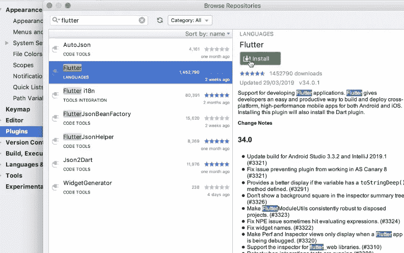

# 我的第一个 FLUTTER 移动应用

> 原文：<https://medium.com/analytics-vidhya/my-first-mobile-application-with-flutter-ad00f76b93a3?source=collection_archive---------38----------------------->

Flutter 是 Google 创建的新兴开源 UI 软件开发工具包。

## 为什么颤动？

我选择 Flutter 的理由是“一个代码库统治 Android、iOS 和 Web 开发”。

还有一些小部件，超酷的文档和热重装也是选择 flutter 的一些标准理由。

## 设置

设置的主要步骤是:

1.  安装颤振 SDK。
2.  安装 Android Studio
3.  安装 Android 模拟器
4.  安装 Xcode 和命令行工具
5.  测试 ios 模拟器

这是为 mac 安装 flutter 的官方指南。

[](https://flutter.dev/docs/get-started/install/macos) [## macOS 安装

### 要安装和运行 Flutter，您的开发环境必须满足这些最低要求:下载以下…

颤振. dev](https://flutter.dev/docs/get-started/install/macos) 

对于 windows

[](https://flutter.dev/docs/get-started/install/windows) [## Windows 安装

### 要安装和运行 Flutter，您的开发环境必须满足这些最低要求:操作系统…

颤振. dev](https://flutter.dev/docs/get-started/install/windows) 

安装 Android Studio 后添加“flutter”插件。然后正确设置 flutter SDK 路径。



最后你可以在 Android Studio 中看到“创建 flutter 应用程序”。


安装完成！

## 构建应用程序

在本文中，我们将创建一个简单的单页移动应用程序，显示一些图像。

在 Android Studio 中点击“开始一个新的颤振项目”。

设置应用程序的名称、位置和描述。

几分钟后，你会看到你的 flutter 应用程序的样板代码。

删除除两行之外的所有代码

```
**import 'package:flutter/material.dart'**;

**void** main() {
  runApp(MyApp());
}
```

Flutter 应用程序正在创建一个小部件树。

MaterialApp 是一个小部件，包含许多创建应用程序所需的有用小部件。

让我们写一个 hello world 程序。

我们只是使用一个文本小部件来显示文本。

```
**import 'package:flutter/material.dart'**;

**void** main() {
  runApp(MaterialApp( home:Text('hello world !!') ));
}
```


这看起来很奇怪！！

我们将通过添加小部件来帮助它看起来更好。

[脚手架](https://api.flutter.dev/flutter/material/Scaffold-class.html)是一个更好的视觉布局的小工具。 [AppBar](https://api.flutter.dev/flutter/material/AppBar-class.html) 是一个创建工具栏的小部件。

要添加图像，我们需要在编写代码之前做几个步骤。

在你的项目文件夹中创建“图片”目录，并将你的图片添加到其中。

现在打开位于测试目录和资产中的“Pubspec.yaml”文件。

```
**name**: flutterapp
**description**: A new Flutter application.

**publish_to**: **'none' 

version**: 1.0.0+1

**environment**:
  **sdk**: **">=2.7.0 <3.0.0"

dependencies**:
  **flutter**:
    **sdk**: flutter

  **cupertino_icons**: ^0.1.3

**dev_dependencies**:
  **flutter_test**:
    **sdk**: flutter

**flutter**:

  **uses-material-design**: true

  **assets**:
     - images/
```

现在你可以使用图片目录中的图片了。

我们将使用带有应用程序栏和图像的支架布局小部件编写代码。

```
**import 'dart:ui'**;

**import 'package:flutter/material.dart'**;

**void** main() {
  runApp(MaterialApp(home :
      Scaffold(
        backgroundColor: Colors.*white*,
        appBar: AppBar(
          title: Text(**"Corona"**),
          backgroundColor: Colors.*redAccent*,
        ),
        body: Center(
          child: Image(
            image: AssetImage(**'images/corona.jpeg'**),
          ),

        ),
      )

  ));
}
```

小组件树看起来像:


现在在模拟器上运行它。您将看到如下输出


搞定了。！

但是在结束本文之前，让我们更改一下 flutter 给出的默认图标。我们将使用“appicon.co”为 android 和 ios 创建图标。

将您自己的图像上传到本网站，然后点击“生成”下载一个文件夹。

你会看到里面有两个子文件夹。一个用于 Android，另一个用于 ios。

将 android 图标添加到我们的项目文件夹中:

找到“flutter _ app/Android/src/main/RES/”


用从 appicon.co 下载的第一个子文件夹替换它。

类似地，对于 ios，定位到“flutter_app/ios/Runner”


用 appicon.co 的第二个子文件夹替换 Assets.xcassets。

现在重新运行以查看您所做的更改。

## 下一个想法

在本文中，我们创建了一个非常基本应用程序。在下一篇文章中，我们将通过研究 flutter 文档创建一个有状态的应用程序和一个多页面应用程序。

Flutter 有一个非常大的社区。因此，如果有任何错误，你可以问“堆栈溢出”，开发人员最好的朋友。

[](https://stackoverflow.com/tags/flutter) [## 最新的“扑”问题

### Flutter 是 Google 的 UI 工具包，用于为移动、web 和桌面构建漂亮的本地编译应用程序，来自…

stackoverflow.com](https://stackoverflow.com/tags/flutter)