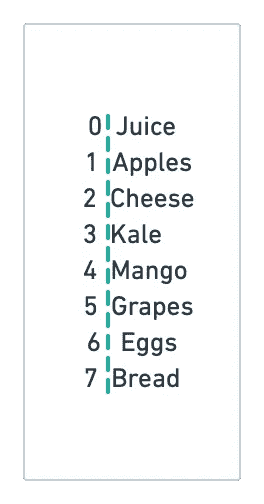
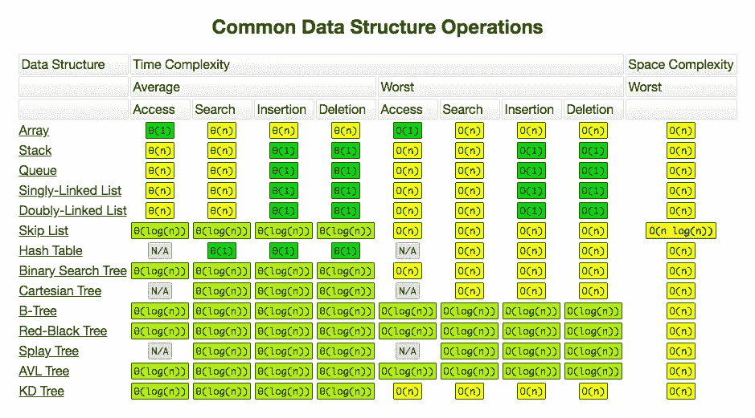
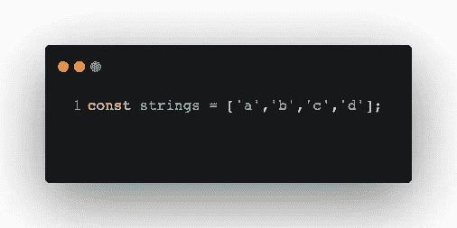
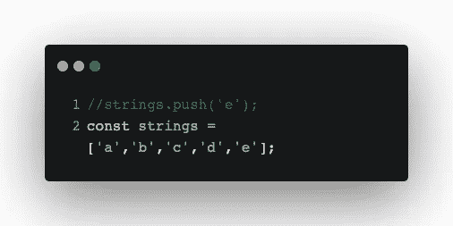
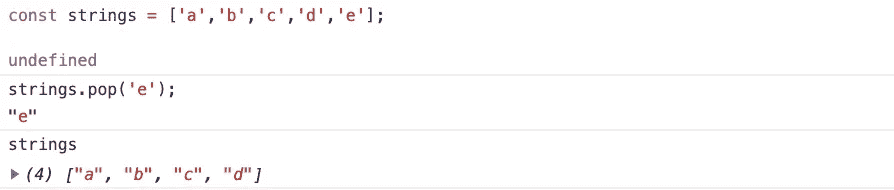
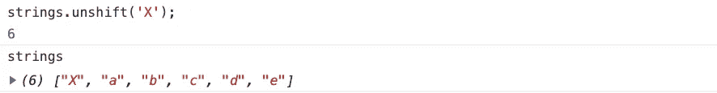
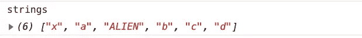
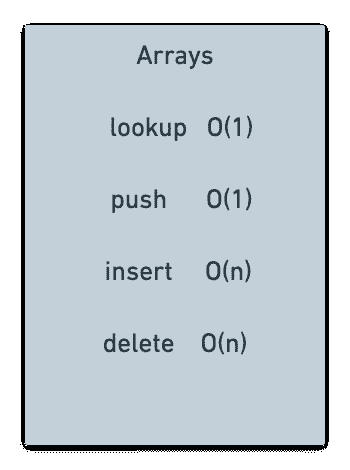
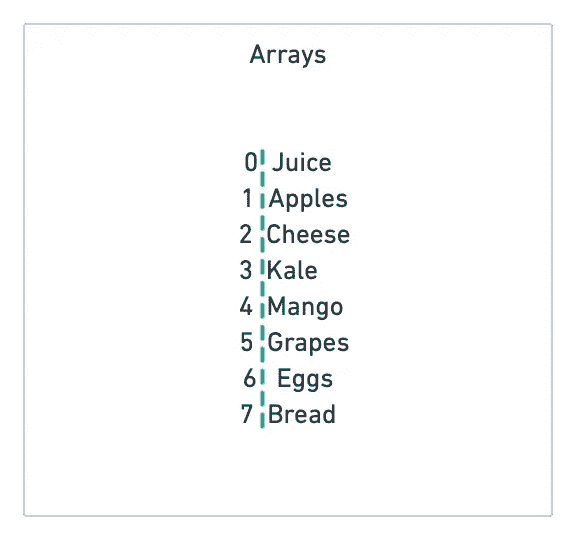

# 我的 Javascript 之旅

> 原文：<https://medium.com/analytics-vidhya/my-javascript-journey-2f4d8ba4d74?source=collection_archive---------20----------------------->

## 数组

# 第三十三部分

数组有时被称为列表，因为它们在内存中按顺序排列项目。

例如，下面我们有一些数据。在*索引 0* ，我们有果汁，紧接着在*索引 1* 有苹果。如果这是我们的购物清单，我们的商品将一个接一个地存储在我们的计算机内存中。

数组是最简单也是最广泛使用的数据结构，而且它们有最少的规则，因为它们存储在连续的内存中。想象一下比赛中智能手机、手机联系人甚至排行榜上的音乐。
因此，如果你需要的只是存储一些数据并对其进行迭代——也就是一个接一个、一步一步地进行，那么它们是最佳选择，尤其是在你知道索引的情况下。

用数组查找或访问是常数时间 *O(1)* 。它非常快。其他方法如 *push()* ，或 *unshift()* 也很快。但是然后*插入*和*删除*是 *O(n)* 或者线性时间，因为正如我们将看到的，你必须移动索引。

让我们通过创建一个简单的数组来加深理解；姑且称之为弦吧。

看着这个数组，基于我们目前所了解的计算机如何存储数据，我们可以做几个假设。例如，为了存储字母 *a* 、 *b、c、*和 *d* ，假设我们在 32 位系统上——也就是说我们有 4 个架子来存储字母 *a* 的 *0 的*和 1 的位。如果这是真的，那么我们就用完了 *16 字节的存储空间*。我们只是将 *a、b、c* 和 *d* 按顺序存储在我们的随机存取存储器中。

所以计算机现在知道在哪里可以找到这些东西。因此，当我执行 *strings [2]* 时，我是在告诉计算机去名为 *strings* 的数组并抓取第三个项目。如果我运行这个命令，计算机会抓取 *c.*

再来看几个方法。在 javascript 中，我们有一些可以用于数组的方法。一个是 *Push()* ，它允许我们在数组的末尾添加一些东西。
故弦。*推(' e')* 。

如果我运行这个命令，我得到 *a，b，c，d，e；e* 已添加到数组的末尾。
*strings . push()*操作为*O(n)；它只是在数组末尾添加了*e*——我们没有遍历任何东西。*

另一种方法是 *pop()。*
*pop()* 是 push 的反义词。它只是从数组中移除最后一项。如果我运行*strings . pop()；*

我们的*字符串*数组现在是 *a，b，c，d；e* 已被移除。

你认为这个操作的时间复杂度是多少？
是 *O(1)。我们没有循环任何东西；我们只是从数组中移除最后一项。我们的计算机知道最后一项存储在哪里，所以我们只是简单地说，转到索引，比如说 4-最后一项，并删除它。*

但是，如果我们想在数组的开头添加一个项目，比如说添加字母 *X* ，该怎么办呢？在 javascript 中，我们可以使用 *unshift()* 。我们简单地做 *strings.unshift()*

在我们的例子中， *unshift('X')* 意味着只在数组的开头加上 *X* 。如果我在这里单击 run，我们会看到 *X* 已经添加到数组的开头。

你认为这个操作的时间复杂度是多少？
嗯，记住字符串是顺序存储的；电脑知道 *a* 在*索引 0* ， *b* 在*索引 1* …。
当我在数组开头用 *unshift()* 方法加上 *X* 的时候，现在我要移动这些*索引*。现在 *X* 转到*索引 0，*和 *a* 转到*索引 1* 等等…

通过我这样做，你可能会看到一些东西；我们只是遍历了所有内容并重新分配了索引。我们做了五个操作来重新排列索引，这应该会给你一个提示，这个操作是 *0(n)* 取决于数组的大小——这就是做那个操作要花的时间。

所以我们马上知道数组可能不是在数组开头添加条目的最佳数据结构。

如果我们想在数组中间添加一些东西呢？
在 Javascript 中，我们可以使用 *splice()。W* 用 *splice()，*我可以说 *strings.splice(2，0，‘外星人’)。* 第一个是起始号。所以我想开始一个 2 的*索引。*所以我们从 *b、*开始，第二个参数是删除计数。第三个是我们想要添加的内容，所以我们添加了字符串' *ALIEN'* 。

如果我们运行这个命令:

所以 *splice()* 告诉我们去*索引 2* 处 *b* 最初所在的位置，并添加*外星人*而不是 *b* ，只是将事情转移一下。因此，我们将 *b* 移至*索引 3，c 移至索引 4* 并将 *d 移至索引 5。*

我们的大 O 是什么？
我们的大 O，在这种情况下，我们做了一半的操作；我们改变了一半的数组，所以它应该是 O(n/2)。但是请记住我们的规则，当涉及到 big-O 时，我们删除常数并将其简化为 O(n)。最坏的情况是要做 O(n)手术。

到目前为止，我们已经了解了数组是如何工作的；他们有一些我们可以做的好事情，比如访问 O(1) b 中的数组，因为它很快；我们知道它在内存中的确切位置。我们可以*推()*和*流行()*。
但是当涉及到 *unshift()* 或 *splice()* 甚至删除时，那将是一个 O(n)操作。

现在我们对为什么数组查找非常快有了更好的理解——我们知道它们在哪里。我们知道为什么*push()*——在数组末尾添加速度极快，但是为什么插入和删除对于数组来说可能不是最好或最快的。

## 数组的类型

有两种类型的数组；静态和动态数组。区别在于静态数组是有限的——它们的大小是固定的，这意味着您需要提前指定数组将容纳的元素数量。

所以在这种情况下，如果这是一个静态数组，我会说创建一个 7 件商品的数组，事先知道在我的购物清单中，我最多只有 7 件商品。不能保证在我们分配了 7 层内存之后，你还能继续添加东西，尤其是按顺序添加。我们用动态数组解决了这个问题。

动态数组允许我们在一个新的位置复制并重建一个数组，如果我们需要的话，可以用更多的内存。例如，对于我们的静态数组，如果我们意识到我们忘记了列表中的另一项，我们需要 8 项。我们复制整个数组，分配 14 个内存块，将这个列表和第八个条目粘贴到新的位置。

有了 javascript 和其他语言，比如 Python，你可以像 java 一样使用列表和数组列表，我们永远不用担心这个。这些列表像动态数组一样工作；它们会根据数组大小的增加自动分配内存，这与 C++等低级语言不同，后者需要管理内存。

所以动态数组会随着你添加更多的元素而扩展。所以你不需要提前确定大小，但是你可能已经注意到了动态数组的一些东西。 *Append()* 在动态数组中与 *push()* 命令相同，有时也可以是 *O(n)。*让我们举个例子:
如果我们有我们的数组 *s=[a，b，c，d]* 。在这一切之下，javascript 和我们的机器为这个数组创建了四个内存块。如果我们添加另一个字母，因为这是一个动态数组，它将循环遍历这些项，复制它们并将其移动到一个不同的位置，现在有 8 个块的空间。你看这里，因为我们做了这个循环，操作变成了 *O(n)* 。

尽管这是个小细节。不管在日常工作中是否需要分配内存和考虑复制数组的可能性，知道事情是如何工作的都很好。理解关于数组，因为你用 *push()，*添加到数组的末尾，你可以假设它是 *0(1)* 通常或者是常数时间。尽管如此，你可能不时会经历一种情况，那就是 *O(n)* 或线性时间。

# 第 34 集见。