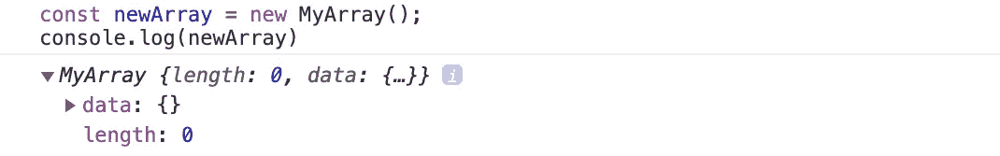
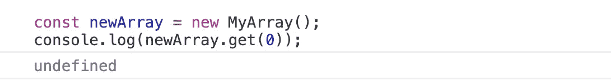
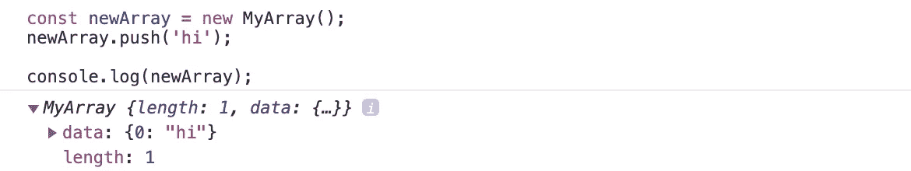
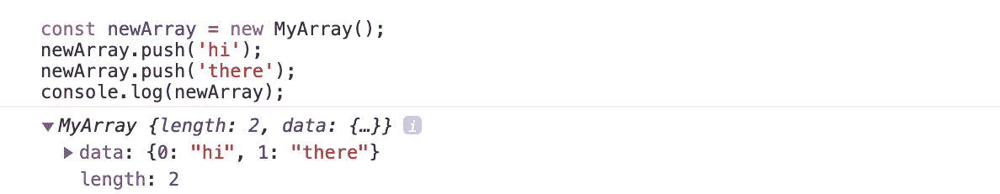
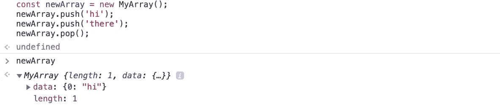
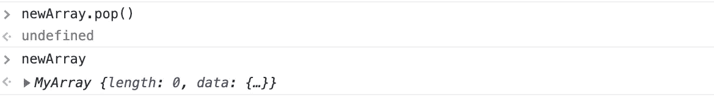
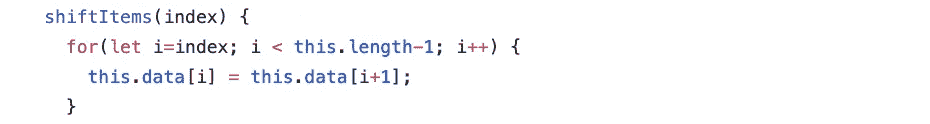
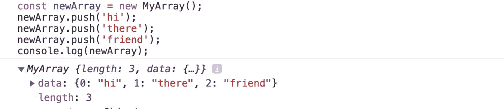
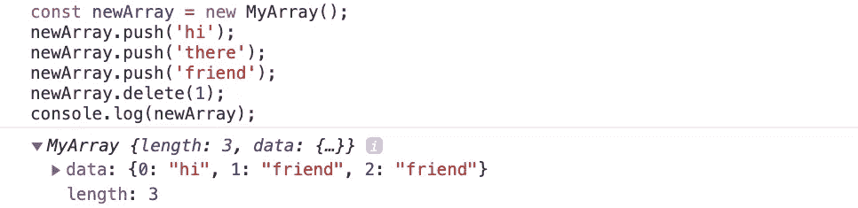

# 我的 Javascript 之旅——如何构建数组

> 原文：<https://medium.com/analytics-vidhya/my-javascript-journey-how-to-build-an-array-4c2922ff2c81?source=collection_archive---------20----------------------->

## 数据结构和算法


到目前为止，我们对数组已经很熟悉了；我们知道哪里快，哪里慢。现在，我们将深入了解它们的内部工作原理，并学习构建一个。

[](/analytics-vidhya/my-javascript-journey-2f4d8ba4d74) [## 我的 Javascript 之旅

### 数组

medium.com](/analytics-vidhya/my-javascript-journey-2f4d8ba4d74) 

如果我们要从基础层面理解事物，学习如何构建数组是一个重要的基础。
我们将使用 javascript 中的*类语法*来创建一个数组，尽管通常使用 javascript，我们可以创建一个数组，如下所示:

```
**const a = [];**
```

但是让我们看看我们是否能建造我们自己的。

到目前为止，我们对数据结构了解多少？我们知道它们是我们可以从零开始构建的东西；这意味着我们可以创建任何我们想要的数据结构。
最广泛使用的数据结构是众所周知的，并且已经实现，因为它们非常有用。但是您可以从头开始构建任何您想要的数据结构，并且大多数数据结构都是建立在其他数据结构之上的。

## 构建我们的阵列

javascript 中的数组只是带有基于整数的键的对象，其作用类似于索引，这就是我们将要构建的。

> javascript 中的数组只是带有基于整数的键的对象，类似于索引。

因此，我们将从创建一个名为 *MyArray 的*类*开始。*在 *MyArray、*中，我们将有一个构造函数，它是我们创建 *MyArray 时运行的初始函数。*这个构造函数将有两个数据点:
1。长度属性——使用数组，我们能够确定数组的长度。我们将初始长度设置为零，显示数组有多少项。

2.数据—这将是一个空对象。

## get()方法

访问数据是数组中最重要的操作。所以让我们创建一个 *get()* 方法。get() 方法将使用一个索引从内存中获取数据。

所以我们只需将 `return this.data` 对准所需的*指标。* `this.data`只是引用我们在*构造函数中创建的数据。*

让我们看看这是如何工作的。为了创造一个新的缅甸，我们需要做的就是说“T2”。W e 使用 javascript 中的 *new* 关键字实例化*这个*或者创建一个*类*的副本。

所以现在如果我做 `console.log(newArray)` *，*，我得到 *myArray* ，它的属性长度为 0，数据为空。



如果我做`console.log(newArray.get(0))`，我得到*未定义的*。因为这个物体里什么都没有——我们没有物品。Javascript 自动拥有类型 *undefined* 而什么都没有。



## push()方法

让我们添加我们的下一个方法— *push()。**push()*方法在数组末尾添加了一些东西。

我们给它一个*项*，我们简单地将这个项添加到数据对象中；它将把它添加到我们的项目的长度中。

因为我们没有条目，长度为 0，所以这将把数据添加到索引 0 中。0 索引现在包含了条目，因为我们想继续添加条目，所以我们会说 *this.length++。*现在我们的数组长度是 1 而不是 0。

因此，下一次我们运行 *push()* 方法时， *this.length* 将为 1，新条目将在索引 1 处添加。我们现在只返回 *this.length* ，因为 javascript 中典型的 *push()* 方法通常会返回数组的长度。让我们运行一下，看看会发生什么。咱们`push(‘hi’)` *。*

我们看到我有长度为 1 的 M *yArray* ，数据的属性为 0。



如果我们增加另一件事—让我们做`newArray.push(‘there’)` *。如果我运行这个函数，我得到的长度是 2。现在在索引 0 处是 *hi* ，在索引 1 处是 *there* 。*



## pop()命令

*pop()* 命令从数组中删除最后一项。这个方法不接收任何东西——我们不需要给它传递参数。我们需要做的就是删除数组中的最后一项。

我们可以简单地使用一个变量 *lastItem。*假设我们的 *lastItem* 获取了数据对象中的最后一项。所以这只是简单的`this.data[this.index-1]` *。*然后我们可以在 javascript 中使用 *delete* 关键字并说*delete*

…删除最后一项，我们需要将数组长度减一。所以`this.length--` *。最后，我们可以返回我们删除的项目。*

所以现在如果我运行 new*array . pop()；*



我们看到那里的*已经被删除了*！现在我们有一个长度为 1 且只有*的 hi。如果我再次运行 *pop()**



我看到我的长度为 0；*嗨*也被删了！

## delete()方法

delete()方法将向我们展示为什么数组中的一些操作是 O(n)。它获取我们想要删除的项目的索引。

这里我们将不得不做一个*常量项*。因此，我们将创建一个对`this.data[index]`的引用，作为对我们想要删除的项目的引用。

但是我们怎么去*删除*这个呢？因为记住，在数组中，我们必须删除该项，然后将所有其他数据类型的索引移动 1。

因此，让我们添加另一个函数，为我们进行数据转换。我将创建一个新方法，我们在 javascript 中使用 *this* 关键字来实现。所以`this.shiftItems(index)`*；*这个方法获取我们在删除中收到的索引。



现在使用 *shiftItems* 方法，我们将不得不循环遍历这些项，这应该提醒我们这是一个 O(n)操作。我们将移动项目——不是所有的项目，只是从索引开始的地方移动。我们看到我们的 *i* 必须小于 *this.length-1* 。在这个循环中，我们每次都要把 *i* 加 1。

在这个循环中，我们要做的就是说`this.data[i]`将等于`this.data[i+1]` *。我们说从我们想要开始的索引开始——删除并遍历它直到结束。在这个循环中，我要你把数据中的每一项，而不是之前的值，移动 1。所以我们将这些项目向左移动 1。*



现在这里有一个问题，因为现在数组中的最后一项`this.data[this.length-1]` 仍然存在。我们把所有的东西都移动了一个位置，但是我们从来没有碰过最后一个项目。当 *i* 小于`this.length-1`时我们停止。



我得到*嗨*。*那里的*被删除。但是我有一个索引为 2 的朋友。所以这种转移是有效的，但是我们仍然有朋友，因为我们从未删除它。我们已经把所有的东西都移动了一遍，但是我们从来没有动过最后一个索引。

因此，我们需要做的就是使用 delete 关键字删除最后一项，并明显减少我们的长度，因为我们只是删除了一项。我们可以做`this.length--` *。*


到目前为止，我们应该已经了解了数组是如何工作的，以及它们是如何实现的。我们有简单的 *O(1)* 命令，速度很快。但是，一旦我们不得不开始移动索引并改变周围的东西，我们就必须循环那些使它成为线性时间的东西。

## 第 35 集见