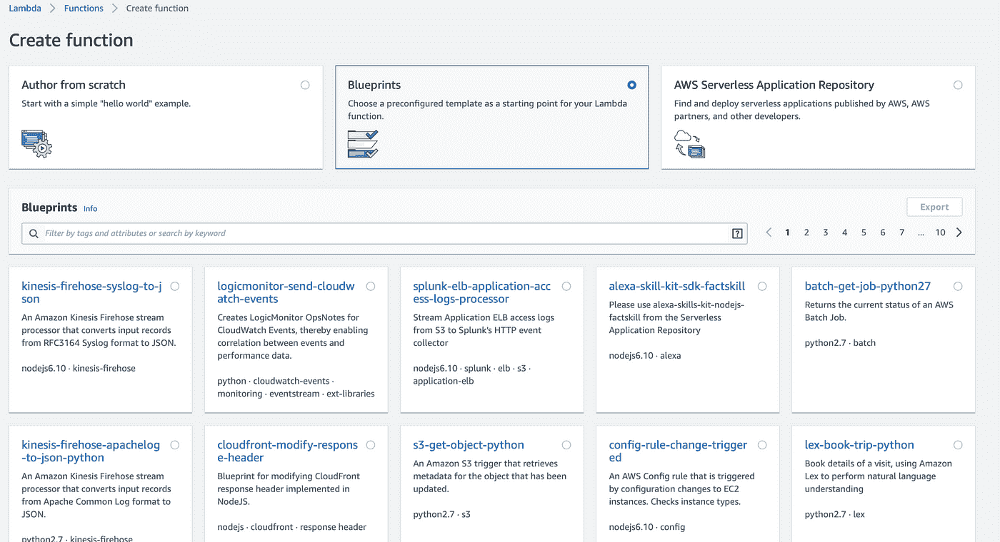
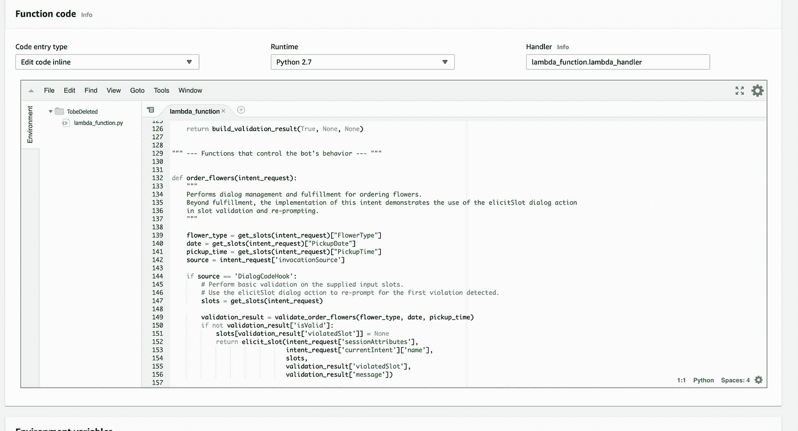

# 我从 Java/J2EE 开发人员到初级 Python 开发人员的旅程

> 原文：<https://medium.com/analytics-vidhya/my-journey-from-a-java-j2ee-developer-to-beginner-python-developer-913628816a0?source=collection_archive---------1----------------------->

为什么要学习 python 作为一名 Java 开发人员已经有将近 10 年的时间了，最初甚至听到 Python 这个词都会感到害怕。在我的一个项目中，我必须创建一个 Lambda 函数供 AWS Lex Bot 调用。从来没有在 AWS 或 Lambda 上工作过的人非常需要现成的参考资料。当您进入 Lambda > Function > Create function 时，您会看到三个选项，如截屏作者从头开始所示，蓝图和 AWS 无服务器应用程序存储库。当你选择 java8 的时候，java 的蓝图并没有出现，所以我的旅程从 python 开始。学习一门新语言总是很有趣，尤其是当它能为你打开像人工智能和人工智能这样的领域时。



我是如何开始的——我选择了蓝图选项，并选择了 lex-order-flowers-python 配置选项。这终于为我打开了下面的窗户。我开始按照我的用例修改下面的代码，并在上面写测试。



**与 Java 的区别**

1.  我意识到的最大和第一个不同是动态打字。通俗地说，在 java 中，我定义变量的数据类型和赋值，但在 python 中，它会根据你给它赋值的值自动获取变量的数据类型。

2.Python 给出了错误格式的编译错误。最初，当我直接在 lambda 的 AWS 控制台中进行更改时，有时会出现如下错误

我意识到 python 作为一种语言，对正确的缩进非常讲究。举个例子，

在上面的代码块中，第一个 if 中的代码应该在第一个 if 之前有几个制表符。类似地，第二个 if 块的代码应该在第二个 if 之前缩进几个制表符。为了解决这些问题并获得各种数据类型的自动建议，我最终切换到了 IDE。

3.if 和 else 或 for 循环没有花括号{}。替换为:

PyCharm 是 Python 中最流行的 IDE 之一，非常容易使用，其社区版是免费的。它来自同样也带来了 IntellJ 想法的 JETBrains。

【Java 和 Python 之间几乎没有相似之处或对应的数据类型

1.  两者都有列表数据类型。
2.  在 java 中我们有地图，在 python 中我们有字典。

3.任何模块导入的导入语法，就像我们在 java 中做的那样。

4.定义函数时，我们使用 def 关键字，就像在 java 中定义函数一样。要返回值，可以使用 return 关键字。

5.**这个**在 java 中表示一个类的实例，在 python 中我们用 **self** 来表示。

6. **instanceof** 替换为类实例上的 **type** 关键字

7.__init__(self，…)表示下面类中的构造函数，并且总是在创建实例时被调用。

8.*args 类似于 java 中的 varargs

```
**Java**
//create instance
Dog d = new Dog();  
// check the instance  
d instanceof Dog**Python**
#class
class Dog: # class object attribute
    # same for all instance, like static variables in java
    species = 'mammmal' #constructor
    def __init__(self, breed, name):
        self.breed = breed
        self.name = name# Below code to be written wherever needed#Create instance
my_dog=  Dog(breed='Alcesian',name='Sam')#Check instance type
print(**type**(my_dog))
```

**少量学习**

1.  最后，我意识到，如果你尝试实现一个用例或项目，并在实现的过程中学习语言，这总是有趣且容易理解的。
2.  用一个好的 IDE，让你的生活更简单。