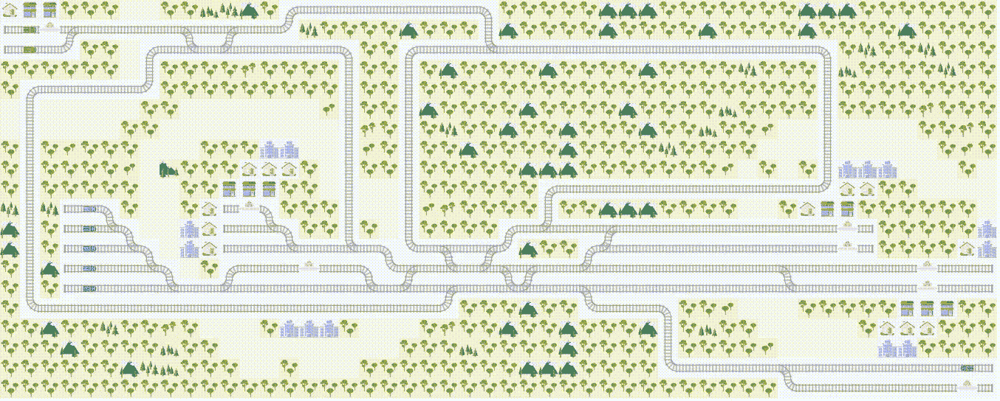

# 我尝试深度强化学习优化列车调度的旅程:

> 原文：<https://medium.com/analytics-vidhya/my-journey-of-trying-deep-reinforcement-learning-to-optimize-train-scheduling-pt-1-d609d4185dbb?source=collection_archive---------16----------------------->

首先，这是在一个叫作[平地](https://www.aicrowd.com/challenges/flatland-challenge)的草坪上的一场比赛，我想，在我写这篇文章的时候，它已经结束了。我制作 RL 算法来解决这个问题的目的不是为了赢得比赛，事实上我从未提交过任何解决方案(我仍在努力让它工作)。相反，我有一个想法，做一个火车调度软件，使用 RL，很长一段时间。所以想象一下当我意外发现这个惊人的比赛时我的快乐。我创建这样一个软件的目的是向人们展示，RL 是一个解决现实世界中许多问题的神奇工具。也要做研究和尝试，要有创造力，要解决大量的问题，我会在这篇文章中给你详细介绍。这篇文章是关于我为这个特定任务解决问题的旅程(这甚至还没有结束)。

## 问题是

所以问题的设定是有 **n** 辆火车，在 **h** x **w** 大小的地图上，(火车的数量和地图大小不同)每辆火车都应该在尽可能最短的时间内到达目的地。考虑到资源限制，以及一个路障只能被一列火车使用的事实，这确实是一个棘手的问题。如果这还不够困难的话，比赛创造者会给你第二轮机会，因为火车的速度不一样了，有时突然(有一定的可能性)一些火车可能会坏掉，卡在铁路中间一段时间。要了解更多信息，你可以去我上面提供的竞争链接。

## 奖励和观察

直到完成为止，每一步的奖励是-1，并且我还为每一个非法移动增加了-2(例如，当铁路没有给出该选项时，非法移动是左转)。观察有点复杂。首先，每列火车都有它自己的观察，环境可以给你三种类型的观察——树形观察、全局观察、局部观察。我使用了树木观察和全球观察，我会简单地告诉你两者。树木观察…哦男孩…..它给你 12 个不同的功能(像细胞距离下一个分支，或细胞距离目的地等。)在每一个可能的动作之后，也在每一个可能的动作之后，每一个可能的动作之后，那就是三的深度。另一方面，GlobalObservation 以一个 **h** x **w** x16 矩阵的形式为每个代理提供完整的转换图，以及其他特征，如代理的方向和位置。LocalObservation 与 GlobalObservation 相同，但它不是完整的地图，而是通过半径 **r** 和该代理的中心来限制每个代理的视图。

快速免责声明，我不会解释什么是强化学习和许多其他东西。

## 我尝试了很多事情

在最开始，我甚至没有开始阅读类似的解决问题的论文，因为我有一个更大的问题，可变数量的代理！！我的立场是从头开始创建每个算法，所以我没有使用 RLlib，即使它为多代理和单代理强化学习设置提供了很好的工具。一种可能的方法是为每个代理建立一个单独的网络，这一切都很好，但代理之间没有通信，当他们需要想出一种方法来共享资源时，这是不可能的。然后，我想使用一种技术，将评论家集中起来，获得所有代理的观察结果，并给每个人一个状态值，参与者在该方向上调整他们的政策，这里所有代理都有单独的网络，因此不存在可变代理数量的问题。然而，分散执行存在一个问题，代理在执行过程中不知道彼此的决定。所以我一直在思考如何在代理人之间建立一个沟通渠道，并提出了一个伟大的想法，后来我发现这不是我的，一些人已经就此写了一篇令人惊叹的论文，并将其命名为多代理双向协调网络(BiCNet)。其背后的思想如下，环境中的每个代理被表示为双向 RNN 序列，并将其隐藏状态传递给其他代理，由于它是双向 RNN，每个代理通过隐藏状态了解其他代理。最棒的是，你不需要设计沟通渠道，他们会在训练过程中学会最好的沟通方式“语言”。现在我们有了算法架构，是时候选择算法本身了。在 [DQN](https://towardsdatascience.com/welcome-to-deep-reinforcement-learning-part-1-dqn-c3cab4d41b6b) 、 [DDQN](https://towardsdatascience.com/dueling-deep-q-networks-81ffab672751) 、 [A3C](/emergent-future/simple-reinforcement-learning-with-tensorflow-part-8-asynchronous-actor-critic-agents-a3c-c88f72a5e9f2) 等算法的海洋里。我从演员-评论家类型的算法家族中选择了非常惊人的 PPO。我单独计算了每个代理的损失，并在培训结束时汇总。平均值，而不是总和，也起作用，所以我想以后我需要更多地使用它，因为随着代理数量的增加，总和会变得更大，我不想以这种方式扰乱我的网络。PPO 的选择是基于这样一个事实，即它是演员-评论家算法家族中工作最好的，而且它比 A3C 稳定得多，所以我们在这里。如果你想了解更多关于 PPO 的知识，我推荐你看看这个令人惊奇的视频[。
我设置了一个训练流程，其复杂性随着时间/迭代而增加，因此训练将从一个小地图中的 1 个代理开始，地图将变得更大，在地图大小增加几次后，代理数量也会增加。在未来，我想尝试一种基于算法执行的好坏而不仅仅是时间来增加复杂度的方法。
现在该说说网络架构了。起初我试图使用 TreeObservation，我使用了不同的架构，但后来我切换到 GlobalObservation，我将谈论我在那里使用的网络。因此，观察的大小为 **h** x **w** x22x **代理数量，**所以我在 RNN 层上使用 CNN 层。正如我所说的，地图的大小是变化的，所以我使用了空间金字塔池，稍后将它提供给我的 RNN 组件。我做了些手脚，把 CNN 所有特工的观察结果分批给了他们，然后从 RNN 的每个特工的观察结果中提取出真正的批次。我使用 Pytorch 是因为它太棒了——易于使用，易于构建和测试新想法，而且代码看起来非常棒。我所说的所有代码都可以在这里的](https://www.youtube.com/watch?v=5P7I-xPq8u8)[中找到。](https://github.com/MelsHakobyan96/flatland_2.0)

## 结果

我还不能吹嘘我的成绩。！所以问题是，我的代码不是很适合我的计算预算，在得到任何有价值的结果之前，我遇到了内存错误。我能说的是，在训练时，有一个非常明显的学习运动，正如我所看到的代理，停下来让其他代理通过，以及许多类似的小细节。我还远没有完成，我会尽可能多的花我的空闲时间在这上面，因为我有很多关于如何实现这一点的想法。

## 对未来的想法

所以我想先优化代码，至少不要出现内存错误。此外，我有一些错误，也想摆脱这些(我想尝试在改变它之前，在同一个地图上保持几次迭代训练，但错误不会让我)。主要的变化将是在我的算法中加入规划，以减少训练时间，而且在这样的项目中进行规划似乎很直观，所以这是未来必须要做的。也许以后我可以尝试分层强化学习，因为我对此也有一些想法。

我的旅程还没有结束，我很有信心可以用现代 RL 技术解决这个问题。我之所以如此专注于 RL，是因为一种算法可以应用于许多其他类似的问题，在解决列车调度之后，下一步可以是飞机、卡车、轮船，你能想到的。此外，通过使用学习算法，我们确保随着时间的推移，它会变得更好，几乎没有变化。此外，学习过程可能会给我们以前所未有的方式解决问题的洞察力。
第一部分到此结束，第二部分再见。