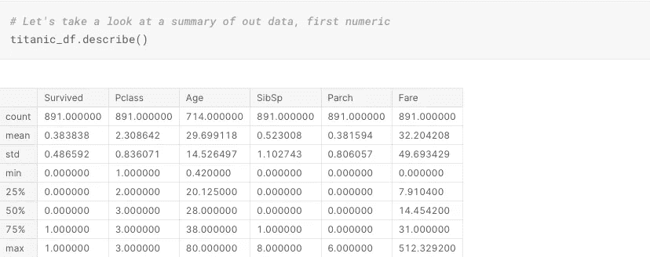

# 我的卡格尔竞赛大师状态之旅:泰坦尼克号基线

> 原文：<https://medium.com/analytics-vidhya/my-journey-to-kaggle-competitions-grandmaster-status-titanic-baseline-a61ed3a31695?source=collection_archive---------25----------------------->

我开始了我的旅程，许多人都开始了他们的旅程:使用越来越流行的泰坦尼克号数据集测试 Kaggle 笔记本的极限。这个数据集包括 11 个基本属性，我们必须决定它们在预测臭名昭著的泰坦尼克号航行中乘客的生存方面的有用性。

提供给我们的属性包括 PassengerId、Survived、Pclass、姓名、性别、年龄、SibSp、Parch、机票、票价、舱位和上船。这个列表和快速浏览前五行数据可以在下面的图片中看到。

属性/列名及其前五行

每个属性的简要描述

我立刻决定从数据框架中删除“乘客 Id”、“姓名”、“机票”和“已登机”列，因为我认为它们对我手头的目标“毫无用处”，我的目标是创建一个高度准确的模型来预测给定乘客的生存状态。我的数据框架就这样被削减了。

删除初始无用列后的数据帧

在这一点上，我们可以看到房间里有一只耀眼的大象(table/dataframe？)上图:太美味的 NaN，或空值。我决定在整个数据框架中仔细观察这些值。

快速浏览数据帧每一列中的空值数量

然后，我将这些数字与我的数据框架中的实例总数进行了比较，发现了以下情况:

在“年龄”栏(输出顶部)和“客舱”栏(输出底部)中找到的 nan 的百分比

由于“Cabin”列中丢失了数量惊人的值，很容易决定这将是从数据帧中删除的下一个属性，这是我的下一步行动。

在删除了这样一个可怕的怪物之后，我决定看一看 dataframe 的统计摘要，以便更好地了解数据的特征——有点像在第一次约会时互相了解！

数字数据(上图)和非数字数据(下图)的统计摘要

看着这些桌子，我注意到一些事情。首先，在“票价”一栏中有一个主要的异常值。没有什么可以立即写回家的，但有些东西值得注意。我还注意到乘客的平均年龄是 29.7 岁，标准差是 14.5。这让我有信心做出基线决策:将 age 列中挥之不去的 NaN 值设置为同一列的平均值——这里，本质上是用 29.7 的几个实例填充空数据。考虑到这个数字非常接近 25%的值、50%的值、75%的值以及相当低的标准偏差，我对这个决定感到满意。

接下来，我打印了一个快速配对图(海上救援！).这让我对剩下的柱子以及它们与乘客生存能力的关系有了更广阔的感受。例如，如下所示，我可以看到较高年龄组和低存活率之间的轻微相关性，而其他年龄组则相当一致。我还发现，在船上有家人(包括兄弟姐妹/配偶/父母/孩子)的乘客与较低的生存能力之间似乎存在关联。我也能够证实我的第一个假设，即对于这个模型预测器，Fare 列的低可用性。

用于可视化每个列之间关系的配对图

根据目前收集的信息，我还不能对“Pclass”列做出决定。考虑到“存活”和“Pclass”列都是绝对的，我决定用条形图仔细观察一下。这有助于我一眼就确定乘客的等级和他们的生存能力之间的基线相关性，头等舱乘客似乎比他们的低舱乘客有更高的存活率。

与乘客等级相比的乘客存活率

然后，我查看了按等级划分的乘客百分比，以确定我获取上述信息的置信度，我发现三等舱的乘客远远超过一等舱和二等舱的乘客。这可能会引起问题，但对我来说，完全抛弃这些信息还不够。在这里，我应该提到的是，对每一个职业的生存能力进行更仔细的观察可能是未来数据运行的一个公平目标。也就是说，这只是一个简单的快速基线，因此我们将毫不谨慎地努力前进。

按等级划分的乘客百分比

因此，在删除了“票价”一栏后，我的最终属性被缩减为“幸存”、“Pclass”、“性别”、“年龄”、“SibSp”和“Parch”。

我的数据帧的当前状态

完成基线清理和争论后，我将数据分成训练和验证子集(当然还有它们的目标子集，即幸存列)，使用 80%的数据进行训练，20%的数据进行验证。然后，我使用 sklearn LabelEncoder 将我的分类数据“性别”列编码为数字形式(将“男性”值转换为整数 1，将“女性”值转换为整数 0)，以便在预测模型中使用(毕竟，众所周知，预测模型可能非常挑剔)。

使用 LabelEncoder 将分类“性别”值编码为数值

最后，我决定使用 RandomForestClassifier 作为我的基线模型，所有属性都设置为默认值。使用 sklearn.metrics 准确性分数，我计算了我的模型相对于验证子集的准确性分数，得出的准确性大约为 82.7%。

RandomForestClassifier 模型以及验证子集准确度分数

最后，我预处理了 Kaggle 提供给我的测试数据，创建了我的测试预测，并将其正确格式化，以允许 Kaggle 神接受它。在内置预测计分器后，我的基线模型达到了 72.248%的合理预测准确率。显然，随着我测试我的模型以获得最佳属性值，这个数字会增加，但这将是下一次安装的目标。

再次感谢，勇敢的读者，感谢你加入我的基线跳跃，进入 Kaggle 竞赛的世界；我当然希望在我的下一期文章中再次见到您。