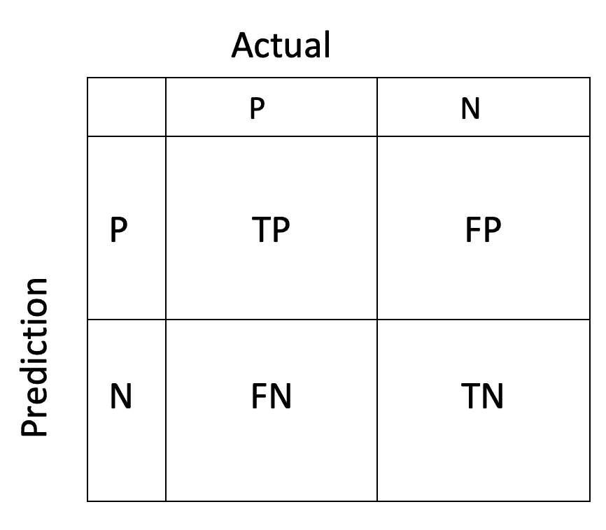

# 我的 ML 词汇表:第 1 部分

> 原文：<https://medium.com/analytics-vidhya/my-ml-glossary-part-1-47d6347388a8?source=collection_archive---------20----------------------->

当我熟悉机器学习技术时，我会记下我遇到的概念。像我这样的人可能会从中受益。词汇表的第一部分开始了。

**混淆矩阵:**分类模型的混淆矩阵是可视化性能的布局。它显示算法能够正确预测的次数。横轴显示实际标签，纵轴显示预测。例如，假设我们有一个过滤垃圾邮件的模型。可能有 4 种结果:

1.  当一封电子邮件实际上是垃圾邮件，并且模型也识别为垃圾邮件时，则该情况为真阳性(TP)。
2.  当该模型将合法的电子邮件标记为垃圾邮件时，则该案例为假阳性(FP)。
3.  当一个模型将一封真实的垃圾邮件标记为非垃圾邮件时，那么这个案例就是假阴性的。
4.  当一个模型正确地将一个非垃圾邮件消息标记为非垃圾邮件时，则该情况为真否定。

下图描述了这些情况。模型性能的这种表示被称为混淆矩阵。

混淆矩阵

**1 型错误:**假阳性错误称为 1 型错误。

**二类错误:**假阴性错误称为二类错误。

**精度:**是评价一个分类模型的度量。这是模型预测正确的部分。所以，*准确率=正确预测总数/预测总数。*

准确率为 95%的模型意味着它能够在 100 次中正确分类 95 次。

精确度的公式为:

> 准确度= (TP+TN)/(TP+FP+TN+FN)

## 精确度和召回率:

我将这两个概念放在同一个标签下，因为它们放在一起更容易理解，而且作为衡量标准，它们是成反比的。

**精度:**这是一个度量，它告诉我们，在所有具有正标签(TP 和 FP)的分类器中，有多少部分是正确的。这个的数学公式是:

> 精度= TP/(TP+FP)

回忆:它是告诉我们，在所有真实的样本中，有多少被模型识别的度量。这个的数学公式是:

> 召回= TP/(TP+FN)

我将用一个垃圾邮件过滤器的例子来解释这两者。假设我们有一个需要识别垃圾邮件的模型。现在，该模型的 **Precision** 将告诉我们，被该模型标记为垃圾邮件的电子邮件中，有多少是真正的垃圾邮件。**回忆**将告诉我们，实际垃圾邮件中有多少部分被模型正确标记为垃圾邮件。

**F1-score** :精度和召回率的调和平均值。这个的数学公式是:

F = 2 *(精度*召回)/(精度+召回)

我们希望我们的模型有一个高的 F1 分数。

F1 分数来自于 F-beta 指标。公式是:

f-beta = 1/(beta *(1/精度)+(1-beta)*(1/召回))

β值越高，精度就越重要。例如，癌症分类模型需要高精度，因此β值会很高。

F1 分数是当 beta = 0.5 时的分数，因此精确度和召回率同等重要，F-beta 方程推导出 F1 分数的公式。

**灵敏度:**这个指标告诉我们，在所有真实的样本中，有多少被模型识别出来。这是真正的阳性率(TPR)。这听起来熟悉吗？没错，其实是**召回的另一种说法。**不出所料，这个的数学公式是:

> 灵敏度= TP/(TP+FN)

**1 —特异性:特异性**是一个度量标准，它告诉我们，在所有阴性样本(假阳性和真阴性)中，有多少是实际正确的预测(真阴性)。所以公式是:

> 特异性= TN/(FP+TN)

由此我们可以推断出`1-Specificity`将会是什么。

> 1 —特异性= FP/(FP+TN)

`1-Specificity`是假阳性率(FPR)。

**欠采样**:我们的数据集经常是不平衡的。例如，在二进制分类模型中，我们的训练数据有一个名为`class`的目标标签，值为 1 和 0。现在，如果我们在`class=1`(标为 1)处的数据比`class=0`(标为 0)多，那么我们的模型将倾向于`class-1`。欠采样就是用来解决这类问题的一种方法。在欠采样中，我们将随机选择一些标签为 1 的行，并缩小行数，使其与标签为 0 的行数相同或成比例。

**过采样:**过采样在不平衡类中创建平衡的另一种方法。在上面欠采样的定义中，很明显，当我们减少行数时，一些数据丢失了。为了克服这种数据丢失，需要使用过采样。过采样与欠采样正好相反。在这种方法中，少数类中的样本数量增加，使其等于多数类中的样本数量。有两种方法可以实现过采样:随机过采样和 SMOTE 过采样。

**随机过采样:**迭代复制少数类中的随机样本，直到两个类的大小变得相似。

**SMOTE 过采样:SMOTE** 代表合成少数过采样技术。SMOTE 的工作方式是，对于少数类的特征，它找到 k 个最近的邻居并将它们相互连接。例如，对于 k=3，将连接特征的 3 个样本。然后，将通过选择位于连接路径上的点来生成合成样本。对于未完全填充的数据集，合成少数过采样技术(SMOTE)通过向少数类添加合成数据点来添加新信息。

**损失函数**:ML 模型的工作是预测估计的目标值。当它预测的值与实际目标值不相等时，它会招致惩罚。损失函数将这种损失量化为单个值。

**优化技术**:优化技术寻求最小化损失。随机梯度下降(SGD)是一种优化技术。SGD 对训练数据进行连续遍历，并且在每次遍历期间，一次更新一个示例的特征权重，目的是接近使损失最小化的最佳权重。

*亚马逊 ML 使用以下学习算法:*

*   *对于二元分类，亚马逊 ML 使用的是 logistic 回归(logistic loss function + SGD)。*
*   *对于多类分类，亚马逊 ML 使用多项式逻辑回归(多项式逻辑损失+ SGD)。*
*   *对于回归，亚马逊 ML 使用线性回归(平方损失函数+ SGD)。*

**超参数**:训练参数用于提高模型性能。每个 ML 算法都有不同的超参数集。

**学习率:**学习率是一个常数，用于随机梯度下降(SGD)算法中。在 SGD 算法中，学习速率决定了它多快达到或收敛到最优权重。线性模型权重会针对它获得的每个数据示例进行更新。更新量由学习率值决定。如果该值太大，则权重可能达不到最优解。如果该值太低，则该算法可能需要多次通过才能达到最佳权重。

**模型大小:**模型大小由输入特征的数量决定。如果有太多的特征，那么数据中也会有太多的模式。这将增加模型的大小。随着模型大小的增加，训练和使用模型进行预测所需的 RAM 大小也会增加。为了减少模型大小，我们可以使用 L1 正则化或设置最大大小。如果我们把模型缩小太多，可能会降低它的性能。

**过度拟合**:当模型记忆模式而不是推广模式时。

**欠拟合**:当模型没有很好地学习模式时。

**正则化**:惩罚极端权重特征以减少过度拟合的过程。L1 正则化将值较小的要素的权重降低为零。这导致稀疏的数据和更少的噪声。L2 正则化降低了特征的总权重值，并稳定了具有高相关性的特征的权重。可以使用`Regularization Type`和`Regularization amount`参数设置规则化的类型和数量。大量将导致所有特征的权重为零，并且模型不会学习任何模式。

**文本特征工程**:特征工程是从数据中提取有用信息的过程。文本数据的特征工程过程是文本特征工程。例如，如果我们有这样一行文本`45 Collins st, VIC 3000, Australia`，它可能对算法没有任何意义。但是当我们用分隔符(如空格、逗号)分隔文本时，我们会发现重要的信息，如街道名称、街道编号、州、邮政编码、国家等。单词袋、N-gram、Tf-idf 等是一些文本特征工程方法。

**单词包**:用空格将句子分割成单个单词。

**N-gram** :是单词包的扩展。n 元语法是来自给定文本或语音样本的 n 个项目的连续序列。

**Tf-idf:** Tf-idf 代表*词频-逆文档频*。这是一种统计度量，用于评估一个术语对集合或语料库中的文档有多重要。

**词频**:衡量一个词在文档中出现的频率，因为文档长度可以变化，所以通过除以文档长度来归一化。

TF(t) =(术语 t 在文档中出现的次数)/(文档中的总术语数)。

**逆文档频率**:衡量一个术语的重要程度。当我们计算 TF 时，所有的项都是同等重要的。然而，我们知道像`the, of, is`这样的词可能会频繁出现，但对找到相关文档没有什么价值。因此，我们需要降低常用术语的权重，增加稀有术语的权重。

IDF = log_e(文档总数/包含该术语的文档数。)

**归一化**:最大值为 1，最小值为 0。其余值使用以下公式计算:

x` = (x-min(x))/(max(x)-min(x))

离群值会干扰规范化。

**标准化**:将平均值设置为零，并使用 z-score 计算值。Z-score 使用平均值和标准偏差来计算值。

z = (x 均值)/sd

这里，mean = x 值的平均值，sd =值的标准偏差

未完待续…