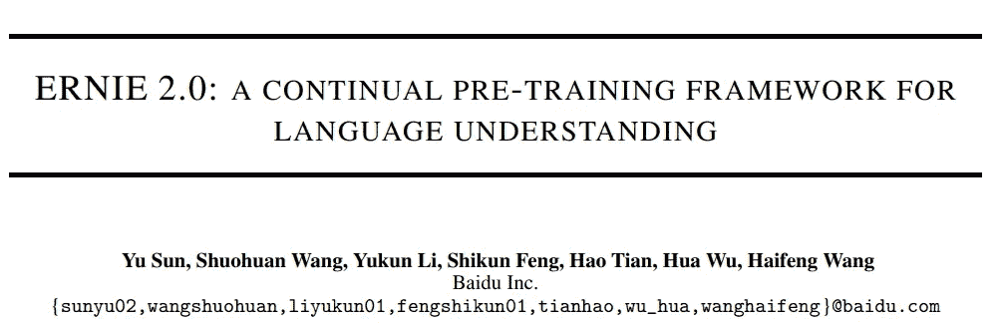
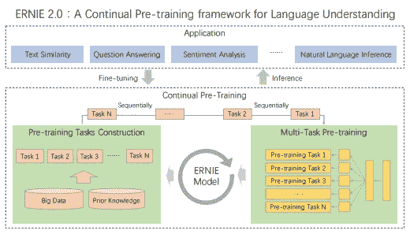
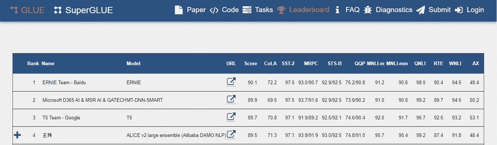
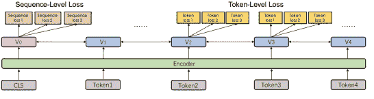
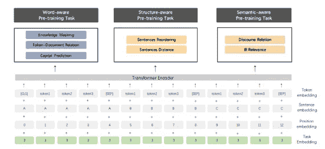
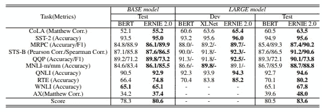

# 我的欧尼 2.0 笔记|百度研究| SOTA 胶水基准

> 原文：<https://medium.com/analytics-vidhya/my-notes-on-ernie-2-0-baidu-research-sota-glue-benchmark-a62951439bc5?source=collection_archive---------21----------------------->

# 简介:

ERNIE 2.0 是一个用于语言理解的持续预训练框架，其中预训练任务可以通过多任务学习逐步构建和学习。

Ernie 之前的算法主要关注单词和句子的共现，但 Ernie 随之引入了标记层、结构层和语义层的理解。

**主要优势——持续学习:目的是用几个任务按顺序训练模型，使它记住以前的任务。**

# 过去算法的主要贡献(2018–2019):

1.  **ELMO** —从语言模型中提出上下文相关特征。
2.  **开艾 GPT** —嵌入式变压器
3.  **BERT** —掩蔽语言模型和句子预测任务进入预训练。
4.  **XLM** —整合跨语言模式。
5.  **MT-DNN** —基于预先训练的模型，在 GLUE[14]中一起学习几个监督任务。
6.  **XLNET** —广义自回归预训练方法，通过在因子分解顺序的所有排列上最大化期望似然来学习双向上下文。

# 模型结构:

1.  Transformer Encoder — Ernie 2.0 使用类似于 BERT 的多层转换器。[CLS]令牌加在开头。在多个输入段之间添加了[SEP]标记。
2.  任务嵌入-每个任务被分配一个唯一的 id，范围从 0 到 nN
3.  模型的输入—令牌+段+位置+任务嵌入

# 培训前任务:

## 单词感知任务—

知识屏蔽任务——预测整个屏蔽阶段和命名实体。

大写任务——基于大写单词具有更多语义重要性的假设。像 NER 一样帮助完成任务。

令牌文档关系预测任务-预测令牌是否出现在一个片段中，以及是否出现在其他实例中。有助于提高特定令牌的重要性。

## 结构感知任务—

句子重新排序——段落被随机分成 1 到 m 段，并应用 k 类分类问题。它有助于学习句子之间的关系。

句子距离任务-这是一个 3 级分类问题，其中“0”表示句子是相邻的；“1”表示句子在同一文档中，“3”表示句子在不同的文档中。

## 语义感知任务—

话语关系任务——预测两个句子之间的语义/修辞关系。

信息检索相关性任务——这是一个 3 级分类问题，其中“0”表示查询和标题是强烈隐含的；“1”表示查询和标题是弱隐含的,“3”表示查询和标题不相关。

# 结果:

# 参考资料:

 [## 粘合基准

### 通用语言理解评估(GLUE)基准是一个培训、评估…

gluebenchmark.com](https://gluebenchmark.com/leaderboard/)  [## ERNIE 2.0:语言理解的持续预训练框架

### 最近，预训练模型在各种语言理解任务中取得了最先进的结果，这…

arxiv.org](https://arxiv.org/abs/1907.12412v1)