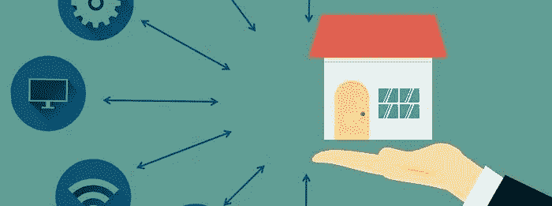
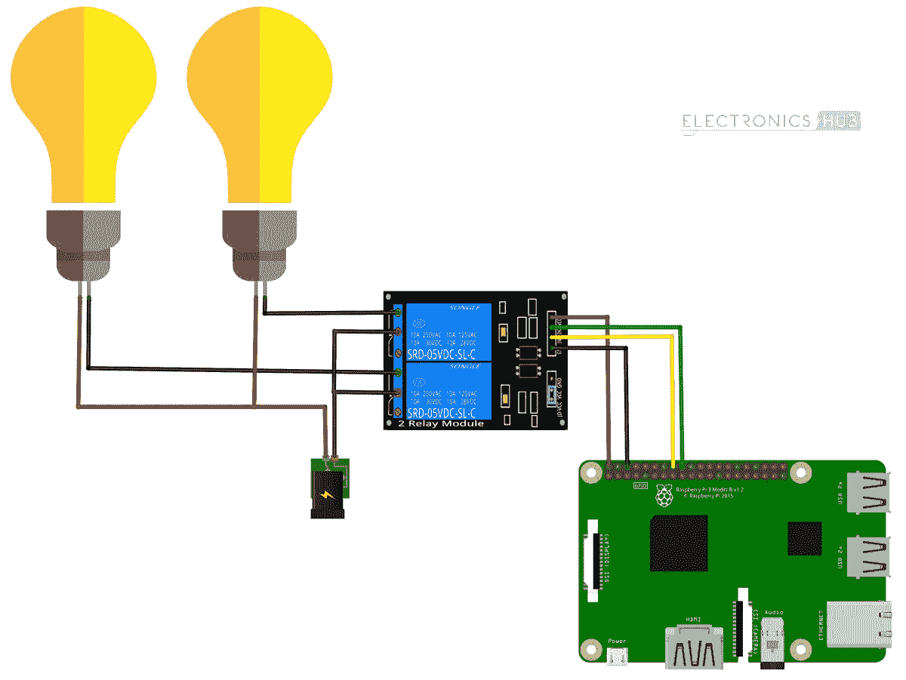
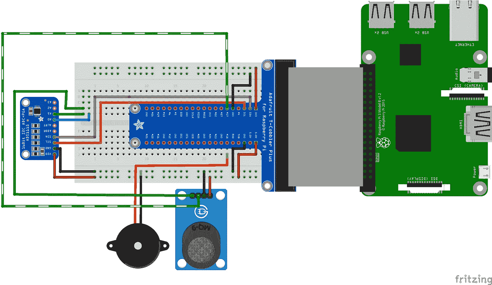

# 我自己的家庭自动化系统- 1

> 原文：<https://medium.com/analytics-vidhya/my-own-home-automation-system-1-b4462057d019?source=collection_archive---------13----------------------->



我在这里分享我的经验，我如何把我的家变成一个智能家居，并减少我的努力，你实际上不需要把任何努力放在像开关按钮这样费力的工作上。如果你有点技术的话。投资₹5K -₹6K.可以自己做

当我买了一个新的树莓派来探索这个神奇的足球，根据它的大小有很多功能时，我想到了这个想法。作为一个懒惰的人，我想到了自动化我的家，在那里我不必站起来做一些愚蠢的小事，如通过将它们与智能助手如谷歌助手、Alexa 和安卓手机集成来关灯。我的智能家居理念的目标是，

1.  打开/关闭所有二进制驱动的电器。示例灯泡、管状灯，
2.  通过 RFID 开门，以及从内部开门的按钮。
3.  通过在您正在使用的所有设备(包括智能手机、笔记本电脑、台式机和智能手表)上发送通知，确保厨房不会发生液化石油气泄漏。
4.  使用 Alexa 等智能助手控制您的电视或任何其他远程控制驱动的设备。

为了实现我的目标，我需要

*   树莓派 3B+
*   传感器(RFID、MQ6 LPG 检测器、32 KHz(射频)红外发射器、红外接收器)
*   继电器电路
*   一点编程技巧

# 准备安装

为了开始，我必须用[Raspberry Pi 3 设置 Raspberry Os 安装](https://projects.raspberrypi.org/en/projects/raspberry-pi-setting-up/2)，并用简单的 python 编程检查 Raspberry 的所有 gpio 是否正常工作，python 编程是控制 gpio 的最基本程序

```
import RPi.GPIO as GPIO
import time

GPIO.setmode(GPIO.BCM)

GPIO.setup(18, GPIO.OUT)
GPIO.output(18, GPIO.HIGH)

time.sleep(3)

GPIO.output(18, GPIO.LOW)
GPIO.cleanup()
```

在 Raspberry Pi 终端上保存并运行程序

```
python Gpio.py
```

我使用 Raspberry Pi 作为我的家庭自动化服务器，并使用 java 网络 API 编写了一个服务器代码，它接受来自客户端的命令，并在物联网设备上反映相同的内容。访问[这里](https://github.com/f71uday/HAS)的代码片段。

## 启动继电器

Raspberry pi 只能控制 0V-5V 之间的信号输出，所以当你需要控制任何工作在高压
(100 V 到 220V)的电器时，你不能直接将 GPIO 直接连接到电器上，这就是继电器在现场的作用，借助继电器你可以切换电流，要获得继电器你只需要 5V。所以现在控制更高的电压变得简单了。



Raspberry pi 至继电器电路的连接图

建立上述连接，并在 Rpi 终端上运行以下代码

```
**import** RPi.GPIO **as** GPIO
**import** time **import** math# Board Setup 
GPIO.setmode(GPIO.BCM)# Pin Setup 
bulb = 4GPIO.setup(bulb, GPIO.OUT)GPIO.output(bulb, GPIO.HIGH)
```

上面的脚本同样用于关闭设备，并将所有脚本与服务器代码集成。

## 液化石油气安全家园

有许多伤亡是由于室内液化石油气泄漏造成的，很多时候你不在家，液化石油气持续泄漏。因此，为了让您了解这一点，并且您可以在正确的时间采取行动，我们可以实现 [MQ6 气体传感器](https://www.sparkfun.com/datasheets/Sensors/Biometric/MQ-6.pdf)来通知我们。



根据进行连接，并在 raspberry pi 上运行以下代码

```
**import** RPi.GPIO **as** GPIO
**import** time **import** math # Board Setup 
GPIO.setmode(GPIO.BCM)# Pin Setup 
gas = 17GPIO.setup(gas, GPIO.IN)
   **while** **True**:
           digGas = GPIO.input(gas)
           **if** digGas == 0:
              notify.send ("notification message")
           time.sleep(3)
```

## 为每个设备上的每个操作推送通知

然而，这项任务似乎是如此沉重和耗时的只是阅读名称，但这项任务只是一个单一的 python 代码行。对于您想要发送通知的任何物联网设备，需要在 raspberry pi 的后台运行一个专用服务，该服务监控设备的每个动作，并将通知发送给设备的每个订户。

为了实现这一点，python 有一个名为 [notify.run](https://notify.run/) 的开源库。您可以使用终端在您的 Raspberry Pi 上进行设置。

```
$pip install notify-run
$notify-run register
```

用于监控物联网设备的每项服务。将这段代码放在适当的位置

```
from notify_run import Notifynotify = Notify()notify.send("Notification Content here")
```

就这样，在这一部分我告诉你我如何实现 LPG 安全系统，通知和控制二进制驱动电器。

在下一部分，我将告诉你我如何用语音助手控制这些电器，以及如何用 Alexa 和 Raspberry Pi 控制电视，即使电视不是智能的。

要收到下一篇文章的通知，请跟我来[乌代·辛格](https://medium.com/u/7008caa98366?source=post_page-----b4462057d019--------------------------------):

github:[https://github.com/f71uday](https://github.com/f71uday)