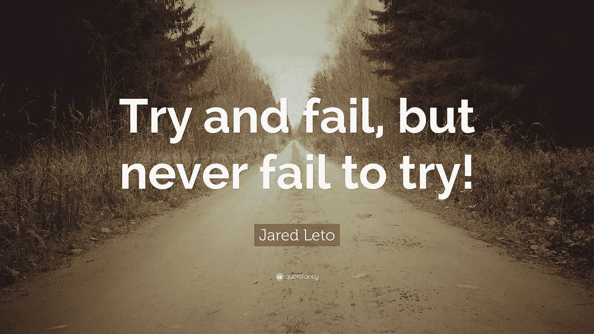
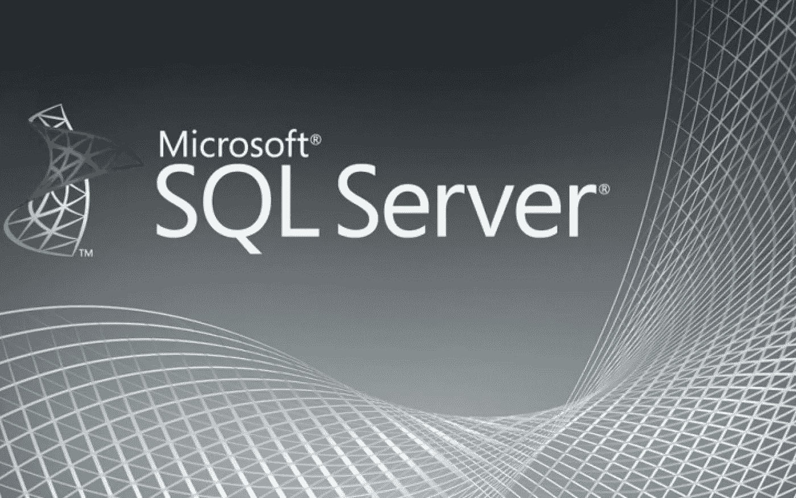
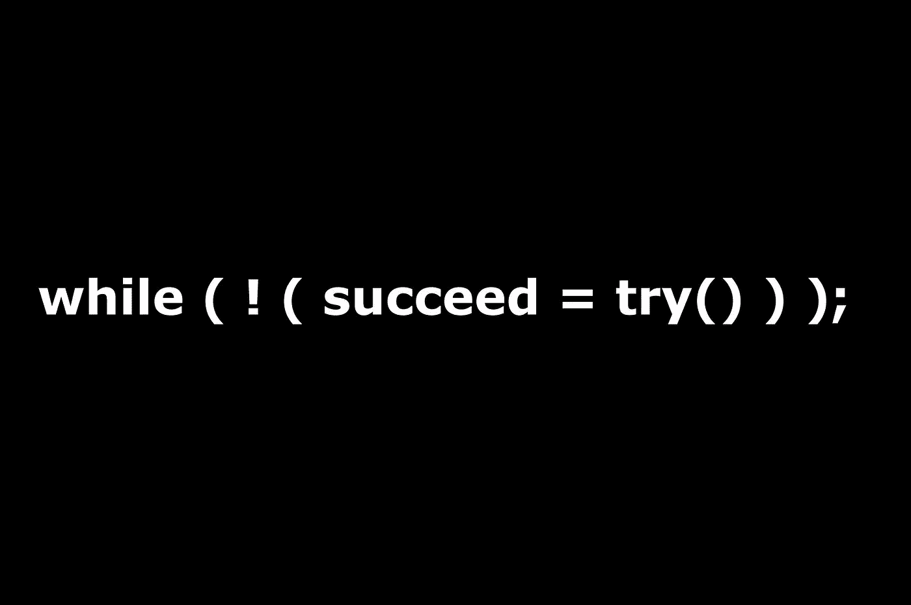
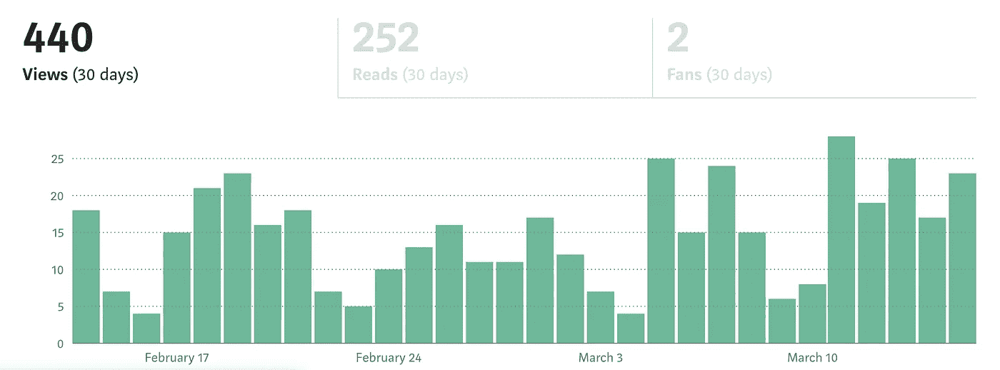

# 我成为数据科学家的道路——非技术人员的道路

> 原文：<https://medium.com/analytics-vidhya/my-path-to-become-a-data-scientist-a-non-tech-guys-way-3c6bde25a58f?source=collection_archive---------16----------------------->

# 关于我的介绍:

我曾在亚马逊印度公司担任数据助理，在那里我开始了进入数据世界的旅程，这也是我了解数据分析师、科学家和 ML 等术语的原因。我是土木工程专业的毕业生，受雇于一个非技术岗位，在这个领域做了两年的数据助理，那时我决定成为一名数据科学家。首先，这篇文章讲述了当你来自非技术背景时，如何成为一名数据科学家或初级数据科学家。我想写这篇文章来让那些没有技术背景的人了解 DS 将会如何。我认识很多没有技术背景的人，所以我想这将有助于人们获得洞察力

[从技术上讲，这是我成为数据科学家的必经之路，这可能会因人们的不同兴趣而异]

# 编码部分:

## Python 编程:

Python 是我的朋友和学长推荐的一个东西，它在很大程度上帮助了我开始这个职业生涯。因为我是一名土木工程师，所以我没有事先的编码知识。我在工程中得到的唯一结果也是错误的。所以开始学习 python 很难。我开始先读很多东西，因为我喜欢阅读和跳入任何东西。我开始阅读，然后我得到了这本书，叫做——教你的孩子如何用 python 编程，相信我，这是一个救命恩人，从那时起，我对 python 产生了兴趣。我学会了如何玩海龟图形，然后慢慢转向学习数据类型和不同的库。

在哪里学习 python:

- Analytics Vidhya 简要介绍了最初的 python 学习，如元组、集合和字典

- Jose portilla 的完整 python 3 训练营是我推荐的一门重要课程

-我推荐在线的 YouTube 频道，尤其是教授数据科学 python 的频道

# SQL 编程:

大多数人认为 RDBMS 过时了，SQL 也过时了。但实际上，SQL 是数据科学领域最受欢迎的语言。学习 SQL 并不容易，因为我有很强的 Python 基础。我唯一做对的事情是先学习 python，这样我就可以很好地接触数据类型。SQL 数据库介绍，然后是 select、where、group by 和 then joins 等语句。对于任何数据分析师来说，连接都是最重要的事情，其次是子查询。由于进化，Teradata 对我们学习 CTE 和其他东西也很重要。我们还必须学习事务语言，因为当我们成为数据库管理员或我们期待这些工作时，这真的很有帮助。我强烈建议人们在 instagram 上关注 Eric Weber 的 SQL，因为他给出了大量关于 SQL 的见解

从哪里学习 SQL:

-如果你想学的话，youtube 上的 SQL 全教程是最好的

- W3 schools 最适合学习文档，MySQL tutorial 也是最好的学习网站

-学习后的训练营是最好的一次尝试 udemy 的 SQL 训练营

我是如何克服创建逻辑的问题的？

坦率地说，一开始很难，但有一件事我一直铭记在心，那就是我想失败。我想一次又一次地失败，然后学习，这对我很有效。我仍然在一些地方挣扎，但仍然比我开始的时候要好。所以克服创造逻辑的唯一方法就是失败和学习。任何对编程没有概念的非技术人员都会在逻辑上吃很多苦头，我也是其中之一。我将简要介绍一下我所做的工作，以便让你对构建逻辑有所了解。

*   从简单的加减法代码开始练习，尝试不同的方法来使它变得更复杂。a+b 也是加法的代码，而 def add(x，y): print(x+y)也是加法的代码。所以从简单的代码开始练习，把它们带到困难的水平。
*   加入像——hacker earth，Hackerrank 这样的编码网站来提高你的编码技能。他们有很多小问题，然后从这些问题开始，提高你的水平
*   一旦觉得自己水平高了，就可以参加编码战，然后尽可能多的打，这样就可以更上一层楼。他们很有趣，他们是不同层次的，做起来很有趣

# 统计部分:

统计学是我在学校里最喜欢的东西，我在数学方面名列前茅。这真的帮助我更容易地学习统计，汗学院和分析 Vidhya 文章是一个生命的救星。相信我去过那里并且做过，所以我会建议他们。他们是数据科学的德干编年史。然后我有点纠结于假设检验和 LR，但是不断的练习确保我很容易克服这个问题。为了掌握统计数据，我研究了大量 YouTube 频道和材料，甚至开始在 Medium 和 LinkedIn 上写很多东西。因此，对我来说，学习所有的统计部分和与之相关的 ML 部分更容易。统计对一切都很重要，大量的时间必须花在统计部分。谈到统计，我使用了很多文章和资源。我使用了许多统计数据的备忘单，并确保这一切顺利进行。

# 从哪里学习统计数据:

*   我强烈建议在 YouTube 上学习 mathisfun.com 网站的统计学课程，因为负责解释的人简直太棒了
*   我还建议，参加 Udemy 的统计课程完全是浪费时间
*   你可以搜索各种文章，也可以使用可汗学院进行统计。

# 统计技巧:

*   确保你在网上找到大量作者写的文章，并确保你理解
*   寻找可能有助于你理解的 YouTube 频道
*   疯狂使用谷歌——与其他资源相比，这是最好的资源

# 哪些图书馆更容易，哪些更难？

Numpy 对我来说更容易学，Pandas 稍微难一点，然后是 sklearn 和 scipy 包。虽然它们是人们的福音，但一开始很难掌握它们。我仍然是一个学习者，但是 sklearn 和 scipy 有很多不同用途的功能，掌握它们肯定需要时间，我准备在这方面花时间。

# 如何确保我们在图书馆做得很好:

*   先从 numpy 和熊猫开始。它们是数据科学库的基础，然后大量练习，你就会成为一名专家
*   然后继续使用可视化库，如 matplotlib 和 seaborn，因为它们遵循下一个过程
*   然后从使用 scipy.stats 模块的统计开始，然后学习所有的东西
*   Sklearn 和 Tensorflow 以及其他模块将遵循吴恩达的机器学习播放列表
*   请关注何塞·波尔蒂利亚的 Python 数据科学训练营，因为他在所有的库中都开设了 udemy 课程。

# 最后:数据可视化工具

PowerBi 和 Tableau 在你去的任何地方都是最重要的，如果你不学习它们，它们会是一种痛苦。数据可视化是最好的部分，也是最有趣的部分，因为你可以有时间玩数据，并根据你的愿望进行可视化，然后呈现给你的客户。因此，一定要在 tableau 和 powerbi 之间选择，或者两者都选，因为它们都在高需求列表中。

## 学习数据可视化的步骤？

*   从基础 excel 到高级 excel，从 tutorialspoint 开始，继续前进
*   一旦你完成了 excel，不要犹豫学习 vba，因为虽然他们是旧的，你需要他们
*   然后，我们开始用 excel 创建仪表板，这就是我们使用 tableau 的方式
*   在 excel 之后，tableau 会更容易学习，确保你使用了 udemy 课程。
*   如果你精通 tableau 和 excel，学习 BI 将会很容易。这只是另一个非常有用的可视化工具

# 窍门:

*   乌代米是这里的救世主，这肯定会有所帮助。找到最好的
*   Youtube 也是另一个救星
*   练习创建仪表盘——确保它们既有吸引力又很酷。
*   获取一个数据集，然后对其进行处理，并根据该数据集创建交互式仪表盘

# 找工作:

这是现在最难的部分，这需要大量的耐心，大量的尝试和失败，并理解求职的算法。这是你获得数据科学工作的方法。找工作是数据科学职业生涯中最难的部分，因为你可以从一开始的数据分析师工作中学到。为了确保你能找到一份工作，在 Linkedin 上建立大量的关系。这是开始把事情安排妥当的一种方式，我们可以和很多人联系，分享我们的知识，这样我们就能被注意到。保持你的简历是最新的，在简历中要新潮。我还想建议，不要超过在简历中添加所有内容，写一页又一页的简历。一页纸，总结一下。足够地

小贴士:

*   Naukri 搜索工作，Linkedin 建立联系
*   AV 寻找新的更新鲜的工作
*   与人交流
*   确保你分享你的学习成果

如何脱颖而出:

*   -参与哈卡顿
*   -写文章
*   -活跃在 ka ggle-Github

感谢阅读