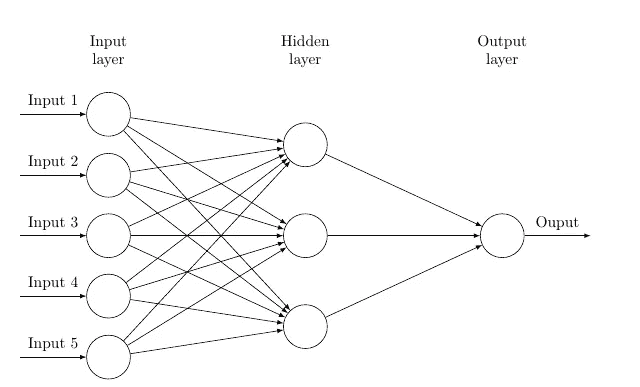
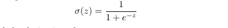
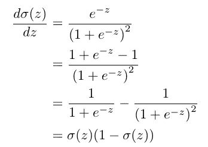
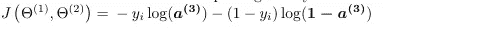
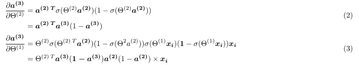
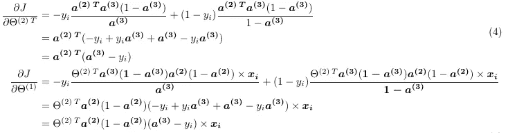

# 我可能错误地实现了反向传播和随机梯度下降

> 原文：<https://medium.com/analytics-vidhya/my-probably-wrong-implementation-of-back-propagation-and-stochastic-gradient-descent-eb17225b64c9?source=collection_archive---------21----------------------->

作为机器学习，特别是神经网络的新学生，当我的算法表现不佳时，我经常感到困惑，我意识到这可能是因为我不明白这些算法在后台做什么。在这一顿悟之后，我自己开始尝试从数学的角度来理解这一切。在整篇文章中，我将着眼于一个 2 层网络，其中输入层有 5 个节点，隐藏层有 3 个节点，输出层有 1 个节点(注意下图中不包括偏置节点)。

图 1:

## Sigmoid 激活函数

激活函数是将相邻层彼此联系起来的函数，对于这个特定的例子，我使用了 sigmoid 激活函数，它由下式给出:

Sigmoid 函数

python 中计算 sigmoid 函数的代码:

下面给出了 sigmoid 激活函数 w.r.t. z 的导数，我就不赘述了，但是我用了链式法则。当我们试图最小化我们的成本函数时，这将是很重要的。

sigmoid 函数的导数

## 价值函数

我选择尝试最小化交叉熵成本函数。我使用了随机梯度下降——它一次查看我们训练集中的一个元素——不需要我对所有例子的成本函数求和。

交叉熵代价函数

## 前馈传播

为了从输入层移动到隐藏层，我执行了前向传播，其中我取了θ1，它具有 3X6 的维度，并且包含我对权重的初始猜测，典型的随机值在[0，非常接近于零的小数字]之间，并且将其乘以(矩阵乘法)转置(x_i)，转置(x_i)是表示我们的训练集的第 I 个示例的向量，转置(x _ I)的维度是 6X1(当包括 bias (1)项时)。这个乘法产生了一个 3X1 的向量，然后我将 sigmoid 函数应用于向量的每个元素，得到一个 a2

输入层到隐藏层

我对 a2 重复了这个过程。我用 1X4 矩阵θ2 乘以 4X1 矩阵 a2(包括偏差(1)项),得到一个标量，然后应用 sigmoid 函数得到 a3，即我们的预测。

隐藏层到输出层

python 中用于执行前馈传播的函数和用于计算成本的函数。

## 反向传播

这是我要用来寻找成本函数 w . r . tθ1 和θ2 的梯度的过程。我应用链式法则来寻找这两个导数，并使用了上述 sigmoid 函数的结果。移调的🙈以确保梯度的尺寸与θ的梯度一致。注意，当用θ1 计算导数时，我们忽略θ2 的第一个元素和 a2 的第一个元素(偏置项)。

我首先找到预测输出(假设)w.r.t 对θ1 和θ2 的导数。

我回到我的成本函数，应用链式法则，代入上面得到的结果。

对我的训练集的每个元素执行前馈传播和反向传播的 python 代码。

使用该公式给出的随机梯度下降来更新两个θ:

梯度下降算法

用 python 更新 thetas 的代码

正如文章标题所暗示的，这种实现可能是错误的，如果能得到一些反馈，我将不胜感激。