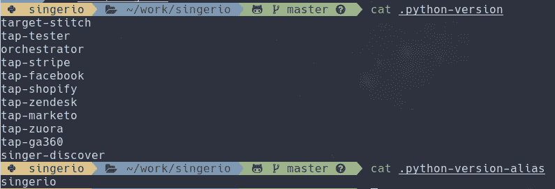

# 我如何管理 Python 的日常使用

> 原文：<https://medium.com/analytics-vidhya/my-python-development-and-daily-usage-setup-af8633ddef78?source=collection_archive---------7----------------------->


哦 XKCD，永远是重点:)

使用 Python 做得越多，设置就越复杂。例如，您可能希望每个项目有一个 virtualenv。对于某些项目，您可能希望有一个完整的沙盒，而对于其他项目，您可能希望能够使用系统范围的 python 环境。在其他项目中，您可能想要测试或使用多个 Python 版本。有些可能是 Anaconda 项目。您可能有自己的依赖于系统级软件包的脚本，但是您希望这些脚本可以从任何地方访问。您可能还希望在沙箱中安装各种基于 python 的工具。幸运的是，有一些很棒的工具可以帮助维护一个合理的配置来满足大多数需求！

我将把这篇文章分成两篇:

*   全局 python 设置
*   [基于 Emacs 的开发环境](/@aiguofer/managing-a-python-development-environment-in-emacs-43897fd48c6a)。

# 全局配置

## 配置基于 Python 的工具

首先，我使用了许多基于 python 的工具，用于各种目的。因为大多数这些通常在包管理器中不可用，所以最好 pip 安装这些。然而，由于可能存在复杂的依赖关系需求，我喜欢将它们分别安装在各自的沙箱中。为此，我使用了 [pipx](https://github.com/pipxproject/pipx) 。我使用系统 python 3 进行设置，并将其安装到用户范围的 python 目录:

```
PYENV_VERSION=system pip3 install --user pipx
```

然后，我从保存在我的 dotfiles 中的`requirements.txt`文件安装我的工具(如果感兴趣，这里有[链接](https://github.com/aiguofer/dotfiles/blob/master/requirements_pipx.txt)):

```
while read pkg; do    
  $HOME/.local/bin/pipx install $pkg
done < requirements_pipx.txt
```

默认情况下，Pipx 会将包安装到`~/.local/bin`，所以我确保这优先于我的 pyenv 安装(见下一节)。为此，只需确保您的`PATH`在您的 init 文件中设置正确。例如:

`export PATH=~/.local/bin:~/.pyenv/shims:~/.pyenv/bin:$PATH`

## 安装 pyenv

为了安装和维护不同的 Python 版本/virtualenv 组合，我使用了一个叫做 [pyenv](https://github.com/pyenv/pyenv) 的神奇包。我安装了所有的默认插件:

```
git_installers=(
    # other tools excluded for post...
    pyenv/pyenv-installer/master/bin/pyenv-installer # pyenv
)for installer in "${git_installers[@]}"; do
    curl -sL [https://raw.githubusercontent.com/$installer](https://raw.githubusercontent.com/$installer) | bash
done
```

(我以类似的方式在 git 上安装了一些其他的东西，这就是为什么我使用了一个循环，不想为这篇文章修改代码)

## 确保每个版本中都安装了必要的软件包

我喜欢确保在我设置的每个版本和环境中都安装了各种各样的包。这些主要是与开发相关的，并且是使用 Emacs 作为我的 IDE 所必需的。

为此，我使用了 [pyenv-default-packages](https://github.com/jawshooah/pyenv-default-packages) 插件(我将在另一节讨论其他插件):

```
pyenv_plugins=(
    aiguofer/pyenv-version-alias
    jawshooah/pyenv-default-packages
    aiguofer/pyenv-jupyter-kernel
)for plugin in "${pyenv_plugins[@]}"; do
    plugin_name=$(echo $plugin | cut -d '/' -f2)
    git clone [https://github.com/$plugin](https://github.com/$plugin) $(pyenv root)/plugins/$plugin_name
done
```

然后我创建一个文件`~/.pyenv/default-packages`,包含:

```
ipdb
elpy
jedi
epc
importmagic
flake8
```

## 设置 Jupyter 内核

因为我通过`pipx`使用全局`jupyter-console`安装，并且每个项目都有自己的版本，所以我确保为每个版本安装了一个 Jupyter 内核。为此，我编写了 [pyenv-jupyter-kernel](https://github.com/aiguofer/pyenv-jupyter-kernel) 插件。我在上面向你展示了我是如何安装它的。现在，每当安装新版本/virtualenv 时，都会创建一个匹配的 Jupyter 内核。我在 Emacs 中利用这一点，无论我在做什么，总是使用相应的内核。

## 设置默认 python 环境

我喜欢有一个默认的 virtualenv，它继承了系统包，我可以用它来做一般用途的 Python 事情，比如写我每天使用的脚本，旋转默认的 REPL 来尝试一些东西，等等。我喜欢使用 virtualenv 的原因是我不必担心使用`--user`标志，我继承系统包的原因是难以构建的包(比如 QT 和 GTK)可以通过包管理器获得。我也喜欢在需要 Python 2 的时候为 Python 2 和 Python 3 各准备一个。我是这样设置的:

```
pyenv virtualenv --system-site-packages -p /usr/bin/python2 default2
pyenv virtualenv --system-site-packages -p /usr/bin/python3 default3pyenv global default3 default2pip2 install -r requirements.txt # install required deps for scripts
pip3 install -r requirements.txt
```

## 设置项目版本

为不同的项目设置 python 环境时，会有各种各样的需求。例如，您可能需要一个特定的 python 版本。您可以使用 pyenv 安装特定版本，如下所示:

```
pyenv install 3.5.7
```

那么您可能希望使用该特定版本来设置 virtualenv:

```
pyenv virtualenv 3.5.7 my_project
```

现在，当您在项目目录中时，您可能想要自动使用该环境，所以您可以设置它:

```
cd /path/to/my_project
pyenv local my_project
```

但是，您可能还想为 TOX 设置多个 python 版本，因此您可以首先使用 pyenv 安装您想要测试的版本，然后像这样设置它:

```
pyenv local my_project 3.7.1 3.6.3 3.5.7 2.7.10
```

这将使 my_project 成为安装包/etc 的缺省值，但是每个版本的 python 可执行文件也可以用于 tox。

或者您可能需要多个 virtualenvs 用于一个更大项目的不同组件，同时在同一个“项目”中拥有所有安装的可执行文件

```
cd /path/to/my_project
# create a dir for each component and set up virtualenvs
pyenv local component1 component2 component3...
```

## 用终端提示符玩得很好

我喜欢这种设置提供的灵活性，但是我不喜欢在使用多个版本时显示 pyenv 版本的工具的工作方式。例如，我的全球版本将显示为:`default3:default2`而其他一些项目甚至更糟。为了解决这个问题，我创建了 [pyenv-version-alias](https://github.com/aiguofer/pyenv-version-alias) 插件，它允许我为不同的 pyenv 环境设置一个别名。比如全球版只是显示为`global`而不是。

由于插件只是创建了一个命令`pyenv version-alias`，你需要设置其他工具来使用它。我使用 Powerlevel10k 作为我的提示符，因此我通过使用以下命令覆盖 pyenv 提示符来配置它:

```
# override powerlevel10k
prompt_pyenv() {
    local v=$(pyenv version-alias)# only display pyenv if we're not using 'global'
if [[ "${v}" != "global" || "${POWERLEVEL9K_PYENV_PROMPT_ALWAYS_SHOW}" == "true" ]]; then
        _p9k_prompt_segment "$0" "blue" "$_p9k_color1" 'PYTHON_ICON' 0 '' "${v//\%/%%}"
    fi
}
```

这是它最终的样子(这里展示了我最复杂的环境):

