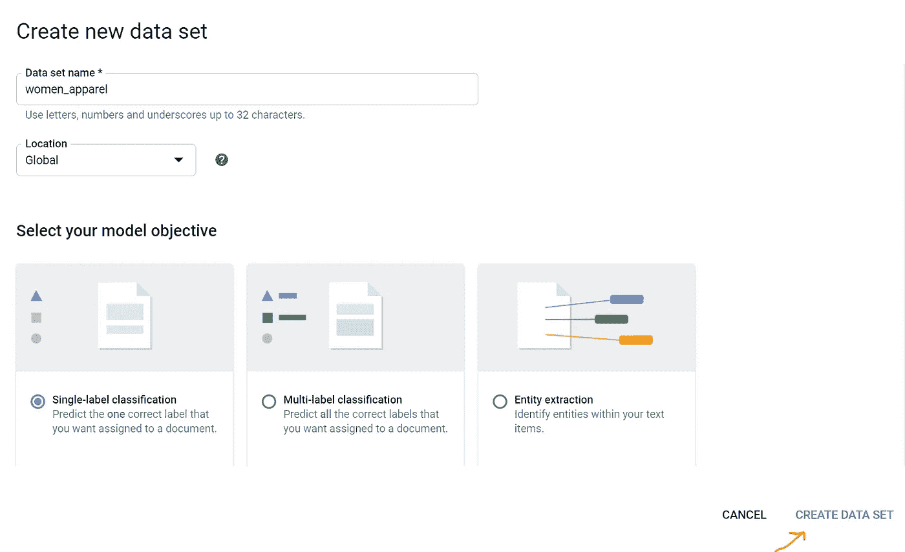

# 我的谷歌自然语言公路之路🌉

> 原文：<https://medium.com/analytics-vidhya/my-way-via-google-natural-language-highway-42fe13442e47?source=collection_archive---------28----------------------->

## 自然语言处理

## 使用谷歌人工智能平台的自定义分类

使用谷歌人工智能平台的自定义分类

你可能听说过以下场景-

I .将收件箱中的电子邮件分类为重要/社交/促销

二。将 FB 用户分类为被动/社交/外向/哭泣者。

三。像 DNA 序列分类一样复杂的分类

现在，让我给你讲个故事-

Vaibhavi 在一家领先的女装电子商务网站担任营销分析师。作为每月分析的一部分，她分析了用户发布的评论。

为了采取适当的措施，她需要将这些数据按部门分类。这将有助于她通知各个部门，并确定哪些人应该得到表扬、关注和相应的行动项目，从而改善整体客户体验。

Vaibhavi 决定接受你的帮助，因为你是他们公司技术团队的数据分析师。她找到你并解释了她的问题。您了解 Vaibhavi 需要根据公司的部门分类对审核意见/反馈进行分类。她和你分享了数据集。

*对于这个故事，我从 Kaggle 下载了一个样本数据集，它是关于女装评论的→* [*Kaggle 数据集*](https://www.kaggle.com/nicapotato/womens-ecommerce-clothing-reviews) *。该数据集对给定发票的产品类别进行分类。*

*该数据集包含以下各列-*

*   *服装 ID*
*   *年龄*
*   *标题回顾*
*   *文本评级*
*   *推荐的 IND*
*   *正反馈计数*
*   *分部名称*
*   *部门名称*
*   *类名*

你现在要做什么？🤷🏽‍♀️

嗯，你脑子里确实有一些方法-

1.  使用市场上可用的自然语言 API
2.  使用 python 库(tensor flow/sci-kit/nltk/numpy/py torch)构建自定义模型对数据进行分类

你从第一步开始-

**自然语言 API**

现在，如果我把这个数据集输入到-

1.  谷歌自然语言编程接口

转到[https://cloud.google.com/natural-language](https://cloud.google.com/natural-language)并点击“分析”按钮。

下面是谷歌的 NLP API 给我们的结果-

在 85%的置信度下，谷歌将这条点评评论归类为女装。嗯，这是一个非常通用的分类，因为所有的评论都属于女装。这对你没有帮助😫。

让我们再尝试一个 API -

2. [IBM 沃森自然语言理解](https://www.ibm.com/demos/live/natural-language-understanding/self-service/home)

IBM Watson 自然语言 API

唉，这对你的情况也没有帮助。😥部门就像“顶部”和“底部”。没有像‘裙子’那样的部门。在这家公司，他们被归入“底层”。

看起来 API 似乎不适合您正在寻找的解决方案。

你想从不同的角度看数据。你手头的问题是按照部门名称对它们进行分类，比如连衣裙、下装、上装等等。

市场上的 API 提供的分类与您的部门分类不一致。

**步骤 2** 即使用 Python 库创建定制模型——哦，天哪！您不具备使用 python 创建自定义模型所需的知识。所以，这种方法也被排除了。

我们刚刚到达**死胡同**了吗？🙆🏽‍♀️

这就是**谷歌的自然语言**来拯救的地方！🦹‍♀️

***先决条件*** *:*

1.  *GCP 及其控制台的基本知识*
2.  *对自然语言非常基本的理解(可选)*
3.  *不需要编码知识*

要访问它，在 GCP 控制台的菜单选项下-

人工智能→自然语言→自动文本和文档分类

自然语言仪表板

# 一.数据准备

a.作为数据准备的一部分，我们需要将数据集分为训练数据和测试数据。有多种方法可以做到这一点。在这种情况下，我们将以 80-20 的比例将它们分开。我们将使用 80%的数据进行训练，剩下的 20%用于测试。

b.对于部门分类，我们不需要年龄、推荐的 IND、正面反馈计数、头衔、类别等参数。因此，我们将删除这些列。剩下的列只有评论和部门

c.“审查文本”字段中缺少日期—

一、18k 记录中，有 674 张是空白的。一种选择是删除它们。但是，使用这种方法，我们可能会面临训练数据减少的风险。这可能不是一个好主意。因此，我们将用与部门名称相同的文本填充这些空白行。

二。有一行 *(Row#13789)* 的所有列都为空。我们正在删除这一行。

三。部门栏为空的有 8 行。我们把这些放在一边评估模型怎么样？我们将从培训数据中删除这些行。让我们的模型决定部门。

四。根据谷歌自然语言提供的建议，每个标签应该至少有 100 个项目才能获得最佳效果。因此，我们需要检查我们的数据集。

现在，我们的训练数据集没有空白数据点。

训练数据集

处理缺失数据的方法因情况而异。

a.移除—删除行

b.接近

I .应用模式-这更适用于二进制/分类数据的情况

二。应用中值—这更适用于具有连续(整数/小数)值的列

d.计算-使用一些高级算法计算缺失值

使用 Google 的[数据准备指南准备您的培训数据。](https://cloud.google.com/natural-language/automl/docs/datasets)

# 二。上传数据/文档

1.  上传云数据存储中的数据

a.遍历云存储→浏览器

b.创建一个桶。它应该有一个唯一的名称。

创建云存储桶

保持其他默认值不变。

云存储桶

c.上传您的。csv 文件在这里

你的文件路径将是*GS://bucket-name/filename*

要上传培训数据，请点击“新建数据集”选项，如下所示-

**创建数据集**

*   **单标签分类**为每个分类文件分配一个标签
*   **多标签分类**允许为一个文档分配多个标签

**导入数据集**

数据集既可以从本地机器导入，也可以从 Google 云存储中导入。这里，我们将数据存储在本地。因此，我们将选择文件并导入。

数据导入可能需要几分钟或更长时间。导入完成后，您将收到电子邮件。

**上传错误:-**

I .这里的标签放在信盒里，即衣服。因此，我们得到了标签名称的错误。我们需要将标签名称全部改为小型大写字母。

二。对于给定的标签“趋势”，记录的数量是 99。我们需要从测试数据中添加一行，并使计数为 100，因为对于给定的标签，Auto ML 至少需要 100 条记录

三。标签没有足够的注释。发生这种情况是因为存在标题。因此，我们可以去掉页眉。

解决上述问题后，我们将在云存储中再次上传训练数据文件，然后在 Auto ML 中上传。

耶！我们的数据已成功上传。现在我们到达了这里，热烈的掌声👏🏽对我们来说，数据准备是整个工作中最细致、最累人的任务之一。

培训数据已上传

# 三。培训自定义模型

现在，让我们来训练我们的定制模型。为此，请转到“培训”选项卡，然后单击“开始培训”

这将要求您输入您的型号名称。我们可以保留提供的默认名称。确保选中了“培训后部署模型”复选框

模型的训练可能需要几个小时，并且会涉及费用。因此，在此步骤之前，请务必检查定价详情。培训完成后，将会发送一封电子邮件。因此，你不必一直在 GCP 控制台上。

在这种情况下，花了 5 个小时来训练我的定制模型。这个时间可能因具体情况而异。

# 四。估价

成绩单日到了！开玩笑的。让我们看看评测结果，看看我们的定制模型做得怎么样。

在控制台上，这是我们看到的-

您可以点击“查看完整评估”查看详细信息。

在评估细节中看到的一个有趣的事情是混淆矩阵，它显示了模型正确分类标签的频率，以及标签分别被混淆为蓝色和灰色的频率。

# 四。测试和使用

现在测试我们的模型怎么样？这可以通过转到“测试和使用”选项卡来完成。

要测试的数据可以直接粘贴在下面的文本框中，或者存储在云存储中，并从那里提取。

我们可以从数据准备阶段已经搁置的测试数据中挑选样本记录。

让我们用我们的定制模型来做**预测**。

样本测试记录

耶！！我的自定义模型以 97%的置信度将评论分类到“Tops”部门下。

还有一个-

该审查意见被归类为“底部”部门，置信度为 97%。

您的自定义分类已完成。现在，我们可以根据手头需要解决的问题，自由地对数据进行分类。

这确实是我的方式通过这条公路:D

然后你赶回 Vaibhavi 分享你的分析。Vaibhavi 很高兴！你很乐意解决她的问题。😊

希望你喜欢这个故事，它帮助你了解了自然语言和数据分析的一个方面。

但是，如果 Vaibhavi 带着更多的数据集回来，并在下个月再次回来呢？你在开玩笑吧！你不能一直这样下去。很快就可以实现自动化了:)。请关注此空间了解更多信息。

请让我知道你在评论中的反馈。他们会激励我继续写下去。

# **参考文献**:

[谷歌云自然语言](https://cloud.google.com/natural-language/automl/docs)

[培训数据准备](https://cloud.google.com/natural-language/automl/docs/prepare)