# 关系型数据库

> 原文：<https://medium.com/analytics-vidhya/mysql-d8d8ddc44aa0?source=collection_archive---------26----------------------->

MySQL 是一个开源的关系数据库管理系统(RDBMS)

[数据 Folkz](https://medium.com/u/77222b949e2?source=post_page-----d8d8ddc44aa0--------------------------------) ，@www.trepend.com

关系数据库将数据组织成一个或多个数据表，在这些数据表中，数据类型可以彼此相关；这些关系有助于组织数据。SQL 是程序员用来从关系数据库中创建、修改和提取数据，以及控制用户对数据库的访问的语言。除了关系数据库和 SQL 之外，像 MySQL 这样的 RDBMS 与操作系统一起工作

# SQL 中的数据类型

# 在 SQL 中，我们有 40 多种不同的数据类型。但是这七个是最多的

# 重要的:

1.整数。没有小数部分的整数。例如 1，156，2012，412

2.十进制。有小数部分的数。例如 3.14，3.141592654，961.41250

3.布尔型。二进制值。它可以是真的，也可以是假的。

4.约会。不言自明。你也可以选择格式。例如 2017 年 12 月 31 日

5.时间。你也可以决定它的格式。例如 23:59:59

6.时间戳。日期和时间一起。例如 2017–12–31 23:59:59

7.文字。这是最常见的数据类型。但它可以只是字母，也可以是字母、数字和任何其他字符的组合。例如你好，python，Manvi，124.56.128.41

# 用于创建表格

语法:创建表名(列名，列类型)

# 例如:创建表 employees (employee_id (int)，not null，autoincrement，employee_name varchar(30)，employee_description varchar(70)，employee_Joiningdate，primary key(employee _ id)；

这里:

- Not null 表示-不能为空

-自动递增—服务请求编号将按顺序自动占用

-Date-将此内容视为日期模式

-主键-表示每行成员的唯一标识

除了这些，我们还有以下-

-Double-这用于测量数量、表现、身高、体重等。

-外键-这是创建到其他表的链接的键。

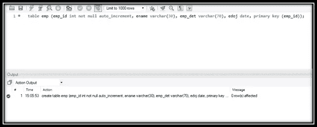

# 因为摔了桌子

语法:DROP table table _ name

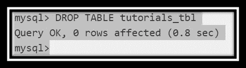

# 插入查询

对于将数据/细节插入 myql 表，我们应该使用命令——INSERT。

语法:insert into table _ name

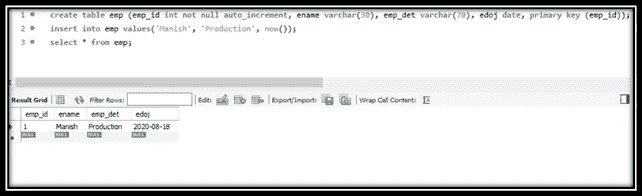

*备注:*

- *这里我们没有使用 id，因为我们使用了 auto increment，这意味着 mysql 将为我们插入的所有记录自动获取数字。*

- *Now()函数用于接受当前日期和时间——如果您想输入其他日期，请使用 yyy-mm-dd* 的格式

# 更改列的命令-

Alter 命令用于更改表或其字段的名称(添加和删除字段列)

删除、添加和重新定位列。

*对于删除，它们应该多于一列；只有一列时，此命令不适用..*

***降列***

为了在表中删除一列，我们需要使用 drop 和 Alter

语法:ALTER table _ name DROP column _ name；

呈现表格；

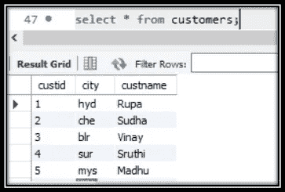

*与空投的列城*

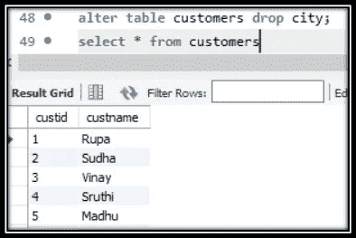

# 选择命令

语法:选择…..(使用此命令从 mysql 数据库获取数据)

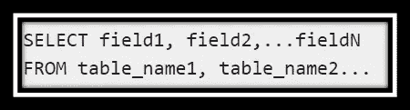

*备注:*

- *选择命令:可以一次提取一个或多个字段*

- *当用*代替字段时，SELECT 命令会拉出该字段的所有数据。*

- *使用 WHERE 子句可以使用任何条件。*

您可以使用 limit 属性来限制返回次数。(见下文)

SELECT * FROM table_name 限制 10；它返回 table_name 中的每一列和前 10 行。

## SELECT 中的几个示例

选择特定列

从 table_name 中选择 column1，column2，column3。

该查询返回 table_name 中第 1 列、第 2 列和第 3 列的每一行

# 用于更改列名或定义的 ALTER 命令-

要更改列的名称或定义(varchar、int、date 等称为定义),我们使用 MODIFY 或 change

例如，将列 CITY 从字符数(15)更改为字符数(20) —下面是语法。

语法:ALTER table customers MODIFY city varchar(20)；

重命名表名的 ALTER 命令

要改变表格的名称，我们使用重命名命令。

语法:ALTER table customers RENAME TO customer 1；

***添加带定位的列:***

这里又加了一栏以给出它的位置那就是，我们要城市跟在名字后面。

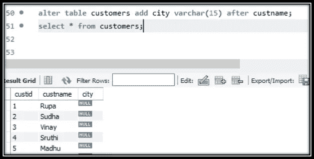

# WHERE 子句:

是一个条件子句，用于从 sql 数据库中提取或筛选详细信息。

这里首先使用 select 命令从数据库中获取详细信息，然后应用 where 进行过滤并获得输出。

语法:SELECT field1，field2，…fieldN table_name1，table_name2…

[其中条件 1[和[或]]条件 2…..

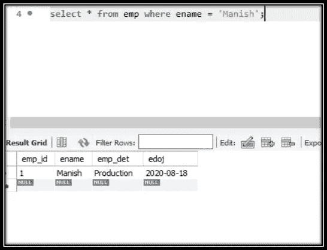

*备注:*

- *可选命令在哪里。*

- *使用逗号(，)可以从不同的表中获取详细信息*

- *使用“与”或“或”运算符可以派生出多个 on 条件。*

- *它也可以与删除或更新 SQL 命令一起使用。*

- *类似于编程语言中的 if 条件。*

使用“where”子句执行的函数列表。

假设 A=10，B 为 20，那么，

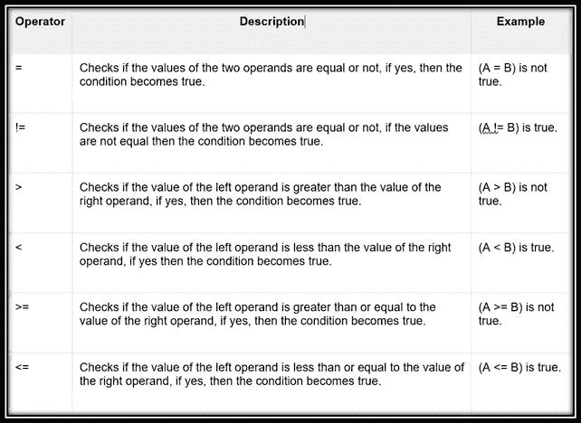

**二进制的用法:**在匹配字符串值时，二进制的用法也使其检查不区分大小写的术语**。**

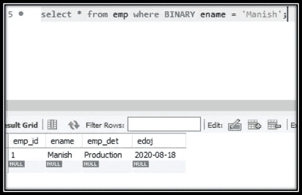

几个例子:

1.SELECT * FROM table _ name WHERE column 1！= ' expression

该查询返回 table_name 中的每一列，但只返回 column1 中的值不是“expression”的那些行。

2.SELECT * FROM 表名，其中第 2 列> = 10；它返回 table_name 中的每一列，但只返回 column2 中的值大于或等于 10 的那些行。

3.SELECT * FROM table _ name WHERE column 3 LIKE“% XYZ %”；它返回 table_name 中的每一列，但只返回 column3 中的值包含“xyz”字符串的那些行。

多重条件

您可以使用多个条件进行筛选。为此，我们有两个逻辑运算符:or、AND。

1.SELECT * FROM table _ name WHERE column 1！= 'expression '和 column3，如' % XYZ % '；

该查询返回 table_name 中的每一列，但只返回第 1 列中的值不是“expression”并且第 3 列中的值包含“xyz”字符串的那些行。

2.SELECT * FROM table _ name WHERE column 1！= 'expression '或 column3，如' % XYZ % '；该查询返回 table_name 中的每一列，但只返回第 1 列中的值不是“expression”或第 3 列中的值包含“xyz”字符串的那些行。

# UPDATE 命令:当我们必须对现有的表进行更改时，使用这个命令。

语法:UPDATE table _ name SET field 1 = new value 1，field2=newvalue2 [where 子句]；

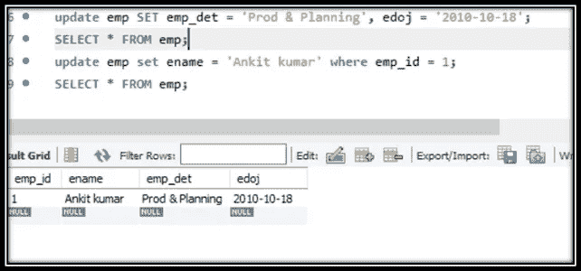

*备注:*

- *Update 命令用于一次更新一个表中的一个或多个字段。*

- *Update 命令可以与 WHERE 子句一起使用。*

# 删除:该命令用于从数据库中删除特定的记录。

语法:DELETE FROM table_name [where 子句]；

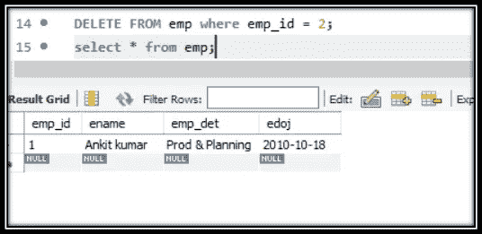

*备注:*

- *如果未指定 where 子句，则将删除数据库中的所有记录。*

- *一次删除一条记录。*

- *一次可以在单个表上使用。*

## Like 命令:LIKE 命令用于从表中导出特定的术语/单词。当使用时，它获取我们要寻找的确切术语，但当我们必须从单词 LIKE 子句中提取具有某些首字母或特定字符的所有记录时，则使用 LIKE 子句。

```
Syntax: SELECT field1, field2,...fieldN table_name1, table_name2...
```

其中 field 1 LIKE condition 1[AND[OR]]file 2 = ' some value '

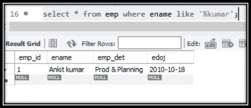

*备注:*

- *通过使用 AND & OR 运算符，可以使用 LIKE 指定任意数量的条件。*

—*LIKE 可以用来代替 WHERE，等于' ='*

- *与%一起使用时，用作元字符搜索(字符数量&位置。*

- *LIKE 子句也可以与 UPDATE 或 DELETE 命令一起使用。*

*%它被用作元字符搜索:*

-*select * from EMP where ename like ' H % '；—此处搜索派生以 H 开头的单词*

-*select * from EMP where ename like ' H % K '；—此处搜索派生出以 H 开头、以 K 结尾的单词*

-*select * from EMP where ename like ' _ a '；—此处搜索派生出第二个字母为“a”的单词*

-*select * from EMP where ename like ' _ a % '；—此处搜索派生单词，其中第二个字母是“a ”,结尾可以是任何内容*

-*select * from EMP where ename like ' % p '；在这里，搜索派生单词，其中最后一个字母是“p ”,起始字母可以是任何字母。*

## order by 命令—使用 select 命令，字段以自由顺序从数据库中导出，但如果我们要求数据以特定顺序形成或排序，则使用 ORDER BY 子句。

语法:SELECT field1，field2，…fieldN table_name1，table_name2…

按字段 1、[字段 2…] [ASC [DESC]]排序

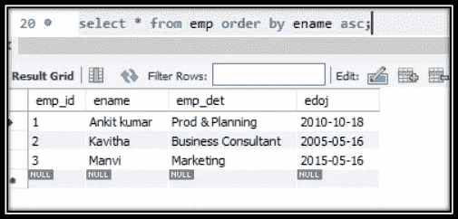

*备注:*

- *排序-通过列出*，排序依据可用于任何字段

- *可应用于多个领域。*

—*WHERE 和 LIKE 子句可以与它一起使用*

# 用于聚合的 SQL 函数

在 SQL 中，对于数据分析师/科学家来说，有五个重要的聚合函数:

1.计数()

2.总和()

3.AVG()

4.最小值()

5.最大()

*几个例子:*

*1。**SELECT COUNT(*)FROM table _ name 其中 column1 = ' something*

*它统计 SQL 表中第 1 列的值为“something”的行数。*

*2。* *从 table_name 中选择 AVG(column1)，其中 column 2>1000；*

*它计算列 1 中值的平均值，只包括列 2 中值大于 1000 的行。*

# 按命令分组:

GROUP BY 子句通常与聚合函数(COUNT、SUM、AVG、MIN、MAX)一起使用。它根据给定的列值(在 GROUP BY 之后指定)对行进行分组，然后计算每个组的聚合，并将其返回到屏幕上。

*注释-示例*

*1。* *SELECT column1，COUNT(column 2)FROM table _ name GROUP BY column 1；*

*此查询计算第 2 列中值的数量，即第 1 列中每组唯一值的数量。*

*2。* *SELECT column1，SUM(column 2)FROM table _ name GROUP BY column 1；*

*该查询对第 2 列中的值进行求和，以得到第 1 列中的每组唯一值。*

*3。* *SELECT column1，MIN(column 2)FROM table _ name GROUP BY column 1；*

*该查询为每组唯一的列 1 值查找列 2 中的最小值。*

*4。* *SELECT column1，MAX(column 2)FROM table _ name GROUP BY column 1；*

*该查询查找列 2 中的最大值，即每组唯一的列 1 值。*

# SQL 别名

我们可以重命名列、表、子查询等等。

SELECT column1，COUNT(column 2)AS number _ of _ values FROM table _ name GROUP BY column 1。

该查询计算第 2 列中值的数量，即第 1 列中每组唯一值的数量。然后，它将 COUNT(column2)列重命名为 number_of_values。

# 加入命令:

联接/内部联接

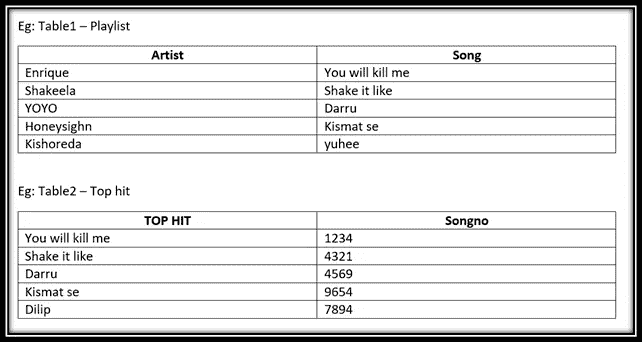

表 SQL 中的播放列表


表 SQL 中的 toplist

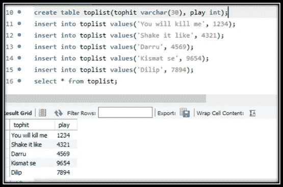

# 执行联接—也称为内部联接

语法:SELECT * from table 1 JOIN table 2 on table 1 _ common factor = table 2 _ common factor

所以在这里


*备注:*

*这里所有的四列都被提取了——因为合并功能已经被应用了*

**请注意，表 5 中的元素不包括在内，因为它没有公因数。(岸田文雄&陈爱龙)**

在 join 中使用特定的列名而不是使用* From 是一个很好的习惯，因为这样会更清楚。(如下图):-

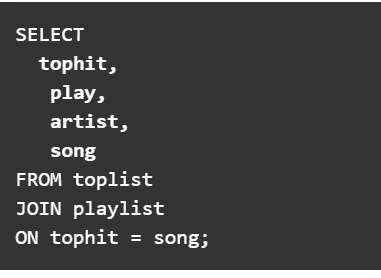

*我们可以使用更好的方法，如上图所示，不清楚从哪个表中提取了什么，所以最好指定表名。(如下图):-*

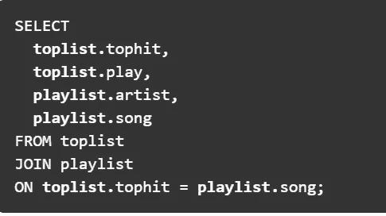

*最后:playlist.song 和 toplist.tophit 列实际上是相同的。我们两个都不需要…所以去掉一个:*

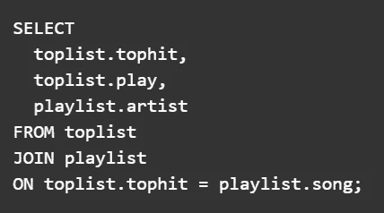

**完全加入**

*回到我们突出显示的段落:*

**请注意，表 5 中的元素不包括在内，因为它没有公因数。(岸田文雄&陈爱龙)**

*现在获取完整的表，包括连接表中两个表的 Kishoreda &陈爱龙。*

*SQL JOIN 称为* **FULL JOIN，** *要执行它，您只需在前面的查询中做一点小小的改动:在 JOIN 子句前添加 FULL。*

语法:SELECT * from table1 完全连接 table 2 on table 1 _ common factor = table 2 _ common factor

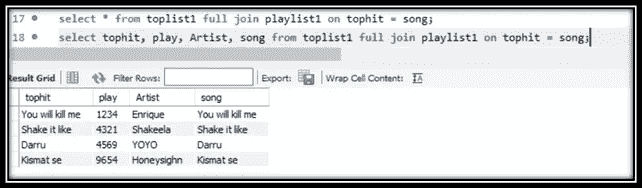

**左连接**

*这里在两个表中如果想从表 1 中导出所有内容，只使用来自表 2 的匹配元素 LEFT JOIN 因为需要表格左侧(表 1)的全部内容。*

语法:SELECT * from table1 左连接 table 2 on table 1 _ common factor = table 2 _ common factor

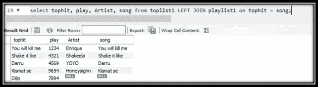

*注意:尽管 DILIP 不属于表 2(播放列表),但此处整个表 1 (Toplist)已被拉入，因为 KISHOREDa 属于表 2(播放列表),而不是公共因子，所以没有提取它。*

**右连接**

*这里在两个表中如果想从表 2 中导出所有内容，只使用表 1 中的匹配元素右连接；因为需要表(表 2)右侧的全部内容。*

语法:SELECT * from table1 右连接 table 2 on table 1 _ common factor = table 2 _ common factor

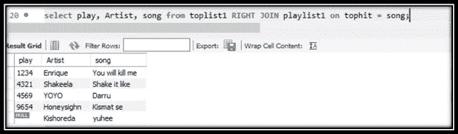

*注意:尽管 KISHOREDa 不属于表 1 (toplist ),但此处整个表 2(播放列表)已被拉入，因为 DILIP 属于表 1 (toplist ),而不是公共因子。*

# 拥有指挥权:

我们需要的许多过滤器不能只在聚合函数(计数、求和等)的结果上使用 WHERE，这是命令发挥作用的地方。

语法:SELECT column1，COUNT(column 2)FROM table _ name GROUP BY column 1，COUNT(column2) > 100。

*注:*

*   *此处无法执行计数功能。*

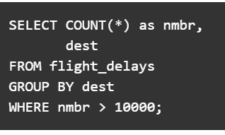

*这里 HAVING 子句将执行计数功能*

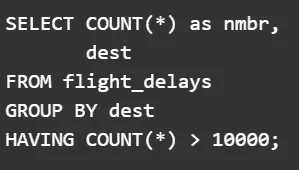

# 正确的关键字顺序-

SQL 对关键字顺序极其敏感。所以确保你保持正确:

1.挑选

2.从

3.加入(上)

4.在哪里

5.分组依据

6.拥有

7.以...排序

8.限制

# 子查询-

是可以在查询中运行的查询，所以它所做的基本上是将一个查询的结果用作另一个查询的输入。

语法:SELECT COUNT(*)FROM(SELECT column 1，COUNT(column 2)AS inner _ number _ of _ values FROM table _ name GROUP BY column 1)AS inner _ query 其中 inner _ number _ of _ values > 100

*备注:*

*内部查询计算第 2 列中值的数量——对于第 1 列的每组唯一值。然后，外部查询使用内部查询的结果，并计算内部值数大于 100 的值的数量。(结果是一个数字。)*

这是一个很好的例子——https://data36.com/sql-data-analysis-advanced-tutorial-ep6/

# SQL 案例— (IF 语句)—

如果我们希望看到条件匹配等于、大于或小于，或者说是真或假，这些都可以插入。

简单的一个

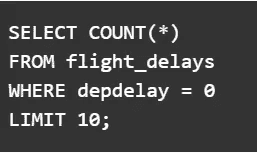

*注释*

- *此处 depdelay 为——出发 _ 延迟，航班 _ 延迟为表名。*

*   *要获得所有变量，您可以将 WHERE 语句中的=改为<和>。*

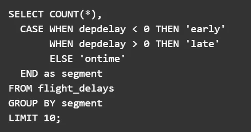

*简化版*

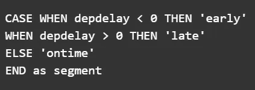

# IS NULL & NOT NULL 语句-

该命令用于获取数据，条件是比较字段是否有空值或无(空值)

语法:IS NULL 当值为 true 时返回

不为空-当值为真时返回

以下是显示所有非空数据的示例。

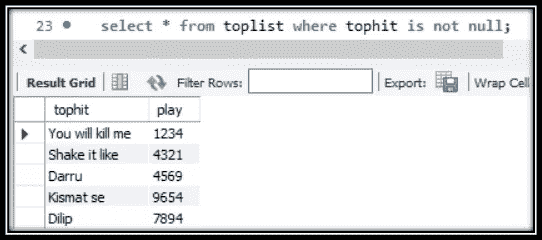

下面的示例显示了所有为空的数据—因为这里没有空单元格，所以它取空白。

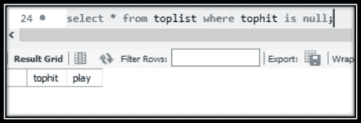

*注意事项*

——*这里！不考虑=和=符号。*

—*我们必须使用 IS 而不是 IS*

信用链接

[https://www . tutorialspoint . com/MySQL/MySQL-useful-functions . htm](https://www.tutorialspoint.com/mysql/mysql-useful-functions.htm)