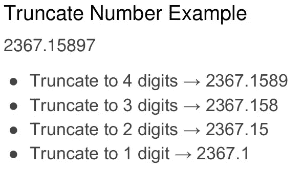
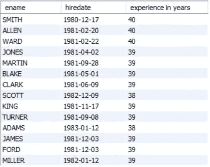

# MySQL 函数:带有示例的备忘单

> 原文：<https://medium.com/analytics-vidhya/mysql-functions-cheatsheet-with-examples-3a08bb36d074?source=collection_archive---------5----------------------->

## 所有常用的 MySQL 函数都在一个地方，有例子和简短的解释。


来源:cleanpng.com

MySQL 提供了大量的函数，其中大部分都被广泛使用。我将提供最常用的函数和简短的描述。这篇文章的目的是为所有的 MySQL 函数提供一个地方，这样你可以在面试或考试前快速浏览一遍。我假设您已经掌握了 SQL 的基本知识。不浪费你的时间，让我直接进入函数。

在此之前，我想让您知道，我已经使用 MySQL Workbench 来执行查询和员工数据库。让我们快速地看一下雇员数据集的描述。


1.  员工编号:员工 ID
2.  ENAME:员工姓名
3.  工作:职务
4.  经理:经理 ID
5.  聘用日期:员工被聘用的日期
6.  萨尔:每月工资
7.  佣金:赚取的佣金
8.  部门编号:员工所属的部门编号

此外，如果您知道 employee 表中的值，接下来的查询会更清楚。

```
SELECT * FROM emps;
```


## **长度()**

CHAR_LENGTH、CHARACTER_LENGTH 和 LENGTH，这三个函数都给出相同的结果，即给定字符串中的字符数。这三个参数都有一个字符串值。

```
SELECT ename, CHAR_LENGTH(ename), CHARACTER_LENGTH(ename), LENGTH(ename) FROM emps;
```


## **串联**()

字符串的连接是所有编程语言中非常常用的技术。SQL 也提供了它。CONCAT 用于将两个或多个值连接成一个字符串值，它可以连接任何类型的数据。

```
SELECT CONCAT(ename, ' works as ',job) FROM emps;
```


## **格式**()

它将浮点数格式化为指定的小数位，并以字符串形式返回值。

> 因素
> 
> *编号:*必填。要格式化的数字
> 
> *小数位数:*必填。*号的小数位数。*如果该参数为 0，则该函数返回一个不带小数位的字符串

```
SELECT comm, FORMAT(comm, 1) FROM emps;
```


## **插入**()

用于从指定的位置开始插入一个字符串来代替另一个字符串，直到某个字符数。

在本例中，我们将所有职务值替换为“公司员工”，从职务值的位置 1 开始，取其所有字符(长度)。

> 因素
> 
> *字符串:*必选。将被修改的字符串
> 
> *职位:*必选。插入*字符串 2* 的位置
> 
> *编号:*必填。要替换的字符数
> 
> *string2:* 必选。要插入到*字符串*中的字符串

```
SELECT ename, job, INSERT(JOB,1, length(job), 'company employee') FROM emps;
```


## 仪表()

返回该字符串在另一个字符串中第一次出现的位置。这里，“g”第一次出现在字符串“介质最好是 blo**g**g 平台”中的位置 19。

```
SELECT INSTR('Medium is best blogging platform', "g") AS MatchPosition;OUTPUT: 19
```

## **定位**()

Locate 是 INSTR 的改进版本，它解决了 INSTR 的缺点。如果我们想知道字符串第三次出现的位置呢？LOCATE 使我们能够灵活地指定从什么位置开始搜索。下面，我们从字符串“Medium is best bloggin**g**platform”的位置 21 开始搜索，以获得第三次出现的“g”的位置。

```
SELECT LOCATE("g", "Medium is best blogging platform", 21) AS MatchPosition;OUTPUT: 23
```

## **UCASE** ( ) **，LCASE** ()

非常简单，UCASE 将字符串转换成大写，LCASE 将字符串转换成小写。

```
SELECT job, LCASE(job), UCASE(job) FROM emps;
```


## **左** ( ) **，右**()

左:从字符串的**开始的**提取指定数量的字符。

右:从字符串的**端**提取指定数量的字符。

下面，我们从每个字符串的开头和结尾提取一个字符。

```
SELECT job, LEFT(job, 1), RIGHT(job, 1) FROM emps;
```


## 替换( )

用另一个指定字符串替换指定字符串的所有匹配项。我们将每个作业值中的所有大写字母“A”替换为小写字母“A”。我已经用一个字符替换了另一个字符，但是同样的事情也可以用字符串来做。去尝试吧，用“女人”替换“男人”。

```
SELECT job, REPLACE(job, 'A', 'a') from emps;
```


## SUBSTR()

为了从一个字符串中提取一个子串，我们必须指定起始位置和从起点开始所需的字符数。这里，我们提取每个作业值的前三个字符。即从字符串的位置 1 开始的 3 个字符。

```
SELECT job, SUBSTR(job, 1, 3) AS Abbrevation FROM emps;
```


## 聚合函数

MySQL 提供的聚合函数有 max、min、avg 和 count。我已经通过寻找最大值、最小值、平均值和工资总数来演示了每一种方法。

```
SELECT MAX(sal), MIN(sal), AVG(sal), COUNT(sal), SUM(SAL) FROM emps;
```


## 地板( )，天花板( )

不考虑小数值，floor 返回小于或等于浮点数的最接近的整数，ceil 返回大于或等于浮点数的最接近的整数。


来源:[mathsisfun.com](https://www.mathsisfun.com/sets/function-floor-ceiling.html)

```
SELECT comm, FLOOR(comm), CEIL(COMM) FROM emps;
```


## 功率( )

返回数字的另一个指定数字的乘方值。在这种情况下，它返回所有薪水的平方。

```
SELECT ename, sal, pow(sal,2) FROM emps;
```


## 圆形( )

将数字舍入到指定的小数位数。它需要两个参数，要舍入的数字和所需的小数位数。


来源:[mathsisfun.com](https://www.mathsisfun.com/rounding-numbers.html)

佣金分别四舍五入到小数点后 1、2 和 3 位。

```
SELECT comm, ROUND(comm,1), ROUND(comm,2), ROUND(comm,3) FROM emps;
```


## 截断( )

返回截断为指定数量的小数值的值。如果第二个参数为 0，则删除小数点；如果为正数，则截断小数部分中指定数量的值；如果为负数，则截断整数部分中指定数量的值。



来源:lideshare.net

```
SELECT comm, TRUNCATE(comm,1), TRUNCATE(comm,-1) FROM emps;
```


> **圆整和截断的区别:**
> 
> Round，将值舍入到最接近的整数，而 truncate 仅丢弃多余的值。

## 添加日期( )

用于向日期添加时间/日期间隔，然后返回日期。添加单位可以是日、月、年、季度等类型。列表如下。


```
SELECT hiredate, ADDDATE(hiredate, INTERVAL 10 DAY), ADDDATE(hiredate, INTERVAL 2 MONTH), ADDDATE(hiredate, INTERVAL 2 YEAR) FROM emps;
```


## CURDATE()，CURTIME()，CURRENT_TIMESTAMP()

这非常简单，返回当前日期、当前时间，以及当前日期和时间一起称为时间戳。

```
SELECT curdate(), CURTIME(), current_timestamp();
```


## DATEDIFF()

假设如果我们想显示一个员工在公司的工作年限，我们需要用雇佣日期减去当前日期。这就是 DATEDIFF()派上用场的地方，它返回两个日期之间的天数。

```
SELECT ename, hiredate, DATEDIFF(CURDATE(), hiredate) as 'experience in days' FROM emps;
```


为了得到年份的差异，我们需要明确地做一些数学运算:除以 365，并对结果取整。

```
SELECT ename, hiredate, ROUND(DATEDIFF(CURDATE(), hiredate)/365) as 'experience in years' FROM emps;
```



## 日名( )，日月( )，日周( )，日年( )

DAYNAME 函数返回一天的名称(星期日、星期一、星期二等。)给定一个日期值。

在给定日期值的情况下，DAYOFMONTH 返回自年初以来的天数。

在给定日期值的情况下，DAYOFWEEK 基本上会返回一个整数，表示从星期日开始的一周中的某一天，值为 0。查看下表中的 DAYNAME，星期三是一周的第 4 天，星期五是一周的第 6 天，依此类推。

DAYOFYEAR 返回一个整数，表示自年初(1 月 1 日)以来的天数。下面，1980 年 12 月 17 日是从 1980 年 1 月 1 日算起的第 352 天。

```
SELECT DAYNAME(hiredate), DAYOFMONTH(hiredate), DAYOFWEEK(hiredate), DAYOFYEAR(hiredate) FROM emps;
```


## 提取( )

用于提取给定日期的指定部分。

```
SELECT EXTRACT(MONTH FROM hiredate), EXTRACT(YEAR FROM hiredate), EXTRACT(DAY FROM hiredate) FROM emps;
```


我们可以从日期中提取下面给出的任何一部分信息。


## 季度( )

返回给定日期所在的季度。

*   一月至三月是第一季度。
*   第二季度是 4 月至 6 月。
*   第三季度是 7 月至 9 月。
*   第四季度是 10 月至 12 月。

```
SELECT hiredate, QUARTER(hiredate) FROM emps;
```


## 如果( )

如果给定条件为真，则返回值，否则返回另一个值。

> IF( *条件*，*值 _if_true* ，*值 _if_false* )

```
SELECT IF(SAL<1000, "YES", "NO") FROM EMPS;
```


## 案例( )

假设我们想根据雇员的薪水对他们进行分类。工资低于 1000 为低薪，1000 至 3000 为合理工资，超过 3000 为高薪。我们必须使用如下的嵌套 if 函数。

```
SELECT ename, sal, IF(sal<1000, “Underpaid”, IF(sal>1000 AND sal>3000,’Fairly paid’,’Overpaid’)) FROM EMPS;
```

如果只有几个条件，这很好，如果我们有几个条件呢？然后我们需要使用如下的 CASE 函数。

```
SELECT ename, sal,
   CASE
     WHEN sal<1000 THEN 'Underpaid'
     WHEN sal>1000 AND sal<3000 THEN 'Fairly paid'
     ELSE 'Overpaid' 
   END AS 'salary status'
FROM emps;
```


## 合并( )

COALESCE 接受一个参数列表，并返回第一个非空值。在下面的例子中，如果 comm 的值为 null，那么它返回零。

```
SELECT ename, comm, COALESCE(comm, 0) FROM emps;
```


## 数据库( )

它返回您正在使用的当前数据库的名称。

```
SELECT DATABASE();
```

## ISNULL()

如果非 null 的给定值返回 1，则返回 0。

```
SELECT comm, ISNULL(comm) FROM emps;
```


## 努里夫( )

它接受两个参数，如果两个值相同，则返回 null，否则传递第一个参数。参数可以是任何类型。

```
SELECT NULLIF(25, 25);
```


下面我们比较每个员工的工资和佣金是否相同。我们可以看到没有雇员有相同的薪水和佣金，因此返回薪水，因为它是第一个通过的参数。

```
SELECT sal, comm, NULLIF(sal, comm) FROM emps;
```


希望这是有帮助的，感谢您的阅读。


皮特·佩德罗萨在 [Unsplash](https://unsplash.com?utm_source=medium&utm_medium=referral) 上的照片