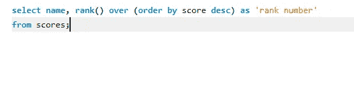

# MySQL 窗口函数

> 原文：<https://medium.com/analytics-vidhya/mysql-window-functions-37e1bb222d30?source=collection_archive---------2----------------------->

快速回顾一下 MySQL 中的窗口函数

MySQL 是一门很好学的语言，如果不能正确理解，它会变得很复杂。基本上 MySQL 都是关于查询的。在子查询的主题中，我们看到了相关的子查询以及所有这些内容。现在，MySQL 有窗口功能，可以帮助你做很多事情。有两种类型的窗口函数，它们是分析函数和聚合函数。像 Python 一样，我们的 MySQL 也有带聚合函数的查询。我们将通过适当的例子来看看集合函数和分析函数。

什么是窗口函数？

> 在 SQL 数据库查询语言中，窗口函数允许访问当前记录前后记录中的数据。窗口函数定义当前行周围具有给定长度的行的框架或窗口，并对窗口中的数据集执行计算。

基本上，这意味着—创建一个窗口并从该窗口中获取一个值的查询。窗口函数对一组与当前行有某种关系的表行执行计算。此外，与普通函数不同，窗口函数不能使用 DISTINCT 关键字。此外，窗口函数只能出现在结果集和 SELECT 语句的 ORDER BY 子句中。这里，在分区时，其他列是默认的粒度，而我们与 window 函数一起使用的列将是 partition 子句中提到的粒度。

窗口功能的类型:

*   分析的
*   总计

**聚合函数**:聚合函数计算特定行的聚合值并返回值。例如:sum()返回一行的总和。这将返回一个结果。

它们是:总和、平均值、最小值、最大值等。这和我们在 python 和学校里学的一样。

**分析函数:**分析函数计算一组行的值，并为每行的*返回一个结果。这不同于聚合函数，聚合函数为整组*行的*返回单个结果。*

它们是:累积分布、行数、密集等级、等级、整体、滞后、领先、第一值、最后值等。我们将看到每一个例子，我们会得到更多的理解。

使用的数据集:[https://dev.mysql.com/doc/sakila/en/](https://dev.mysql.com/doc/sakila/en/)或者您也可以使用经典款数据集[https://www.mysqltutorial.org/mysql-sample-database.aspx/](https://www.mysqltutorial.org/mysql-sample-database.aspx/)

聚合函数:

*   SUM():SUM()窗口函数返回表达式中所有输入值的总和。SUM 函数处理数值，忽略空值。

句法

这里我们得到的是被顺序号分割的表达式的总和。这给出了输出:

因此它提供了总和。如果你在这里使用 group by，这并不能提供你所得到的答案。

*   avg():AVG()窗口函数返回所有输入值的表达式平均值。AVG 函数处理数值，忽略空值。

句法

这里我们得到了每个订单的平均价格。例如，这里的 10100 有 4 个项目，它给出了这 4 个项目的平均价格，因此，它给出:

没错。这是四个订单的平均值。

最小值和最大值函数的工作方式相同，给出四个阶数之间的最小值和最大值。

*   Max():Max()window 函数返回表达式中所有输入值的最大值。Max 函数处理数值，忽略空值。
*   Min():Min()窗口函数返回所有输入值的表达式的最小值。min 函数处理数值，忽略空值。
*   COUNT():COUNT()窗口函数计算输入行数。COUNT(*)对目标表中的所有行进行计数，无论它们是否包含空值。COUNT(expression)计算特定列或表达式中具有非空值的行数。

计数的语法

这里我们计算按订单编号划分的订单数量。相信我，如果你不按订单号来划分，结果会很奇怪。

这给出了已下订单总数的计数。一个类似的东西是用汽车数据库做的，可以在这里找到:[https://drill.apache.org/docs/aggregate-window-functions/](https://drill.apache.org/docs/aggregate-window-functions/)

现在分析函数来了。与聚合函数不同，分析函数理解起来有点复杂，但是如果我们知道它是关于什么的，就很容易了。这种分析函数也被称为排序窗口函数。

*为此我们创建了一个名为 scores 的表格:*[https://github . com/navinni sh/Datasets/blob/master/Scores % 20 data % 20 set](https://github.com/navinniish/Datasets/blob/master/Scores%20data%20set)

*   Cumedist():我们在学校学过使用两个值之间的范围的累积分布。这与计算当前行在窗口分区中的相对等级相同

我们已经获得了分数的累积分布，这就是我们正在计算的累积分布。这给出了:

因此，找到了分数数据集的累积分布。

*   Row_number () : Row number 根据我们在 over()中给出的值给出一个行号。ORDER BY 表达式的值相等的行会不确定地收到不同的行号。我们现在可以根据分数给出行号。

我们根据分数排序，然后给出行号。因此，这给出了:

当涉及到给特定数据集赋予行号时，这基本上是很酷的。

*   ntile() : ntile 函数根据您提供的值将行分成不同的块。NTILE window 函数需要 OVER 子句中的 ORDER BY 子句。

这里我们计算分数的整数倍。因此，这种情况发生了:

这个文件将行分成不同的组。这就像玩一个有趣的周五游戏，1，2 等。

*   Rank 和 Dense_rank : RANK 给出您在有序分区中的排名。平局被分配相同的等级，跳过下一个等级。因此，如果你有 3 个物品在**等级 2** ，下一个列出的等级将会是等级 5。DENSE_RANK 再次给出了您在有序分区中的排名，但是这些排名是连续的。

基本密集的秩不跳过行。

排名:

这给出了:

您可以在这里看到跳过的行。但是另一方面，稠密的秩:

东西不会跳过行，它会给出:

没错。事情就是这样的。

Lag、Lead、First_value、Last_value 被称为值函数，它们还使用了无界前行和无界后行或无界前行和当前行。

LAG:LAG()window 函数返回分区中当前行之前的行的值。如果不存在任何行，则返回 null。

这给出了第一行的滞后分数，因为它没有任何滞后值，结果为空

由于 Johnson 没有以前的值，因此为 null。

Lead:Lead()window 函数返回分区中当前行之后的行的值。如果不存在任何行，则返回 null。与滞后正好相反。

因此，这给出了:

**注意最后一个值为空。**

FIRST _ VALUE:FIRST _ VALUE window 函数返回指定表达式相对于窗口框架中第一行的值。

我们根据 classicmodels 模式中的订单号进行了分区，并获得了 price each 的第一个值，因此这给出了订单号的第一个价格值:

LAST _ VALUE:LAST _ VALUE window 函数返回指定表达式相对于窗口框架中最后一行的值。

因此，我们得到:

给出列的最后一个值。

我希望这给了你一个关于窗口功能的概述，如果你有任何疑问，请随时 ping:)

**如果你面临面试，需要记住的一些问题:**

*   **1)什么是 SQL？**
*   **2)SQL 什么时候出现的？**
*   **3)SQL 有哪些用法？**
*   **4)SQL 支持编程吗？**
*   **5)SQL 有哪些子集？**
*   **6)什么是数据定义语言？**
*   什么是数据操作语言？
*   什么是数据控制语言？

谢谢大家！