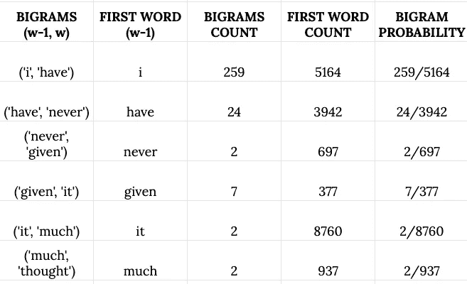
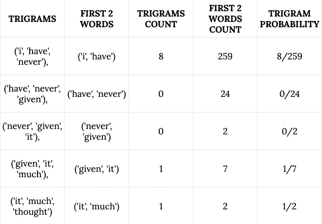
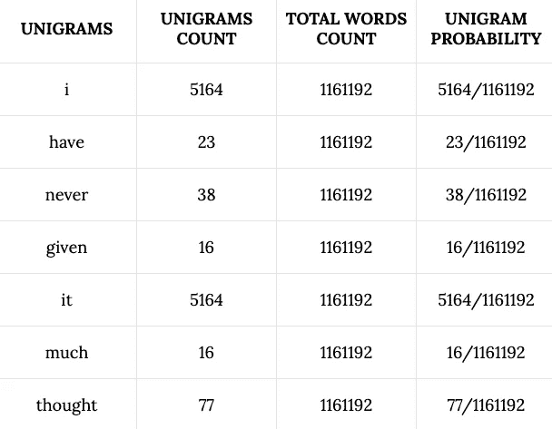

# n 元语言模型

> 原文：<https://medium.com/analytics-vidhya/n-gram-language-models-9021b4a3b6b?source=collection_archive---------5----------------------->


在本文中，我们将讨论语言建模，使用 N 元语言模型生成文本，并使用语言模型估计句子的概率。首先，什么是语言建模？

> 语言建模只不过是预测下一个单词是什么的过程。

> **语言模型基于文本示例或训练数据学习单词出现的概率**

考虑一个单词序列

```
x1, x2, x3, x4,...,xn
```

假设你的词汇集中有 V 和 m 个单词

```
V = {w1, w2, w3,...,wm}
```

计算序列中下一个单词 x(n+1)的概率分布，其中 x(n+1)可以是固定词汇集 V 中的任何单词 w

```
Conditional Probability = P(x(n+1)|xn, x(n-1), x(n-2),...,x2,x1)
```

> 你也可以认为语言模型或者语言模型是一项为句子或序列分配概率的任务

假设我们有一个句子

```
sentence = 'I came by bus'
```

它由 4 个单词组成

```
tokens = ['I', 'came', 'by', 'bus']
```

所以根据我们的语言模型，这个句子的概率是所有单词基于它们之前的单词的所有条件概率的乘积。

```
prob = product of all probabilitiesp = P('I')*P('came'|'I')*P('by'|'came','I')*P('bus'|'by','came','I')
```

概率→ p 是我们的语言模型为句子提供的

## 那么，如何学习语言模型呢？

一种方法是通过 N 元语言模型。那么什么是 N-gram 呢？

N-gram 是 N 个连续单词的序列

考虑上面的句子和记号

```
unigrams = 'I', 'came', 'by', 'bus'bigrams = 'I came', 'came by', 'by bus'trigrams = 'I came by', 'came by bus'4-grams = 'I came by bus'
```

T**何假设一个 n 元单词 LM 是下一个单词只依赖于前 n-1 个单词**

所以新的条件概率是

```
P(x(t+1)|xt, x(t-1),...,x2,x1) = P(x(t+1)|xt, x(t-1),...,x(t-n+2)
```

所以一个单字 LM，next 单词不依赖于任何前面的单词

假设我们正在学习一个 4 克的 LM

```
sentence = If you resort to making fun of someone’s appearance, you lost the __________
```

因为我们正在学习一个 4 个字母的单词，所以只有最后(4-1)个单词会影响下一个单词

```
sequence = 'you lost the'
```

所以下一个单词的概率

```
P(next_w|you lost the) = P(you lost the next_w)/P(you lost the)
```

假设在我们的语料库中

‘你输了’→发生了 10000 次

‘你输了游戏’→出现 2000 次

```
P(game|sequence) = P(you lost the game)/P(you lost the)
P(game|you lost the) = 2000/10000 = 0.2
```

‘你赌输了’→出现 1000 次

```
P(bet|you lost the) = 0.1
```

‘你数错了’→出现了 1000 次

```
P(count|you lost the) = 0.1
```

“你输了这场争论”→发生了 500 次

```
P(argument|you lost the) = 0.05
```

所以当你看原句时，单词“argument”比其他单词更有意义。

如果丢弃太多的上下文，预测的结果就不会那么好。

缺点或限制之一是稀疏性问题

如果语料库中不存在“你丢失了”怎么办

```
P(sequence) = 0
```

然后你必须从 4 个字母的 LM 退回到三个字母的 LM，以此类推

# 使用 python 在 NLTK 的 Brown 语料库的帮助下生成文本

基本的想法是在 4 克 LM 的帮助下生成接下来的 30 个单词。如果 4-gram LM 在预测下一个单词时存在稀疏性问题，请退回到三元模型 LM。如果同样的问题发生在三元模型上，退回到二元模型，如果发生在二元模型上，退回到一元模型。因为 unigram 不依赖于前面的单词，所以从单词库中随机选择一个单词。

*   **导入单词语料库**

```
import numpy as np
from nltk.corpus import brownwords = list(brown.words())
```

*   **为这个句子生成接下来的 30 个单词或记号**

```
sentence = 'I am planning to____________________________________'start_sentence = 'I am planning to'tokens = start_sentence.split()
```

*   **4 克 LM**

这个模型返回下一个单词的所有可能的标记。

```
def fourgram_model(self):
        next_words = []for i in range(len(words)-3):
            if words[i] == tokens[-3]:
                if words[i+1] == tokens[-2]:
                    if words[i+2] == tokens[-1]:
                        next_words.append(words[i+3])next_words = next_words
        return next_words
```

为上述 4-gram LM 模型的结果中出现的所有不同单词生成概率。根据概率 ***选择前三个单词。***

```
def get_top_3_next_words(next_words):
        next_words_dict = dict()for word in next_words:
            if not word in next_words_dict.keys():
                next_words_dict[word] = 1
            else:
                next_words_dict[word] += 1for i,j in next_words_dict.items():
            next_words_dict[i] = np.round(j/len(next_words),2)#Sorting the probs in decreasing order and select the first three
result = sorted(next_words_dict.items(), key = lambda k:(k[1], k[0]), reverse=True)[:3]return result
```

选择这三个单词中的一个，并将该单词添加到单词列表的末尾。

```
[('use', 0.11), ('tour', 0.11), ('shelter', 0.11)]
```

例如，如果您从预测中选择“使用”,则更新后的令牌列表应该是

```
tokens = ['I', 'am', 'planning', 'to', 'use']
```

现在，如果您使用一个 4-gram LM 来生成下一个单词，请使用标记列表的最后三个单词。

如果你面临稀疏性问题，那么使用标记列表的最后两个单词，并使用三元模型 LM。

如果你仍然面临稀疏性的问题，退回到一元。

我只在这里发布了 4 克 LM 的代码。对于 trigram、bigram、unigram 自己试试或者 ***你可以在***[***GitHub***](https://github.com/ambatiashok60/Medium/blob/master/Language%20Modeling/N-gram%20Language%20Model%20for%20text%20generation.ipynb)找到与这个文本生成问题相关的代码

在生成所有 30 个单词之后，您的令牌列表应该看起来像这样

```
['I', 'am', 'planning', 'to', 'use', 'the', 'Standard', 'Deduction', 'or', 'the', 'Tax', 'Table', ',', 'and', 'later', 'go', 'hungry', '?', '?', 'The', 'voice', 'had', 'music', 'in', 'it', '.', 'The', 'sequence', 'may', 'involve', 'a', 'sharp', 'contrast', ':']
```

*   **生成的文本看起来像**

```
I am planning to use the Standard Deduction or the Tax Table , and later go hungry ? ? The voice had music in it . The sequence may involve a sharp contrast :
```

# 估计句子的 N-gram 概率

让我们使用同一个棕色语料库来计算一个句子的 N-gram 概率。我们将按如下方式计算概率

*   **检查在语料库中只出现过一次的单词**

```
words = list(brown.words())words_dict = dict()for word in words:
    if word not in words_dict.keys():
        words_dict[word] = 1
    else:
        words_dict[word] +=1occured_once = [i for i,j in words_dict.items() if j ==1]
```

> 在语料库中只出现一次的单词被认为是被称为 OOV 的单个特殊单词的实例。OOV 指的是词汇之外

*   **将出现过一次的单词转换为特殊单词 OOV 的实例**

```
for num, word in enumerate(words):
    if word in occured_once:
        words[num] = "OOV"
```

*   对句子进行标记，检查标记是否在语料库中。

> 如果词汇中没有这些标记，则将该特定标记视为 OOV 的实例

```
sentence = "I have never given it much thought"tokens = sentence.split()for num,token in enumerate(tokens):
    if not token in words:
        tokens[num] = "OOV"
```

现在，我们已经用 OOV 实例更新了令牌和单词

*   **将记号和单词转换成小写**

```
tokens = [token.lower() for token in tokens]words = [word.lower() for word in words]
```

*   **二元概率**

```
Probability = P(2 token sequence | first token)prob = P(w-1, w | w-1) = count(w-1, w)/count(w-1)
```

*   **句子的标记**

```
tokens = ['i', 'have', 'never', 'given', 'it', 'much', 'thought']
```

*   **句子的所有二元模型**

```
bigrams = []
for i in range(len(tokens)-1):
    bigrams.append((tokens[i],tokens[i+1]))
```



各自的二元概率

*   **计算单个二元模型概率的函数**

```
def bigram_probability(bigram,words):
    count = [0,0]
    for i in range(len(words)-1):
        if (words[i] == bigram[0]):
            count[1] += 1
            if (words[i+1] == bigram[1]):
                count[0] += 1
    return count[0]/count[1]
```

> **一个句子的概率=所有二元模型概率的乘积**

*   **句子的二元模型概率**

```
def bigram_prob_sentence(tokens, bigrams):
    prob = []
    for bigram in bigrams:
        p = bigram_probability(bigram,words)
        prob.append(p)
    return np.prod(prob)
```

所以这句话使用二元模型 LM 的概率是**7.92268578305691 e-15**

现在让我们尝试三元模型。

*   **三元模型概率**

```
trigram = (w-2, w-1, w)Probability = P(3 token sequence | first 2 token sequence)prob = P(w-2, w-1, w | w-2, w-1) = count(w-2, w-1,w)/count(w-2, w-1)
```

*   **句子的三元模型概率**



三元模型概率

```
probability = (8/259) * (0/24) * (0/2) * (1/7) * (1/2) = 0
```

*   **单字概率**

```
unigram = wProbabilty = P(w)prob = count(w)/total_words
```

*   **句子的单字概率**



单字概率

```
probability = product of all unigram probabilitiesprobability = 1.6139361322466987e-28
```

> **你可以在** [**GitHub**](https://github.com/ambatiashok60/Medium/blob/master/Language%20Modeling/Estimating%20the%20N-Gram%20Probabilities%20of%20a%20sentence.ipynb) 找到使用 N-grams 的句子概率估计的相关代码