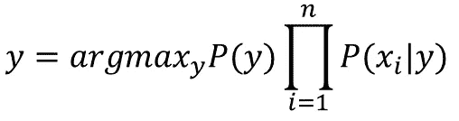

# 朴素贝叶斯算法

> 原文：<https://medium.com/analytics-vidhya/na%C3%AFve-bayes-algorithm-5bf31e9032a2?source=collection_archive---------3----------------------->

## ***探索朴素贝叶斯:数学，它是如何工作的，优点&缺点，以及应用***

## 什么是朴素贝叶斯算法？

朴素贝叶斯是一种基于贝叶斯定理的分类技术，它假设预测目标值的所有特征都是相互独立的。它会计算每个类别的概率，然后选择概率最高的类别。它已经被成功地用于许多目的，但是它在处理自然语言处理(NLP)问题时特别有效。

贝叶斯定理描述了一个事件发生的概率，基于可能与该事件相关的条件的先验知识。

## 是什么让朴素贝叶斯成为“幼稚”的算法？

朴素贝叶斯分类器假设我们用来预测目标的特征是独立的，互不影响。而在现实生活数据中，特征在确定目标时相互依赖，但朴素贝叶斯分类器忽略了这一点。

尽管独立性假设在真实世界的数据中从来都不正确，但在实践中却常常行之有效。所以它被称为**【天真】**。

## 朴素贝叶斯算法背后的数学

给定一个特征向量 X=(x1，x2，…，xn)和一个类别变量 y，贝叶斯定理表明:

我们感兴趣的是从可能性 P(X | y)和先验概率 P(y)，P(X)计算后验概率 P(y | X)。

使用链式法则，可能性 P(X ∣ y)可以分解为:

但是由于 Naive 的条件独立性假设，条件概率是相互独立的。

因此，通过条件独立，我们有:

由于所有值的分母保持不变，因此后验概率可以是:

朴素贝叶斯分类器将该模型与决策规则相结合。一个常见的规则是选择最有可能的假设；这被称为最大后验概率或 MAP 判决规则。

## **天真的海湾是如何工作的:**

让我们用一个例子来解释它，让事情变得清楚:

假设我们有一堆想要归类为垃圾邮件的电子邮件。

我们的数据集有 ***15 封非垃圾邮件*** 和 ***10 封垃圾邮件*** 邮件。已经做了一些分析，每个词的频率被记录如下:

> ***注:*** 删除了" the "、" a "、" on "、" is "、" all "等停用词，因为它们没有重要意义，通常从文本中删除。同样的事情也适用于数字和标点。

**探索一些概率:**

*   p(亲爱的|不是垃圾邮件)= 8/34
*   p(访问|非垃圾邮件)= 2/34
*   p(亲爱的|垃圾邮件)= 3/47
*   p(访问|垃圾邮件)= 6/47

诸如此类。

现在假设我们有消息“*你好朋友*”，我们想知道它是否是垃圾邮件。

所以，利用贝叶斯定理

忽略分母

但是，P(Hello friend | Not Spam) = 0，因为这种情况(Hello friend)在我们的数据集中不存在，也就是说，我们处理的是单个单词，而不是整个句子，P(Hello friend | Spam)的情况也将是零，这反过来将使成为垃圾邮件和不是垃圾邮件的概率都为零，这没有任何意义！！

> 但是等等！！我们说**朴素贝叶斯假设* **`我们用来预测目标的特征是独立的`**。*

*所以，*

**

*现在，让我们使用相同的过程来计算成为垃圾邮件的概率:*

**

*所以，消息“*你好朋友”*不是垃圾邮件。*

***现在，让我们试试另一个例子:***

*假设消息*“亲爱的拜访晚餐钱钱钱”*。很明显这是一个垃圾邮件，但是让我们看看朴素贝叶斯会怎么说。*

******

*哎呀！！Naive Bays 说这个消息是**不是垃圾邮件**？！！！*

*发生这种情况是因为单词"*晚餐"*没有出现在*垃圾邮件*数据集中，所以 P(晚餐|垃圾邮件)= 0，因此所有其他概率都没有影响。*

*这被称为**零频率问题。***

*为了解决这个问题，我们可以使用**拉普拉斯平滑。***

> ***拉普拉斯平滑**是一种平滑分类数据的技术。小样本校正，或伪计数，将被纳入每一个概率估计。因此，任何概率都不会为零。这是一种正则化朴素贝叶斯的方法。*
> 
> *给定来自具有 N 次试验的多项式分布的观测值 x = (x1，…，xd)和参数向量θ = (θ1，…，θd)，数据的“平滑”版本给出估计量:*

**

> *其中伪计数α > 0 是平滑参数(α = 0 对应于没有平滑)。*

*在这里阅读更多关于**加法平滑** [的内容。](https://en.wikipedia.org/wiki/Additive_smoothing)*

*回到我们的问题，我们将选择α = 1，而“d”是数据集中唯一单词的数量，在我们的例子中是 10。*

******

*现在，它正确地将邮件分类为垃圾邮件。*

## ***朴素贝叶斯分类器的类型***

*   ***多项式:**特征向量表示通过多项式分布产生某些事件的频率。例如，计算每个单词在文档中出现的频率。这是通常用于文档分类的事件模型。*
*   ***伯努利:**像多项式模型一样，该模型对于文档分类任务是流行的，其中使用二元术语出现(即，单词是否在文档中出现)特征，而不是术语频率(即，单词在文档中的频率)。*
*   ***高斯:**用于分类，假设特征遵循正态分布。*

## ***朴素贝叶斯的利弊***

***优点:***

*   *需要少量的训练数据。所以训练花费的时间更少。*
*   *处理连续和离散数据，对无关特征不敏感。*
*   *非常简单、快速、易于实现。*
*   *可用于二元和多类分类问题。*
*   *高度可扩展，因为它随预测要素和数据点的数量线性扩展。*
*   *当朴素贝叶斯条件独立性假设成立时，它将比逻辑回归等判别模型收敛得更快。*

***缺点:***

*   *独立预测因子/特征的假设。朴素贝叶斯隐含地假设所有的属性都是相互独立的，这在现实世界的数据中几乎是不可能找到的。*
*   *如果分类变量的某个值出现在测试数据集中，而没有在训练数据集中观察到，则模型将为其分配零概率，并且无法进行预测。这就是我们所说的**“零频率问题”**，可以使用平滑技术来解决。*

## ***朴素贝叶斯算法的应用***

*   *实时预测。*
*   *多类预测。*
*   *文本分类/垃圾邮件过滤/情感分析。*
*   *推荐系统。*