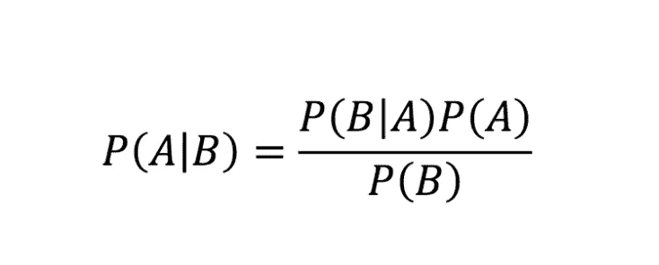
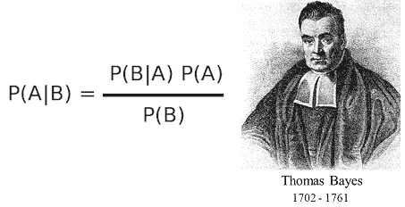
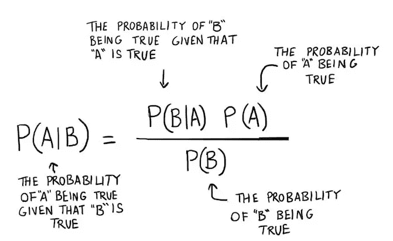
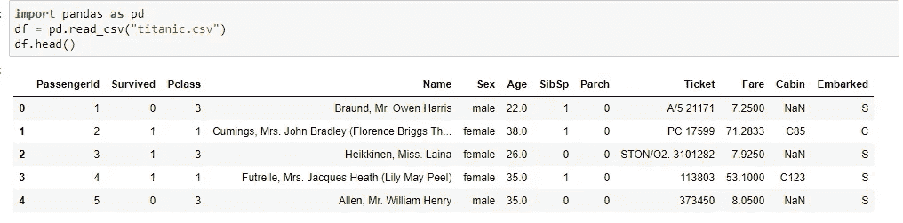
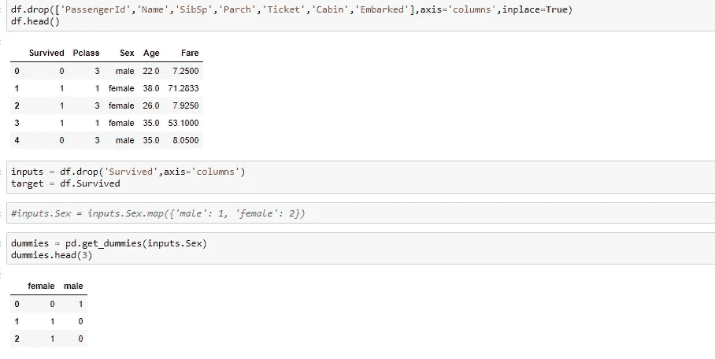
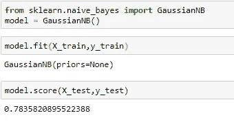

# 用 Python 实现朴素贝叶斯算法

> 原文：<https://medium.com/analytics-vidhya/na%C3%AFve-bayes-algorithm-with-python-7b3aef57fb59?source=collection_archive---------7----------------------->

本文包括五个部分:

1.  什么是朴素贝叶斯算法？
2.  朴素贝叶斯算法的应用
3.  朴素贝叶斯的优点
4.  朴素贝叶斯的缺点
5.  朴素贝叶斯与 **python( *与代码* )**

# 什么是朴素贝叶斯算法？

朴素贝叶斯算法是流行的**分类**机器学习算法之一，包含在**监督学习**中。这有助于根据条件概率值计算对数据进行分类。这种算法在自然语言处理、实时预测、多类预测、推荐系统、文本分类和情感分析用例中非常流行。对于大数据集，该算法可扩展且易于实现。

托马斯·贝叶斯

该算法基于**贝叶斯定理。**贝叶斯定理帮助我们在已知先验知识的情况下，找到假设的概率。

> 让我们看看贝叶斯定理的等式，

贝叶斯定理

朴素贝叶斯是一种简单但惊人强大的预测建模算法。朴素贝叶斯分类器计算每个因素的概率。然后它选择概率最高的结果。

# 朴素贝叶斯算法的应用

**1。实时预测:**朴素贝叶斯算法速度快，并且随时准备学习，因此最适合实时预测。

**2。多类预测:**可以使用朴素贝叶斯算法预测任何目标变量的多类概率。

**3** 。朴素贝叶斯最常用的文本分类是电子邮件中的垃圾邮件过滤(朴素贝叶斯广泛用于文本分类)

**4。文本分类/情感分析/垃圾邮件过滤:**由于朴素贝叶斯算法在处理多类问题时表现更好，且具有独立性规则，因此在文本分类中表现更好或成功率更高，因此被用于情感分析和垃圾邮件过滤。

**5** 。**推荐系统:**朴素贝叶斯分类器和[协同过滤](https://en.wikipedia.org/wiki/Collaborative_filtering)一起构建了一个推荐系统，它使用机器学习和数据挖掘技术来过滤看不见的信息，并预测用户是否喜欢给定的资源。

# 朴素贝叶斯的优点

*   所有特征都是独立的假设使得朴素贝叶斯算法**比复杂算法**更快。在某些情况下，速度优先于更高的精度。
*   对于少量训练数据的问题，它可以获得比其他分类器更好的结果，因为它具有较低的过拟合倾向。
*   它可以很好地处理文本分类、垃圾邮件检测等高维数据。
*   对缺失数据不太敏感，算法也比较简单，常用于文本分类；
*   朴素贝叶斯很容易解释这些结果。

# 朴素贝叶斯的缺点

*   关于特征相互独立的强有力的假设，这在实际应用中很难成立。
*   朴素贝叶斯是独立预测者的假设。在现实生活中，我们几乎不可能得到一组完全独立的预测器。
*   失去准确性的机会。
*   如果分类变量在测试数据集中具有在训练数据集中没有观察到的类别，则模型将分配 0(零)概率，并且将无法进行预测。这就是通常所说的**零频率**。为了解决这个问题，我们可以使用平滑技术。最简单的平滑技术之一叫做**拉普拉斯估计**。

# 使用 Python 的朴素贝叶斯

 [## abhijeetap/Naive _ Bayes _ Algorithm _ With _ Python

### permalink dissolve GitHub 是超过 5000 万开发人员的家园，他们一起工作来托管和审查代码，管理…

github.com](https://github.com/Abhijeetap/Naive_Bayes_Algorithm_With_Python/blob/master/Naive%20Bayes%20Algorithm.ipynb) 

输入数据

inputs.drop(['Sex '，' male']，axis='columns '，inplace=True)
inputs.head(3)

投入。年龄=投入。Age.fillna(输入。
age . mean())inputs . head()

导入朴素贝叶斯并输出

感谢您的阅读。如果您有任何反馈，请告诉我。

# 我关于机器学习算法的其他帖子

 [## 用 Python 实现随机森林算法

### 在本文中，我们将探索著名的监督机器学习算法“随机…

medium.com](/analytics-vidhya/random-forest-algorithm-with-python-7ccfbe9bcb47)  [## 什么是支持向量机(SVM)

### 本文包括三个部分:

medium.com](/analytics-vidhya/what-is-the-support-vector-machine-svm-dc89207c011)  [## 基于 Python 的 k 近邻算法(KNN)

### 本文包括六个部分:

medium.com](/@abhi.pujara97/k-nearest-neighbors-algorithm-knn-with-python-e570f6bb8aed) 

**快乐学习！！！**

**快乐编码:)**

别忘了拍手拍手拍手…

