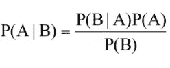
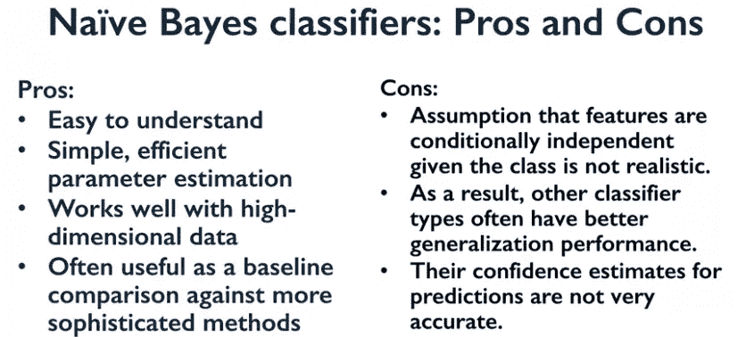

# 绝对初学者的朴素贝叶斯分类器

> 原文：<https://medium.com/analytics-vidhya/na%C3%AFve-bayes-classifiers-fafde4f0a411?source=collection_archive---------21----------------------->

> 这是一篇朴素贝叶斯 sklearn 分类器的初学者文章，具有最小的数学复杂度。

朴素贝叶斯分类器是一类基于贝叶斯定理的分类器，与线性模型非常相似。然而，他们在训练中往往更快。这种效率的代价是朴素贝叶斯模型通常提供的泛化性能比线性分类器(如 LogisticRegression 和 LinearSVC)稍差。

朴素贝叶斯模型如此高效的原因是，它们通过单独查看每个要素来学习参数，并从每个要素中收集简单的每类统计数据。

> 它被称为“天真”，因为它假设所有的特性都是相互独立的。

# 贝叶斯定理

贝叶斯定理是以条件概率为基础的，条件概率陈述了在另一个事件“B”已经发生的情况下，事件“A”发生的可能性。数学上，贝叶斯定理可以表示为以下等式:

贝叶斯定理概率方程

在哪里，

*   P(A|B)是事件“A”(标签)发生的概率，假设事件“B”(特征)已经发生
*   P(B|A)是事件“B”(特征)发生的概率，假设事件“A”(标签)已经发生
*   P(A)是事件“A”发生的概率，不考虑其他事件
*   P(B)是事件“B”发生的概率，与其他事件无关

# 三种朴素贝叶斯

有三种类型朴素贝叶斯:

1.  **高斯** - >模型假设数据遵循正态分布，我们所有的特征都是连续的。
2.  **伯努利** - >它假设我们所有的特征都是二进制的，因此它们只取两个值:0 和 1。
3.  **多项式** - >它假设数据有离散值，比如评分在 1 到 5 之间。

# 密码

从 sklearn.naive_bayes 导入高斯

X_train，X_test，y_train，y_test = train_test_split(X_C2，y_C2，随机状态=0)

nbclf = GaussianNB()。拟合(X_train，y_train)

predict = nbclf.predict(X_test)