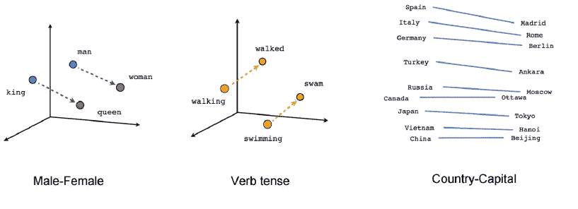
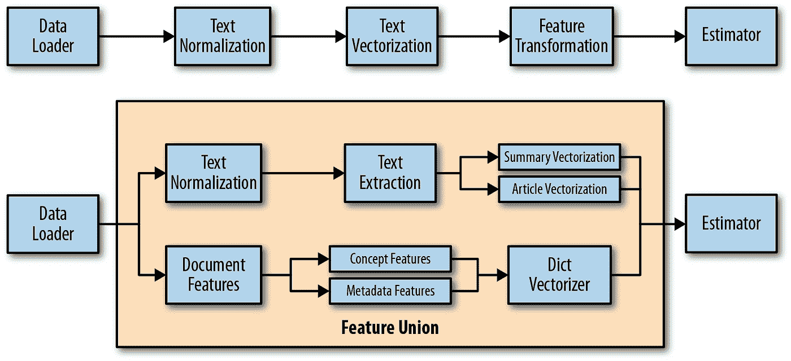
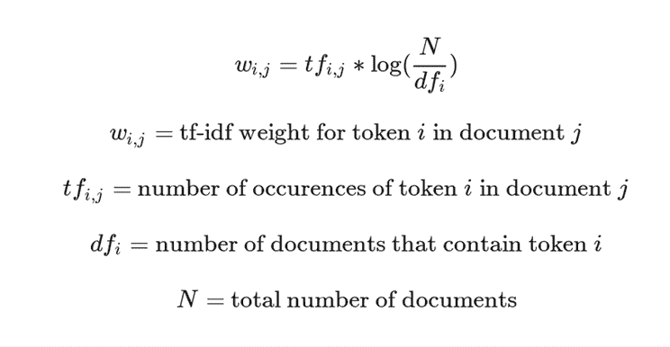
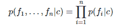
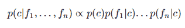
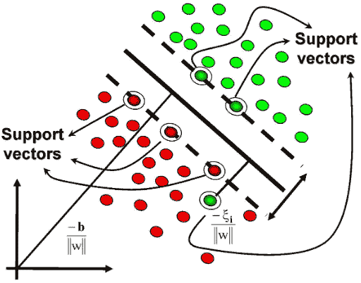
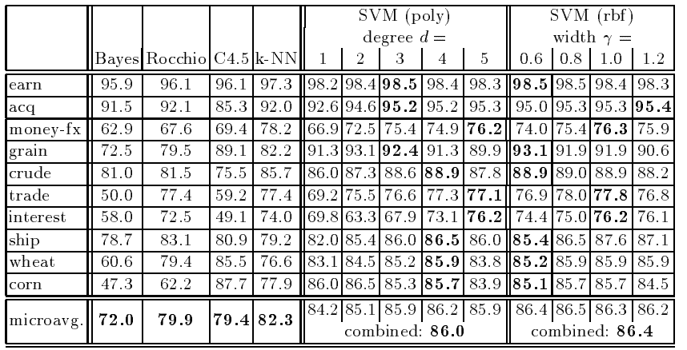

# 朴素贝叶斯和 SVM 在文本分类中的比较

> 原文：<https://medium.com/analytics-vidhya/na%C3%AFve-bayes-vs-svm-for-text-classification-c63478229c33?source=collection_archive---------5----------------------->

# 介绍

在本文中，我将重点介绍支持向量机的各个方面，它不同于用于文本分类的朴素贝叶斯方法。

但是首先要做的是！

# 什么是文本分类？

> 使用一些自动化技术(例如机器学习)将文本分类成预定义的类别被称为文本分类。一个例子包括-将电子邮件分类为垃圾邮件或火腿，将推文分类为不同的极性，如积极、消极、厌恶、愤怒、恐惧、快乐等。像朴素贝叶斯、SVM 甚至神经网络这样的分类算法都可以用于上述过程。

首先，过去是你办公室的秘书根据上下文来区分重要的信件和会议的优先顺序，现在是机器秘书为你区分垃圾邮件。唯一的缺点是你不能带这个秘书去吃饭。

任何人。

让我们继续，

# 应用上述机器学习算法所需的流水线:

机器学习模型需要一些预处理步骤，因为它不理解或学习原始文本数据。相反，下面的方法用于将文本转换成数字:(aka word2vec)

最简单的常用方法是:

***一袋文字的方法(简单地说):***

*   首先需要使用标记化创建标记，即将字符串或文档转换为标记(更小的块)，这是为 NLP 准备文本的第一步，可以使用 nltk.tokenize 导入 word_tokenize
*   词汇化/词干化:将单词缩短到它们的词根
*   删除停用词:删除标点符号，或根据上下文没有太多意义的多余符号
*   小写也有帮助
*   对所有的令牌进行计数(这被称为词频)
*   一个单词出现得越频繁，它就可能越重要
    是一种确定文本中重要单词的好方法

注意:每个用例都有不同的管道，上面提到的只是基本的预处理。

在某些情况下，为了理解语言，保留数据的原始文本是很重要的。

**但是有另一种方法克服了单词袋的问题(其中只考虑术语频率),即 TF-IDF:代表术语频率-逆文档频率**:

TF-IDF 有什么重要性？

TF- IDF 背后的想法是，每个语料库可能都有不仅仅是停用词的共享词，这些词就像停用词一样，需要删除或降低重要性，例如在一篇关于天文学的文章中，单词“Sky”可能经常出现，但它并不重要。

这确保了这些常用词不会显示为关键字，并保持特定于文档的常用词的权重较高。与此同时，一些罕见的词，如猫文章中的“狮虎”也将被删除。

TF-IDF 公式:

第一，如果项不经常出现，权重将会很低，因为 tf 变量将会很低。然而，如果对数值接近于零，则权重也将较低，这意味着内部方程较低。

这意味着，如果该术语出现在大多数或所有文档中，并且当我们将频率除以文档总数时，它将接近 1，这将导致对数值接近 0。因此，在许多或所有文档中出现的单词将具有很低的权重，但相反，如果单词很少出现，则权重会很高。

为此，我们可以使用 gensim.model.tfidfmodel 导入 tfidfmodel

好了，现在让我们回到我们的模型选择:

**朴素贝叶斯:**

观察特征 f1 和 f2 的概率

独立性假设后的后验概率

顾名思义，朴素贝叶斯必须执行一些朴素的分类操作，深入到朴素贝叶斯的数学中，它假设在后验概率中，只要有证据，每个元素都是相互独立的。好吧，对于大部分语料库很小的文本来说，这个方法出奇地有效。(如推文或引用)

但是，作为一种恩惠的东西，却是对算法的诅咒，因为在大多数情况下，这种假设都没有意义。这种容易的代价是它不能学习特征之间的交互，因为上面做的类条件独立性假设在大多数现实世界的应用中很少是真实的。导致精确度的损失。

例如:朴素贝叶斯测试用例无法了解的是，尽管你喜欢猫，但你讨厌可能与“老虎”或“狮子”有关联的大型猫

现在我们来谈谈房间里的大象！

**支持向量机:**

支持向量机被认为是有史以来最好的开箱即用模型之一。因为 SVM 没有采用概率方法，而是致力于问题的几何解释。由于模型独立于维度(学习能力独立于特征空间的维度)，所以作为高维问题的文本正好符合其核心。

此外，由于文本分类的预处理步骤，语料库现在包含非常少的不相关特征，并且好的分类器还会考虑术语之间的交互，以理解“密集”概念，这是朴素贝叶斯由于其假设而失败的，但是由于 SVM 具有插入包括线性核的多个核的能力，因此可以容易地对这样的预测器进行处理，并且分离出独立术语以达到最大距离。(这里试着联系一下猫的例子)。

让我们回到之前在预处理步骤中创建的文档术语矩阵，并理解它的重要性。给定文档中唯一单词的数量只占语料库中唯一单词总数的很小一部分(零多于一)…所以文档向量是稀疏的。SVM 在稀疏的例子中繁荣。

接下来，上图显示了与线性核相比，即使有很多特征，使用 RBF 核也不会影响性能，这对于推断大多数文本分类问题可以通过线性核来解决是有意义的。(但并不适用于所有情况)

继续在网上进行一些探索，我遇到了一个非常足智多谋的指南，基于它我能够写出这篇文章:

让我与你分享康奈尔大学计算机科学系进行的一项实验的结果。在那里他们使用了一些传统的方法(包括朴素贝叶斯)并与 SVM 进行了比较。

根据在路透社语料库上所做的实验。精度/召回盈亏平衡点被用作性能的度量，并且应用微平均来获得总体二进制分类任务的单个性能值。你可以从这里获得更多关于实验的信息:[http://www . cs . Cornell . edu/people/TJ/publications/joachims _ 98a . pdf](http://www.cs.cornell.edu/people/tj/publications/joachims_98a.pdf)

**所以现在结论:**

哪种算法更适合文本分类，没有唯一的答案，也永远不会有，因为这都归结于用例，例如在远程医疗中，从数据语料库的其余部分中有效地对药物进行分类是很重要的。根据剂量，我们可以预测患者的病情是轻微还是严重。因此，使用 SVM 将是一个安全的赌注，因为它不容易发生灾难性故障，并且该算法能够与语料库中的其他元素相关联，这些元素有助于理解 NLP 中的密集特征，从而导致情感分析或机器翻译，但是在朴素贝叶斯的情况下，结果不够一致。虽然它更像是一种通用算法，当我们想要对具有相对少量输入特征的小型数据语料库进行分类时，它可以有效且廉价地工作，但是您并不期望输入有意义地相关。如果一种算法不能捕捉不同单词之间的相关性及其强度，那么你怎么能指望它学习“词序”呢？此外，删除停用词并执行 TD-IDF 会增加 NB 的痛苦，因为它会带走大量原始文本。还有其他形式的朴素贝叶斯需要超参数调整，从而产生更好的结果。

**参考文献:**

*   [**https://en.wikipedia.org/wiki/Support_vector_machine**](https://en.wikipedia.org/wiki/Support_vector_machine)
*   **[http://www . cs . Cornell . edu/people/TJ/publications/joachims _ 98a . pdf](http://www.cs.cornell.edu/people/tj/publications/joachims_98a.pdf)**
*   **[**https://www.csie.ntu.edu.tw/~cjlin/papers/guide/guide.pdf**](https://www.csie.ntu.edu.tw/~cjlin/papers/guide/guide.pdf)**

**注意:这篇文章是一个初学者为初学者写的。如果您发现任何矛盾的陈述或错误的陈述，请评论。会很乐意纠正。**