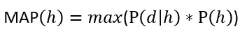
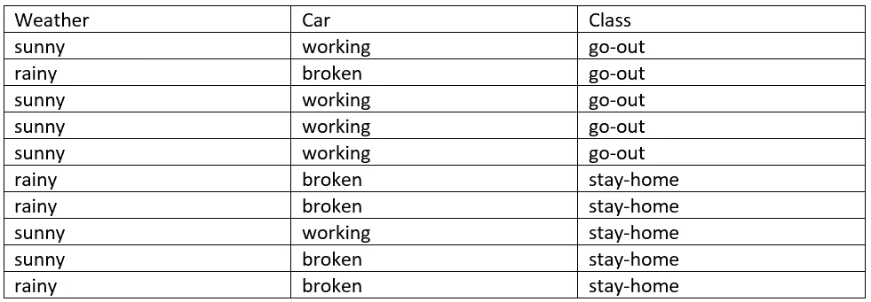
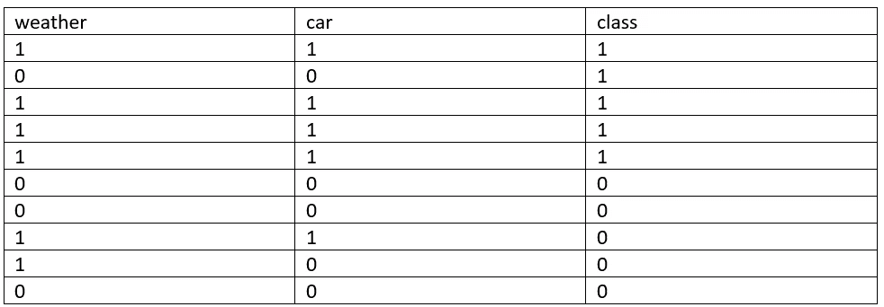
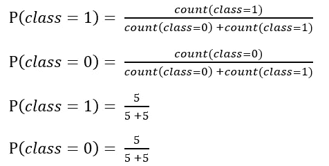
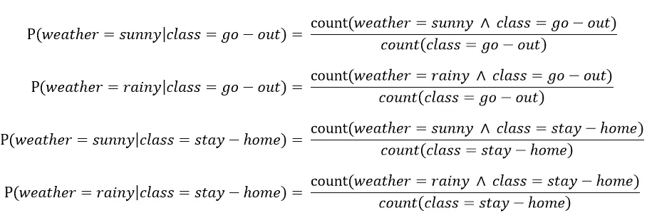
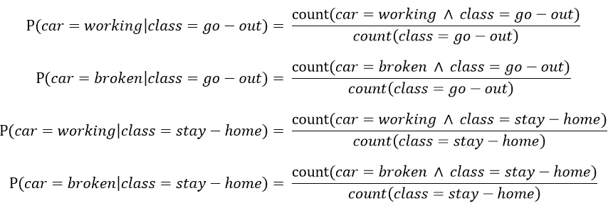
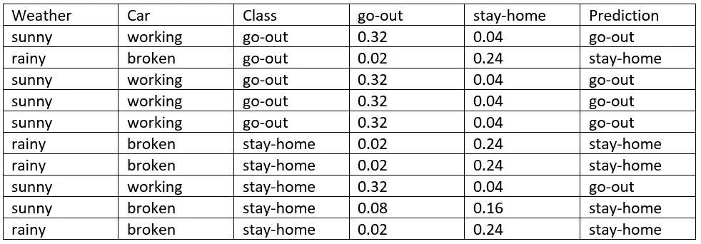
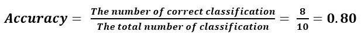

# 朴素贝叶斯算法讲解

> 原文：<https://medium.com/analytics-vidhya/naive-bayes-algorithm-explained-52608add8c17?source=collection_archive---------12----------------------->

**贝叶斯定理:**

在机器学习中，我们通常对给定数据(d)选择最佳假设(h)感兴趣。在分类问题中，我们的假设(h)可能是分配给新数据实例(d)的类别。给定我们所拥有的可以用作我们关于问题的先验知识的数据，选择最可能的假设的最简单方法之一。贝叶斯定理提供了一种方法，在已知先验知识的情况下，我们可以计算假设的概率。贝叶斯定理表述为:

其中:

**P(h|d)** 是假设 h 给定数据 d 的概率，这叫做后验概率。

**P(d|h)** 是假设假设 h 为真，数据 d 的概率。

**P(h)** 是假设 h 为真的概率(不考虑数据)。这叫做 h 的先验概率。

**P(d)** 是数据的概率(不考虑假设)。

在计算了许多 different 假设的后验概率后，可以选择概率最高的假设。这是最大可能假设，可以正式称为最大后验概率(**图**)假设。这可以写成:

**朴素贝叶斯分类器**

朴素贝叶斯是一种用于二元(两类)和多类分类问题的分类算法。当使用二进制或分类输入值进行描述时，该技术最容易理解。它被称为朴素贝叶斯或白痴贝叶斯，因为每个假设的概率计算都被简化了，使它们的计算易于处理。不是试图计算每个属性值 P(d1，d2，d3|h)的值，而是假设它们在给定目标值的情况下是有条件独立的，并计算为 P(d1|h)×P(d2|h)等等。这是一个非常强有力的假设，但在真实数据中却不太可能，也就是说，属性不会相互影响。然而，该方法在该假设不成立的数据上表现得令人惊讶地好。

资料组

我们可以把这个转换成数字。每个输入只有两个值，输出类变量有两个值。我们可以将每个变量转换为二进制，如下所示:

天气:晴天= 1，雨天= 0

汽车:工作= 1，损坏= 0

类别:外出= 1，留在家中= 0

来自关于数据集的二进制数据集

对于朴素贝叶斯模型，需要从数据集计算两种类型的量:

类别概率。

条件概率。

**计算类别概率:**

数据集是 0 类和 1 类的两类概率。

类别概率

0 类和 1 类的概率是 0.5。

计算条件概率:

条件概率是给定每个类值时每个输入值的概率。数据集的条件概率可以计算如下:

天气输入变量的条件概率

P( **天气=晴朗|班级=外出** ) = 0.8

P( **天气=下雨|班级=外出** ) = 0.2

P( **天气=晴|班=宅** ) = 0.4

P( **天气=下雨|班级=待在家里** ) = 0.6

同样的，

汽车输入变量的条件概率

P( **车=工作|班=外出** ) = 0.8

P( **车=坏|班=出门** ) = 0.2

P( **汽车=工作|阶级=居家** ) = 0.2

P( **车=坏|班=宅** ) = 0.8

**用朴素贝叶斯进行预测**

让我们从数据集中取出第一条记录，并使用我们学习的模型来预测它属于哪个类。

**一审:天气=晴朗，汽车=工作**

出门 = P(天气= **晴**|班= **出门**×)

P(车= **工作**|班= **出门** ) × P(班= **出门**)

= 0.8 × 0.8 × 0.5

= 0.32

不出门的，不出门的

P(车= **工作**|班= **留守** ) × P(班= **留守**)

= 0.4 × 0.2 × 0.5

= 0.04

我们可以看到概率 0.32 > 0.04，因此对于这种情况，预测是**输出**，这是正确分类。

准确(性)

我们使用朴素贝叶斯算法获得了 80%的准确率。