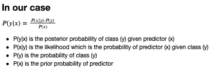
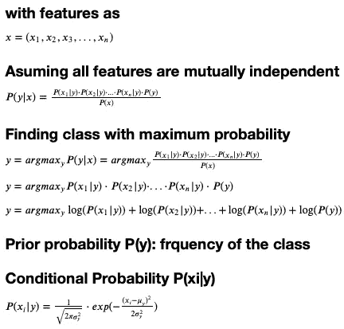
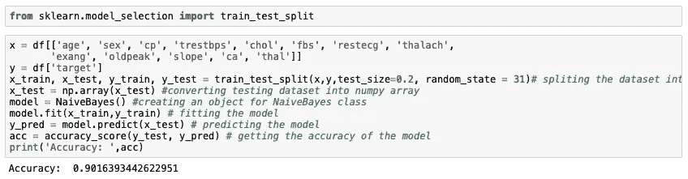

# 从零开始的朴素贝叶斯算法

> 原文：<https://medium.com/analytics-vidhya/naive-bayes-algorithm-from-scratch-c59d262a042?source=collection_archive---------10----------------------->

朴素贝叶斯是一种简单的机器学习算法。它是一个求知欲很强的学习者，这意味着它花在训练上的时间比测试要多。该算法基于所有特征相互独立的假设。

它基于贝叶斯定理。它很容易建造。它是模型的集合，而不仅仅是单一的模型。

贝叶斯定理

这里，

P(A|B):给定预测类的后验概率

P(A):类的先验概率

P(B|A):似然性，它是给定类的预测值的概率

P(B):预测值的先验概率

朴素贝叶斯定理有三种类型，高斯型、多项式型和贝努里型。我们将从头开始发展高斯朴素贝叶斯定理。在高斯朴素贝叶斯中，特征的分布被假定为高斯或正态分布。当绘制时，它给出了关于特征值的平均值对称的钟形曲线。

# 从理论开始

我们情况下的贝叶斯定理

假设这些特征相互独立后，我们可以直接将这些概率与先验概率相乘。为了获得数据点的类别，我们找到目标类别的最大概率，即，如果类别 A 具有最高概率，则该数据点属于类别 A。由于忽略了先验概率，因此只有分子是重要的。由于条件概率给我们的值非常小，因此我们将 log 应用于整个分子，使其成为条件概率的总和。这些条件概率是使用高斯函数找到的。

# Python 代码

## 导入基本库以便执行

我们有进口的熊猫和 numpy 图书馆。

## 定义朴素贝叶斯类

这里我们看到了类中的四个函数。在拟合函数中，我们得到样本、特征的数量，以及唯一类的数量。我们还为均值和方差声明了 numpy 数组，所有的类和特征的大小都为零。我们还创建了一个 numpy 数组来表示类别大小的先验概率。此后，找出并存储均值、方差和先验概率。

预测函数用于预测数据点的类别。_predict 函数用于将概率最大的类返回给 predict 函数。正如我们看到的，在 _predict 函数中，prior 从 _pdf 函数中获取其值，该函数使用高斯函数来获取条件概率，该值通过取其自然对数来存储。Class_conditional 存储先验概率的总和。Posterior 存储 class_conditional 和 prior 的和，稍后追加到 posteriors 列表中。我们将具有最大概率的类的最大值返回给先验函数。

我们将把这种朴素贝叶斯算法应用于 UCI 心脏病数据集。在应用朴素贝叶斯之前，我们需要预处理这个数据集。我们用 StandardScaler 来做这个。我们将从头开始学习如何编写 StandardScaler。

# 标准缩放器

我们看到 StandardScaler 类包含三个函数 fit、transform 和 fit_transform。在拟合函数中，我们找到了数据集中每一列的平均值和标准方差。Transform 函数用于规范化列，使用以下函数转换列中的每个值。(X —平均值)/标准方差。Fit_transform 用于在一个步骤中同时拟合和转换数据集。

## 读取数据集并应用数据集

我们已经阅读了 UCI 数据集，我们看到该数据集包括 303 个数据点和 13 个特征以及 1 列目标类。目标栏表示患者是否患有心脏病(用 1 表示)或没有心脏病(用 0 表示)。该数据集包含 164 名心脏病患者和 139 名非心脏病患者的数据。年龄和性别属性用于识别目的，其他 11 个属性包含重要的临床记录。[【1】](http://sersc.org/journals/index.php/IJAST/article/view/29849)

这里使用的数据集包含以下特征

*   年龄:患者的年龄
*   性别:性别(1 =男性，0 =女性)
*   cp:胸痛类型(0 =典型心绞痛，1 =非典型心绞痛，2 =非心绞痛性疼痛，3 =无症状)
*   trestbps:静息血压(入院时单位为毫米汞柱)
*   chol:血清胆固醇，单位为毫克/分升
*   fbs:空腹血糖> 120 mg/dl (0 =假，1 =真)
*   静息心电图:静息心电图结果(0 =正常，1 =有 ST-T 波
*   异常，2 =根据 Estes 标准显示可能或明确的左心室肥大)
*   thalach:达到最低心率
*   例:运动诱发的心绞痛(0 =是，1 =否)
*   oldpeak:相对于静息运动诱发的 ST 段压低
*   斜率:运动 ST 段峰值的斜率(1=上坡，2 =平缓，3 =下坡)
*   ca:透视着色的主要血管数(0-3)
*   thal: 3 =正常；6 =修复缺陷；7 =可逆缺陷

然后，我们对除目标列之外的所有列应用标准缩放器。我们还打印数据集的平均值和标准值。

## 分割数据集并应用朴素贝叶斯

我们引入了 train_test_split 模块，将数据集分成训练和测试两部分。然后，我们将除目标列之外的所有列分配给变量 x，将目标分配给变量 y。然后，我们使用 train_test_split 将数据集拆分为定型数据和测试数据，其中测试数据占数据集的 20%。然后，我们应用朴素贝叶斯算法，然后使用训练数据集拟合模型。测试数据集用于使用预测函数测试数据集。在使用 predict 函数之前，我们需要将 x_test 数据帧转换成一个 numpy 数组。然后，我们使用如下所示的 accuracy_score 函数计算模型的准确性。

准确性是正确预测的百分比。

我们还设计了一个图形用户界面，它接受用户的输入，并预测用户是否患有心脏病。

GUI 预测用户有心脏病

GUI 预测用户没有心脏病

# 朴素贝叶斯算法的应用

*   当数据集很小且有许多参数时
*   当分类器需要易于解释时

# 朴素贝叶斯算法的优势

*   该方法易于实现，处理速度快
*   当假设成立时，它会给出更好的结果
*   在分类数据上表现良好

# 朴素贝叶斯算法的缺点

*   如果目标类不在训练数据中，那么它就不能预测该类。
*   在现实世界的数据集中，要素通常是相互依赖的。

# 标准缩放器

标准标量通过从数据中减去数据集的平均值，然后缩放至单位方差来标准化数据。单位方差是指所有值除以标准偏差。StandardAero 产生的分布均值等于 0，标准差等于 1，大部分值介于-1 和 1 之间。作为参考，假设数据集具有以下值([[1，-1，2]，[2，0，0]，[0，1，-1]])。应用标准标量后，值被转换为([[0，1.22，-1.22]，[- 1.22，0，1.22]，[1.33，-0.26，-1.06]])。我们可以清楚地看到，经过处理的数据集的平均值为(0，0，0)，标准差为(0.99，0.99，0.99)(几乎等于 1)。尽管标准标量有助于简化数据处理，但它也有自己的局限性。在存在异常值的情况下，它不能很好地执行。异常值在计算经验平均值和标准偏差时会产生影响，这会缩小数据值的范围。由于每个要素上的异常值具有不同的大小，因此每个要素上的变换数据的分布非常不同。因此，在异常值存在的情况下，标准标量不能保证平衡的特征尺度。

# 结论

*   我们从头开始创建了朴素贝叶斯、StandardScaler 和 Accuracy_score 函数。
*   将它们应用于 UCI 心脏病数据集，取得了 90.16%的准确率
*   我们还为模型创建了一个 GUI，并预测了用户输入数据的类别。

# 参考

[1] Swapnil Singh，Ameyaa Biwalkar。(2020).机器学习算法对心脏病数据集的影响。*《国际先进科技杂志》*， *29* (3)，11786 -。检索自[http://sersc . org/journals/index . PHP/ij astt/article/view/29849](http://sersc.org/journals/index.php/IJAST/article/view/29849)

## 访问[https://github.com/The-Swapster/NaiveBayes](https://github.com/The-Swapster/NaiveBayes)获取 GUI 代码