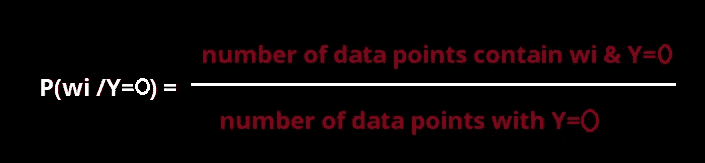
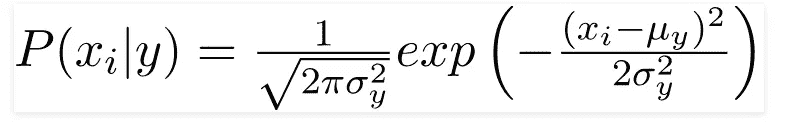
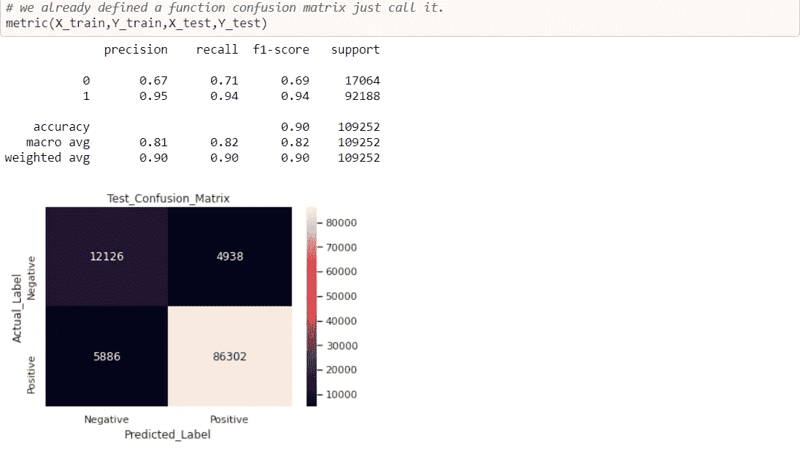
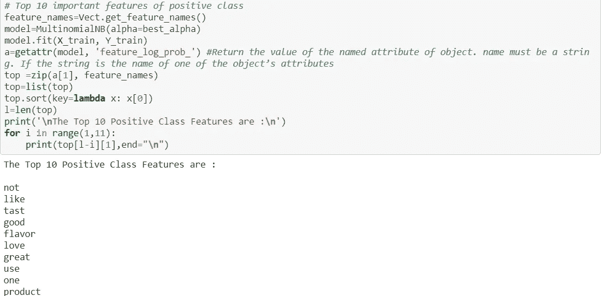

# 朴素贝叶斯算法与亚马逊食品评论分析

> 原文：<https://medium.com/analytics-vidhya/naive-bayes-algorithm-with-amazon-food-reviews-analysis-66bb59b66e62?source=collection_archive---------11----------------------->


朴素贝叶斯是一种基于贝叶斯定理的统计分类技术。它是最简单的监督学习算法之一。朴素贝叶斯分类器是一种快速、准确和可靠的算法。朴素贝叶斯分类器在大数据集上具有很高的准确率和速度。

为了理解朴素贝叶斯算法，我们首先要知道一些概率的基本概念。

# 内容

1.  可能性

2.条件概率

3.独立事件

4.互斥事件

5.贝叶斯定理

6.朴素贝叶斯算法

7.使用朴素贝叶斯的玩具示例

8.文本数据上的朴素贝叶斯算法

9.拉普拉斯(或)加法平滑

10.对数概率和数值稳定性

11.偏差-方差权衡

12.特征重要性和可解释性

13.朴素贝叶斯分类器的类型

14.朴素贝叶斯算法的最佳和最坏情况

15.朴素贝叶斯算法与亚马逊食品评论分析

## **概率**

“概率”(或“机会”)是指**某事发生的可能性有多大**。事件 A 和 B 的**并**的概率用 **P** 表示(A∨**B**)。事件 A 和事件 B 的**交集**的概率用 **P** 表示(A ∩ **B** )。

两个事件的**并**的一般**概率**加法规则为**P**(A∩**B【T25)=**P**(A)+**P**(**B**)**P**(A∩**B****


实验(或)试验:预期会有结果的事情。

**事件(或)结果:**实验结果。

## **条件概率**

条件概率是一个事件发生的概率，假定其他事件已经发生。

这个概率被写成 *P(A|B)* ，给定 B 的概率的符号为*。在事件 *A* 和 *B* 独立*的情况下(其中事件 *A* 对事件 *B* 的概率没有影响)，事件 *B* 给定事件 *A* 的条件概率就是事件 A 的概率，即 *P(A)* 。**

**

## ***独立事件***

*一个事件的发生不影响另一个事件的发生。这两个事件发生的概率是相互独立的。如果 A 和 B 被认为是独立的事件，*

**

*例子:你掷一枚硬币，它三次都是正面朝上……下一次掷硬币也是正面朝上的可能性有多大？*

*这种可能性很小(或 0.5%)，就像任何一次抛硬币一样**。***

*它过去的所作所为不会影响现在的折腾！*

## ***互斥事件***

*这些是不可能同时发生的事情。如果 A 和 B 被认为是互斥事件，*

**

*比如你不能同时向后和向前跑。事件“向前运行”和“向后运行”是互斥的。扔硬币也可以给你这种类型的事件。你不能抛硬币同时得到正面和反面。所以“抛正面”和“抛反面”是互斥的。*

## *贝叶斯定理*

*这是概率论中基本的、简单的、优美的、有用的定理。贝叶斯定理在处理条件概率时很有用(就像我们在这里所做的)，因为它为我们提供了一种逆转它们的方法。*

**

*利用贝叶斯定理，我们可以求出 **A** 发生的概率，假设 **B** 已经发生。这里， **B** 是证据， **A** 是假设。*

*要了解更多贝叶斯定理，请访问 [**这里**](https://en.wikipedia.org/wiki/Bayes%27_theorem#:~:text=In%20probability%20theory%20and%20statistics,be%20related%20to%20the%20event.) 。*

## *朴素贝叶斯算法*

*朴素贝叶斯是最简单快速的分类算法，适用于大数据块。朴素贝叶斯分类器被成功地用于各种应用中，例如垃圾邮件过滤、文本分类、情感分析和推荐系统。它利用贝叶斯概率定理对未知类别进行预测。*

*在统计学中，**朴素贝叶斯分类器**是基于应用[贝叶斯定理](https://en.wikipedia.org/wiki/Bayes%27_theorem)和特征间强[独立性](https://en.wikipedia.org/wiki/Statistical_independence)假设的一族简单的“概率分类器”。它们是最简单的贝叶斯网络模型。*

***证明:**抽象地说，朴素贝叶斯是一个[条件概率](https://en.wikipedia.org/wiki/Conditional_probability)模型:给定一个要分类的问题实例，用一个向量 *x* ={ *x* 1，…， *xn* }，表示一些 *n* 特征(自变量)，它给这个实例赋值概率。*

*给定一个数据点 x={ *x* 1，…， *xn* }的 *n* 个特征，朴素贝叶斯根据概率预测 x 的类别 *Ck**

**p*(*CK*∣*x*)=*p*(*CK*∣*x*1、…、 *xn* ) for *k* =1、…、 *K**

*使用贝叶斯定理，这可以分解为*

**

*简单地说，使用[贝叶斯概率](https://en.wikipedia.org/wiki/Bayesian_probability)术语，上述等式可以写成*

**

*实际上，人们只对该分数的分子感兴趣，因为分母不依赖于特征 x 的值，所以分母实际上是常数。*

*利用[链式法则](https://brilliant.org/wiki/chain-rule-probability/)，分子中的因子 p(x1，…，xn|Ck) *p* ( *x* 1，…， *xn* ∣ *Ck* )可以进一步分解为*

**

*计算每个概率是复杂的，为了计算，我们需要足够的数据量。*

*所以，在这一点上，**【幼稚】**条件独立性假设就发挥了作用。*

**

*具体来说，朴素贝叶斯模型假设特征***【Xi】*有条件地独立于特征 x *j*** ，因为 I≦*j*已经给了类 *Ck。*利用前面的分解，这可以表述为:*

**

*因此，*

**

*朴素贝叶斯给出了属于类别 *Ck* 的数据点 *x* 的概率，该概率与 *n* +1 个因子的简单乘积成比例(类别先验 *p* ( *Ck* )加上 n 个条件特征概率*p*(*∣*Xi*CK*)。*

*由于分类涉及将类别 *Ck* 分配给值*p*(*CK*∣*x)*最大的数据点，因此该比例乘积可用于确定最可能的类别分配。具体来说，*

**

*因此，通过计算*p*(*CK*)(*Xi*∣*CK*)对于 *k* =1、…、 *K* ，并赋值，可以找到数据点最可能的类赋值*

*到目前为止的讨论已经导出了独立特征模型，即朴素贝叶斯概率模型。朴素贝叶斯分类器将该模型与决策规则相结合。一个常见的规则是选择最有可能的假设。这就是所谓的**最大后验概率**或**图*图*决策规则。***

*在数学符号中，这被定义为:*

**

*其中 *C* ^是给定其特征 *x* 1，…， *xn* 的估计类。*

*关于**朴素贝叶斯**证明的更多细节，请访问 [**这里。**](https://en.wikipedia.org/wiki/Naive_Bayes_classifier)*

## *使用朴素贝叶斯的玩具示例*

*让我们建立一个分类器，根据预测来预测我是否应该打网球。描述预测需要四个属性；即前景、温度、湿度和是否有风。此外，这四个属性的值是定性的(也称为分类的)。它们采用如下所示的值。*

*展望晴天、阴天、雨天气温炎热、温和、凉爽 T21 湿度高、正常风、弱、强*

*类标签是变量 Play，取值为 yes 或 no。*

*播放∈[是，否]*

*我们在下面读到了 14 天来收集的训练数据。*

**

***学习阶段***

*在学习阶段，我们从训练数据中计算可能性(概率)表。它们是:*

*P(Outlook=o|ClassPlay=b)，其中 o∈[晴天，阴天，雨天]和 b∈[是，否]*

*P(Temperature=t|ClassPlay=b)，其中 t∈[热，温和，凉爽]和 b∈[是，否]，*

*p(湿度=h|ClassPlay=b)，其中 h∈[高，正常]和 b∈[是，否]，*

*P(Wind=w|ClassPlay=b)，其中 w∈[弱，强]和 b∈[是，否]。*

**

*我们还计算 P(class play =是)和 P(class play =否)。*

**

***分类阶段***

*比方说，我们得到一个天气条件的新实例，x'=(前景=晴朗，温度=凉爽，湿度=高，风=强)，它必须被分类(例如，我们是否要在 x '指定的条件下打网球)。*

*使用[映射](http://en.wikipedia.org/wiki/Maximum_a_posteriori_estimation)规则，我们计算后验概率。这很容易通过查找我们在学习阶段建立的表格来完成。*

*P(class play = Yes | x ')=[P(Sunny | class play = Yes)×P(Cool | class play = Yes)×*

*P(High | class play = Yes)×P(Strong | class play = Yes)]×*

*P(ClassPlay=Yes)*

*= 2/9 × 3/9 × 3/9 × 3/9 × 9/14 = 0.0053*

*P(class play = No | x ')=[P(Sunny | class play = No)×P(Cool | class play = No)×1*

*P(High | class play = No)×P(Strong | class play = No)]×*

*P(ClassPlay=No)*

*= 3/5 × 1/5 × 4/5 × 3/5 × 5/14 = 0.0205*

*由于 P(ClassPlay=Yes|x ')小于 P(ClassPlay=No|x ')，我们将新实例 x '归类为“No”。*

## ***文本数据上的朴素贝叶斯算法***

*朴素贝叶斯是一种常用于文本分类的学习算法*。**

*使用朴素贝叶斯文本分类器可能是一个非常好的主意，尤其是在没有太多训练数据和计算资源稀缺的情况下。*

*考虑对于给定的文本我们要分类**垃圾邮件/火腿分类，**因此，有两类:“垃圾邮件”和“火腿”(即非垃圾邮件)。*

**

*我们想为文本做一些预处理技术，如删除停用词，词干，特征化，如单词包取决于给定的文本。*

*其中 **x** 是包含来自垃圾邮件的单词的特征向量:*

********

*类似地，对于类 Y=0，计算由下式给出:*

**

*计算每类概率的公式如下*

****

*计算可能性的公式如下*

****

*因此，最后我们需要找到具有最大概率的类 Y。使用下面的函数，我们可以得到类，给定预测。*

**

## *拉普拉斯(或)加法平滑*

*如果查询点包含*一个*新的观察*，*在计算概率*时在训练数据中还没有看到，那么引入这个是为了解决零概率*的问题。***

***最大似然法的问题是，如果我们从给定的数据集中没有看到包含单词 and 的训练文档，并且在类中进行了分类，那会怎么样？***

******

***如果一个新单词来自测试阶段，它不存在于训练阶段，那么 p(w2/y=1)和 p(w2/y=0)变为零。***

***不管其他证据如何，零概率不能被排除！如果我们忽略这些词，对模型不好。为了解决这个问题，我们使用拉普拉斯平滑。***

***让我们看看如何使用拉普拉斯平滑，考虑下图 P(w'/y=1)=0，P(Y=1)为 n1。***

******

***如果该单词不存在于语料库中，则不是将零分配给 P(w’/y = 1 ),***

******

***假设 **α=1** ，k 是 w’可以取的不同值的数量，n1 是 p(Y=1)。我们经常使用 **α=1** ，所以我们称之为拉普拉斯加一平滑。如果α < 1，那么它是 Lidstone 平滑。***

***“α”不应过高或过低，应通过考虑“偏差-方差”权衡来适当选择“α”不应干扰分配给未知数据/新观测值的统一概率。***

*****广义加性平滑:**拉普拉斯加一平滑现在给看不见的词分配了太多的概率。更常见的是用α代替 1。***

******

***如果分子和分母都是小数字，那么随着α增加，α的影响在可能性概率上是高的。因此，如果α增加，那么似然概率大约为。***

*****寻找最佳‘α’*****

***使用肘图，尝试使用网格搜索交叉验证绘制“性能指标”v/s“α”(或)。这里α是超参数。***

## ***对数概率和数值稳定性***

***当 m(词汇量的大小)变得很大时，问题就出现了。请注意，因为当您开始将它们相乘时，每个 P(wi | Cj)项都在 0 和 1 之间，所以总乘积开始接近零。***

***每增加一个新特征都会加剧这种情况:有 1000 个特征，将 1000 个概率相乘很快就会得到一个极其微小的数字，这个数字通常不能用双精度或长双精度表示。***

***对于这种情况，常见的解决方法是将概率表示为对数概率。也就是说，我们不用 P(wi | Cj)和 P(Cj)，而是用 ln P(wi | Cj)和 ln P(Cj) (ln 表示自然对数，虽然任何对数都可以)。这种转换是可行的(而且相当优雅),原因有很多。***

*   ***因为概率总是介于 0 和 1 之间，所以对数概率总是介于∞和 0 之间(比 0 和 1 之间的数字范围更广)。***
*   ***如果一个***
*   *****Finally, the math works out nicely because the logarithm of a product is the sum of the logarithms (that is, ln(a · b) = ln a + ln b).*****

**********

*****Note that because we are taking the logarithm of numbers between 0 and 1, the log probabilities will always be negative. This is OK. Just do your calculations and comparisons as you would normally, a “more negative” number (meaning a negative number greater in absolute value) corresponds to a smaller probability than a “less negative” number, so you don’t have to switch the comparison.*****

## *******偏差-方差权衡*******

********情况 1 :*** 如果α = 0(高方差)*****

****在这种情况下，即使对于非常罕见的单词，我们也与一些概率相关联，但是另一方面，对于在训练阶段从未见过的另一个单词，可能性概率突然变为零。****

****这意味着我们的模型过度拟合。因为对于一个非常小的训练数据的变化，在模型中存在非常大的差异。****

****所以这是一个高方差的例子。****

*******情况二:*** 如果α是一个很大的值(偏高)****

****正如我们之前看到的，如果α，那么，似然概率≈。****

****如果我们有平衡的数据，那么每个类的先验也变得相同。那么在这种情况下，每一类的后验概率大致相同。****

****这是一个高偏差的例子，因为后验概率是相同的。****

****当α太小时，会导致过度拟合。****

****当α太大时，它导致欠拟合，因为可能性概率变成均匀分布，我们可以说新的数据点属于哪一类。****

## ******功能重要性和可解释性******

****对于朴素贝叶斯算法功能，重要性是从似然概率中获得的。根据可能性概率按降序排序，最上面的词是特征更重要。****

****在朴素贝叶斯中，从模型本身直接获得特征重要性。****

****朴素贝叶斯算法很容易给出**的可解释性。******

## ****当我们有不平衡数据、异常值、缺失值等等时，朴素贝叶斯是如何工作的？****

## ****不平衡数据****

****朴素贝叶斯也受到不平衡数据的影响。解决方案是执行上采样(或)下采样。****

****当我们有不平衡数据时，α对少数阶级的影响更大，而α对多数阶级的影响较小。****

## ******离群值******

*   ****在训练时，如果一个单词(Wi)出现的次数少，我们就忽略它们。****
*   ****测试时间时，拉普拉斯平滑会处理异常值。****

## ******缺失值******

****如果我们有文本数据，没有丢失值的情况，如果我们有分类特征，我们假设也有一个数字特征类别，我们使用模型插补技术。****

## ****多类分类****

****朴素贝叶斯很容易进行多类分类，因为只需通过**最大后验概率**或 ***映射*决策规则来比较这些类并挑选该值最大的类 *Ck* 。******

## ****相似(或)距离矩阵****

****朴素贝叶斯不能处理距离矩阵，因为它不是基于距离，而是一种基于概率的技术。****

## ****大维度****

****对于大维数 d 来说，这是非常舒适的，当 d 是大概率的大乘积时，我们使用对数概率来避免数值稳定性和下溢问题。****

# ****朴素贝叶斯分类器的类型****

## ****伯努利朴素贝叶斯****

****该分类器适用于离散数据。伯努利 NB 是为二进制(或)布尔特征而设计的。单词的二进制包(BOW)就是伯努利 NB 的一个简单例子。它通常在我们有伯努利分布时使用。我们用来预测类变量的参数只取值 yes 或 no，例如，一个单词是否出现在文本中。****

## ****多项式朴素贝叶斯****

****这主要用于文档分类问题，即文档是否属于体育、政治、技术等类别。分类器使用的特征(或)预测器是文档中出现的单词的频率。****

## ****高斯朴素贝叶斯****

****当我们处理连续数据(或数值特征)时，高斯朴素贝叶斯是有用的。当数据具有高斯分布时使用。当预测值取连续值且不是离散值时，我们假设这些值是从高斯分布中采样的。****

********

****高斯分布(正态分布)****

****由于数据集中值的显示方式发生了变化，条件概率的公式也发生了变化，****

********

****虽然这些方法在形式上有所不同，但背后的核心思想是相同的假设特征满足某种分布，估计分布的参数，然后得到概率密度函数。****

## ****朴素贝叶斯算法的最佳和最坏情况****

1.  ****朴素贝叶斯假设特征是条件独立的。理论上，如果假设不成立，则 NB 的性能会下降。但是研究表明，即使有一些特征依赖，朴素贝叶斯也能给出最好的结果。****
2.  ****然而，对这一假设的强烈违反将导致朴素贝叶斯的较差性能。****
3.  ****朴素贝叶斯是文本分类问题的基准(或)基线算法。****
4.  ****当数据包含分类特征时，朴素贝叶斯被广泛使用，但在数字特征中不太使用。****
5.  ****朴素贝叶斯具有很好的可解释性和特征重要性。****
6.  ****朴素贝叶斯非常节省时间和空间，可用于低延迟应用。****
7.  ****朴素贝叶斯很容易过拟合，所以拉普拉斯平滑必须经常进行。****

## ****朴素贝叶斯算法与亚马逊食品评论分析****

****让我们对来自 Kaggle 的真实数据集 Amazon Fine Food Review 分析应用朴素贝叶斯算法。****

******首先我们想知道什么是亚马逊美食点评分析？******

****这个数据集由亚马逊的美食评论组成。这些数据跨越了 10 多年的时间，包括截至 2012 年 10 月的所有约 500，000 篇评论。评论包括产品和用户信息、评级和明文评论。我们也有来自所有其他亚马逊类别的评论。****

****亚马逊评论通常是最公开可见的消费品评论。作为一个经常使用亚马逊的用户，我对检查亚马逊评论的大型数据库的结构和可视化这些信息很感兴趣，以便成为一个更聪明的消费者和评论者。****

****【https://www.kaggle.com/snap/amazon-fine-food-reviews】来源:[](https://www.kaggle.com/snap/amazon-fine-food-reviews)****

******亚马逊美食点评数据集由来自亚马逊的美食点评组成。******

******评论数:568，454
用户数:256，059
产品数:74，258
时间跨度:1999 年 10 月—2012 年 10 月
数据中的属性/列数:10******

******属性信息:******

1.  ******身份******
2.  ******产品 Id —产品的唯一标识符******
3.  ******UserId —用户的唯一标识符******
4.  ******ProfileName******
5.  ******帮助度分子—认为评论有帮助的用户数量******
6.  ******帮助度分母——表示他们认为评论是否有帮助的用户数量******
7.  ******分数—介于 1 和 5 之间的等级******
8.  ******时间—审核的时间戳******
9.  ******摘要—审核的简要摘要******
10.  ******文本—审阅的文本******

## ******目标******

******给出一个评价，确定该评价是正面的(评分为 4 或 5)还是负面的(评分为 1 或 2)。******

## ******数据预处理******

******数据预处理是一种用于将原始数据转换成干净数据集的技术。换句话说，无论何时从不同来源收集数据，都是以原始格式收集的，这对于分析是不可行的。******

************

******要了解亚马逊美食评论数据集和特征的完整概述，请访问我以前的博客链接 [**这里**](/analytics-vidhya/amazon-fine-food-reviews-featurization-with-natural-language-processing-a386b0317f56) **。********

******将数据分配给从属特征 X，将目标分配给 y。******

```
******X=data['preprocessed_reviews'].values
 Y=data['Score'].values******
```

## ******列车测试分离******

******当机器学习算法用于对不用于训练模型的数据进行预测时，训练-测试分离过程用于估计机器学习算法的性能。******

******如果你有**一个数据集**，你需要首先使用 Sklearn `train_test_split`函数分割它。******

************

## ******使用单词包的文本特征化******

************

## ******超参数调谐******

******我们要选择最好的阿尔法来获得更好的模型性能，通过使用网格搜索交叉验证来选择最好的阿尔法。******

******我们已经定义了一个 Grid_search 函数，当我们调用它时，它会给出结果。******

************

## ******使用测试数据进行测试******

******在我们使用网格搜索 CV 找到最佳 alpha 后，我们希望使用测试数据检查性能，在本案例研究中，我们使用 AUC 作为性能度量。******

******我们已经定义了一个测试数据的函数，当我们调用它时，它会给出结果。******

************

## ******性能指标******

******绩效指标用于衡量企业的行为、活动和绩效。这应该是在一个范围内测量所需数据的数据形式，允许形成支持总体业务目标实现的基础。******

******要了解机器学习中使用的性能指标的详细信息，请访问我以前的博客链接[**这里**](/@sachin.s1dn/performance-metrics-for-machine-learning-models-80d7666b432e) **。********

******我们已经为性能指标定义了一个函数，当我们调用它时，它会给出结果。******

************

## ********特征重要性********

******对于两个特征集和使用“feature_log_prob_”参数值，正面类的前 10 个特征和负面类的前 10 个特征。******

************

******类似地，我们也构建了一个具有 TFIDF 特征的朴素贝叶斯模型。要了解完整代码请访问我的 [**GitHub**](https://github.com/Sachin-D-N/Amazon_Food_Reviews/blob/main/03.NaiveBayes_Amazon_Food_reviews/NaiveBayes_Amazon_Food_reviews_Assignment.ipynb) 链接。******

## ******结论******

******朴素贝叶斯算法主要用于情感分析、垃圾邮件过滤、推荐系统等。它们快速且易于实现，但是它们最大的缺点是要求预测器是独立的。在大多数实际情况下，预测器是相关的，这阻碍了分类器的性能。******

******为了在表格中写入震荡，我们使用了 python 库 PrettyTable。******

******pretty table 是一个简单的 Python 库，旨在使在视觉上吸引人的表格中表示表格数据变得快速而简单。******

************

## ******观察******

1.  ******与词袋特征表示相比，TFIDF 特征在测试数据上获得了最高的 95.51%的 AUC 分数。******
2.  ******通过超参数调整，两者都将 0.1 作为最佳 alpha。******
3.  ******这两个模型对于 Amazon_food_reviews 分类都相当有效。******

******要了解亚马逊美食评论数据集和特征的完整概述，请访问我以前的博客链接 [**这里**](/analytics-vidhya/amazon-fine-food-reviews-featurization-with-natural-language-processing-a386b0317f56) **。********

******要了解机器学习中使用的性能指标的详细信息，请访问我以前的博客链接[**这里**](/@sachin.s1dn/performance-metrics-for-machine-learning-models-80d7666b432e) **。********

******要了解完整代码，请访问我的 [**GitHub**](https://github.com/Sachin-D-N/Amazon_Food_Reviews/blob/main/03.NaiveBayes_Amazon_Food_reviews/NaiveBayes_Amazon_Food_reviews_Assignment.ipynb) 链接。******

# ******参考******

*   ******应用人工智能******
*   ******维基百科(一个基于 wiki 技术的多语言的百科全书协作计划ˌ也是一部用不同语言写成的网络百科全书ˌ 其目标及宗旨是为全人类提供自由的百科全书)ˌ开放性的百科全书******
*   ******Coursera******
*   ******数据营******

******感谢您的阅读和耐心。我希望你喜欢这个帖子，如果我的帖子有错误，请告诉我。如果你发现帖子中有什么错误或者有什么要补充的，就在评论中讨论吧…******

******快乐学习！！******