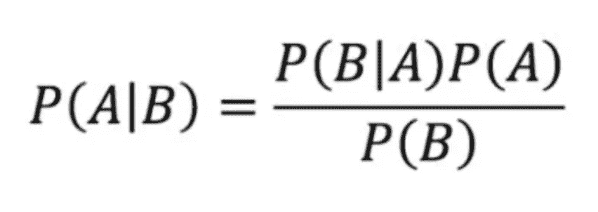

# 通过爱莉安娜·格兰德的歌词解释朴素贝叶斯

> 原文：<https://medium.com/analytics-vidhya/naive-bayes-as-explained-through-ariana-grande-lyrics-aca6688d4170?source=collection_archive---------20----------------------->

# **什么是朴素贝叶斯？**

朴素贝叶斯是一种机器学习分类器。更具体地说，它是一个概率分类器，这意味着它预测某个特征属于每个类的概率，而不只是告诉你它最有可能属于哪个类。

它最常用于文本分类和检测垃圾邮件。你可以感谢朴素贝叶斯让这么多垃圾邮件远离了你的收件箱。

在对朴素贝叶斯的简短介绍中，我们将使用 Spotify 十年来最受欢迎的女艺术家爱莉安娜·格兰德的歌曲和歌词。

# **它是如何工作的？**

## **试衣**:

为了拟合数据，我们将从使用贝叶斯规则开始。a 是类，B 是特性。这将计算要素 B 属于 a 类的概率。我们将对每个类和每个要素执行此操作。

天真的部分在哪里发挥作用？为了简化计算，朴素贝叶斯假设特征对于给定的类是条件独立的。这种假设，类似于爱莉安娜·格兰德在她的歌曲《皮特·戴维森》(pete davidson)中对她当时与同名歌曲的关系所做的假设，很可能是不真实的——因此，天真的部分就来自于此。

计算每个要素的每个类的单个概率取决于数据的分布。例如，在文本分类中，分布很可能是多项式分布。在其他情况下，例如当要素连续时，分布可能是高斯分布。

我们需要什么超参数？通过查看[朴素贝叶斯科学工具包学习文档](https://scikit-learn.org/stable/modules/naive_bayes.html)，看起来我们只需要输入我们的训练特征和标签来适应数据。

## **培训**:

> “我看到了，我喜欢，我想要，我得到了”

*-阿里安娜·格兰德在《七戒》中迅速得到她想要的东西*

与其他分类方法相比，朴素贝叶斯需要很少的训练。在预测之前，我们需要做的就是找到每个特征的概率分布的参数。这可以很快完成——几乎和爱莉安娜·格兰德看到某样东西和她拥有它之间的时间一样快。正因为如此，朴素贝叶斯能够很好地处理大量数据点和高维数据点。

## **预测**:

> 一个教我爱，一个教我耐心，一个教我痛苦

*-阿里安娜·格兰德在《谢谢你，下一个》中对前男友教给她的东西进行分类*

朴素贝叶斯不是像上面引用的 Grande 那样只给你一个分类，而是使用给定数据点落入某个类别的概率来产生分类。概率最高的类最终成为要素的分类，但每个分类的概率都是朴素贝叶斯输出的一部分。

# 那是朴素贝叶斯！

> "如果你不知道，现在你知道了，宝贝"

*-阿里安娜·格兰德，《没有眼泪可以哭了》*