# 朴素贝叶斯分类器

> 原文：<https://medium.com/analytics-vidhya/naive-bayes-classification-aa381b00dd45?source=collection_archive---------4----------------------->

朴素贝叶斯是一种监督学习分类。它是基于贝叶斯定理的概率分类器。naive 这个名称源于这样一个事实，即分类器假设特征对是独立的，因此大大简化了模型参数的训练要求。这简化了计算，这就是为什么它被称为“天真”。这也被称为类独立性。

**条件概率:**
假设桶中有七个球，其中三个是蓝色的，四个是黑色的，那么从桶中取出蓝色球的概率是 3/7，同样地，取出黑色球的概率是 4/7。

让我们应用这个条件，有两个桶。桶 A 和桶 B
在桶 A 中有两个黑球和两个蓝球，类似地，在桶 B 中有两个黑球和一个蓝球。

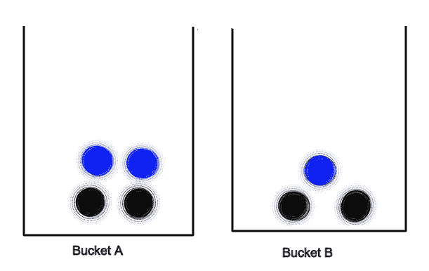

在桶 B 中得到蓝球的概率是
P(蓝/桶 B)=1/3
或
P(蓝/桶 B)=P(蓝和桶 B)/P(桶 B)
P(蓝/桶 B)=(1/7)/(3/7)
P(蓝/桶 B)=1/3

上面的公式是基于 c 在 x 上的概率

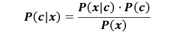

假设 h 的概率的后验训练数据 D 遵循基本定理如下

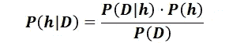

其中，
P(h):假设的独立概率也叫先验概率
P(D):给定数据集的独立概率
P(D | h):D 给定 h 的条件概率也叫似然概率
P(h | D):h 给定 D 的条件概率也叫后验概率

> **用 scikit 学习 Python 中的朴素贝叶斯算法**

在本例中，我们使用分班数据集来找出有多少学生被安排和有多少学生没有被安排。

我一般用 google colab 写个代码。这是一个令人惊叹的平台。为此，首先你必须将谷歌硬盘安装到谷歌实验室。这样我们就可以从 google dive 获取数据集。我们使用以下代码

```
from google.colab import drive
drive.mount('/content/drive')
```

导入所需的库

```
import pandas as pd
import numpy as np
import seaborn as sns
import matplotlib.pyplot as plt
from sklearn.model_selection import train_test_split
from sklearn.metrics import classification_report, confusion_matrix, accuracy_score
```

之后，我必须读取 csv 文件(dateset) [单击此处](https://drive.google.com/file/d/1IlowRit-W0R2sDsEYvyeZNO_7y3kG3gc/view?usp=sharing)下载数据集。

```
df = pd.read_csv('/content/drive/My Drive/placement.csv')
df
```

**数据预处理:**
首先我们要检查数据集是否包含空值，如果包含，我们要对其进行一些转换。

```
df.isnull().sum()
```

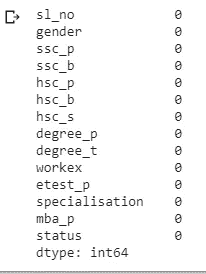

shape 方法返回表示数据帧维数的元组。

```
df.shape
```

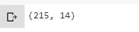

info()用于打印数据帧的简明摘要

```
df.info()
```

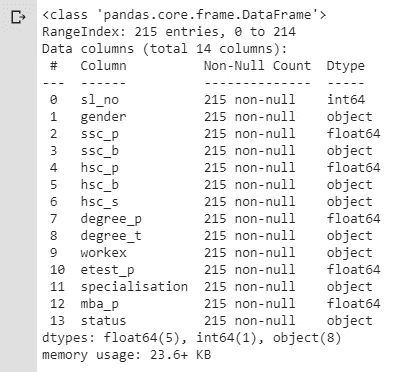

**数据可视化:**
它的目的是通过图形化的表示，清晰高效地传达数据&。

```
sns.countplot(x=’status’,data=df)
```

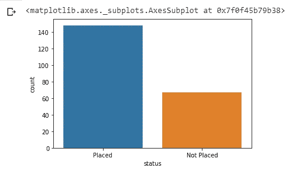

```
sns.countplot(x=’status’,hue=’gender’,data = df)
```

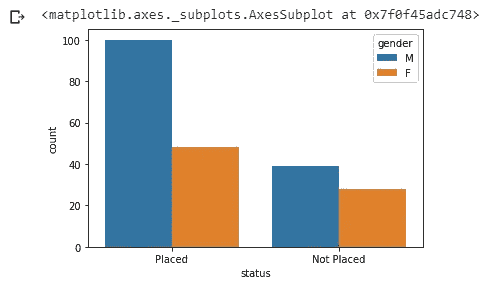

将分类变量转换为指示变量

```
workexp= pd.get_dummies(df[‘workex’])
workexp
```

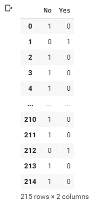

将数据连接到原始数据集中。

```
df=pd.concat([df,workexp],axis=1)
df
```

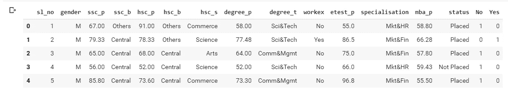

```
df.drop([‘sl_no’,’gender’,’ssc_b’,’hsc_b’,’hsc_s’,’degree_t’,’workex’,’specialisation’],axis=1,inplace=True)
df
```

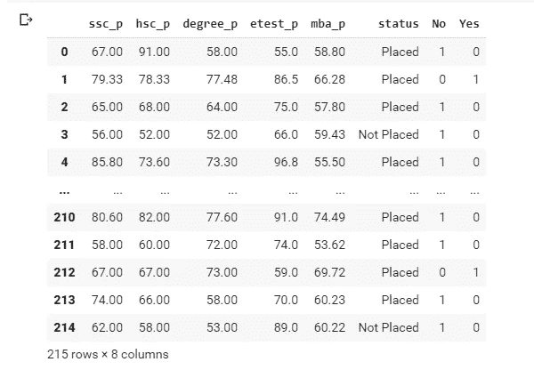

培训和测试数据

```
X=df.drop(‘status’,axis=1)
y=df[‘status’]
X_train,X_test,y_train,y_test=train_test_split(X,y,test_size=0.3,random_state=1)
```

应用朴素贝叶斯定理

```
from sklearn.naive_bayes import GaussianNB
model = GaussianNB()
model.fit(X_train,y_train)
```

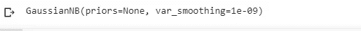

比较实际状态和预测状态

```
y_pred=model.predict(X_test)
df1=pd.DataFrame({‘Actual Status’:y_test,’Predicted Status’:y_pred})
df1
```

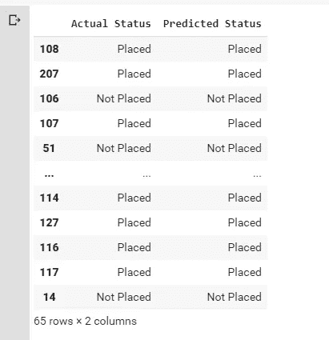

分类报告:
分类报告用于衡量分类算法的预测质量。

```
print(classification_report(y_test, y_pred))
```

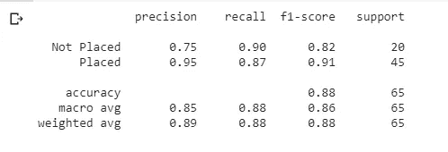

混淆矩阵:
混淆矩阵是对一个分类问题的预测结果的总结。正确和错误预测的数量用计数值汇总，并按每个类别细分。

```
print(confusion_matrix(y_test,y_pred))
```


准确度分数:

```
print(accuracy_score(y_test,y_pred)*100)
```


本文研究了机器学习算法，即朴素贝叶斯分类。
此外，我们使用 scikit learn 实现了朴素贝叶斯分类。

我希望你们理解如何实现朴素贝叶斯分类。请在评论区告诉我你的疑问和建议。

快乐学习！！