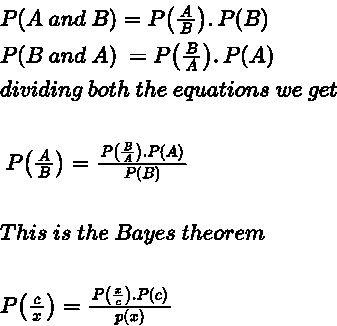

# 朴素贝叶斯分类算法

> 原文：<https://medium.com/analytics-vidhya/naive-bayes-classification-algorithm-d3ed9cfd1fea?source=collection_archive---------18----------------------->

朴素贝叶斯是一种分类算法，它基于从概率世界中得出的贝叶斯定理的原理。

图片来源[https://science Prog . com/simple-explain-of-naive-Bayes-classifier/](https://scienceprog.com/simple-explanation-of-naive-bayes-classifier/)

让我们浏览一下概率的基础知识，以数学的方式理解分类器。

**独立事件**:如果一个事件发生的概率不影响其他事件发生的概率，则称两个事件是独立的。设 A 和 B 是两个独立的事件

**互斥事件**:如果一个事件的发生排除了另一个事件的发生，或者两个事件不能同时发生，则称这两个事件互斥。假设 A 和 B 是两个事件

更进一步，我们可以推导出贝叶斯法则

> 朴素贝叶斯的工作原理是贝叶斯定理，其中

P(c/x)是后验概率，即给定数据 x 时 c 类的概率。P(x/c)是给定 c 类时数据 x 的概率。P(c)称为数据中该类的先验概率。

**高斯朴素贝叶斯**

计算分类变量的概率很容易，但是如果变量本质上是连续的呢？高斯 NB 假设变量遵循正态分布，这使其在计算概率时具有优势。

下面举个例子用 python 实现这个算法。

导入所有必需的库

我们将使用威斯康星乳腺癌数据集。

数据集由 31 个特征和作为目标变量的“诊断”组成。这是一个二元分类问题，有两种可能的预测 B-开始，M-恶性类型的癌细胞。没有丢失数据。

因为 Id 在分析中没有用，所以最好删除这个列

这两个类别在特性中的分布几乎相等。

由于数据具有距离测量值，不同的要素可能具有不同的单位，这可能会影响模型的性能。最好用 mean=0 和 std=1 来归一化数据。我将使用 scipy.stats 库的 zscore 函数。

我们可以说，数据已经标准化，所有列的平均值几乎等于 0，标准值等于 1。

让我们通过以 70/30 的比例分割训练和测试数据来拟合高斯朴素贝叶斯。

该模型的混淆矩阵可用于检查其性能

我们可以看到只有 10 个输入被错误预测。

这个模型的精确度和召回率都很高，这决定了一个好的 f1 分数。准确度为 0.94 表示分类器在测试数据集上具有良好的预测得分。

综上所述，朴素贝叶斯是一种简单的分类算法，其根源来自贝叶斯概率规则，尽管有其缺点，但性能相当好。

# **附加信息**

**拉普拉斯校正**

有时，特定变量的概率趋向于 0，这会导致零除，从而使整个计算失败。为了避免这种情况，变量在分子中增加一个小值 1，因此概率不会变为零。这种校正称为拉普拉斯校正。

设 A 是值为 0 或 1 的二元变量，类别 k 的拉普拉斯估计如下所示

拉普拉斯估计

关于拉普拉斯估计的更多参考请参考[这个](http://www.cs.toronto.edu/~bonner/courses/2007s/csc411/lectures/03bayes.zemel.pdf)

在 [Linkedin](https://www.linkedin.com/in/ashwin-srivatsa-3ab953122/) 上联系我。

查看我的 GitHub，了解更多关于 ML 和数据科学的内容

 [## Ashwin1234 -概述

github.com](https://github.com/Ashwin1234)