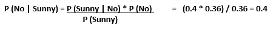

# 朴素贝叶斯分类器

> 原文：<https://medium.com/analytics-vidhya/naive-bayes-classifier-3c02f542c911?source=collection_archive---------16----------------------->

# **简介**

朴素贝叶斯算法是一种基于贝叶斯定理的机器学习监督分类技术，具有特征之间的强独立性假设。它主要用于二值或多值分类，并且仍然是文本分类和文档分类的最佳方法之一。

例如，如果一种蔬菜是红色的，圆形的，直径为 2 英寸，它就可以被认为是番茄。朴素贝叶斯分类器认为这些特征中的每一个都独立地影响该蔬菜是番茄的概率，而不考虑颜色、圆度和直径特征之间的任何可能的相关性。

**贝叶斯定理**

贝叶斯定理提供了一种从 P (A)，P (B)和 P (A|B)计算后验概率 P (A|B)的方法。看下面的等式:

P (A|B) = **后验概率**，给定观察到的证据，我们的假设有多大概率【这个值我们要计算，不可直接计算】

P (B | A) = **可能性**。给出的证据表明我们的假设是正确的可能性有多大？

P (A) = **先验概率。在观察证据之前，我们的假设有多大的可能性？**

P (B) = **边际概率**。在所有可能的假设下，新证据的可能性有多大？

现在我们来看看如何将上述公式应用到现实生活的分类问题中。

**问题陈述:**根据给定的天气状况，如晴天、雨天或阴天，对人是否会打高尔夫球进行分类。

**数据集:**

上述数据集频率表如下:

对于上述频率表，可能性表如下:

现在当我们把所有计算出的值代入贝叶斯定理来计算后验概率时。

给定前景晴朗的可能性是

没有给定前景晴朗的可能性是

通过以上两个计算，我们可以观察到，当前景晴朗时，打高尔夫球的概率比不晴朗时高。

**朴素贝叶斯分类器的类型:**

**多项朴素贝叶斯:**特征向量表示通过多项分布产生某些事件的频率。该事件主要用于文档分类((如垃圾或合法、体育或政治等。)

**伯努利朴素贝叶斯**:在多元伯努利事件模型中，特征是描述输入的独立布尔(二元变量)。像多项式模型一样，该模型对于文档分类任务是流行的，其中使用二元术语出现(即，单词是否在文档中出现)特征，而不是术语频率(即，单词在文档中的频率)。

**高斯朴素贝叶斯:**在高斯朴素贝叶斯中，假设与每个特征相关联的连续值按照高斯分布分布。高斯分布也称为正态分布。绘制时，它给出一条钟形曲线，该曲线关于特征值的平均值对称，如下所示:

由于数据集中值的显示方式发生了变化，条件概率的公式也发生了变化，

# 机器学习示例

1.  **加载数据:**从 sklearn 库中加载 Iris 数据集。

2)数据集由来自三种鸢尾(刚毛鸢尾、海滨鸢尾和杂色鸢尾)的每一种的 50 个样本组成。测量每个样品的四个特征:萼片和花瓣的长度和宽度，以厘米为单位。

3) **将数据分成训练和测试集**:存储特征矩阵(输入)和响应向量(输出)。将数据集分成训练集和测试集。

4) **训练模型，求测试集的精度:**在训练集上训练模型。对于这个导入，从 sklearn 库获得 GaussianNB。使用拟合方法训练模型。并用测试输入特征(X_test)预测测试集。比较预测输出和实际输出，以获得精确度。

**使用朴素贝叶斯分类器的重要注意事项**

*   如果连续特征不具有正态分布，我们应该使用变换或不同的方法将其转换为正态分布。
*   移除相关特征，因为高度相关的特征在模型中被投票两次，这可能导致过度夸大重要性。
*   你可能会想到应用一些*分类器组合技术，如*集合、打包和提升，但这些方法不会有帮助。实际上，“集合、提升、打包”不会有帮助，因为它们的目的是减少方差。朴素贝叶斯没有要最小化的方差。

**朴素贝叶斯分类器的挑战**

独立特征的假设。实际上，模型几乎不可能得到一组完全独立的预测值。

如果没有特定类别的训练元组，这将导致零后验概率。在这种情况下，模型无法进行预测。这个问题被称为零概率/频率问题。

**总结**

朴素贝叶斯是最简单的算法。尽管机器学习在过去几年取得了重大进展，但它已经证明了自己的价值。从情感分析、文本分类到推荐引擎等，许多模型都使用了这种算法。

参考:[https://en.wikipedia.org/wiki/Naive_Bayes_classifier](https://en.wikipedia.org/wiki/Naive_Bayes_classifier)

github:[https://github . com/diva karpm/data science/tree/master/Naive % 20 Bayes % 20 classifier](https://github.com/DivakarPM/DataScience/tree/master/Naive%20Bayes%20classifier)