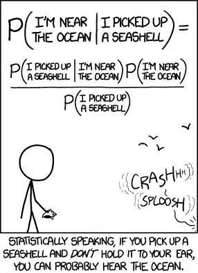
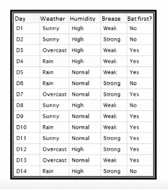
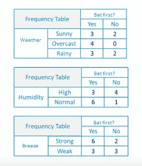
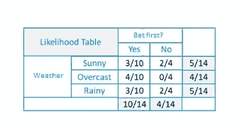
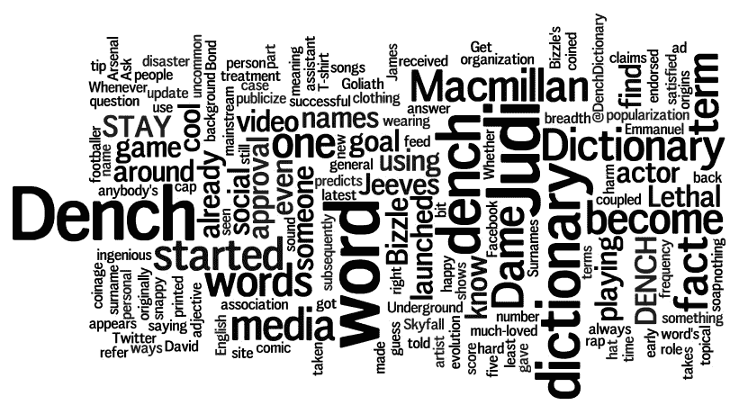

# 使用 Python 的朴素贝叶斯分类器

> 原文：<https://medium.com/analytics-vidhya/naive-bayes-classifier-a-beginners-guide-to-master-the-fastest-and-simplest-classification-d6a368e6b737?source=collection_archive---------3----------------------->

## 掌握最快最简单分类算法的初学者指南

板球投掷，来源:espncricinfo.com

我应该先击球还是先投球？嗯...球场似乎潮湿，天气晴朗，让我们先打保龄球。你可能经历过这种情况，你根据一些独立的条件做决定。让我们选择板球的例子，假设你已经赢得了掷硬币，现在作为队长，你必须决定是先投球还是先击球。你将根据天气、球场条件、湿度、微风等条件做出决定，并假设所有这些条件独立地影响我们决定是先投球还是先击球。如果球场是新鲜的，草较少，天气晴朗，湿度较小，微风缓慢，那么这肯定意味着你应该首先击球，并在板上获得更高的分数。否则，如果球场是湿的，有裂缝，天气阴沉，风很大，那么作为队长，你会去打保龄球。因此，我们做出“天真”的假设，认为所有这些条件都独立影响我们作为船长的决定。这就是人类所做的，现在让我们学习帮助机器以类似方式接近的算法。

让我们打破术语*‘朴素贝叶斯分类器’*，然后理解它。

来源:memes.ucoz.com

天真是针对我们在算法中计算概率时所做的无知假设。朴素贝叶斯也被称为*白痴*贝叶斯，因为每个假设的概率计算都被简化了，使得在真实数据中最不可能的计算变得容易。现在让我们进一步讨论数学术语。

让我们来理解“贝叶斯”术语，这是解决这个问题的最重要的概率方法。贝叶斯定理提供了一种基于似然、边际和先验概率计算后验概率的方法。我们将进一步理解所有这些术语的含义。给定我们所拥有的可以用作我们关于问题的先验知识的数据，选择最可能的假设的最简单方法之一。贝叶斯定理提供了一种方法，在已知先验知识的情况下，我们可以计算假设的概率。例如在板球的例子中，我们必须计算 P(球棒或碗|天气、球场、湿度…..)

现在对于公式，我们假设“H”代表假设,“E”代表证据或简单的预测与给定数据。

贝叶斯定理，来源:swarm-help.zendesk.com

*   **P(H|E)** 是假设 H 给定数据 E 的概率，这叫做后验概率。
*   **P(E|H)** 假设假设 H 为真，数据 E 的概率。
*   **P(H)** 是假设 H 为真的概率(不考虑数据)。这叫做 h 的先验概率。
*   **P(E)** 是数据的概率(不考虑假设)。

并且最终的术语分类器仅仅是模型的离散响应。与我们有连续反应的回归变量相比。最好的例子是情感分析，在这种分析中，我们将文本分为积极、消极或中性等不同的反应。

来源:pinterest.com

总的来说，我们天真地假设所有的预测因子都可以被独立地计算以给出最终的结果，因此我们用 Bayes 定理独立地计算每个预测因子的假设的后验概率。这一过程进一步有助于实现最终任务，即分类。这是一种监督学习算法。此外，这陈述并解释了术语“朴素贝叶斯分类器”。

# 算法背后的数学原理:

让我们回到最初的例子来理解朴素贝叶斯背后的计算。

比如说，如果板球场是湿的，首先击球的概率是多少？

> P(先击球|湿)=P(湿|先击球)*P(先击球)/P(湿)

资料组

上面我有一个天气和相应的目标变量“击球优先？”的训练数据集。现在，我们需要根据天气情况来分类玩家会选择球棒还是碗。让我们按照以下步骤来执行它。

1.  将数据集转换成频率表。

频率表

2.通过查找概率创建一个可能性表。

可能性表

类似地，计算每隔一个预测值的可能性表。

3.现在，使用朴素贝叶斯方程来计算每一类的后验概率。具有最高后验概率的类是预测的结果。

所以简单地说，如果我们把它用于天气，

> P(是|晴)= P(晴|是)* P(是)/ P(晴)
> 
> P(晴|是)= 3/10 = 0.3，P(晴)= 5/14 = 0.36，P(是)= 10/14 = 0.64
> 
> 现在 P(是|晴)= 0.33 * 0.64 / 0.36 = 0.60，概率较大。

因此，如果天气晴朗，队长很可能会选择先击球。

因此，如果我们想更多地基于天气、湿度和各种属性进行预测，那么

> P(是|天气、螺距、湿度… )=P(是|天气)*P(是|螺距)*P(湿度)……

所以只需将每个属性的后验概率相乘，就可以得到最终需要的结果。

同样，我们也可以使用朴素贝叶斯分类器进行文本分类。

来源:macmilliandictionaryblog.com

自然语言处理和单词标记化是这样做的先决条件。那么进一步的朴素贝叶斯分类器将帮助我们对文本进行分组分类。

Ex: P(莎士比亚写的|《憎恶》《绝对》《线圈》)

这就是我们要计算的，得到给定文本是莎士比亚写的可能性，因为憎恶，绝对和线圈是莎士比亚最常用的词。

# **朴素贝叶斯模型的类型:**

1.  **高斯模型**:用于正态分布数据的简单分类。
2.  **多项式模型**:多用于文本分类问题。在[伯努利试验](https://www.toppr.com/guides/maths/probability/bernoulli-trials-and-binomial-distribution/)的帮助下，我们可以找到“一个单词在给定文本中出现的频率”。
3.  **伯努利模型**:如果你的特征向量是二元的，二项式模型是有用的。仅用于两个离散变量。

# 为什么要使用朴素贝叶斯分类器？

1.  轻松快速地预测测试数据集的类别。它在多类预测中也有很好的表现
2.  有时比逻辑回归表现更好。使用这两种算法，选择精度最高的算法。
3.  更有效地处理有数百个数据点但变量很少的问题。
4.  众所周知，它可以很好地处理连续和离散数据。
5.  如果独立性假设成立，它导致最有效的分类算法。

# 在哪里使用朴素贝叶斯分类器？

来源:blog.malwarebytes.com

1.  文本分类
2.  情感分析
3.  垃圾邮件过滤
4.  将新闻分为政治、科学、技术、犯罪等类别。
5.  推荐系统

还可用于实时预测和多类预测。朴素贝叶斯分类器有着大量的实际应用。

下面是在 Scikit-learn 的帮助下用 Python 实现的一个简单的高斯朴素贝叶斯。我们已经用天气和湿度的特征来举例说明击球或保龄球的决定。我们将首先标记这些特征，训练它们，并使用训练好的模型来获得预测结果。

使用 sklearn 和 python 的朴素贝叶斯

这只是一个如何实现的例子。当您希望模型更加精确时，请使用大型数据集。

## 重要参考:

1.  [带有 Scikit-Learn 的朴素贝叶斯](https://github.com/scikit-learn/scikit-learn/blob/master/sklearn/naive_bayes.py):带有 Scikit-Learn 的内置函数高斯朴素贝叶斯的实现。
2.  [朴素贝叶斯文档](https://scikit-learn.org/stable/modules/naive_bayes.html)

现在你可以理解新闻分类的背景，也可以设计新闻分类了。加载你最喜欢的变量很少的庞大数据集，并尝试一下！朴素贝叶斯有多准确？检查一下。从现在开始，你需要的只是练习。