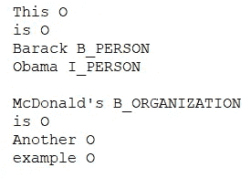
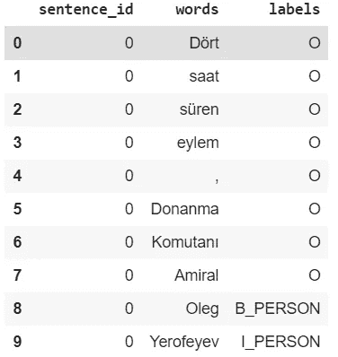
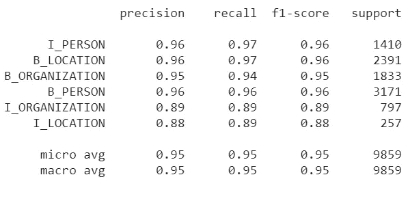

# 带 BERT 的土耳其语命名实体识别(NER)

> 原文：<https://medium.com/analytics-vidhya/named-entity-recognition-for-turkish-with-bert-f8ec04a31b0?source=collection_archive---------1----------------------->


图片鸣谢:[https://www . code motion . com/magazine/dev-hub/machine-learning-dev/Bert-how-Google-changed-NLP-and-how-to-benefit-from-this/](https://www.codemotion.com/magazine/dev-hub/machine-learning-dev/bert-how-google-changed-nlp-and-how-to-benefit-from-this/)

# 介绍

谷歌人工智能的研究人员在 2 年前发布了论文“ [BERT:用于语言理解的深度双向转换器的预训练](https://arxiv.org/abs/1810.04805)”。从那以后，它在机器学习/自然语言处理领域获得了很大的流行。BERT 是建立在最近在 NLP 世界流行的许多成功和有前途的工作之上的。包括但不限于 Seq2Seq 架构、Transformer(来自“注意是你所需要的全部”一文)、ELMO、ULM-FIT 和无监督语言建模。在 BERT 发布的时候，BERT 在各种各样的 NLP 任务上展示了最先进的性能。在本文中，我们将在土耳其命名实体识别(NER)数据集上微调预训练的土耳其 BERT 模型。我们将使用流行的 HuggingFace 预训练变形金刚库进行微调。我们还将实现一个已知的解决方案，通过构建重叠子序列来处理 BERT 最大序列长度问题。

在本文中，我假设读者已经了解了以下主题的背景信息:

1.  命名实体识别(NER)。
2.  来自变压器(BERT)的双向编码器表示。
3.  HuggingFace(变形金刚)Python 库。

# 本文的重点:

1.  利用 HuggingFace Trainer class 轻松微调 ner 任务的 BERT 模型(适用于大多数变形金刚，而不仅仅是 BERT)。
2.  处理比 BERT 的 MAX_LEN = 512 更长的序列

# 拥抱脸培训师课程:

变形金刚新的训练师职业提供了一个简单的方法来微调已知任务的变形金刚模型，比如康尔 ner。[这里的](https://huggingface.co/transformers/examples.html)是其他支持的任务。本课程将关注培训/评估循环、日志记录、模型保存等。这使得切换到其他变压器模型非常容易。为此，我们将使用另一个类 NerDataset 来处理数据的加载和标记化。

# 预处理

为了能够在 ner 任务中使用教练模型，我们将数据转换为如下所示的 CoNLL 格式:



CoNLL 文件格式

其中每行有两列“标记标签”,由空格分隔，不同的句子由空行分隔。为了做到这一点，我们首先创建一个元组列表，其中每个元组具有(句子 id，标记，标签),然后使用这些来初始化 Pandas 数据帧，其中每行表示(句子 id，标记，标签)元组。不幸的是，我使用的数据集是私有的，因此我实际上不能共享数据集。我将只指出运行这段代码所需的预期数据格式。train_docs 和 test_docs 是字符串列表。我们使用 doc.split()执行简单的空白标记化，您可以跳过这一步(第 6 行和第 11 行)。train_labels 和 test_labels 是令牌级 IOB 标签\labels 的列表。

```
print(train_docs)###OUTPUT###
["This is one sentence",
"here's another one"]print(train_labels)###OUTPUT###
[['O','O','O','O'],
['O','O','O']]
```

```
# check the first 10 rows
print(test_df.head(10))
```



我们还需要一个包含所有可能标签的列表，以及一个标签到整数的映射。

```
print(labels) ###OUTPUT###
['O', 'B_PERSON', 'I_PERSON', 'B_LOCATION', 'I_LOCATION',        'B_ORGANIZATION', 'I_ORGANIZATION']print(label_map)###OUTPUT###
{0: 'O',  1: 'B_PERSON',  2: 'I_PERSON',  3: 'B_LOCATION',  4: 'I_LOCATION',  5: 'B_ORGANIZATION',  6: 'I_ORGANIZATION'}
```

NerDataset 希望每个培训/测试/开发集都有一个. txt 文件。因此，我们的下一步是将这些 CoNLL 格式的文件创建到一个目录(“data”)中，我们将在这个目录中保存我们的培训和测试。txt 文件:

# NerDataset

我们的 trainer 对象将通过 NerDataset 对象期待训练输入。我们已经准备好了 train.txt 文件，所以现在我们需要提供 BERT 记号化器并指定所需的参数(文件目录，最大序列长度..等等。).首先，我们必须下载包含 NerDataset 定义的 utils_ner.py。

```
!wget [https://raw.githubusercontent.com/huggingface/transformers/master/examples/token-classification/utils_ner.py](https://raw.githubusercontent.com/huggingface/transformers/master/examples/token-classification/utils_ner.py)
```

这个脚本必须添加到 python 构建路径中，这样您就可以简单地导入它。现在我们必须指定模型参数，这些是初始化 BERT 记号化器和模型所需要的。我们将在两个独立的 python 字典中保存 BERT 模型参数，一个用于 BERT 模型参数，另一个用于数据相关参数。我们正在使用的模型是一个 cased base BERT 模型( [BERTurk](https://github.com/stefan-it/turkish-bert) )，它是在一个大小为 35GB 和 44，04976，662 个标记的土耳其语料库上预先训练的。

接下来，我们初始化我们的配置和标记器。Config 用于根据指定的参数(如类的数量)实例化 BERT 模型，并定义模型架构。Tokenizer 负责准备模型的输入。通过提供正确的 model_name_or_path 参数，在这里使用 auto model(auto config，AutoTokenizer)有助于使用其他的 transformer 模型(XLNet，RoBERTa…等等)。因为我们已经对句子进行了标记化，并且使用 BERT Tokenizer 对句子进行标记化会导致标签对齐问题。我们通过将 do_basic_tokenize = False 传递给标记器来跳过基本的空白标记化。然后，记号赋予器将只执行单词块记号化。在这里，我还定义了 AutoModelForTokenClassification，它基本上是我们的 BERT 模型，在顶部有一个分类头用于标记分类。

现在，我们准备创建我们的训练 NerDataset 对象。Split 用于指定我们正在创建的数据集的模式。它有三种状态:训练、测试、开发。通过指定模式，该对象将自动获取“data_dir”中的正确文件(在本例中为 train.txt)。

# 运动鞋

现在，我们几乎准备好创建我们的培训师，并开始培训过程。但是，首先我们需要指定我们的训练参数。训练器通过训练参数对象期望训练参数。我们将创建一个 json 文件，其中包含我们所有的训练参数。然后，我们将使用 HfArgumentParser 解析该文件，并将参数加载到 TrainingArguments 对象中。

在这里，我只指定了一些基本参数(output_dir 是一个必需的参数)，其他参数(学习率，重量衰减…等)。)我只是使用了它们的默认值。[这里是](https://github.com/huggingface/transformers/blob/18177a1a60be16b2ff6749ecb5fe850ee28b49ff/src/transformers/training_args.py)可能的训练参数及其默认值的完整列表，可以在记录和保存模型检查点时提供更多信息。最后，我们可以创建我们的培训师对象，并通过调用。train()函数。

使用 Colab 的 GPU，训练需要大约 1 小时(每个纪元 20 分钟)。

现在，我们可以使用测试数据集来评估我们的模型性能。我们将从创建一个用于测试数据的 NerDataset 开始。然后，我们可以获得输入的最后一层输出/激活。这些激活具有以下形状(batch_size，seq_len，num_of_labels ),表示所有测试示例的类概率。然后，我们使用 argmax(axis= 2)函数来获取每个示例中概率最高的标签。

现在，为了评估这些预测，我们可以使用 seqeval 库来计算精确度、召回率和 F1 分数度量。首先我们安装 seqeval 库:

```
!pip install seqeval
```

然后，我们需要得到与预测形状相同的真实标签(num_of_examples，seq_len)。我们可以使用完全符合该形状的原始数据(在 CoNNL 变换之前)。但是我认为实际上从 CoNLL 格式(我们的测试数据帧)转换成(num_of_examples，seq_len)形式的标签列表可能是有用的。

现在我们可以简单地通过计算 F1 值来评估我们的模型。

```
F1-score: 95.2%
```

我们还可以通过使用 classification_report 函数来查看类级别的性能。我们可以观察到支持度低的班级(I_ORGANIZATION，I_LOCATION)其实 f1 分最低。



# 用 BERT 处理长序列

BERT 模型的一个限制是它的最大长度限制。自然，你不能处理超过 512 个记号的序列。在我们的测试集中，实际上有 8 个序列没有被完全处理(裁剪)。这里需要注意的一点是，即使我们提供了 512 个单词的序列(在执行单词片段标记化之前),该序列也很可能不会被完全处理，因为在单词片段标记化期间，许多单词实际上被拆分成单词片段，例如:

```
ORIGINAL: "Why isn't my text tokenizing"
WordPiece TOKENIZED: ['why', 'isn', "'", 't', 'my', 'text', 'token', '##izing']
```

记住这一点，实际检查一个序列是否将被完全处理的一种方法是实际尝试并标记该序列，并检查标记序列的长度是否等于或小于用于初始化 BERT 的最大长度。

```
# simple example
tokenizer = AutoTokenizer.from_pretrained("dbmdz/bert-base-turkish-cased",do_basic_tokenize = False)
list_of_tokens = tokenizer.tokenize("Why isn't my text tokenizing")
print(list_of_tokens)
```

对于我们预测的情况，我们实际上可以将每个示例标签的长度与预测的标签进行比较。预测的标签不会超过最大值 512，当两个长度不匹配时，这意味着该示例还没有被完全处理。

为了克服这个问题，我们实际上可以创建重叠序列，将一个长序列分成两个较短的重叠序列。我们需要重叠来为分裂序列的两边提供上下文。然后，我们可以创建一个数据框架，重复我们之前完成的步骤，轻松地进行预测。

接下来，我们必须从重叠的标签中实际组合(重建)预测的(原始长度)标签序列。我已经尽可能地给代码添加了注释，我希望它足够清晰。重构序列后，我们用重构的标签替换旧的(未完全处理的)预测标签。这样，所有真实标签和预测标签的长度将匹配(举例来说)。

然后，我们可以计算 F1 分数，检查是否有任何改进

```
print("F1-score: {:.1%}".format(f1_score(test_labels, preds_list)))###OUTPUT###
F1-score: 95.4%
```