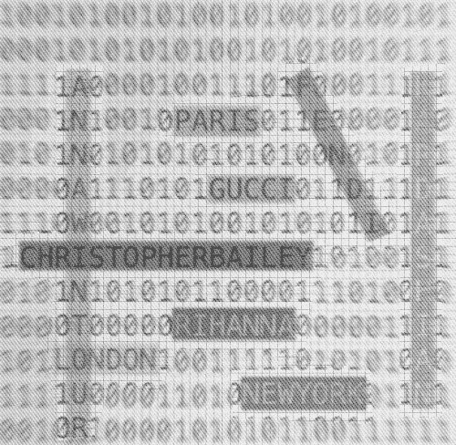

# 用斯坦福-NER 和 Spacy 实现 Python 中的命名实体识别

> 原文：<https://medium.com/analytics-vidhya/named-entity-recognition-in-python-with-stanford-ner-and-spacy-fb84e470ffee?source=collection_archive---------21----------------------->



命名实体识别是自然语言处理中的一项常见任务，旨在标记文本数据中的人名或地名等内容。

今天我们将使用流行的库 Stanford NLP 和 Spacy 来看看 Python 中的两个例子。

# 什么是命名实体？

我正在处理时尚文章，所以我将从一些与时尚相关的命名实体的例子开始:

*   为安娜·温图尔打扮—人名
*   古驰——品牌名称
*   巴黎—位置
*   《时尚》杂志—品牌/组织

命名实体可以指人名、品牌、组织名、地名，甚至货币单位等。

基本上，任何具有*专有名称*的东西都可以是命名实体。

# 命名实体识别

[命名实体识别](https://en.wikipedia.org/wiki/Named-entity_recognition)，或 *NER* ，是一种广泛用于[自然语言处理](https://en.wikipedia.org/wiki/Natural_language_processing)，或 *NLP* 的信息提取类型，旨在从非结构化文本中提取命名实体。

非结构化文本可以是从一篇较长的文章到一条简短的 Tweet 的任何一段文本。

在尝试回答以下问题时，命名实体识别会很有帮助…

*   哪些品牌最受欢迎？
*   时尚界最有影响力的人是谁？
*   人们谈论的最热门的时尚物品是什么？

我们可以使用几个不同的库来提取命名实体，在这篇文章中我们将会看到其中的几个。

1.  带有自然语言工具包(NLTK)的斯坦福 NER 标记者
2.  空间

# 斯坦福 NER + NLTK

我们将使用斯坦福的命名实体识别标记器，以及 NLTK，它为斯坦福 NER 标记器提供了一个包装类。

斯坦福 NER 标记器是用 Java 编写的，NLTK 包装器类允许我们用 Python 访问它。

你可以在这里看到这个例子[的完整代码。](https://gist.github.com/lvngd/5b3784dfd7638b4cd6bbd892e86e08b5)

# 下载斯坦福 NER

斯坦福 NER 标记器是用 Java 编写的，所以你需要在你的机器上安装 Java 来运行它。

你可以在这里阅读更多关于斯坦福 NER 大学的信息。

在[nlp.stanford.edu](https://nlp.stanford.edu/software/CRF-NER.shtml#Download)下载软件。

这包括用于 NER 标记器的 jar 文件，以及预训练的模型，这些模型将用于标记带有命名实体的文本。

我使用的是英语 3 级模型，其中包含地点、人员和组织实体。你可以在这里阅读更多关于[车型的信息。](https://nlp.stanford.edu/software/CRF-NER.shtml#Models)

注意 jar 文件和模型的文件路径。我们将在代码中需要它们。

# NLTK —自然语言工具包

NLTK 是一个用 Python 编写的库的集合，用于执行 NLP 分析。

网站上有一本很棒的[书/教程](https://www.nltk.org/book/)，可以学习许多 NLP 概念，以及如何使用 NLTK。

正如我之前提到的，NLTK 为斯坦福 NER 标记器提供了一个 Python 包装类。

## 安装 NLTK

首先让我们为这个项目创建一个虚拟环境。

```
mkvirtualenv ner-analysis
```

并安装 NLTK

在一个新文件中，导入 NLTK，并为斯坦福 NER jar 文件和上面的模型添加文件路径。

```
import nltk 
from nltk.tag.stanford import StanfordNERTagger PATH_TO_JAR='/Users/christina/Projects/stanford_nlp/stanford-ner/stanford-ner.jar' PATH_TO_MODEL = '/Users/christina/Projects/stanford_nlp/stanford-ner/classifiers/english.all.3class.distsim.crf.ser.gz'
```

我还导入了`StanfordNERTagger`，这是 NLTK 中用于斯坦福 NER 标记器的 Python 包装类。

接下来，用 jar 文件路径和模型文件路径初始化标记器。

```
tagger = StanfordNERTagger(model_filename=PATH_TO_MODEL,path_to_jar=PATH_TO_JAR, encoding='utf-8')
```

## 示范句子

```
sentence = "First up in London will be Riccardo Tisci, onetime Givenchy darling, favorite of Kardashian-Jenners everywhere, who returns to the catwalk with men's and women's wear after a year and a half away, this time to reimagine Burberry after the departure of Christopher Bailey."
```

我从《纽约时报》的一篇文章[中摘录了这句话用于演示。](https://www.nytimes.com/2018/09/05/fashion/new-york-fashion-week-preview.html)

用 NLTK 的单词标记器将句子拆分成单词。

每个单词都是一个*令牌*。

```
words = nltk.word_tokenize(sentence)
```

然后将标记化的句子放入标签中。

```
tagged = tagger.tag(words)
```

并且输出将是令牌及其命名实体标签的元组列表。

```
[('First', 'O'), 
('up', 'O'), 
('in', 'O'), 
('London', 'LOCATION'), 
('will', 'O'), 
('be', 'O'), 
('Riccardo', 'PERSON'), 
('Tisci', 'PERSON'), 
(',', 'O'), 
('onetime', 'O'), 
('Givenchy', 'ORGANIZATION'), 
('darling', 'O'), 
(',', 'O'), 
('favorite', 'O'), 
('of', 'O'), 
('Kardashian-Jenners', 'O'), 
('everywhere', 'O'), 
(',', 'O'), 
('who', 'O'), 
('returns', 'O'), 
('to', 'O'), 
('the', 'O'), 
('catwalk', 'O'), 
('with', 'O'), 
('men', 'O'), 
(''', 'O'), 
('s', 'O'), 
('and', 'O'), 
('women', 'O'), 
(''', 'O'), 
('s', 'O'), 
('wear', 'O'), 
('after', 'O'), 
('a', 'O'), 
('year', 'O'), 
('and', 'O'), 
('a', 'O'), 
('half', 'O'), 
('away', 'O'), 
(',', 'O'), 
('this', 'O'), 
('time', 'O'), 
('to', 'O'), 
('reimagine', 'O'), 
('Burberry', 'O'), 
('after', 'O'), 
('the', 'O'), 
('departure', 'O'), 
('of', 'O'), 
('Christopher', 'PERSON'), 
('Bailey', 'PERSON'), 
('.', 'O')]
```

它并不完美——请注意,“博柏利”和“卡戴珊-詹纳斯”都没有被标记。

但总体来说，还不错。

`O`标签只是不符合任何命名实体类别标签的单词的背景标签。

# 空间

让我们试着用 Spacy 标记同一个句子。

Spacy 是用 [Cython](https://cython.org/) 编写的另一个 NLP 库。

它很受欢迎，也很容易使用，你马上就会看到。

# 安装空间

首先，我们需要下载 Spacy，以及我们将使用的英语模型。

# 模型

我们将下载英语模式`en_core_web_sm`——这是默认的英语模式。Spacy 也有[其他型号](https://spacy.io/models)。

Spacy 模型可以作为 Python 包安装，并作为依赖项包含在您的`requirements.txt`文件中。在的[文档中阅读更多相关内容。](https://spacy.io/usage/models)

```
python -m spacy download en_core_web_sm
```

使用与前面例子中相同的演示句子，我们可以用 Spacy 在几行代码中提取命名实体。

```
import spacy sentence = "First up in London will be Riccardo Tisci, onetime Givenchy darling, favorite of Kardashian-Jenners everywhere, who returns to the catwalk with men's and women's wear after a year and a half away, this time to reimagine Burberry after the departure of Christopher Bailey." nlp = spacy.load('en_core_web_sm') doc = nlp(sentence)
```

第一步是将模型加载到`nlp`变量中。

然后在文本上调用`nlp`,这将启动许多步骤，首先对文档进行标记，然后启动[处理管道](https://spacy.io/usage/processing-pipelines),它用标记器、解析器和实体识别器处理文档。

现在我们可以遍历命名的实体。

```
for ent in doc.ents: 
    print(ent.text,ent.label_)
```

以下是输出:

```
First ORDINAL 
London GPE 
Riccardo Tisci PERSON 
Givenchy GPE 
Kardashian-Jenners ORG 
a year and a half DATE 
Burberry PERSON 
Christopher Bailey PERSON
```

斯帕西同时提取了“卡戴珊-詹纳斯”和“博柏利”，所以这很好。

# 培训自定义模型

如果一个现成的 NER 标签没有给你想要的结果，不要担心！

通过斯坦福 NER 和 Spacy，你可以*训练你自己的定制模型*用于命名实体识别，*使用你自己的数据*。

如果您试图用命名实体标记的数据与用于训练 Stanford 或 Spacy 的 NER 标记器中的模型的数据不太相似，那么您可能会更幸运地用自己的数据训练模型。

在一天结束时，这些模型只是进行计算，以*预测*哪个 NER 标签适合你输入的文本数据中的一个单词，这就是为什么如果你的文本数据与你使用的标签最初训练的数据相差太大，它可能无法识别你文本中的一些命名实体。

*太不一样*是主观的，这些开箱即用的标签是否符合你的需求，就看你自己了！

# 培训定制 NER 模型的资源

[与斯坦福 NER 一起训练定制的 NER 模型。](https://nlp.stanford.edu/software/crf-faq.shtml#b)

[用 Spacy 训练自定义 NER 模型。](https://spacy.io/usage/training#ner)

# 感谢阅读！

如果你有任何问题或评论，请告诉我，或者在 Twitter 上联系我 [@LVNGD](https://twitter.com/LVNGD) 。

*最初发表于*[https://lvngd.com/blog](https://lvngd.com/blog/named-entity-recognition-in-python-with-stanford-ner-and-spacy/)/*。*