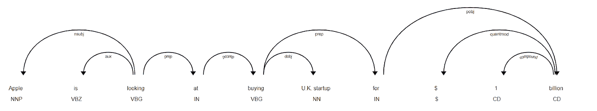
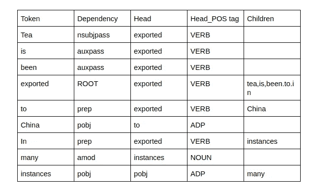
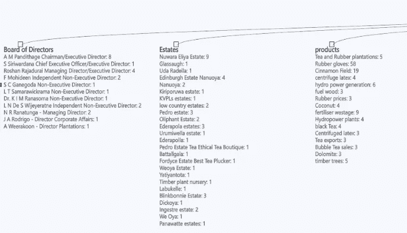
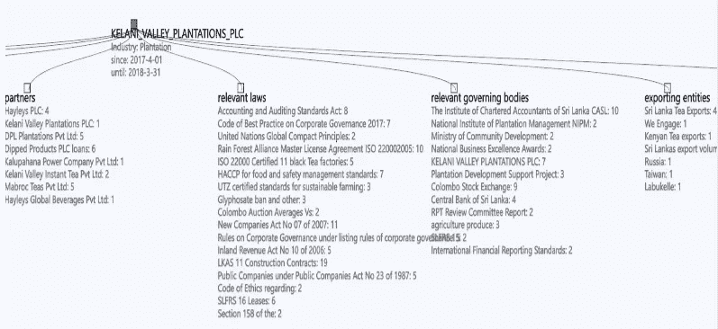
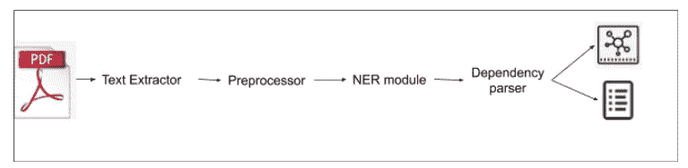
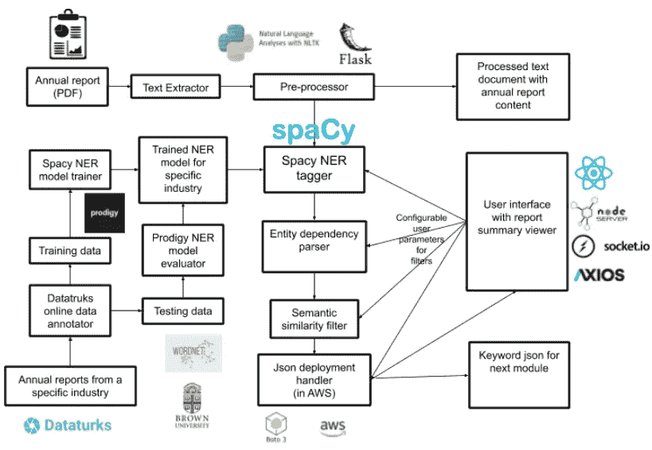

# 用于文本提取的命名实体识别(NER)

> 原文：<https://medium.com/analytics-vidhya/named-entity-recognition-ner-for-text-extraction-2d95a04eb67f?source=collection_archive---------16----------------------->

由于自然语言处理技术的进步和从机器学习技术中获得的类似人类的支持，从大型文档中提取文本已经成为一项相对容易的任务。但是几年前，当我需要提取与特定主题相关的实体时，我遇到了一个问题，找到一个解决方案似乎并不容易。

**问题简单来说！！！**

当给出一个具体的公司简介(如年度报告)时，我需要提取董事、所有者、工厂地点、出口/进口国家、合作公司、产品生产商等的名称。在各自的实体类别下(主题..简单来说)。

**为什么传统的 NER 不起作用……**

命名实体识别的传统方法使用已训练的机器学习模型，该模型已被馈送了来自目标域的已注释实体的数据集，并且该模型将列出符合已训练简档的所有可用实体，而没有任何意义或意图。

基本上，它会列出所有的名字，地点，国家，对象等。而不具有找到与主题相关的特定单词的能力。

使用 Spacy 将苹果识别为一个组织，将英国识别为一个地缘政治实体

**解！！！….依存解析+ NER**

依存句法分析是一种语法模型，它以语法方式连接句子中的单词，以便我们可以在我们定义的规则下找到与特定单词相关的其他单词。

依存解析器如何发现句子中的关系

所以我的解决方案是将 NER 和依赖解析器的结果组合起来，如下所示。

**先决条件**

1.  为给定的实体定义一组我想要查找的目标关键字。
    例如:-对于一个位置，可能存在以下关键字集
    {进口、进口、进口、出口、出口、出口} —查找进口/出口国家
    {工厂、厂房、建筑、种植园、办公室} —查找经营位置
2.  以适当格式准备的数据集，代表目标行业。为此，我使用[datatuks.com](https://dataturks.com/)来注释数据集。一些训练数据的例子可以在[这里](https://github.com/AeshanaShalindra/final_year_project/tree/master/tarining)找到。
3.  在 [Prodigy](https://prodi.gy/) (一种由主动学习驱动的注释工具)的帮助下，使用主动学习方法的训练有素的空间 NER 模型

**现在要实施了！！！**

1.  使用 NER 模型识别文档给定句子中的实体—使用[空间](https://spacy.io/usage/linguistic-features#named-entities) NER 模型
2.  使用这个发现的实体作为*搜索头，*使用依赖解析器解析句子，并查找是否有任何预定义的关键字形成与这个实体相关的集合在句子中可用。

例句:*在一句“茶叶出口到中国的例子很多。”NER 模型会将中国识别为 GPE，依赖解析器会将 exported 作为根，并将中国归类为出口目的地！！！*

依存分析的结果

提取这些数据后，使用语义相似度方法，将搜索结果分组，最终得到一个不错的文档摘要。

**结果！！！**

以下是摘自 Kelani Valley PLC 年度报告的结果示例。

获取该公司开发的 BoD、地产位置和产品。

获取合作公司、影响行业的法律、管理行业的相关实体以及产品出口的几个国家。

正如你所看到的，一个公司简介的摘要可以以一种非常简洁有效的方式展示给投资者或任何感兴趣的人，而不是阅读一份 890 页的报告。

该方法的基本高级架构如下…

为了更好地理解上面提到的 ML 服务和技术是如何协同工作的，请参考下面的技术图表…

上述文本提取方法的完整代码实现可以在[这里](https://github.com/AeshanaShalindra/final_year_project)找到。

测试结果和所用方法评估的详细文件可在[这里](https://drive.google.com/file/d/11bAN9Uzyepn1jxDSMeX0lBudl_q09Xwk/view?usp=sharing)找到。

希望这篇文章对你有帮助，请随时评论和改进这个模型。谢谢大家！！！！