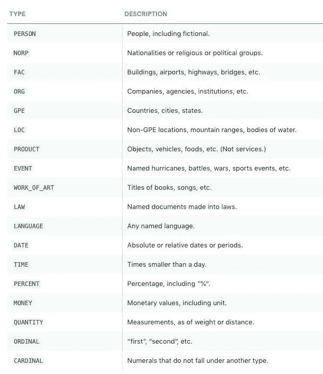
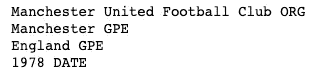
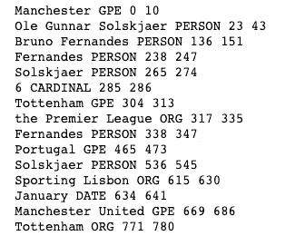
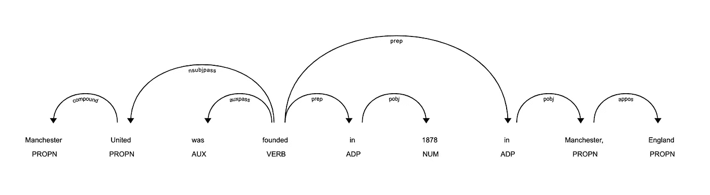

# 带空间的命名实体识别(NER)

> 原文：<https://medium.com/analytics-vidhya/named-entity-recognition-with-spacy-2ecfa4114162?source=collection_archive---------9----------------------->


命名实体识别(NER)是自然语言处理的一个重要方面。通过使用 NER，我们可以智能地提取实体信息(相关名词，如地点、人、位置等。)来帮助从文本中获得更多的含义。

NER 可用于构建推荐、从大量文本中快速提取相关信息、客户支持，甚至对文本内容进行编目。

NLTK 和 spaCy 为许多 NLP 问题提供了预先训练好的模型，包括命名实体识别。在这篇文章中，我们将通过一个温和的介绍如何执行 NER 与空间。

不用说，你需要先在你的机器上安装 spaCy。请按照此处提供的说明在您的机器上安装 spaCy。

spaCy 支持不同级别的多种语言，完整的型号列表请访问[这个](https://spacy.io/usage/models)页面。

# **命名实体**

spaCy 支持在注释 5 的[上训练的模型的以下实体类型。](https://catalog.ldc.upenn.edu/LDC2013T19)



让我们来看一个例子，我们正在为 NER 加载" **en_core_web_lg** "模型。该模型是在 OntoNotes 上训练的英语多任务 CNN，在普通爬行上训练手套向量。它分配单词向量、上下文特定的标记向量、位置标签、依赖解析和*命名实体*。

```
import spacy
nlp = spacy.load("en_core_web_lg")
```

将文本传递给模型，

```
doc = nlp(“Manchester United Football Club is a professional football club based in Manchester, England established in 1978”)
```

该模型返回一个 **spacy.tokens.doc.Doc** 对象，您可以对其进行迭代。因为我们没有为我们的模型对象定义定制的管道，所以它执行了模型支持的所有 NLP 操作。

现在，让我们遍历模型返回的命名实体

```
for ent in doc.ents:
    print(ent.text, ent.label_)
```



# **从新闻文章中提取命名实体**

对于这个例子，我们将使用一个名为[news](https://github.com/codelucas/newspaper)的强大的库来抓取一篇新闻文章并对内容执行 NER。报纸图书馆提供了很多现成的功能，比如除了支持非英语语言之外，还可以对文章进行总结。

```
from newspaper import Article
import spacynlp = spacy.load("en_core_web_lg")url = r"[https://techcrunch.com/2020/09/16/ios-14-is-now-available-to-download/](https://techcrunch.com/2020/09/16/ios-14-is-now-available-to-download/)"
article = Article(url)
article.download()
article.parse()doc = nlp(article.text)for ent in doc.ents:
    print(ent.text, ent.label_, ent.start_char, ent.end_char)
```



文章中的命名实体

# **显示**

spaCy 还提供了一个方便的可视化库 displacy 来可视化文本中的命名实体。你可以用 displacy，就像这样，

```
doc = nlp("Manchester United was founded in 1878 as Newon Heath in Manchester, England")
spacy.displacy.serve(doc, style='ent')
```


使用 displacy 可视化命名实体

我们甚至可以用它来可视化一个文本的依存解析树，就像这样，

```
doc = nlp(u"Manchester United was founded in 1878 in Manchester, England")
spacy.displacy.serve(doc, style='dep')
```



用 displacy 可视化的依赖关系解析树